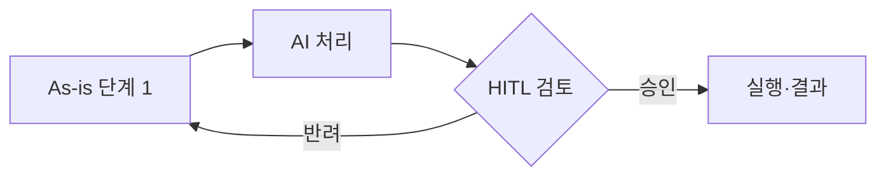
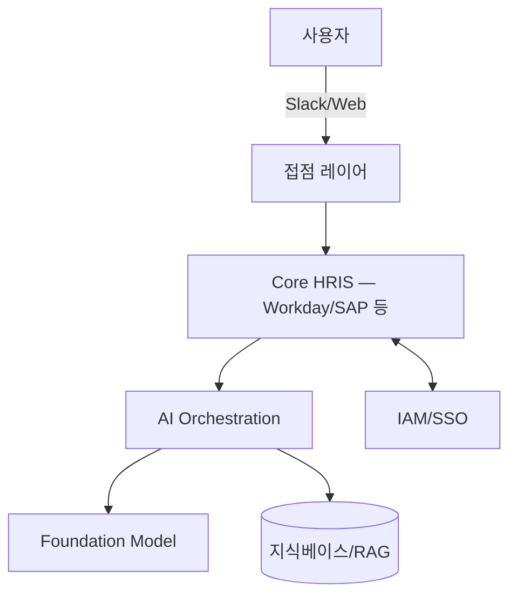
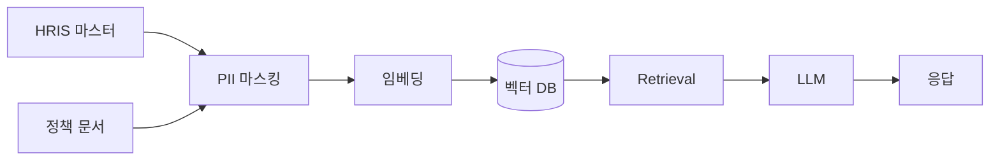

# Use Case Page Schema

모든 use case 페이지는 `wiki/usecases/<slug>.md`에 저장하며 아래 frontmatter를 반드시 포함한다.

```yaml
---
title: "Moderna — Ask HR 통합 챗봇 (3,000+ custom GPTs)"
slug: moderna-ask-hr-custom-gpts
primary_category: Employee Experience & HR Ops
subcategory: Employee Self-service
tags: [ask-hr, chatbot, case-deflection, onboarding, benefits-q-and-a]
company: Moderna
industry: [pharma, biotech]
region: [na]                       # na | eu | apac | kr | global
employee_class: [all]              # 기술사무직 | 전임직 | 계약직 | all
vendor: [OpenAI]
vendor_type: [foundation-model]    # hrms | ats | lxp | talent-marketplace | point-solution | foundation-model | internal-build
ai_tech_type: [generative, automation]   # 5 대분류 — §10 ai_tech_type 표 참조
ai_tech_subtype: [summarization-qa, rpa] # 13 소분류 — §10 표 참조 (subtype은 type의 자식이어야 함)
stage: production                  # announced | pilot | production | sunset
frequency: daily                   # daily | monthly | annual | adhoc
first_seen: 2025-07-12
last_confirmed: 2026-03-28
confidence: 0.85                   # 0.0–1.0, 4절 참고
sources:
  - sources/moderna-wsj-2025-07.md
  - sources/moderna-hbr-2026-02.md
related_usecases:
  - gloat-talent-marketplace-unilever
related_vendors:
  - openai
---

## Summary
(3~5줄, 핵심만)

## Problem / Why (도입 배경)
어떤 HR pain point를 해결하는가. **반드시 포함해야 할 것**:
- **Before (baseline)**: 도입 전 상태를 가능한 한 구체적으로 (정량 수치 우선, 없으면 정성 기술 + `❓ baseline 미공개` 명시)
- **Pain point**: 왜 이 문제를 AI로 풀려 했는가 (비용·시간·품질·규모 중 어느 축)
- **Trigger**: 도입을 결정하게 된 직접적 계기 (경쟁사 동향·경영진 지시·규제·사건 등)
- **벤더 제품인 경우**: "벤더 제품이므로 특정 기업의 도입 배경은 고객별 상이"라고 명시하고, 해당 HR 영역의 **일반적 pain point만 간략 기술** (🚫 일반론 표기 필수)

## Solution Architecture

> **최우선 원칙**: 이 섹션은 **공개된 사실만** 기록한다. 소스에 명시되지 않은 세부사항은 절대 추정·보완하지 않는다.
> 각 하위 항목에서 정보가 없으면 반드시 `_미공개 (not disclosed)_` 라고 명시한다. "아마도", "추정컨대", "보통 이런 시스템은..." 같은 표현 **전면 금지**.
> 벤더·자사 마케팅 주장은 그대로 옮기지 말고 `벤더 주장:` 접두사 + Tier 1·2 독립검증 여부를 반드시 병기한다.

### A. Process (프로세스)
어떤 HR 프로세스·워크플로가 AI로 바뀌었는가. 업무 흐름 관점.

- **Before (As-is)**: 기존 프로세스 단계 — 번호 리스트, 누가/무엇을/언제
- **After (To-be)**: AI 도입 후 프로세스 단계 — 무엇이 자동화되고 무엇이 바뀌었나
- **Human-in-the-loop (HITL) 지점**: 어느 단계에서 사람이 개입·승인·검토·반려하는가
- **Trigger & Frequency**: 이벤트 기반? 배치? 실행 주기는? (일/주/월/연/수시)
- **Scope of autonomy**: 제안만 하는지(recommend), 사람 검토 후 실행하는지(approve-then-act), 완전 자율인지(autonomous)

**Mermaid flowchart 필수** (공개된 사실이 3단계 이상이면):

도식에 쓰는 노드·엣지는 **반드시 소스에서 확인된 것만** 포함. 확인되지 않은 지점은 `(미확인)` 라벨 또는 점선 엣지로 표시. 추측한 노드·연결은 금지.

### B. System & Infrastructure (시스템·인프라)
무엇 위에 돌아가는가. 기술 스택 관점.

- **Core HRIS / 기반 시스템**: Workday / SAP SuccessFactors / Oracle HCM / ServiceNow HR / 자체 구축 / 불명 — 공개된 것만
- **AI 시스템 배치**: HRIS 내장 기능? 별도 SaaS? 자체 호스팅? 하이브리드?
- **배포 환경**: Public cloud (AWS / Azure / GCP), private cloud, on-prem, edge, 불명
- **연동·통합**: 어떤 시스템과 API·ETL·이벤트로 연결되는가 (SSO/IdP, ATS, LMS, payroll, ITSM, 메시징 등)
- **사용자 접점 (UX layer)**: Slack / Teams bot, web portal, mobile app, email, voice, IDE plugin, workflow embedded
- **인증·권한**: RBAC, attribute-based, role 모델 (공개된 것만)
- **가용성·SLA**: 알려진 경우만

**Mermaid 시스템 다이어그램 권장** (구성요소가 3개 이상 공개돼 있으면):

점선 = 추정 또는 미확인. 실선 = 소스 확인. 범례를 도식 하단에 명시.

### C. Data (데이터)
무엇이 들어가고 무엇이 나오는가. 데이터 관점.

- **입력 데이터 소스**: 이력서·JD·성과·근태·급여·pulse·1:1 노트·정책 문서·티켓·공개 웹 등 — 구체 항목
- **데이터 규모**: 문서 수·사용자 수·토큰 수·인덱스 크기 (공개된 수치만)
- **전처리·정제**: PII 마스킹, 익명화, chunking, 임베딩, 벡터 DB, 지식그래프 등
- **학습 vs RAG vs In-context 구분**: 파인튜닝인가, retrieval인가, 단순 프롬프트 주입인가 (섞인 경우 각각 명시)
- **데이터 거버넌스**: 보존 기간, 접근 권한 모델, 감사 로그, 크로스보더 이동 여부
- **민감정보 처리**: GDPR·한국 개인정보법·HIPAA 등 규제 범주, DPIA 여부
- **데이터 출처의 오너십**: HR 데이터? 사내 위키? 외부 벤더? 혼합?

**Data flow 다이어그램 권장**:


### D. Model (모델)
어떤 AI가 쓰이는가. 모델 관점.

- **Foundation model**: GPT-4 / 4o / 5, Claude Opus / Sonnet, Gemini, Llama, Mistral, 자체 파인튜닝 모델, 불명 — 공개된 것만. 버전까지.
- **Model 유형**: LLM (생성), embedding, classifier, multi-modal, agent (tool-use), specialized (예: NER, STT)
- **제공 방식**: 상용 API (OpenAI / Anthropic / Azure OpenAI / Bedrock / Vertex), self-hosted OSS, 하이브리드
- **커스터마이징 기법**: prompt engineering / few-shot / RAG / fine-tuning / RLHF / DPO / agent orchestration (LangGraph 등)
- **Orchestration 프레임워크**: LangChain, LlamaIndex, Semantic Kernel, 자체 구축, 불명
- **평가·가드레일**: eval set 존재 여부, red-team, bias 감사, hallucination 테스트, content filter
- **비용·성능 지표**: latency, throughput, 토큰 비용, 월간 호출 수 (공개된 경우만)
- **Fallback·degradation 전략**: 모델 실패 시 동작 (공개된 경우만)

### E. Organization & Team (조직·팀 구조)
누가 만들고 누가 운영하는가. 조직 관점.

- **오너십**: HR 부서 주도? IT/데이터 주도? CoE(Center of Excellence)? Joint venture?
- **참여 역할**: HRBP·HR tech PM·ML engineer·data engineer·prompt engineer·legal·보안·현업 사용자 중 공개된 것
- **팀 규모·기간**: 파일럿/풀-롤아웃 각 단계의 인력·기간 (공개된 경우만)
- **거버넌스 체계**: AI 윤리위원회, 리뷰보드, HR-AI Council 등 존재 여부·구성
- **변화관리**: 현업 HR·매니저 교육, 업무 재설계, 내부 홍보
- **파트너**: 컨설팅·구현 파트너사 (Deloitte·Accenture·PwC·EY·BCG 등 공개된 경우만)

### F. Diagrams (도식) — 시각화 원칙

- **Fact 기반 도식화가 이 섹션의 핵심**. 글보다 도식이 컨설팅 현장에서 즉시 쓰임.
- 최소 1개 이상의 Mermaid 다이어그램을 생성. 공개 정보가 충분하면 2~3개 (process / system / data flow).
- **범례 규칙**:
  - `실선` = 소스에서 명시적으로 확인된 연결
  - `점선` = 일반적인 패턴상 존재할 가능성이 있으나 **명시적 확인 안 됨** (`(미확인)` 라벨 필수)
  - `?` 접두사 붙은 노드 = 존재 여부 자체가 불명 — 가급적 넣지 말 것
- 노드 1개마다 본문에 citation `[[sources/xxx]]` 달 수 있어야 함. 없으면 도식에서 제거.
- 복잡한 다층 구조는 Mermaid `flowchart TB` / `sequenceDiagram` / `C4Context` 중 적절한 것 선택.

---

**Fact vs 주장 vs 추측 표기 규칙 (모든 하위 항목 공통)**:

정보의 출처·신뢰도에 따라 5단계로 구분한다. 이 구분은 **나중에 합성 쿼리·digest에서 문장이 발췌될 때도 같이 따라가야** 하므로 접두사·서식을 반드시 유지한다.

| 표기 | 의미 | 사용 조건 | 신뢰도 |
|---|---|---|---|
| ✅ **Fact** | 소스에 명시적으로 기재된 내용. Tier 1·2의 독립 검증 포함. | 인접 citation 필수 (`[[sources/xxx]]`) | 높음 |
| ⚠️ **벤더 주장** (vendor claim) | HR tech 벤더가 자사 제품·기능에 대해 마케팅 맥락에서 한 주장. 독립 검증 없음. | `⚠️ 벤더 주장:` 접두사 + Tier 1·2 독립 검증 여부 병기 | 낮음 (이해관계 편향 있음) |
| ⚠️ **자사 보고** (customer self-report) | 벤더가 아닌 **도입 기업 본인**이 자사 AI 도입 사례로 공개한 내용 (press release·자사 블로그·컨퍼런스 발표·사내 자료 인용 등) | `⚠️ 자사 보고:` 접두사 + 독립 검증(Tier 1·2 분석가·언론) 여부 병기. Tier 1 분석가가 지면에 전달했더라도 "independently endorsing"이 아니면 여전히 자사 보고임 | 중간 (과장 동기는 있으나 벤더 마케팅보다 약함. employer branding 고려 필요) |
| ❓ **미공개** (not disclosed) | 소스에 없음. 빈 섹션 금지. | `_미공개 (not disclosed)_` 문구 그대로 사용 | — |
| 🚫 **금지** | 일반론·전형 패턴·상식으로 빈칸 채우기 | "보통 이런 시스템은…", "아마 Azure AD와 연동…", "일반적으로 RAG를 쓰므로…", "sentiment 분석은 통상 classifier를 쓰므로…" 등 **전면 금지** | — |

**벤더 주장과 자사 보고의 구분 예시**:
- Workday가 "우리 Illuminate는 800B LLM 기반"이라고 발표 → ⚠️ **벤더 주장** (제품 판매 동기)
- Moderna가 "우리 직원들이 주 120 대화를 사용한다"고 자사 사례 공개 → ⚠️ **자사 보고** (도입 기업의 성공 스토리텔링 동기)
- Gartner가 자체 조사로 "엔터프라이즈 75%가 HR AI 도입"이라고 발표 → ✅ **Fact** (Tier 1 독립 분석기관)
- Constellation Research 분석가가 "Moderna는 750 GPT 운영"이라고 기사에 적었지만 본인이 "독립 검증 아닌 illustrative"라고 밝힘 → ⚠️ **자사 보고** (Tier 1 매체 전달이지만 검증 아님)

**Hallucination self-check**: 페이지 저장 전에 본문의 모든 구체적 주장이 sources 리스트 중 어느 페이지에서 나온 것인지, 그리고 어느 표기(Fact/벤더 주장/자사 보고)에 해당하는지 머릿속으로 짚어볼 것. 짚어지지 않거나 애매한 문장이 있으면 삭제하거나 `_미공개_`로 바꾼다.

## Impact / Metrics (기대효과)
정량 지표가 있으면 우선. 없으면 정성 + confidence 낮게. 벤더 주장 수치는 `벤더 주장:` 접두사 필수.
**반드시 포함해야 할 것**:
- **기대효과 요약** (섹션 첫 줄): 1~2줄로 "이 AI 도입으로 무엇이 좋아졌는가/좋아질 것인가" 요약. 예: "채용 시간 75% 단축으로 매장 매니저의 운영 집중 시간 확보"
- **Before → After 형식**: 가능하면 "Before: X → After: Y (Z% 변화)" 형식. Before 미공개 시 `_Before 수치 미공개_` 명시
- **정량 지표 없으면**: "⚠️ 기대효과 수치 미공개" 또는 "⚠️ 벤더 주장만 존재" 명시. 빈 섹션 금지.
- **벤더 제품인 경우**: 플랫폼 전체 ROI(예: Forrester TEI) 또는 개별 고객 metric으로 분리 기술

## Governance & Risk
(편향·개인정보·HITL 여부·거버넌스 장치)

## Contradictions
(다른 소스와 충돌이 있으면 [!contradiction] 콜아웃으로)

## Consulting Angle
(컨설팅 프로젝트에서 이 사례를 어떻게 쓸 수 있는가 — 벤치마크·제안·반면교사)
```

---

# Consulting Angle

이 저장소는 단순 지식 수집이 아니라 **HR AI 컨설팅 프로젝트에 즉시 투입되는 벤치마크 자산**이다.
매 use case 페이지는 `## Consulting Angle` 섹션에 다음 중 하나를 반드시 기록:
- 어떤 산업·규모 클라이언트에 참고 가능한가
- 어떤 제안서/워크숍 덱에 바로 활용 가능한가
- 반면교사 사례라면 어떤 리스크를 경고할 것인가
- 파생 질문 (예: "이걸 한국 대기업에 적용 시 제약은?")

이 섹션이 비어 있으면 lint가 경고한다.

---


# 2026-09-27 개정 — 추가 frontmatter 필드와 grounding 규칙

기존 §3 frontmatter에 다음 필드가 추가된다 (lint가 검사):

```yaml
visibility: public | internal          # internal = 클라이언트·제안서 자료 유래. export 제외
case_type: adoption | vendor-product   # 도입 기업 명시 사례 / 벤더 제품 페이지(고객 다수)
evidence_grade: A|B|C|D                # grade.py 계산 — 손으로 고치지 않음
corroborated_by: N                     # 서로 다른 독립 소스 수 (grade.py)
freshness: fresh|stale|unverified      # grade.py
depth: full|partial|stub               # grade.py — B·C·D·E 실질 내용 3개+ & Mermaid = full
graded_at: YYYY-MM-DD
regulatory_exposure: [kr-high-impact, eu-annex-iii]   # 채용·평가·승진·해고·이탈예측·근태감시 관여 시
kr_law: "..."       # 한국 적용성 4축 — 한 줄씩. 소스 근거 없으면 '검토 필요'
kr_union: "..."
kr_language: "..."
kr_vendor: "..."
first_seen_estimated / last_confirmed_estimated: true   # 소스 발행일이 아닌 추정값일 때
```

`stage`는 배포 단계(announced/pilot/production/sunset)만 뜻한다. 정보 부족은 `depth: stub`으로 표현하며 `stage: stub`은 더 이상 쓰지 않는다.

## B·C·D 섹션 작성 규칙 (Grounding)

- 각 bullet은 다음 중 하나여야 한다: (a) `[[sources/<slug>]]` 인용이 붙은 사실, (b) `⚠️ 벤더 주장:`/`⚠️ 자사 보고:` 접두사 + 인용, (c) `_미공개 (not disclosed)_` 또는 `❓`.
- 인용도 미공개 표기도 없는 서술이 3개 이상이면 lint `ungrounded-bcd` 경고 → 소스를 찾아 인용하거나 `_미공개_`로 바꾼다. "Workday 또는 자체 — 미공개" 같은 **선택지 나열식 추정**도 금지: 그냥 `_미공개_`.
- 수치는 raw 스냅샷에 있는 표기 그대로 쓴다 (23,000시간을 "2만 3천"으로 바꾸지 않는다). 환산이 필요하면 원 표기를 괄호로 병기.
- 소스가 미래형·계획형("예정", "plans to", "추진 중")이면 본문도 미래형으로 쓰고 `stage: announced`.

## 한국 적용성 4축 (Consulting Angle 필수 하위 항목)

- `kr_law`: 개인정보보호법·AI 기본법 고영향 AI·근로기준법·채용절차법 관점의 제약 한 줄
- `kr_union`: 노조·근로자대표 협의 필요성 한 줄
- `kr_language`: 한국어 지원·현지화 상태 한 줄 (소스 없으면 "미확인")
- `kr_vendor`: 국내 벤더·SI 지원 여부 한 줄 (소스 없으면 "미확인")

## regulatory_exposure 값 (2026-09-27 crosswalk 검증 후 확정)
- `kr-high-impact`: AI 기본법 고영향 AI가 **가이드라인으로 확인된** 영역 = 채용(탐색~선발). Talent Acquisition 중그룹(Sourcing·Screening·Interview·Executive Search·Early-career)에서 후보 선별·랭킹·평가에 관여할 때.
- `kr-high-impact-review`: 조문 제2조 4호 사목의 "등"에 근거해 보수적으로 검토 대상으로 두는 영역(평가·승진·배치·이탈예측·근태·구조조정). 가이드라인(2026-04-29)은 이 영역을 명시하지 않았다 — [[taxonomy-crosswalk]] 표 4 참조.
- `eu-annex-iii`: EU AI Act Annex III 4(a)(b) — 채용·선발·승진·해고·업무 배분·모니터링·평가. 의무 적용은 2027-12-02로 연기.
