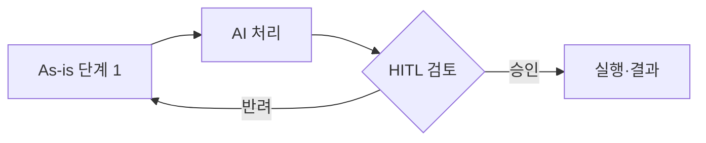
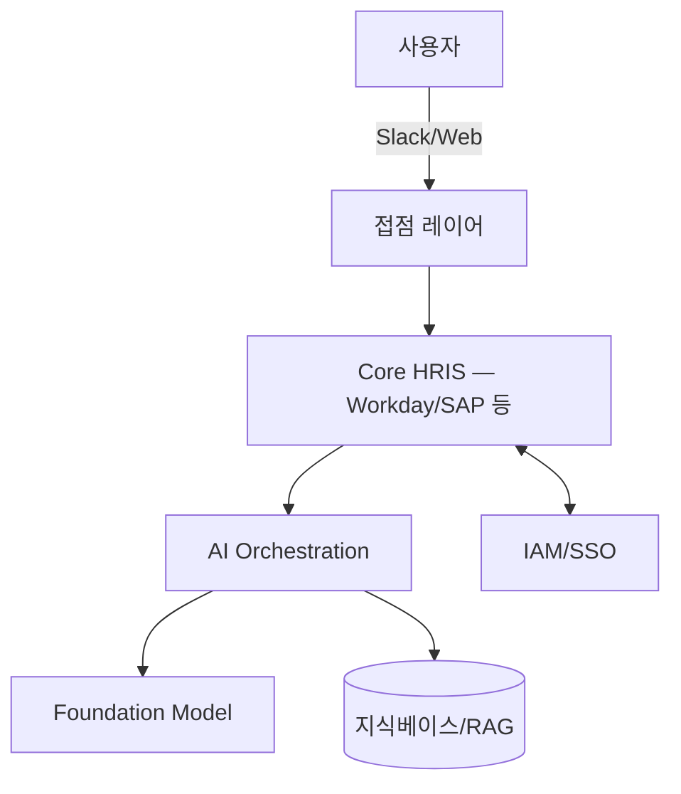
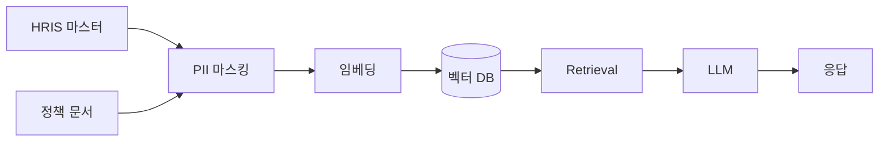

# HR AI Benchmark Wiki — Agent Schema

이 저장소는 **HR 부문 AI 적용 use case**를 지속적으로 축적·갱신하는 LLM Wiki입니다.
Karpathy의 LLM Wiki 패턴(raw → wiki → schema)을 따르며, HR 컨설팅 프로젝트용 벤치마크 자산으로 사용됩니다.

에이전트(Claude)는 이 문서의 규칙에 따라 `raw/`의 원본 소스를 읽고, `wiki/`의 markdown 페이지를 작성·유지·상호참조합니다.

---

## 1. Repository Layout

```
raw/                      # 원본 소스 (immutable — 에이전트는 읽기만)
  articles/               # 웹 기사·블로그 (Obsidian Web Clipper 등)
  reports/                # Gartner/McKinsey/Deloitte 등 PDF 리포트
  vendors/                # 벤더 1차 자료 (제품 문서·release note·case study)
  feeds/                  # 자동 수집된 RSS/뉴스 dump (YYYY-MM-DD.md)

wiki/                     # LLM이 유지관리하는 markdown (쓰기 가능)
  index.md                # 전체 카탈로그 — 카테고리별 페이지 목록
  log.md                  # Append-only 타임라인 (ingest/query/lint 이력)
  sources/                # 소스 1건 = 1 요약 페이지 (근거 추적용)
  usecases/               # ★ HR AI use case 1건 = 1 페이지 (핵심 자산)
  vendors/                # HR 테크 벤더 페이지 (Workday, Gloat, Eightfold…)
  companies/              # 도입 기업 페이지 (Moderna, Unilever, 삼성…)
  categories/             # 대/중/소 카테고리 개요 페이지
  syntheses/              # 쿼리·리서치 결과가 페이지로 승격된 것

.claude/commands/         # 슬래시 커맨드 정의
scripts/                  # 수집·보조 스크립트
```

**핵심 원칙**:
- `raw/`는 절대 수정하지 않는다. 파일 삭제·rename 금지.
- `wiki/`의 모든 페이지는 에이전트가 소유하며 필요 시 재작성 가능하다.
- 모든 변경은 `wiki/log.md`에 append된다.

---

## 2. HR Taxonomy (대/중/소 그룹)

모든 use case 페이지는 frontmatter의 `primary_category`(대그룹), `subcategory`(중그룹), `tags`(소그룹)에 아래 값을 사용한다. **디렉토리로 카테고리를 고정하지 않고 태그로 관리**한다 — 하나의 use case가 여러 카테고리에 걸치는 경우가 많기 때문.

### 대그룹 7개

1. **Talent Acquisition** — 채용·인력확보
2. **Onboarding & Transitions** — 온보딩·발령·이동·퇴직
3. **Learning & Development** — 교육·역량·스킬
4. **Performance & Talent Management** — 평가·승진·핵심인재·후계
5. **Total Rewards** — 보상·급여·복리후생
6. **Employee Experience & HR Ops** — EX·HR 운영·근태·Core HR
7. **Strategic Workforce & Governance** — 인사기획·People Analytics·노사·거버넌스

### 중그룹 / 소그룹

#### 1. Talent Acquisition
- **Sourcing & Attraction**: JD 생성, employer branding, passive candidate mining, 채용 마케팅
- **Screening & Assessment**: Resume parsing, skills matching, chat screening, video interview 분석, bias audit
- **Interview & Selection**: 질문 생성, interview copilot, scorecard 자동화, reference check
- **Offer & Pre-boarding**: Offer letter 생성, 협상 시뮬레이터, 문서 수집
- **Executive Search (핵심인재 채용)**: Referral·Search Firm·Direct Sourcing
- **Early-career Pipeline**: 대졸 정기/수시 채용, 장학생 선발·관리, 인턴십, 산학협력

#### 2. Onboarding & Transitions
- **New-hire Onboarding**: 개인화 온보딩 플랜, 30·60·90 체크인, 시스템 프로비저닝
  - *Mentoring Program*: 멘토 매칭, Phase1~Final 관리, 체크인 봇
- **Internal Mobility**: Talent marketplace, 사내공모, Redeployment/재배치, Project Staffing
- **Global Mobility**: 주재원 선발·발령·파견·귀임
- **Offboarding**: Exit interview 분석, 지식 이관, alumni 네트워크
  - *Mandatory Retirement*: 정년퇴직, 임금피크, 정년연장 신청

#### 3. Learning & Development
- **Skills & Capabilities**: Skills ontology, skills gap 분석, skills inference, 직무전문성 진단
- **Content & Delivery**: 과정 자동 생성, adaptive learning path, AI tutor/coach, 마이크로러닝
- **Performance Support**: Workflow-embedded copilot, just-in-time 지식
- **Language & Certification**: 어학관리, 자격 관리

#### 4. Performance & Talent Management
- **Goal & Performance**: OKR/목표 생성, 연속 피드백 요약, 리뷰 초안, calibration 분석, 1:1 지원
- **Succession & Leadership**: HiPo 식별, 후계자 추천, 리더십 assessment, 최고 기술전문가 관리(TLE류)
- **Coaching**: AI 코치(BetterUp 류), manager copilot, LMD 지원

#### 5. Total Rewards
- **Compensation**: Pay strategy/보상기획, Pay equity, comp benchmarking, offer modeling
  - *Equity & Stock Programs*: 우리사주, 자사주, RSU, 스톡옵션, ESPP
- **Payroll Operations**:
  - *Payroll Execution*: 정기급여, 상여(PS/PI), 비정기 급여
  - *Year-end Tax Settlement*: 연말정산, 수정신고
  - *Retirement Settlement & Pension*: 퇴직정산, DC/DB 연금, 중도인출
  - *Accruals & Reserves*: 퇴직·연차·상여 충당금, 인건비 마감
  - *Garnishment & Deductions*: 채권압류, 공제
- **Benefits & Wellbeing**:
  - *Health & Insurance*: 의료비, 보험, 산재
  - *Flexible Benefits*: 복지포인트, 포인트몰 추천
  - *Wellbeing & Mental Health*: 웰니스 챗봇, EAP triage
  - *Life Events*: 경조사, 휴직, 학자금
  - *Perks & Facilities*: 식대, 통신비, 기숙사, 동호회, 숙면보조, 차량유지
- **Recognition**: 사내/사외 포상, 장기근속, peer recognition

#### 6. Employee Experience & HR Ops
- **Core HR & Employee Records**: Master data 유지보수, 문서·학위·어학·가족 등록, 개인정보 거버넌스, One Resume, 경력 소개서
- **Employee Self-service**: Ask HR 챗봇, 정책 Q&A, case deflection, 제증명
- **HR Service Delivery**: 티켓 분류/라우팅, 지식베이스 유지, 인사 문의응답
- **Time, Attendance & Absence**:
  - *Daily Time & Attendance*: 근태 기록, 이상 탐지, 카드키
  - *Shift & Overtime*: 교대 최적화, 52시간 컴플라이언스
  - *Leave & Return-to-work*: 휴직 관리, 복직 re-onboarding, 연차
- **Listening & Engagement**: Pulse 설문, sentiment/ONA, 이직 예측 (신호 수집 관점)
- **Culture & OD**: 조직문화 진단, 가치체계, 변화관리 nudge
- **Comms & Change**: 내부 커뮤니케이션 생성, announcement 개인화

#### 7. Strategic Workforce & Governance
- **Workforce Planning**: 정기/수시 인력계획, Job Architecture(직무체계), scenario/capacity modeling, 수시 충원
- **Org Design**: 정기/수시 조직개편, 조직 현황 분석
- **People Analytics**: HR 현황·역량·Time 분석, attrition 예측, text-to-SQL HR 분석
  - *Retention Management*: Retention 인력 리스트·리포트·면담 운영 (운영+분석 통합)
- **DEI**: Bias 감사, 포용성 분석, 대표성 dashboard
- **Employee Relations & Labor**:
  - *Contract Management*: 근로계약(기술사무직/전임직/계약직), 임원계약, 서약서
  - *Awards & Recognition Admin*: 사내/사외/장기근속 포상 운영
  - *Discipline*: 징계 관리, 유사사례 검색
  - *Labor Relations*: 노사관계, 단협, 고충처리
- **Compliance & Risk**: 정책 초안, 규제 모니터링(EU AI Act, NYC LL144, 개인정보법), 감사 로그
- **HR Tech Governance**: Vendor risk 평가, 권한 체계, 코드 관리, AI 모델 governance, HR-in-the-loop 설계

---

## 3. Use Case Page Schema

모든 use case 페이지는 `wiki/usecases/<slug>.md`에 저장하며 아래 frontmatter를 반드시 포함한다.

```yaml
---
title: "Moderna — Ask HR 통합 챗봇 (3,000+ custom GPTs)"
slug: moderna-ask-hr-custom-gpts
primary_category: Employee Experience & HR Ops
subcategory: Employee Self-service
tags: [ask-hr, chatbot, case-deflection, onboarding, benefits-q-and-a]
company: Moderna
industry: [pharma, biotech]
region: [na]                       # na | eu | apac | kr | global
employee_class: [all]              # 기술사무직 | 전임직 | 계약직 | all
vendor: [OpenAI]
vendor_type: [foundation-model]    # hrms | ats | lxp | talent-marketplace | point-solution | foundation-model | internal-build
ai_tech_type: [generative, automation]   # 5 대분류 — §10 ai_tech_type 표 참조
ai_tech_subtype: [summarization-qa, rpa] # 13 소분류 — §10 표 참조 (subtype은 type의 자식이어야 함)
stage: production                  # announced | pilot | production | sunset
frequency: daily                   # daily | monthly | annual | adhoc
first_seen: 2025-07-12
last_confirmed: 2026-03-28
confidence: 0.85                   # 0.0–1.0, 4절 참고
sources:
  - sources/moderna-wsj-2025-07.md
  - sources/moderna-hbr-2026-02.md
related_usecases:
  - gloat-talent-marketplace-unilever
related_vendors:
  - openai
---

## Summary
(3~5줄, 핵심만)

## Problem / Why (도입 배경)
어떤 HR pain point를 해결하는가. **반드시 포함해야 할 것**:
- **Before (baseline)**: 도입 전 상태를 가능한 한 구체적으로 (정량 수치 우선, 없으면 정성 기술 + `❓ baseline 미공개` 명시)
- **Pain point**: 왜 이 문제를 AI로 풀려 했는가 (비용·시간·품질·규모 중 어느 축)
- **Trigger**: 도입을 결정하게 된 직접적 계기 (경쟁사 동향·경영진 지시·규제·사건 등)
- **벤더 제품인 경우**: "벤더 제품이므로 특정 기업의 도입 배경은 고객별 상이"라고 명시하고, 해당 HR 영역의 **일반적 pain point만 간략 기술** (🚫 일반론 표기 필수)

## Solution Architecture

> **최우선 원칙**: 이 섹션은 **공개된 사실만** 기록한다. 소스에 명시되지 않은 세부사항은 절대 추정·보완하지 않는다.
> 각 하위 항목에서 정보가 없으면 반드시 `_미공개 (not disclosed)_` 라고 명시한다. "아마도", "추정컨대", "보통 이런 시스템은..." 같은 표현 **전면 금지**.
> 벤더·자사 마케팅 주장은 그대로 옮기지 말고 `벤더 주장:` 접두사 + Tier 1·2 독립검증 여부를 반드시 병기한다.

### A. Process (프로세스)
어떤 HR 프로세스·워크플로가 AI로 바뀌었는가. 업무 흐름 관점.

- **Before (As-is)**: 기존 프로세스 단계 — 번호 리스트, 누가/무엇을/언제
- **After (To-be)**: AI 도입 후 프로세스 단계 — 무엇이 자동화되고 무엇이 바뀌었나
- **Human-in-the-loop (HITL) 지점**: 어느 단계에서 사람이 개입·승인·검토·반려하는가
- **Trigger & Frequency**: 이벤트 기반? 배치? 실행 주기는? (일/주/월/연/수시)
- **Scope of autonomy**: 제안만 하는지(recommend), 사람 검토 후 실행하는지(approve-then-act), 완전 자율인지(autonomous)

**Mermaid flowchart 필수** (공개된 사실이 3단계 이상이면):

도식에 쓰는 노드·엣지는 **반드시 소스에서 확인된 것만** 포함. 확인되지 않은 지점은 `(미확인)` 라벨 또는 점선 엣지로 표시. 추측한 노드·연결은 금지.

### B. System & Infrastructure (시스템·인프라)
무엇 위에 돌아가는가. 기술 스택 관점.

- **Core HRIS / 기반 시스템**: Workday / SAP SuccessFactors / Oracle HCM / ServiceNow HR / 자체 구축 / 불명 — 공개된 것만
- **AI 시스템 배치**: HRIS 내장 기능? 별도 SaaS? 자체 호스팅? 하이브리드?
- **배포 환경**: Public cloud (AWS / Azure / GCP), private cloud, on-prem, edge, 불명
- **연동·통합**: 어떤 시스템과 API·ETL·이벤트로 연결되는가 (SSO/IdP, ATS, LMS, payroll, ITSM, 메시징 등)
- **사용자 접점 (UX layer)**: Slack / Teams bot, web portal, mobile app, email, voice, IDE plugin, workflow embedded
- **인증·권한**: RBAC, attribute-based, role 모델 (공개된 것만)
- **가용성·SLA**: 알려진 경우만

**Mermaid 시스템 다이어그램 권장** (구성요소가 3개 이상 공개돼 있으면):

점선 = 추정 또는 미확인. 실선 = 소스 확인. 범례를 도식 하단에 명시.

### C. Data (데이터)
무엇이 들어가고 무엇이 나오는가. 데이터 관점.

- **입력 데이터 소스**: 이력서·JD·성과·근태·급여·pulse·1:1 노트·정책 문서·티켓·공개 웹 등 — 구체 항목
- **데이터 규모**: 문서 수·사용자 수·토큰 수·인덱스 크기 (공개된 수치만)
- **전처리·정제**: PII 마스킹, 익명화, chunking, 임베딩, 벡터 DB, 지식그래프 등
- **학습 vs RAG vs In-context 구분**: 파인튜닝인가, retrieval인가, 단순 프롬프트 주입인가 (섞인 경우 각각 명시)
- **데이터 거버넌스**: 보존 기간, 접근 권한 모델, 감사 로그, 크로스보더 이동 여부
- **민감정보 처리**: GDPR·한국 개인정보법·HIPAA 등 규제 범주, DPIA 여부
- **데이터 출처의 오너십**: HR 데이터? 사내 위키? 외부 벤더? 혼합?

**Data flow 다이어그램 권장**:


### D. Model (모델)
어떤 AI가 쓰이는가. 모델 관점.

- **Foundation model**: GPT-4 / 4o / 5, Claude Opus / Sonnet, Gemini, Llama, Mistral, 자체 파인튜닝 모델, 불명 — 공개된 것만. 버전까지.
- **Model 유형**: LLM (생성), embedding, classifier, multi-modal, agent (tool-use), specialized (예: NER, STT)
- **제공 방식**: 상용 API (OpenAI / Anthropic / Azure OpenAI / Bedrock / Vertex), self-hosted OSS, 하이브리드
- **커스터마이징 기법**: prompt engineering / few-shot / RAG / fine-tuning / RLHF / DPO / agent orchestration (LangGraph 등)
- **Orchestration 프레임워크**: LangChain, LlamaIndex, Semantic Kernel, 자체 구축, 불명
- **평가·가드레일**: eval set 존재 여부, red-team, bias 감사, hallucination 테스트, content filter
- **비용·성능 지표**: latency, throughput, 토큰 비용, 월간 호출 수 (공개된 경우만)
- **Fallback·degradation 전략**: 모델 실패 시 동작 (공개된 경우만)

### E. Organization & Team (조직·팀 구조)
누가 만들고 누가 운영하는가. 조직 관점.

- **오너십**: HR 부서 주도? IT/데이터 주도? CoE(Center of Excellence)? Joint venture?
- **참여 역할**: HRBP·HR tech PM·ML engineer·data engineer·prompt engineer·legal·보안·현업 사용자 중 공개된 것
- **팀 규모·기간**: 파일럿/풀-롤아웃 각 단계의 인력·기간 (공개된 경우만)
- **거버넌스 체계**: AI 윤리위원회, 리뷰보드, HR-AI Council 등 존재 여부·구성
- **변화관리**: 현업 HR·매니저 교육, 업무 재설계, 내부 홍보
- **파트너**: 컨설팅·구현 파트너사 (Deloitte·Accenture·PwC·EY·BCG 등 공개된 경우만)

### F. Diagrams (도식) — 시각화 원칙

- **Fact 기반 도식화가 이 섹션의 핵심**. 글보다 도식이 컨설팅 현장에서 즉시 쓰임.
- 최소 1개 이상의 Mermaid 다이어그램을 생성. 공개 정보가 충분하면 2~3개 (process / system / data flow).
- **범례 규칙**:
  - `실선` = 소스에서 명시적으로 확인된 연결
  - `점선` = 일반적인 패턴상 존재할 가능성이 있으나 **명시적 확인 안 됨** (`(미확인)` 라벨 필수)
  - `?` 접두사 붙은 노드 = 존재 여부 자체가 불명 — 가급적 넣지 말 것
- 노드 1개마다 본문에 citation `[[sources/xxx]]` 달 수 있어야 함. 없으면 도식에서 제거.
- 복잡한 다층 구조는 Mermaid `flowchart TB` / `sequenceDiagram` / `C4Context` 중 적절한 것 선택.

---

**Fact vs 주장 vs 추측 표기 규칙 (모든 하위 항목 공통)**:

정보의 출처·신뢰도에 따라 5단계로 구분한다. 이 구분은 **나중에 합성 쿼리·digest에서 문장이 발췌될 때도 같이 따라가야** 하므로 접두사·서식을 반드시 유지한다.

| 표기 | 의미 | 사용 조건 | 신뢰도 |
|---|---|---|---|
| ✅ **Fact** | 소스에 명시적으로 기재된 내용. Tier 1·2의 독립 검증 포함. | 인접 citation 필수 (`[[sources/xxx]]`) | 높음 |
| ⚠️ **벤더 주장** (vendor claim) | HR tech 벤더가 자사 제품·기능에 대해 마케팅 맥락에서 한 주장. 독립 검증 없음. | `⚠️ 벤더 주장:` 접두사 + Tier 1·2 독립 검증 여부 병기 | 낮음 (이해관계 편향 있음) |
| ⚠️ **자사 보고** (customer self-report) | 벤더가 아닌 **도입 기업 본인**이 자사 AI 도입 사례로 공개한 내용 (press release·자사 블로그·컨퍼런스 발표·사내 자료 인용 등) | `⚠️ 자사 보고:` 접두사 + 독립 검증(Tier 1·2 분석가·언론) 여부 병기. Tier 1 분석가가 지면에 전달했더라도 "independently endorsing"이 아니면 여전히 자사 보고임 | 중간 (과장 동기는 있으나 벤더 마케팅보다 약함. employer branding 고려 필요) |
| ❓ **미공개** (not disclosed) | 소스에 없음. 빈 섹션 금지. | `_미공개 (not disclosed)_` 문구 그대로 사용 | — |
| 🚫 **금지** | 일반론·전형 패턴·상식으로 빈칸 채우기 | "보통 이런 시스템은…", "아마 Azure AD와 연동…", "일반적으로 RAG를 쓰므로…", "sentiment 분석은 통상 classifier를 쓰므로…" 등 **전면 금지** | — |

**벤더 주장과 자사 보고의 구분 예시**:
- Workday가 "우리 Illuminate는 800B LLM 기반"이라고 발표 → ⚠️ **벤더 주장** (제품 판매 동기)
- Moderna가 "우리 직원들이 주 120 대화를 사용한다"고 자사 사례 공개 → ⚠️ **자사 보고** (도입 기업의 성공 스토리텔링 동기)
- Gartner가 자체 조사로 "엔터프라이즈 75%가 HR AI 도입"이라고 발표 → ✅ **Fact** (Tier 1 독립 분석기관)
- Constellation Research 분석가가 "Moderna는 750 GPT 운영"이라고 기사에 적었지만 본인이 "독립 검증 아닌 illustrative"라고 밝힘 → ⚠️ **자사 보고** (Tier 1 매체 전달이지만 검증 아님)

**Hallucination self-check**: 페이지 저장 전에 본문의 모든 구체적 주장이 sources 리스트 중 어느 페이지에서 나온 것인지, 그리고 어느 표기(Fact/벤더 주장/자사 보고)에 해당하는지 머릿속으로 짚어볼 것. 짚어지지 않거나 애매한 문장이 있으면 삭제하거나 `_미공개_`로 바꾼다.

## Impact / Metrics (기대효과)
정량 지표가 있으면 우선. 없으면 정성 + confidence 낮게. 벤더 주장 수치는 `벤더 주장:` 접두사 필수.
**반드시 포함해야 할 것**:
- **기대효과 요약** (섹션 첫 줄): 1~2줄로 "이 AI 도입으로 무엇이 좋아졌는가/좋아질 것인가" 요약. 예: "채용 시간 75% 단축으로 매장 매니저의 운영 집중 시간 확보"
- **Before → After 형식**: 가능하면 "Before: X → After: Y (Z% 변화)" 형식. Before 미공개 시 `_Before 수치 미공개_` 명시
- **정량 지표 없으면**: "⚠️ 기대효과 수치 미공개" 또는 "⚠️ 벤더 주장만 존재" 명시. 빈 섹션 금지.
- **벤더 제품인 경우**: 플랫폼 전체 ROI(예: Forrester TEI) 또는 개별 고객 metric으로 분리 기술

## Governance & Risk
(편향·개인정보·HITL 여부·거버넌스 장치)

## Contradictions
(다른 소스와 충돌이 있으면 [!contradiction] 콜아웃으로)

## Consulting Angle
(컨설팅 프로젝트에서 이 사례를 어떻게 쓸 수 있는가 — 벤치마크·제안·반면교사)
```

---

## 4. Source Tiers & Confidence Scoring

### Source Tiers
모든 소스 페이지(`wiki/sources/<slug>.md`)는 frontmatter에 `tier` 필드를 가진다.

| Tier | 정의 | 예시 | 기본 confidence 기여 |
|---|---|---|---|
| 1 | 분석기관·권위 프레임워크 | Gartner, McKinsey, Deloitte, Bersin, Hackett, MIT SMR, HBR | +0.35 |
| 2 | HR 전문 미디어·리서치 | AIHR, HR Brew, HR Dive, HR Executive, SHRM, CIPD | +0.20 |
| 3 | 벤더 1차 소스 | Workday/SAP/Oracle/Eightfold/Gloat/Paradox 공식 blog·release | +0.10 (주장임을 감안) |
| 4 | 실사례 신호 | 기업 press release, 컨퍼런스 발표, 10-K, 채용공고, 학술(SSRN/arXiv) | +0.15 |

### Use Case Confidence 공식 (가이드)
```
base = Σ(source tier 기여)
recency_modifier = +0.10 if last_confirmed within 6 months
                   0.00 if 6–12 months
                  -0.15 if 12–24 months
                  -0.30 if >24 months
contradiction_penalty = -0.20 per unresolved contradiction
confidence = clamp(base + recency_modifier + contradiction_penalty, 0.0, 1.0)
```

confidence < 0.4 인 use case는 `wiki/log.md`에 경고로 남기고, 다음 `/hr-lint`에서 재확인 대상이 된다.

### Confidence 감쇠 원칙
- 어떤 claim이 last_confirmed로부터 12개월이 지나면 자동으로 `stale` 플래그
- lint가 stale을 찾아 재검증 요청 → autoresearch 또는 수동 확인

---

## 5. Source Whitelist (Tier 1 · 2 고정)

아래 소스는 새로 발견되면 **무조건 ingest 후보**이며 `scripts/fetch_sources.ps1`의 RSS 피드에도 포함된다.

**Tier 1 (분석기관)**:
- Gartner HR (articles, research notes)
- McKinsey People & Organizational Performance
- Deloitte Human Capital Trends
- Josh Bersin Co. / Bersin Academy
- Hackett Group HR research
- MIT Sloan Management Review (HR/workforce 주제)
- Harvard Business Review (HR/talent 주제)

**Tier 2 (HR 전문 미디어)**:
- AIHR (aihr.com)
- HR Brew (hr-brew.com)
- HR Dive (hrdive.com)
- HR Executive (hrexecutive.com)
- SHRM (shrm.org)
- CIPD People Management (영국)
- TLNT / ERE (채용 중심)
- LinkedIn Talent Blog

**Tier 3 (벤더 primary, 수동 whitelist)**:
- Workday, SAP SuccessFactors, Oracle HCM, ServiceNow HR, Microsoft Viva
- Eightfold, Gloat, Fuel50, Beamery, Phenom, Paradox, HireVue
- Visier, Lattice, 15Five, BetterUp
- 국내: 원티드랩, 잡코리아, 마이다스아이티, 플렉스, 시프티, 아이클라우드

**Tier 4**: 키워드 트리거 기반 (회사명 + "AI" + "HR") — 자동 포착, 수동 승인 후 ingest

---

## 6. Ingest Protocol

새 소스가 `raw/` 아래에 도착하면 아래 순서로 처리한다.

1. **Read & classify**
   - 소스 유형(article/report/vendor/feed) 판별
   - Tier 판정 → `wiki/sources/<slug>.md` 생성 (frontmatter: title, url, tier, source_type, ingested_at)
   - 요약 3~7줄 + 원문 주요 인용 (3~5개)

2. **Extract entities & use cases**
   - 등장하는 회사·벤더·use case 식별
   - 각 use case에 대해:
     - 기존 `wiki/usecases/` 검색 → 존재하면 **업데이트**, 없으면 **신규 생성**
     - `sources` 리스트에 이번 소스 추가
     - `last_confirmed` 갱신, confidence 재계산
   - 기존 vendor/company 페이지 업데이트 (언급, 제품 변경사항, case list 추가)

3. **Solution Architecture 작성 — Fact-only 모드**
   - §3 템플릿의 A~F 하위 섹션(Process / System / Data / Model / Org / Diagrams)을 채운다.
   - **작성 규칙**:
     1. 각 항목은 원본 소스에서 인용 가능한 문장 또는 수치가 있을 때만 채운다.
     2. 없으면 반드시 `_미공개 (not disclosed)_`로 표시. 빈 섹션은 허용하되 공백으로 두지 말 것.
     3. 벤더·자사 주장은 `⚠️ 벤더 주장:` 접두사로 격리하고, Tier 1·2 독립 검증 여부를 병기.
     4. "일반적으로", "보통", "아마도", "추정컨대", "이런 시스템은 대개…" 등 **일반론으로 빈칸 채우기 전면 금지**.
     5. 도식(Mermaid)은 최소 1개 이상 생성하되, 모든 노드·엣지에 대응하는 소스 근거가 있어야 한다. 근거 없는 연결은 점선 + `(미확인)` 라벨로 표시하거나 아예 그리지 말 것.
   - **Hallucination self-check**: 작성 후 본문의 모든 구체적 주장(시스템명·모델명·수치·팀 역할 등)이 `sources` 리스트 중 어느 페이지에서 온 것인지 마음속으로 짚어본다. 짚어지지 않으면 해당 문장을 삭제하거나 `_미공개_`로 대체한다.
   - 이 단계에서 정보가 크게 부족하면 페이지를 `stage: stub`으로 표시하고 `confidence`를 낮게 유지한다. 억지로 채우지 말 것.

4. **Cross-link**
   - 본문의 회사·벤더·concept는 `[[wikilink]]` 형태로 연결
   - 새로 등장한 엔티티는 stub 페이지라도 생성

5. **Contradiction check**
   - 새 소스의 claim이 기존 wiki의 claim과 충돌하면 해당 페이지에 다음 블록 추가:
     ```
     > [!contradiction] <날짜> — <요약>
     > - 기존 주장: ... (출처: [[sources/old]])
     > - 새 주장: ... (출처: [[sources/new]])
     > - 상태: unresolved
     ```
   - 충돌은 silent overwrite 금지. 반드시 콜아웃으로 표면화.

6. **Update index & log**
   - `wiki/index.md`: 신규 use case·vendor·company 엔트리 추가
   - `wiki/log.md`: `## [YYYY-MM-DD] ingest | <소스 제목> | touched: N pages | new: X usecases`

7. **Report back**
   - 사용자에게 요약: 신규 N건, 업데이트 M건, 충돌 K건, 확인 요청 사항
   - **Solution Architecture 품질 리포트**: 각 신규 use case의 A~E 항목 중 몇 개가 Fact로 채워졌는지, 몇 개가 `_미공개_`인지 명시 (예: "fact 3/5, 미공개 2/5 — stub 상태")

**1건의 소스는 보통 5~15개 wiki 페이지를 touch한다.** 이 범위를 크게 벗어나면 스키마 해석이 잘못된 것.

---

## 7. Lint Protocol

`/hr-lint` 실행 시 아래를 점검한다.

1. **Stale claims**: `last_confirmed`가 12개월 경과한 use case
2. **Low confidence**: `confidence < 0.4` 페이지
3. **Orphan pages**: 어떤 다른 페이지에서도 `[[wikilink]]`되지 않은 페이지
4. **Broken links**: 존재하지 않는 페이지로의 `[[wikilink]]`
5. **Missing entities**: 언급되었지만 페이지가 없는 회사·벤더
6. **Unresolved contradictions**: 상태가 unresolved인 contradiction 콜아웃 전수
7. **Category coverage gaps**: 대/중/소 카테고리 중 use case가 0건인 곳
8. **Tier imbalance**: Tier 3·4에만 의존하는(= Tier 1·2 출처 0건인) use case
9. **Solution Architecture 품질 점검** (★ 가장 중요)
   - A~E(Process / System / Data / Model / Org) 중 3개 이상이 `_미공개_`이거나 빈 페이지는 `stage: stub` 또는 경고
   - **추측성 표현 탐지**: "아마도", "추정", "보통", "일반적으로", "대개", "대체로", "통상" 등 금지어가 본문에 있으면 즉시 critical로 플래그 (의도적 불확실성 표시여도 다른 표현으로 리라이트)
   - **Unverified 벤더 주장 / 자사 보고**: `⚠️ 벤더 주장:` 또는 `⚠️ 자사 보고:` 접두사 없이 벤더·도입 기업 출처에서 나온 수치·단언이 그대로 단언형으로 쓰여 있으면 경고. 벤더 주장과 자사 보고의 구분이 올바른지도 확인 (§3 표 참조)
   - **Citation 커버리지**: Solution Architecture 섹션의 구체적 주장(시스템명·모델명·수치) 중 인접한 `[[sources/xxx]]` citation이 없는 문장 탐지
   - **Mermaid 다이어그램 누락**: Solution Architecture에 도식이 0개이고 공개 정보가 충분한(A~E 중 3개 이상 Fact) 페이지는 경고
10. **Consulting Angle 누락**: `## Consulting Angle` 섹션이 비어 있거나 `consulting_angle_status: pending`인 use case
11. **Frontmatter 불일치**: 필수 필드 누락, 태그 오탈자, primary_category가 taxonomy에 없는 값

산출물: `wiki/syntheses/lint-YYYY-MM-DD.md` 생성 및 사용자에게 액션 리스트 보고.

---

## 8. Query Protocol

사용자 질문은 우선 wiki 내부만 검색·합성해 답한다.

1. 관련 페이지 검색 (카테고리·태그·frontmatter)
2. 페이지 내용 읽고 citation과 함께 답변 (`[[wikilink]]` 포함)
3. 답변이 "재사용 가치 있음"이면 `wiki/syntheses/<topic>-YYYY-MM-DD.md`로 승격
4. wiki 내에 답이 부족하면 사용자에게 **명시적으로** 알리고 `/hr-autoresearch` 제안 (wiki 내 데이터로는 답할 수 없다고 솔직하게 말한다 — 추측 금지)

---

## 9. Log File Convention

`wiki/log.md`는 append-only. 모든 엔트리는 아래 prefix로 시작:

```
## [YYYY-MM-DD] <operation> | <one-line description>
```

operation 값: `ingest` | `query` | `lint` | `digest` | `refactor` | `manual-edit`

오래된 엔트리 삭제·수정 금지. grep 가능하도록 포맷 엄수.

---

## 10. Tag 관리 — 카테고리 축 외 필수 태그

모든 use case의 frontmatter에는 카테고리 외에도 다음 축 태그가 붙는다:

- `industry`: pharma, finance, tech, manufacturing, retail, public, consulting, energy, logistics
- `region`: na, eu, apac, kr, global
- `employee_class`: 기술사무직, 전임직, 계약직, 임원, all
- `frequency`: daily, monthly, annual, adhoc (프로세스 실행 주기 — AI ROI 판단에 활용)
- `stage`: announced, pilot, production, sunset
- `vendor_type`: hrms, ats, lxp, talent-marketplace, point-solution, foundation-model, internal-build
- `ai_tech_type`: 사용된 AI 기술 5 대분류 (use case 1건이 다수 type 가능)
- `ai_tech_subtype`: 13 소분류 (subtype은 반드시 자기 부모 type과 함께 표기)

### `ai_tech_type` / `ai_tech_subtype` taxonomy (PwC 양식)

분류 기준·실수 사례·실전 매핑은 **`기타/ai_technology_categories.md`**를 ground truth로 사용. 신규 use case 작성·기존 use case 갱신 시 모두 이 reference doc의 정의를 따른다.

| 대분류 (top-level) | ID | 소분류 (subtype) | ID |
|---|---|---|---|
| ① 생성형 (Generative) | `generative` | 텍스트 생성 | `text-generation` |
| | | 요약·재작성·질의응답 ⭐ | `summarization-qa` |
| | | 멀티모달 생성·이해 | `multimodal` |
| | | 정보 추출 | `information-extraction` |
| ② 판별·예측 (Predictive) | `predictive` | 예측 | `prediction` |
| | | 군집·분류 | `clustering-classification` |
| | | 추천·랭킹 | `recommendation-ranking` |
| ③ 인식 (Recognition) | `recognition` | OCR | `ocr` |
| | | 음성 인식 | `speech-recognition` |
| ④ 의사결정·최적화 (Decision·Optimization) | `decision-optimization` | 최적화 | `optimization` |
| ⑤ 자동화 (Automation) | `automation` | RPA | `rpa` |

**핵심 분류 원칙** (reference doc 발췌 — 자주 혼동되는 지점):

1. **요약·재작성·질의응답이 압도적 다수** — chatbot·정책 Q&A·메일/보고서 작성은 거의 모두 `summarization-qa`. `text-generation`은 자유 창작에만.
2. **예측 vs 군집·분류** — 미래 확률적 ML 추론(이탈·매출 예측)만 `prediction`. 규칙 기반 binary 판정은 `clustering-classification`.
3. **최적화** — LP·휴리스틱·강화학습 등 알고리즘이 들어가야 `optimization`. 단순 판정은 분류.
4. **RPA** — 봇이 화면·시스템 조작하는 경우만. AI agent의 텍스트 자동 작성은 RPA 아님.
5. **멀티모달** — 텍스트+이미지/음성/영상 동시. PDF→텍스트만 뽑는 건 `information-extraction`.
6. **정보 추출** — 비정형 텍스트(이력서·메일)에서 구조화 필드 추출 (NER 류).

Dataview 쿼리로 어떤 축으로든 재조합 가능하게 유지하는 것이 목적.

---

## 11. Consulting Angle

이 저장소는 단순 지식 수집이 아니라 **HR AI 컨설팅 프로젝트에 즉시 투입되는 벤치마크 자산**이다.
매 use case 페이지는 `## Consulting Angle` 섹션에 다음 중 하나를 반드시 기록:
- 어떤 산업·규모 클라이언트에 참고 가능한가
- 어떤 제안서/워크숍 덱에 바로 활용 가능한가
- 반면교사 사례라면 어떤 리스크를 경고할 것인가
- 파생 질문 (예: "이걸 한국 대기업에 적용 시 제약은?")

이 섹션이 비어 있으면 lint가 경고한다.

---

## 12. Operational Notes

- 기본 언어: 한국어 우선, 인용은 원문 유지
- 날짜는 항상 `YYYY-MM-DD` 절대 포맷
- 사용자는 컨설턴트 1인. 모든 산출물은 "클라이언트 앞에 가져가도 부끄럽지 않은 품질"을 기본 기준으로 한다.
- 프로젝트 메모리는 `C:\Users\user\.claude\projects\c--AI-AI-HR-Benchmark\memory\`에 있다.
