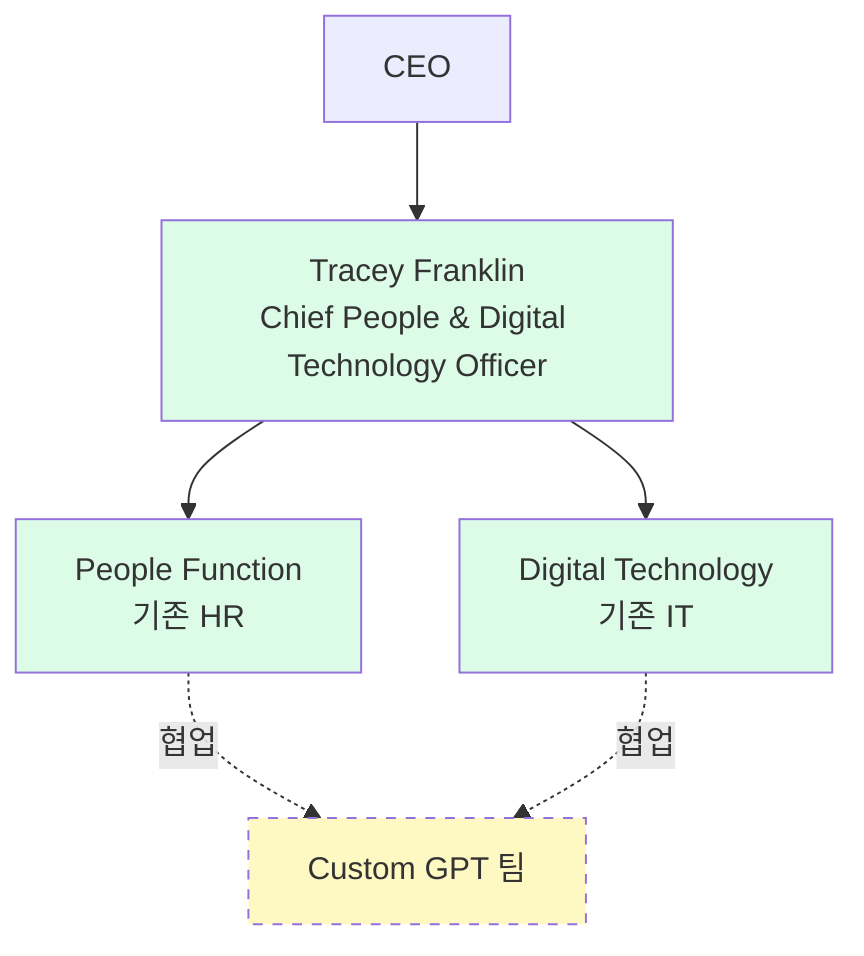

# Moderna

바이오텍/제약사. COVID-19 mRNA 백신으로 잘 알려짐. HR AI 도입 사례로 **Fortune 1000급에서 가장 많이 인용되는 references 중 하나**. OpenAI ChatGPT Enterprise 최초 엔터프라이즈 레퍼런스.

## 조직 구조 변화 (2025)

**2025년** Moderna는 HR 부서와 IT 부서를 단일 division **"People and Digital Technology"**로 병합. [[unleash-moderna-hr-it-merger-2025-06]] 확인.

- ✅ 리더: **Tracey Franklin**, **Chief People and Digital Technology Officer (CPDO)** (Moderna 최초 직책)
- ✅ Franklin 인용: *"architect the flow of work—how tasks, information and decisions get done"*
- ✅ 전제: "workforce planning"(HR) + "technology planning"(IT) → "work planning" 통합
- ⚠️ Franklin 솔직한 caveat: "**still very much a work in progress**", "**not a one-size-fits-all solution**"


_범례: 녹색 = 소스 확인. 점선/노랑 = 존재는 확인되나 상세 구조 미공개_

❓ 미공개: 병합 후 팀 사이즈, 하위 조직도, reporting 세부

## AI 도입 타임라인

| 시점 | 이벤트 | 출처 |
|---|---|---|
| 2023 | ⚠️ 자사 보고: **mChat** 출시 — OpenAI API 기반 내부 ChatGPT 인스턴스 | [[moderna-blog-openai-2024-04]] |
| 2024년 초~2024-04 | ⚠️ 자사 보고: **ChatGPT Enterprise** 배포 ("recently") | [[moderna-blog-openai-2024-04]] |
| 2024-04 | ✅ 750+ 커스텀 GPT, 배포 소요 ~2개월 | [[constellation-moderna-chatgpt-enterprise-2024-04]] |
| 2025-06 | ✅ HR+IT 병합, 3,000+ 커스텀 GPT | [[unleash-moderna-hr-it-merger-2025-06]] |

> **관찰 (contradiction 아님)**: GPT 개수는 14개월에 걸쳐 750 → 3,000+로 증가. 같은 시점의 상충 아닌 **시계열 성장**으로 해석.

## 확인된 Metric (2024-04, Constellation Tier 1 분석가 전달, 원자료는 Moderna)

- 사용자당 주 120 ChatGPT Enterprise 대화 평균
- weekly active users의 40%가 본인 GPT 제작
- Legal 팀 100% 채택
- 초기 mChat 채택률 80%

> ⚠️ **중요 주의**: Constellation 자체가 이 수치를 "independently endorsing"하지 않는다고 **명시**. Moderna self-report를 Tier 1 매체가 전달한 형태로 취급해야 함.

## 📊 Moderna의 HR AI Use Cases — 홀리스틱 뷰 (Live)

아래 표는 **Dataview로 자동 생성**됩니다. Moderna에 새 use case가 ingest되면 자동 반영.

```dataview
TABLE WITHOUT ID
  file.link AS "Use Case",
  primary_category AS "대그룹",
  subcategory AS "중그룹",
  stage AS "단계",
  confidence AS "신뢰도",
  last_confirmed AS "마지막 확인"
FROM "wiki/usecases"
WHERE company = "Moderna" OR contains(tags, "moderna")
SORT confidence DESC, last_confirmed DESC
```

### HR 대그룹 커버리지 (Moderna 기준)

```dataview
TABLE WITHOUT ID
  primary_category AS "HR 대그룹",
  length(rows) AS "Moderna Use Case 수",
  rows.file.link AS "페이지들"
FROM "wiki/usecases"
WHERE company = "Moderna"
GROUP BY primary_category
```

> **"홀리스틱 뷰"의 의미**: 위 쿼리는 Moderna가 **7개 HR 대그룹 중 몇 개에 걸쳐 AI를 적용했는지**를 보여줍니다. 현재는 1개 use case만 수집돼 있지만, Moderna가 실제로는 self-review·benefits assistant·job leveling 등 여러 도메인에 적용했으므로, 추가 ingest가 들어오면 이 표가 자동으로 Moderna의 "전사 HR AI 지도"로 성장합니다.

### 🔜 아직 수집 안 된 Moderna GPT (다음 ingest 후보)

| 추정 영역 | GPT 이름 (보고됨) | 예상 카테고리 | 출처 상태 |
|---|---|---|---|
| Performance Management | self-review GPT | 4. Performance & Talent Mgmt | HR Brew 2025-05 (미fetch) |
| Total Rewards | US benefits assistant GPT | 5. Total Rewards → Benefits | HR Brew 2025-05 (미fetch) |
| Workforce Planning | job leveling GPT | 7. Strategic Workforce → Workforce Planning | HR Brew 2025-05 (미fetch) |

> 이 표의 "보고됨" 정보는 지난 WebSearch 결과의 3차 전달이므로 직접 ingest된 것이 아님. 다음 ingest 라운드에서 HR Brew 2025-05 기사를 1차 소스로 확보 후 각 use case 페이지를 생성해야 함.

## Consulting Angle

- **최상급 레퍼런스 후보**: 포춘 500 클라이언트에 "full-stack AI at work" 예시로 제시 가능. 단, **"Moderna 규모·문화가 일반적이지 않음"**을 반드시 고지.
- **핵심 교훈 3가지** (클라이언트에게 제시용):
  1. **조직 구조 변화가 먼저, 도구는 나중** — Franklin의 CPDO 직책 자체가 메시지
  2. **solutions가 아니라 "work planning"** — 도구 도입이 아니라 업무 재설계
  3. **솔직한 "work in progress" 포지셔닝** — 성공 신화로 포장하지 않은 점
- **반면교사 경고**:
  - Moderna는 $3.2B · 5,000명 규모 · 디지털 네이티브 문화 · CEO 지원 4가지가 모두 맞아떨어진 케이스. 한국 대기업(수십만 명, 계열사 구조, 전통적 HR)에 **그대로 복제 제안은 위험**.
  - HR+IT 병합을 "베스트 프랙티스"로 제시하기 전에 Franklin의 caveat("not one-size-fits-all")을 반드시 인용

## Related
- Vendor: [[openai]]
- Sources: [[unleash-moderna-hr-it-merger-2025-06]], [[constellation-moderna-chatgpt-enterprise-2024-04]], [[moderna-blog-openai-2024-04]]
