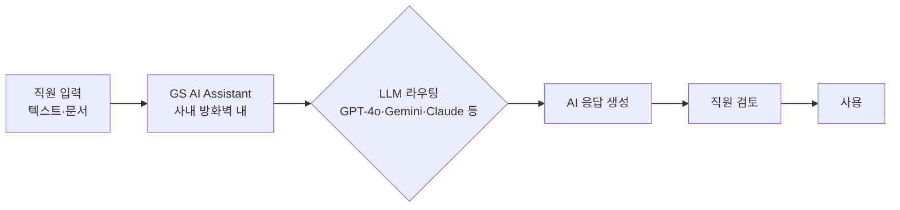

## Summary

Goldman Sachs는 2025년 1월 GS AI Assistant를 10,000명 파일럿으로 시작, 2025년 6월 전 지식노동자 대상 전사 배포를 완료했다. ✅ **Fact** 이 도구는 다수의 LLM(OpenAI ChatGPT/GPT-4, Google Gemini, Meta Llama, 오픈소스 모델)을 단일 인터페이스로 접근하는 멀티모델 어시스턴트로, 문서 요약·리서치 노트 초안·규제 문서 분석·코드 생성·다국어 번역 등을 지원한다. [[sources/fortune-goldman-gs-ai-2025-06.md]] [[sources/hrkatha-goldman-ai-assistant-2025.md]] [[sources/cnbc-goldman-gs-ai-assistant-2025-01.md]] ✅ 전사 출시 대상은 46,000명 규모 글로벌 인력. [[sources/hrkatha-goldman-ai-assistant-2025.md]] ✅ 2025-10 CEO Solomon 메모: AI 중심 재조직, "constrain headcount growth"·제한적 감원 (직원 48,300명). [[sources/cnbc-jpmorgan-goldman-ai-hiring-2025-10.md]] (2026-09-27 `jpmorgan-goldman-sachs-hr-ai` 합본 페이지에서 이관된 수치 4건 — 개발자 GitHub Copilot 배포 인원, 효율 향상 비율, firm-wide 인원, 감축 인원 — 은 인용 소스에 없어 grounding 점검에서 제거. Contradictions 참조.)

## Problem / Why (도입 배경)

Goldman Sachs의 지식노동자들은 리서치 노트 작성, 규제 문서 요약, 클라이언트 쿼리 응답 등 정형화된 고숙련 작업에 많은 시간을 소비하고 있었다. 외부 AI 도구 사용 시 민감 금융·고객 데이터가 방화벽 외부로 유출될 위험이 있었다.

## Solution Architecture

> **최우선 원칙**: 이 섹션은 **공개된 사실만** 기록한다.

### A. Process (프로세스)

- **Before (As-is)**: 지식노동자가 직접 문서 작성, 수동 검색, 개별 도구 사용.
- **After (To-be)**: ✅ **Fact** GS AI Assistant를 통해 문서 요약, 리서치 노트·코드·번역 초안 생성. 다양한 부서(채용·운영·리서치 등)에서 사용. [[sources/fortune-goldman-gs-ai-2025-06.md]] ✅ 사용자가 여러 AI 챗봇(ChatGPT·Gemini 등)에 접근해 질의 응답·이메일 작성·장문 문서 요약 요청. [[sources/fortune-goldman-gs-ai-2025-06.md]] [[sources/cnbc-goldman-gs-ai-assistant-2025-01.md]] ✅ Banker Copilot·Legend AI Query·Translate AI 등 내부 AI 툴킷의 일부. [[sources/hrkatha-goldman-ai-assistant-2025.md]]
- **Human-in-the-loop (HITL) 지점**: AI 생성 콘텐츠는 직원이 검토 후 사용. 완전 자율 의사결정 없음.
- **Trigger & Frequency**: 일상 업무 중 수시(on-demand).
- **Scope of autonomy**: Recommend 수준.

범례: 실선 = [[sources/fortune-goldman-gs-ai-2025-06.md]] 확인.

### B. System & Infrastructure (시스템·인프라)

- **Core HRIS / 기반 시스템**: _미공개 (not disclosed)_
- **AI 시스템 배치**: ✅ **Fact** 사내 방화벽 내 격리 운영. 외부 LLM들과 연동하되 데이터가 외부로 나가지 않도록 설계. [[sources/cnbc-goldman-gs-ai-assistant-2025-01.md]] ✅ 46,000명 규모 글로벌 인력 대상 firm-wide (10,000명 파일럿 → 2025-06 전사). [[sources/hrkatha-goldman-ai-assistant-2025.md]]
- **배포 환경**: _미공개 (not disclosed)_
- **사용자 접점 (UX layer)**: 접점 형태(portal/앱) _미공개 (not disclosed)_ — ✅ Banker Copilot·Legend AI Query·Translate AI를 포함한 내부 AI 툴킷의 일부. [[sources/hrkatha-goldman-ai-assistant-2025.md]]
- **인증·권한**: _미공개 (not disclosed)_

### C. Data (데이터)

- **입력 데이터 소스**: 직원이 입력하는 텍스트·문서. 내부 지식베이스 연동 여부 _미공개 (not disclosed)_.
- **데이터 거버넌스**: ✅ **Fact** 사내 방화벽 격리로 민감 데이터 유출 차단. [[sources/cnbc-goldman-gs-ai-assistant-2025-01.md]] ✅ 모델을 사내 호스팅해 데이터 프라이버시·컴플라이언스 요건 충족. [[sources/hrkatha-goldman-ai-assistant-2025.md]] 감사 로그·모니터링 세부: _미공개 (not disclosed)_
- **민감정보 처리**: _미공개 (not disclosed)_

### D. Model (모델)

- **Foundation model**: ✅ **Fact** OpenAI GPT-4(ChatGPT), Google Gemini, Meta Llama, 오픈소스 모델 — 세부 버전 _미공개_. [[sources/hrkatha-goldman-ai-assistant-2025.md]] [[sources/cnbc-goldman-gs-ai-assistant-2025-01.md]] [[sources/fortune-goldman-gs-ai-2025-06.md]] (Anthropic Claude 포함 여부는 인용 소스에 없음 — 2026-09-27 grounding 점검)
- **Model 유형**: LLM (생성형), 멀티모델.
- **제공 방식**: 다수 외부 벤더 API + 내부 포털 라우팅.
- **커스터마이징 기법**: _미공개 (not disclosed)_

### E. Organization & Team (조직·팀 구조)

- **오너십**: _미공개 (not disclosed)_
- **팀 규모**: _미공개 (not disclosed)_ (AI 엔지니어 채용 인원·개발자 Copilot 배포 인원 — 수치 근거 미확보, 2026-09-27 grounding 점검)
- **거버넌스 체계**: _미공개 (not disclosed)_

## Impact / Metrics (기대효과)

### 기대효과 요약
10,000명 파일럿에서 전사 확대(Fact). 파일럿 참여자가 효율 개선 및 시간 절약 보고하나 구체 수치 미공개 (자사 보고).

- ✅ **Fact**: 10,000명 파일럿 → 전사 지식노동자 전체로 확대 (2025년 6월). [[sources/fortune-goldman-gs-ai-2025-06.md]]
- ⚠️ **자사 보고**: 파일럿 참여자들이 효율 개선 및 정확도 향상, 시간 절약 보고. 독립 검증 미확인. [[sources/fortune-goldman-gs-ai-2025-06.md]]
- 개발자 GitHub Copilot 배포 인원·효율 향상 비율: _미공개_ (수치 근거 미확보 — 2026-09-27 grounding 점검)
- ✅ **Fact**: CEO Solomon 메모(2025-10) — "constrain headcount growth", 올해 제한적 인원 감축; AI 프로젝트는 수년 소요, 고객 경험·수익성·생산성·직원 경험 목표로 측정. [[sources/cnbc-jpmorgan-goldman-ai-hiring-2025-10.md]] (감축 인원 수치 _미공개_)

## Governance & Risk

- 사내 방화벽 내 격리 운영으로 금융 민감 데이터 보호.
- 향후 agentic AI(멀티스텝 자율 실행) 도입 계획 공개 — 현재는 생성 보조 수준.
- 세부 AI 윤리·편향 감사 체계: _미공개 (not disclosed)_

## Contradictions

> [!note] 2026-09-27 합본 페이지 병합
> `jpmorgan-goldman-sachs-hr-ai` 합본 페이지의 Goldman 사실을 이관 (JPM 사실 → [[jpmorgan-llm-suite-redeployment]], 금융 산업 인사이트 → [[industry-region-landscape]]). 10,000명 파일럿(이 페이지)과 "10,000 직원에게 GS AI 배포"(합본 페이지)는 동일 사실.

> [!note] 2026-09-27 grounding — 합본 이관 수치 4건(개발자 12,000명 GitHub Copilot 배포, 약 20퍼센트 효율 향상, firm-wide 46.5K명, 1,000명 감축)은 인용 소스 4건의 raw 어디에도 없어 제거. HRKatha는 "46,000-strong", CNBC 2025-10-15는 "lay off a limited number"·직원 48,300명으로 기재. 모델 버전(GPT-4o·o3-mini·Gemini 2.0 Flash·Claude 3.7 Sonnet)과 "2024년 AI 엔지니어 500명 채용"도 소스에 없어 제거·_미공개_ 처리. frontmatter `vendor`의 Anthropic, `output:`의 모델 버전 표기는 본 점검에서 손대지 않음 (수정 필요).

## Consulting Angle

- JPMorgan LLM Suite와 함께 "월가 지식노동자 AI 생산성 플랫폼" 대표 사례로 짝으로 제시. 두 사례 모두 멀티모델·내부 방화벽 격리·전사 배포의 공통 패턴.
- 국내 증권사·보험사 AI 도입 로드맵 제안 시, 파일럿(10,000명) → 전사(전체) 단계적 확대 전략의 실증 레퍼런스.
- **내재화 전략**: 모델을 사내 호스팅하는 방식은 "내재화 전략의 비용 현실"(인력·인프라)을 동반 — 외부 벤더 SaaS 대비 내재화 비용 비교 시 논점으로 활용 (인력 규모 수치는 _미공개_).
- **"전 직원에게 AI 도구 배포" 전략** (병합 이관): Moderna의 "모든 직원에게 ChatGPT Enterprise"와 유사한 firm-wide 배포 패턴
- **전사 AI 배포 → headcount 전략**: Solomon 메모의 "constrain headcount growth"·제한적 감원은 **"전사 AI 배포가 HR 전략(채용·감축·보상)에 미치는 영향"**의 증거로 제시 [[sources/cnbc-jpmorgan-goldman-ai-hiring-2025-10.md]]
