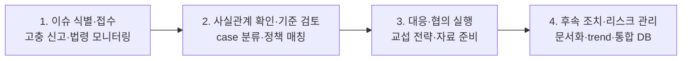
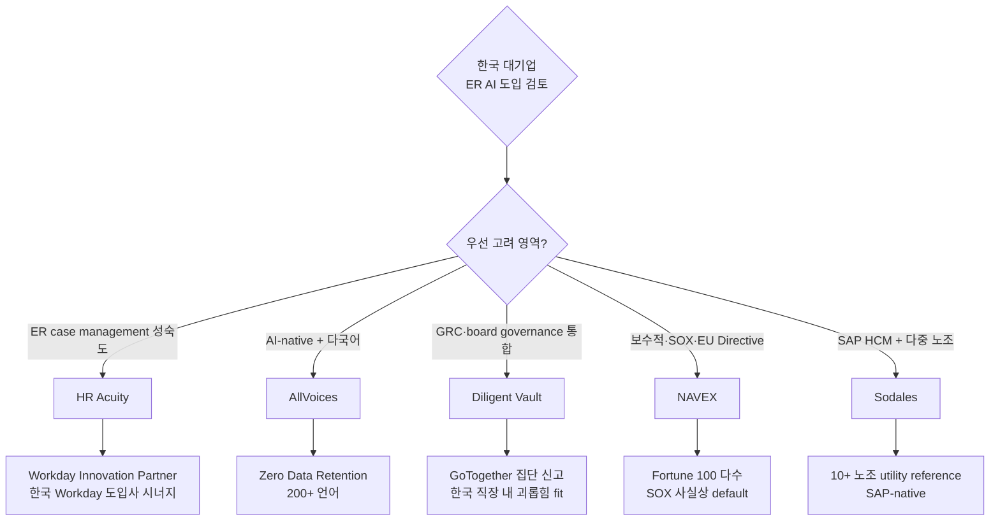
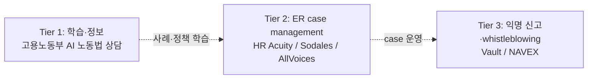

# ER (Employee Relations · 노무) AI 벤더 landscape + 한국 적용 reference

본 synthesis는 PwC Korea ER AI 컨설팅 자료 (raw/etc/) + 2개 background research agent 검증 결과 + 추가 발굴 reference를 종합한 ER AI 벤더 비교 자료. 한국 대기업 ER/노무 AI 도입 컨설팅에 즉시 활용 가능.

## 1. ER (Employee Relations · 노무) 정의

ER 영역은 **사실관계 정리·이슈 모니터링·내부 규정 해석·문서화** 등 지원 업무가 AI 도입 핵심 — **핵심 판단·교섭·의사결정은 사람이 수행**한다는 원칙 일관.

### ER Value Chain (4단계)

### 두 갈래: 집단노사 vs 준법지원

| 영역 | Focus | 주요 벤더 |
|---|---|---|
| **집단노사** | 노조 grievance·CBA·교섭 | Sodales (SAP-native), HR Acuity, AllVoices |
| **준법지원** | ethics·whistleblowing·investigation | HR Acuity, AllVoices, Diligent Vault, NAVEX |

## 2. 글로벌 ER AI 벤더 4-vendor 비교 (Top tier)

| 벤더 | 출시·인수 | Confidence | 핵심 차별화 | 한국 적용 우선순위 |
|---|---|---|---|---|
| **HR Acuity** [[hr-acuity-oliver-er-companion]] | olivER 2024 | **0.80** | G2 #1, Brandon Hall Gold 2025, Forrester TEI 520% ROI, Workday Innovation Partner. ER case management 성숙도 최고 | ★★★ 1차 검토 |
| **AllVoices** [[allvoices-vera-ai-er-copilot]] | Vera AI 2024 | 0.65 | AI-native, 200+ 언어, 익명 신고 + ER 통합. HR Acuity 직접 경쟁자 | ★★ AI-native 선호 시 |
| **Diligent Vault** [[diligent-vault-active-integrity-speakup]] | 2025-05 인수 | 0.65 | GRC 통합 + EthicsChat + 집단 신고 (GoTogether). board governance 시너지 | ★★ ESG·SOX 연계 |
| **NAVEX EthicsPoint + NCA** [[navex-ethicspoint-nca-compliance]] | NCA 2025-12 | 0.65 | 13K+ 조직, 글로벌 whistleblowing 표준. 보수적 SOX·EU Directive | ★★ 보수적 선택 |

### 한국 도입 시 selection guide

## 3. 특수 reference: SAP-native 다중 노조 (Sodales + Spire)

[[sodales-spire-energy-labor-relations]] — SAP SuccessFactors 베이스 한국 대기업 (LG·SK·삼성 등)에 즉시 매칭. **다중 노조 utility (10+ 노조) 글로벌 reference로 유일**.

⚠️ PwC 자료 정정: PwC가 "Spire" (고객)를 벤더로 표기 → 실제 벤더는 Sodales Solutions.

## 4. 한국 정부 reference: 고용노동부 AI 노동법 상담

[[moel-ai-labor-law-consultation]] — **2024-11 출시, 누적 117K 사용 (2025), 87.5% 상담 시간 단축, 32개 언어**. 공인노무사회 MOU.

### 한국 컨설팅 시 활용 가치
- **"정부도 한다" 카드** — 보수적 CHRO 설득
- **사내 챗봇 ROI 시뮬레이션 base** — 정량 metric 활용
- **외국인 노동자 다국어 대응 reference** — 32개 언어 지원이 한국 대기업 외국인 사업장 (제조·F&B·물류) fit

## 5. ER 4-stage Value Chain × 벤더 매핑

| 단계 | 핵심 기능 | 매핑 벤더 |
|---|---|---|
| **1. 이슈 식별·접수** | 고충 자동 분류·법령 monitoring·다국어 hotline | NAVEX, AllVoices, Vault, HR Acuity Speakfully |
| **2. 사실관계 확인·기준 검토** | Compliance 챗봇·정책 Q&A·precedent 검색·investigation plan | **HR Acuity olivER**, AllVoices Vera, Vault EthicsChat, NAVEX NCA |
| **3. 대응·협의 실행** | 교섭 전략·인터뷰 질문·자료 준비 | HR Acuity olivER (ER), Sodales (CBA), AllVoices |
| **4. 후속 조치·리스크 관리** | 문서화·trend·통합 DB·SOX audit | HR Acuity, NAVEX (SOX), Vault (GRC), Sodales (audit trail) |

## 6. 컨설팅 활용 angle (한국 대기업)

### 6.1. 3-tier 모델 권장

### 6.2. 산업·기존 HRIS 별 추천

| 클라이언트 | 추천 vendor | 이유 |
|---|---|---|
| Workday 도입 한국 대기업 | **HR Acuity** | Workday Innovation Partner |
| SAP HCM 도입 한국 대기업 | **Sodales** | SAP-native, 다중 노조 fit |
| ESG·SOX 의무 강함 (금융·바이오 글로벌 진출) | **Diligent Vault** | GRC 통합, board reporting |
| 외국인 사업장 비중 높음 (제조·F&B·물류) | **AllVoices** | 200+ 언어 + AI-native |
| 보수적 보안 1순위 (공기업·금융지주) | **NAVEX** | 글로벌 표준, 13K+ 조직 |

### 6.3. 한국 적용 공통 제약
- ✅ 모든 글로벌 SaaS는 **한국어 LLM 정확도 검증** 필수 (POC 단계)
- ✅ **PIPA(개인정보보호법)** + 노조 사전 합의 필수
- ✅ **직장 내 괴롭힘 금지법** (2019~) + **중대재해처벌법** (2022~) customization
- ✅ **한국 AI 기본법 (2026-01-22)** — ER AI는 **고영향 AI** 분류 가능 → 영향평가·인적감독·이용자 고지 의무
- ⚠️ 한국 ER AI 시장 미성숙 — **글로벌 SaaS + 노무법인 hybrid 모델** 권장

## 7. PwC 자료 정정·시사점

### 정정 4건
1. **"Spire" = 고객사** (벤더 아님) — 실제 벤더는 **Sodales Solutions**
2. **"LiKHR AI Companion" = 검증 불가** — **HR Acuity olivER**가 가장 유사
3. **"Cisco Webex Saakaroon" = 검증 불가** — 0건 검색
4. **"Adept Solid Solutions" = 검증 불가** — Adept AI는 별개 회사
5. **"Hitachi Skye 2022 Case (ER)"** = **PwC 분류 부정확** — Skye는 2025년 출시, **Ema 플랫폼 기반**, 일반 HR 자가서비스 (ER 명시 없음). [[hitachi-skye-hr-ai-assistant]] contradiction callout 참조

### 누락 vendor (PwC가 missed)
- **AllVoices Vera AI** — AI-native ER copilot
- **Diligent Vault** — GRC 통합 + 집단 신고 (2025-05 인수)
- **NAVEX EthicsPoint NCA** — 2025-12 AI 확장
- **고용노동부 AI 노동법 상담** — 한국 정부 사례 (필수 인용)

### 컨설팅 권장
- PwC 자료 그대로 클라이언트 인용 시 **벤더 식별 오류 risk** — 본 wiki의 정정·확장 자료 활용
- 한국 대기업 ER AI 컨설팅 deck에 **4-vendor 비교 + Sodales SAP fit + 정부 사례** 3-tier 구조 권장

## 8. Watch list (2026 H2~2027)

- Forrester Wave for Whistleblowing/ER Software 등재 (HR Acuity·NAVEX 모두 후보)
- Gartner Magic Quadrant for Employee Relations 신규 발표
- Diligent의 한국 진출·Vault 한국 customer reference
- AllVoices Series 추가 funding·한국 진출
- 고용노동부 AI 사용 통계 갱신 (분기·연간)
- NAVEX NCA 한국 customer reference

## 9. 추가 발굴 후보 (lower priority, 페이지 작성 가치 검토)

- **AI노무사** (ainomusa.co.kr) — 24년차 공인노무사 김경모, 근로계약서 자동 생성 (3,200만 가지 조합)
- **Convercent → EQS Group** (2024-2025 매각) — 유럽 중심, 한국 활용도 낮음
- **ServiceNow Employee Relations + Agentic AI** (2025-2026) — ER 전용 AI는 약함
- **Workday × HR Acuity 통합** — HR Acuity 페이지 내 cover됨

---

본 synthesis는 2026-05-06 기준. ER AI 벤더 변화 및 한국 시장 동향에 따라 정기 갱신 권장.
