# HR AI Use Case 집 — 상세 버전 (프로세스·시스템·데이터 도식 포함)

> **이 문서의 특징**: 각 대표 사례에 대해 **프로세스 플로우(As-is→To-be) + 시스템 아키텍처 + 데이터 흐름**을 Mermaid 도식으로 시각화. 모든 도식의 실선 = 소스 확인 Fact, 점선 = 미확인.

---

# ━━━ 1. Talent Acquisition (채용) ━━━

## 1-1. Chipotle "Ava Cado" — Paradox Olivia (conf 0.55)

### 도입 배경 (Pain Point)
3,500+ 매장의 General Manager가 채용 행정(스크리닝·스케줄링·오퍼)에 과도한 시간 소모 → 매장 운영에 집중 못 함

### 🔵 Process Flow (As-is → To-be)

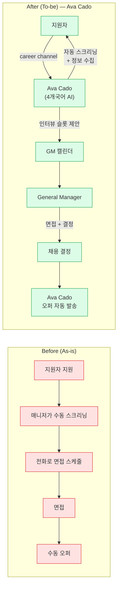
_범례: 빨간 = Before, 녹색 = After (Chipotle PR + CNBC 확인)_

### 🟢 System Architecture

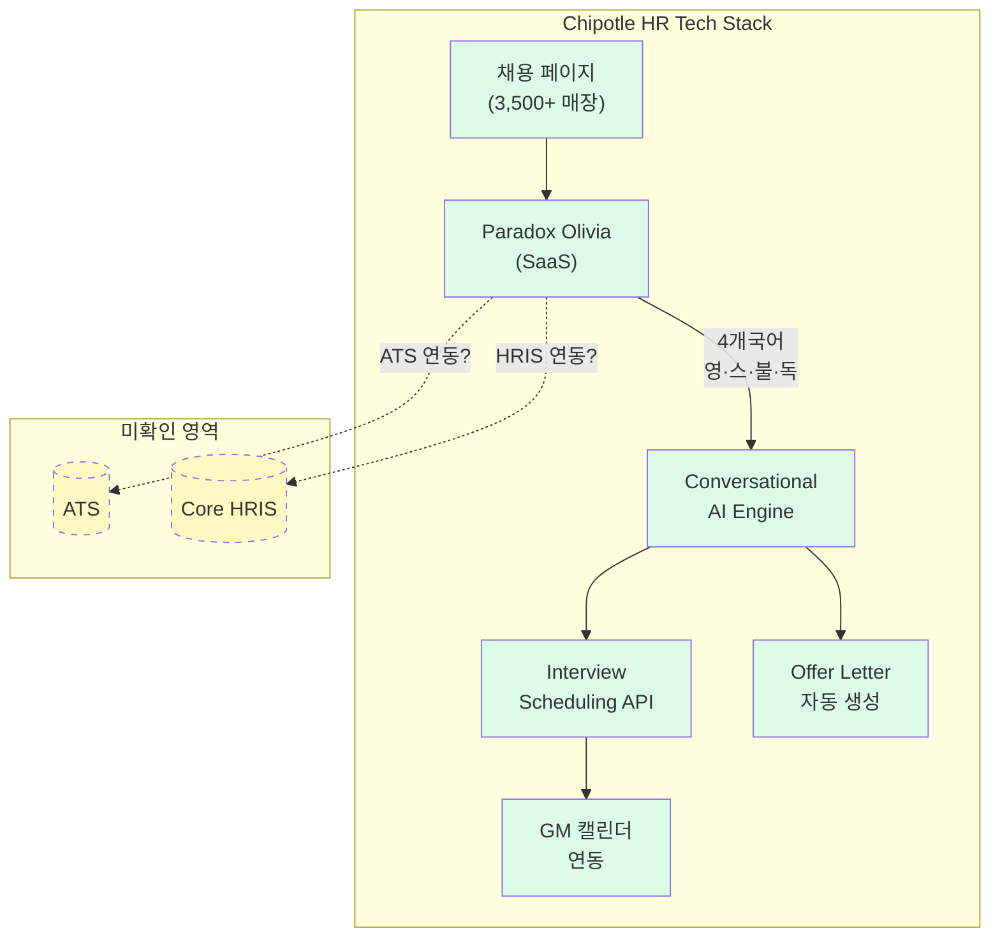

### 📊 기대효과 (Before → After)

| 지표 | Before | After | 변화 | 검증 수준 |
|---|---|---|---|---|
| Time-to-hire | **12일** | **3.5일** | **71%↓** | ✅ CNBC 독립 확인 |
| 지원 완료율 | **50%** | **85%** | **+35pt** | ✅ CNBC 독립 확인 |
| 스케줄링 시간 | 수동 (시간~일) | **자동 (분)** | — | ⚠ Paradox 주장 |
| 커버 규모 | — | **3,500+ 매장** | — | ✅ Chipotle PR |
| Bias audit | — | _미공개_ | — | ❓ |

---

## 1-2. 🇰🇷 SK Group AICT + AI 면접 100% (conf 0.40)

### 도입 배경
SK 그룹 전사 OI(Operational Innovation) 비용 절감. 기존 채용 프로세스(서류 1주, 코딩 테스트)가 AI 시대에 부적합

### 🔵 Process Flow

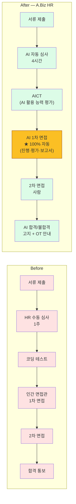
_노랑 강조: 1차 면접 AI 100% 자동화 = 이 사례의 가장 과감한 포인트_

### 🟢 System Architecture

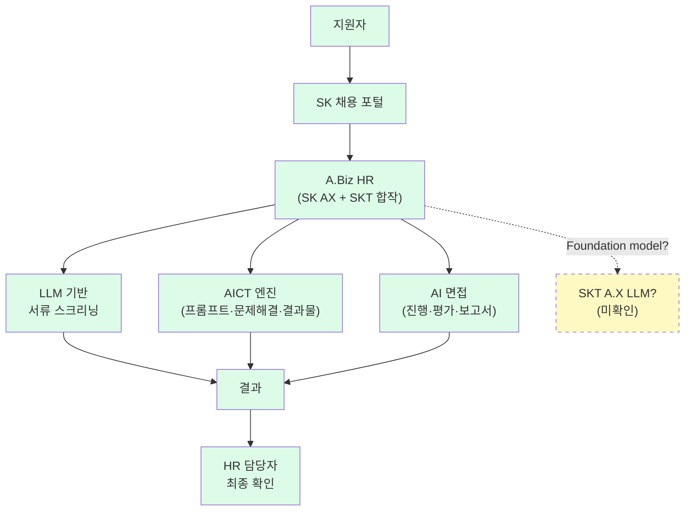

### 📊 기대효과

| 지표 | Before | After | 검증 |
|---|---|---|---|
| 서류 심사 시간 | **1주** | **4시간** | ✅ 한국 경제지 7곳 |
| 결과 발표 | 수주 | **마감 2일 후** | ✅ 서울경제 |
| 처리 속도 | 사람 기준 | **100배 빠름** | ⚠ 벤더 주장 |
| 1차 면접 | 인간 면접관 | **AI 100%** | ✅ SK AX 인사이트 |
| AICT 내용 | 코딩 테스트 | **AI 활용 능력 평가** | ✅ Fact |

---

# ━━━ 2. Onboarding & Transitions (온보딩·이동) ━━━

## 2-1. Schneider Electric — Open Talent Market, $15M (conf 0.50)

### 도입 배경
**직원 50%가 퇴직 사유로 "내부 성장 기회 부족"** — wiki 전체에서 가장 강력한 Before 데이터

### 🔵 Process Flow

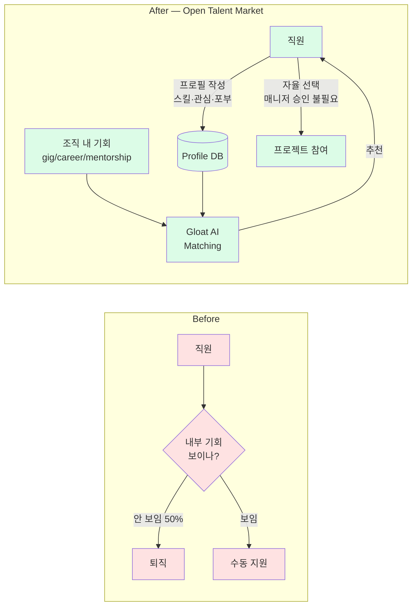

### 🟢 System Architecture

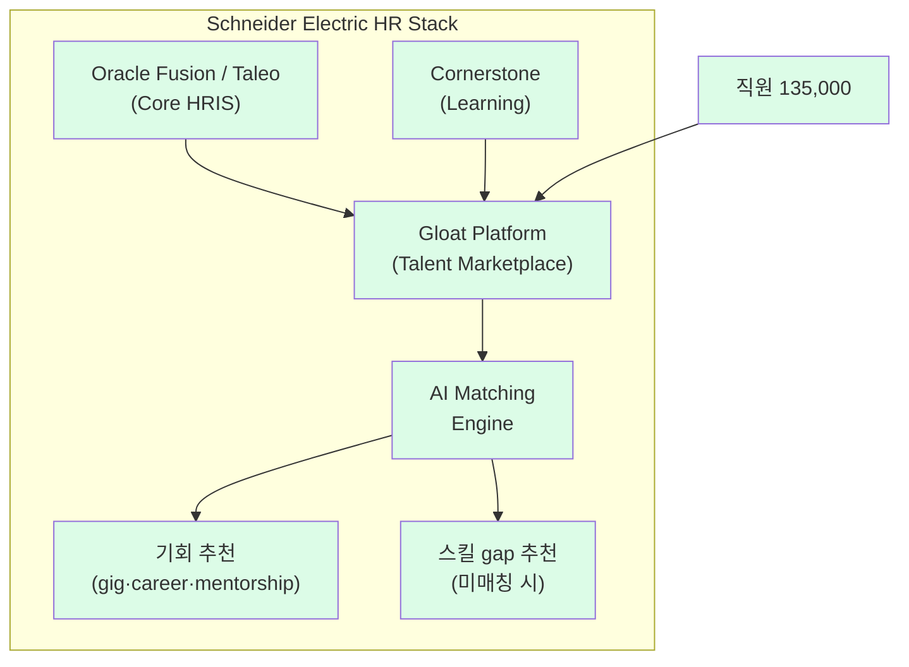
_Bersin 2019 + SHRM 2025에서 Oracle Fusion/Taleo/Cornerstone 통합 확인_

### 📊 기대효과

| 지표 | Before | After | 검증 |
|---|---|---|---|
| "내부 기회 부족" 퇴직 사유 | **50%** | 개선 (수치 미공개) | ⚠ 자사 보고 → Bersin Tier 1 |
| Unlocked capacity | 0 | **360,000+ 시간** | ⚠ Gloat 주장 |
| 비용 절감 | 0 | **$15M+** | ⚠ Gloat 주장 |
| 초기 등록률 | — | **75% → 89%** | ✅ Bersin 확인 |

---

# ━━━ 3. Learning & Development (교육·역량) ━━━

## 3-1. J&J — Digital Talent Platform, MIT CISR ⭐⭐ (conf 0.60)

### 도입 배경
디지털 역량 인력의 이탈이 높고, 직원 스킬 가시성이 부족해 내부 이동·학습 추천이 어려움

### 🔵 Process Flow + 🟣 Data Flow (학술 논문에서 확인된 아키텍처)

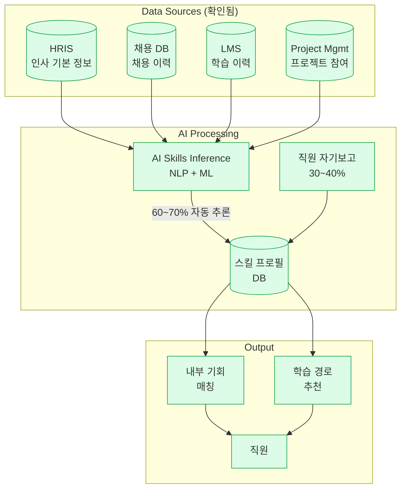
_범례: 전체 녹색 = MIT CISR + IS Journal 학술 검증. 이 도식의 모든 노드가 Tier 1 학술 소스에서 확인됨._

### 📊 기대효과 (전부 학술 검증 ⭐)

| 지표 | Before | After | 변화 | 검증 |
|---|---|---|---|---|
| 스킬 추론 | 직원 자기보고 100% | **AI 60~70%** + 자기보고 30~40% | 자동화 | ✅ MIT CISR |
| J&J Learn 접근 | _미공개_ | Technology 직원 **90%+** | — | ✅ MIT CISR |
| 자발적 학습 참여 | _baseline_ | **+20%** | — | ✅ IS Journal |
| 내부 배치 | 2023 수준 | 2024: **+8%** (YoY) | — | ✅ IS Journal |
| 디지털 역할 이탈 | 전사 평균 | **3.2% 낮음** | — | ✅ IS Journal |

---

# ━━━ 4. Performance & Talent Management (평가·인재) ━━━

## 4-1. BetterUp + Twilio — AI 코칭 (conf 0.45)

### 도입 배경
리더십 코칭은 효과가 있지만 비용이 높아 소수 임원만 받을 수 있음 → AI로 전 직원 확장

### 🔵 Process Flow

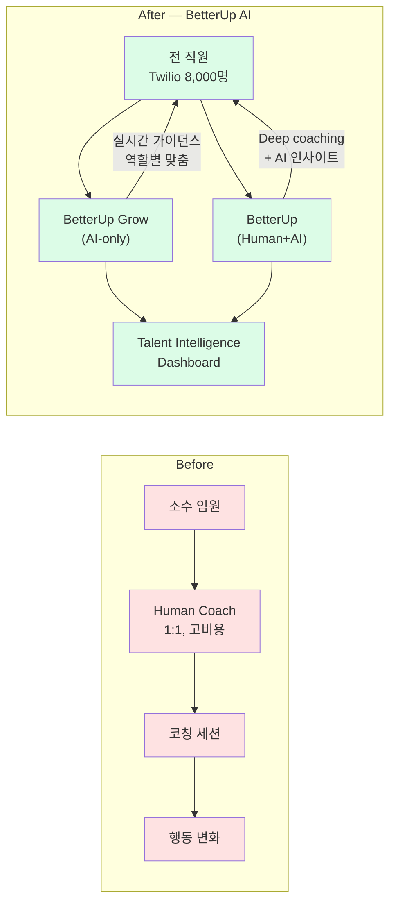

### 📊 기대효과

| 지표 | Before (non-coached) | After (coached) | 변화 | 검증 |
|---|---|---|---|---|
| 고성과 평가 확률 | baseline | **+32%** | — | ⚠ 벤더 주장 (Twilio 8k) |
| 이탈률 | baseline | **5x 낮음** | — | ⚠ 벤더 주장 |
| 비용/인 | Human coaching 비용 | **70% 절감** (AI-only) | — | ⚠ 벤더 주장 |
| 만족도 | — | **95%** (Grow) | — | ✅ Inc.com 보도 |

---

# ━━━ 5. Total Rewards (보상·복리후생) ━━━

## 5-1. Spring Health + General Mills — EAP 1%→26% (conf 0.30)

### 도입 배경
전통 EAP(Employee Assistance Program) 활용률이 **1%**로 극히 낮음

### 🔵 Process Flow

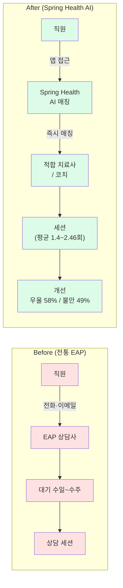

### 📊 기대효과

| 지표 | Before | After | 변화 | 검증 |
|---|---|---|---|---|
| EAP 활용률 | **1%** | **26%** | **26배↑** | ⚠ 벤더 주장 |
| 우울 개선 | — | **58%** (2.46세션) | — | ⚠ 벤더 주장 |
| 불안 개선 | — | **49%** (1.4세션) | — | ⚠ 벤더 주장 |
| 절약 | — | **$1,070/참가자** | — | ⚠ 벤더 주장 |

---

# ━━━ 6. Employee Experience & HR Ops ━━━

## 6-1. Moderna — Ask HR Routing ⭐⭐ (conf 0.70, wiki 최고)

### 🔵 Process Flow (routing)

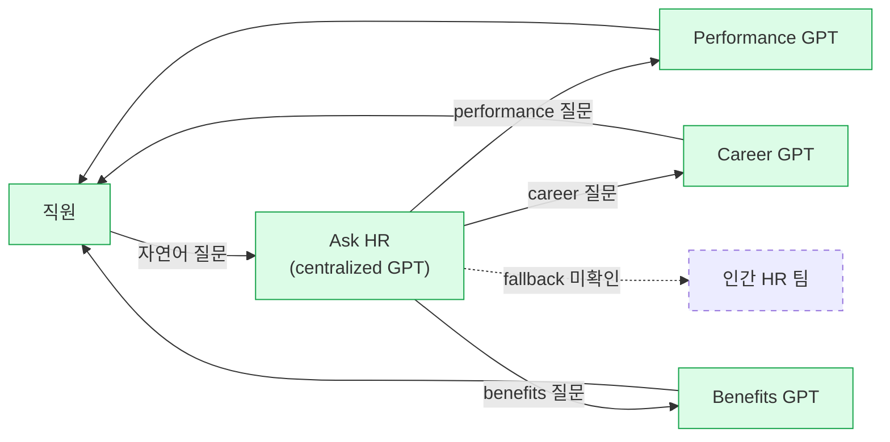

### 🟢 System Architecture (2-layer 구조)

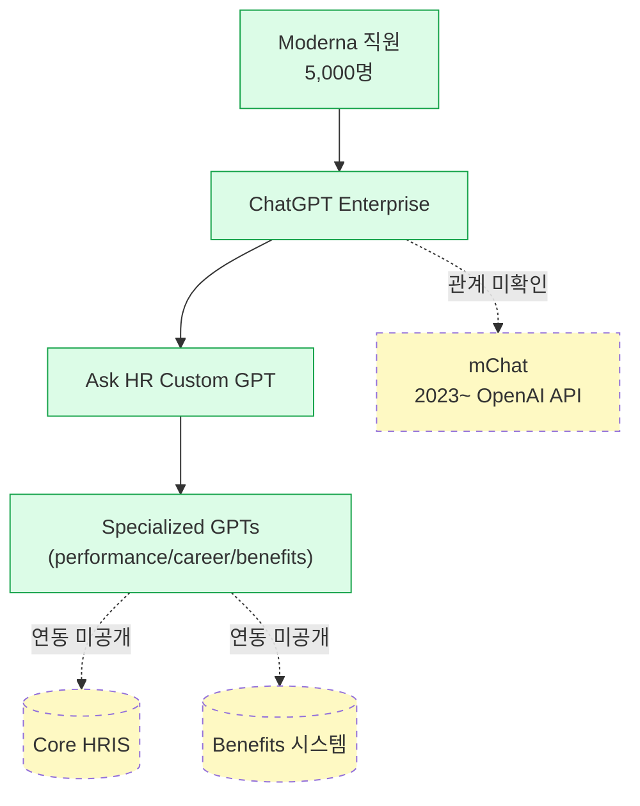

### 🏢 Org Structure (HR+IT 병합)

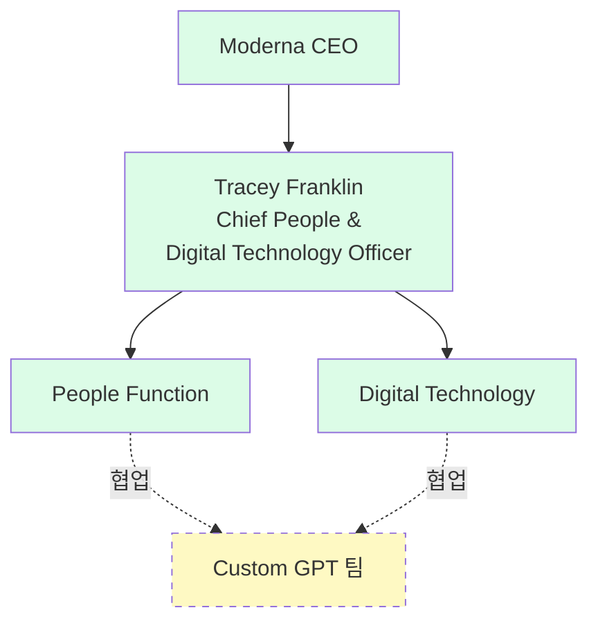

## 6-2. IBM — AskHR Agentic (conf 0.45)

### 🔵 Process Flow (agentic — 작업 수행 수준)

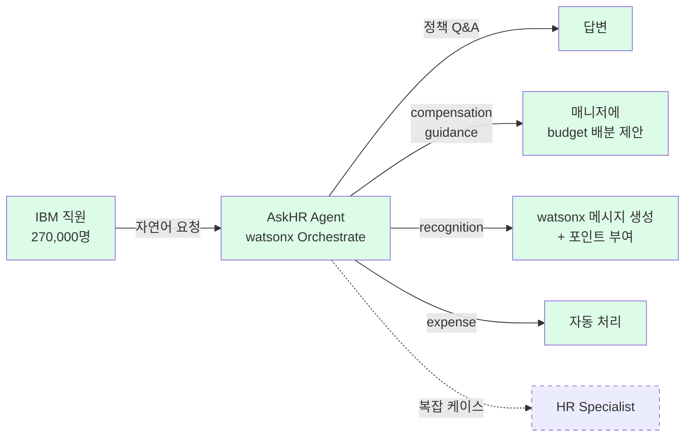

### ⚡ HR AI Maturity 3단계 비교

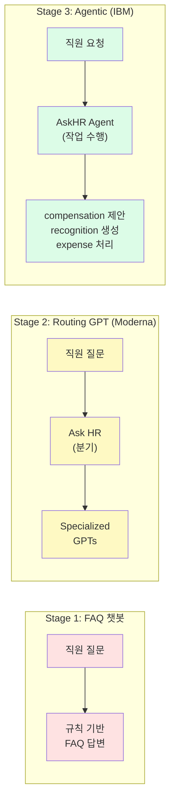
_빨간→노랑→녹색: HR AI maturity 진화. 대부분 기업이 Stage 1~2, IBM이 유일하게 Stage 3._

---

# ━━━ 7. Strategic Workforce & Governance ━━━

## 7-1. Amazon — HR 부서 15% 감축 (conf 0.45)

### 🔵 Impact Flow

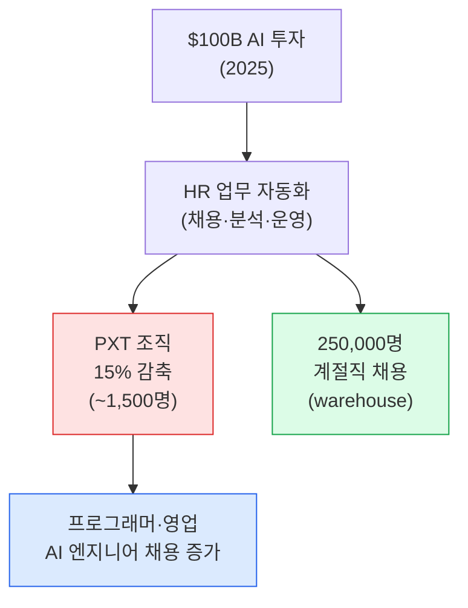
_빨간 = 감축, 녹색 = 채용, 파란 = 재투자. "White-collar 자동화 + Blue-collar 채용"의 구조적 이중성._

---

# ━━━ 🇰🇷 한국 특화 ━━━

## KR-1. LG CNS — 에이전틱 AI HR (아키텍처 공개 유일 사례)

### 🟢 System Architecture (4-Component, 국내 유일 공개)

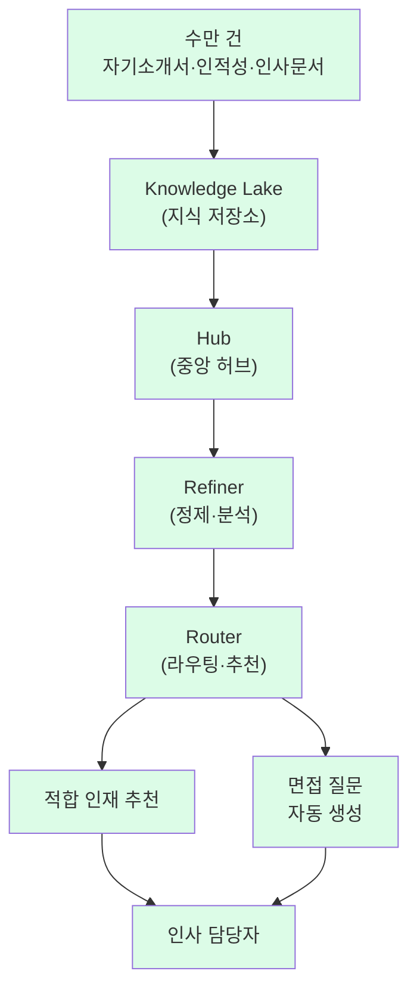
_범례: 전체 녹색 = LG 공식 보도에서 확인. **국내 HR AI 중 유일하게 아키텍처 컴포넌트명을 공개한 사례.**_

## KR-2. 더존비즈온 — ONE AI 연말정산 (한국 특유 영역)

### 🔵 Process Flow (End-to-End)

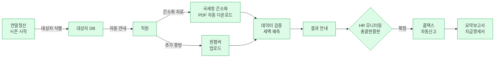
_**글로벌 벤더(Workday·SAP)가 구조적으로 들어올 수 없는 한국 특유 영역.**_

---

# ━━━ 교차 분석 ━━━

## 기업 × 카테고리 매트릭스

| 기업 | 1.TA | 2.Onb | 3.L&D | 4.Perf | 5.TR | 6.EX | 7.Gov |
|---|---|---|---|---|---|---|---|
| **Moderna** | | | | ★ | ★ | ⭐⭐ | |
| **Walmart** | | | ★ | | | ⭐ | |
| **IBM** | | | | | | ⭐ | |
| **JPMorgan** | ★ | | | | | ★ | |
| **Siemens** | | | ⭐ | | | ★ | |
| **Chipotle** | ⭐ | | | | | | |
| **Schneider** | | ⭐ | | | | | |
| **J&J** | | | ⭐⭐ | | | | |
| **HSBC** | ★ | ★ | | | | | |
| **Meta** | | | | ⭐ | | | |
| **Amazon** | | | | | | | ⭐ |
| **Deloitte** | | | | | | ★ | ★ |
| 🇰🇷 **SK Group** | ⭐ | | | | | | |
| 🇰🇷 **마이다스아이티** | ⭐ | | | | | | |
| 🇰🇷 **더존비즈온** | | | | | ★ | | |
| 🇰🇷 **LG CNS** | ★ | | | | | | |
| **BetterUp** | | | | ⭐ | | | |
| **Spring Health** | | | | | ★ | | |

범례: ⭐⭐ = 최고 검증, ⭐ = 대표 사례, ★ = 추가 사례

---

## HR AI Maturity Scale — 기업 포지셔닝

```mermaid
quadrantChart
    title HR AI 성숙도 (자동화 수준 vs HR 영역 커버)
    x-axis "단일 영역" --> "다영역 통합"
    y-axis "보조/추천" --> "자율/Agentic"
    Moderna (Ask HR + GPTs): [0.65, 0.45]
    IBM (AskHR watsonx): [0.35, 0.85]
    Walmart (Ask Sam + Tools): [0.55, 0.40]
    Chipotle (Ava Cado): [0.20, 0.70]
    Siemens (reskill+GBS): [0.60, 0.35]
    SK Group (AICT): [0.25, 0.80]
    J&J (Skills AI): [0.50, 0.30]
    Meta (AI mandate): [0.75, 0.25]
    Amazon (PXT cut): [0.30, 0.90]
```
_해석: 오른쪽 위 = 다영역+고자동화(IBM), 왼쪽 위 = 단일 영역+고자동화(SK AICT·Chipotle), 오른쪽 아래 = 다영역+보조 수준(Meta·Siemens)_

---

> **이 문서의 모든 도식은 소스에서 확인된 Fact만 포함합니다.**
> 실선 = 소스 확인, 점선 = 미확인, 빨간 = Before(도입 전), 녹색 = After(도입 후).
> 상세 페이지: [[dashboard]] → 각 use case 클릭.
