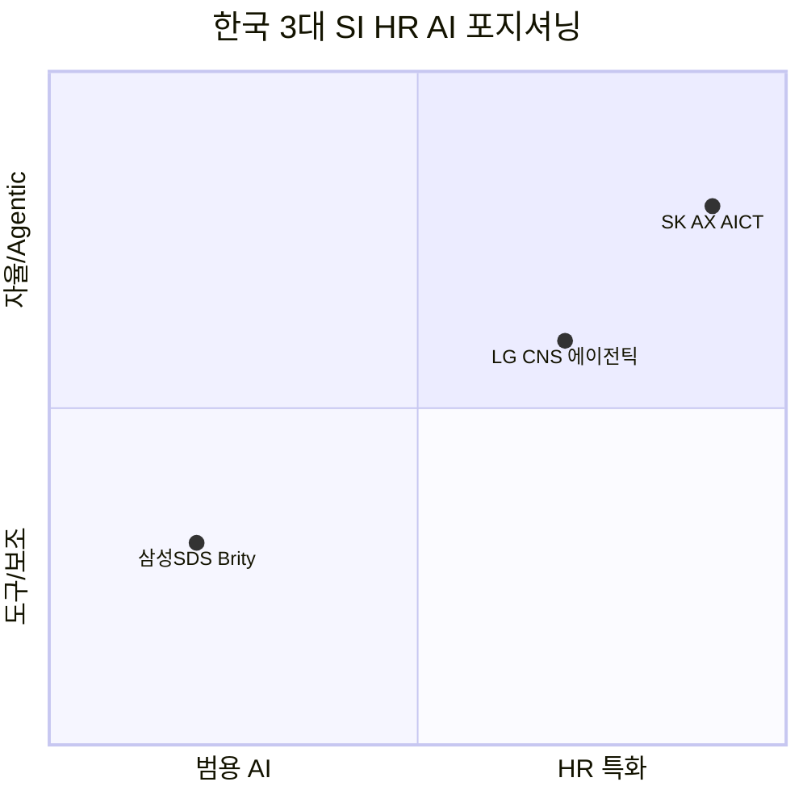

# 🇰🇷 한국 HR AI 벤더 비교 — 3대 SI + 주요 HR tech

> 🎯 **컨설팅 insight**: 한국 대기업 HR AI 시장은 **"그룹 SI가 만든다"** 패턴이 뚜렷하다. 삼성SDS·LG CNS·SK AX 3대 SI가 모두 HR AI에 진출했으며, 각각 다른 접근법을 취한다. 여기에 마이다스아이티(평가)·원티드랩(매칭)·더존비즈온(급여)·플렉스(올인원)가 영역별로 경쟁한다.

---

## 1. 한국 3대 SI의 HR AI 전략 대비

| 축 | **삼성SDS** | **LG CNS** | **SK AX** |
|---|---|---|---|
| **주력 제품** | Brity Copilot (범용 AI 어시스턴트) | 에이전틱 AI HR (채용 특화) | AI 채용 서비스 + AICT |
| **HR 특화도** | 낮음 (범용 협업 도구에 HR 기능 포함) | **높음** (채용·인사 특화 서비스) | **매우 높음** (채용 전 과정 전용) |
| **핵심 기능** | 메일·메신저·문서 요약·협업 | **자기소개서 분석 + 면접 질문 자동 생성** | **AICT (AI 활용 능력 평가) + 1차 면접 100% 자동화** |
| **아키텍처 공개** | 🚫 | ✅ **Knowledge Lake → Hub → Refiner → Router** | 🚫 |
| **자사 도입** | 삼성 관계사 17곳, 18만+ 사용자 | LG 그룹 (추정, 공식 확인 제한) | SK C&C·SKT·SK브로드밴드 3개 계열사 |
| **외부 고객** | 대외 고객 있음 | _미공개_ | 2025 SaaS 대외 확산 추진 중 |
| **파트너** | OpenAI 공식 파트너 | 자체 개발 (foundation model _미공개_) | SKT (합작), A.X LLM 추정 |
| **성과 metric** | 18만+ 사용자 (전사 범용) | **26% 생산성 개선** (HR 특화) | **100배 빠름, 시간당 1,000명** |
| **학술 검증** | 🚫 | 🚫 | 🚫 |
| **wiki confidence** | (use case 미생성) | 0.25 | 0.25 |
| **출처** | LG 미디어, ZDNet | LG 공식 보도 | SK AX 공식·인사이트 |

### 3사 포지셔닝



**해석**:
- **삼성SDS**: 범용 협업 AI에서 시작, HR은 일부 기능 (가장 넓지만 얕은 접근)
- **LG CNS**: HR 특화 에이전틱 AI로 깊이 있는 접근, 아키텍처까지 공개
- **SK AX**: 채용 1개 도메인에 올인, **1차 면접 완전 자동화까지 감행** (가장 과감)

---

## 2. 한국 HR Tech 주요 벤더 대비 (SI 외)

| 축 | **마이다스아이티** | **원티드랩** | **더존비즈온** | **플렉스** |
|---|---|---|---|---|
| **영역** | 채용 평가 (TA) | 채용 매칭 (TA) | 급여·세무 (TR) | 올인원 HR SaaS |
| **주력 제품** | inAIR (AI 역량검사) | 채용 에이전트 | ONE AI 연말정산 | flex 플랫폼 |
| **핵심 차별점** | ★ **Nature 논문 검증** | LLM 자연어 검색 | 한국 세법 특화 | SaaS, 빠른 성장 |
| **도입 기업** | **10+ 대기업 + 공공** | 3.5만 기업 (플랫폼) | 1000+ 기업 (연말정산) | 다수 스타트업·중견 |
| **독립 검증** | ✅ KAIST+Nature | ✅ AI타임스 (Tier 2) | ✅ 택스워치 (Tier 2) | 🚫 (블로그만) |
| **타겟** | 대기업·공공 | 채용 담당자 B2B | 중소·중견 HR | 스타트업~중견 |
| **wiki confidence** | **0.50** ★ | 0.20 | 0.20 | (stub) |

---

## 3. 컨설팅 Insight — "한국 HR AI는 누가 만드나?"

### Insight 1: 그룹 SI가 대기업을, 전문 벤더가 중소·중견을

```
대기업 (삼성·LG·SK·현대)  ← 자사 그룹 SI가 구축
중견기업                   ← 마이다스아이티 (평가) + 더존 (급여)
스타트업·중소              ← 플렉스 (올인원) + 원티드랩 (매칭)
```

**이것이 글로벌과 다른 점**: 미국에서는 Paradox·Eightfold 같은 **독립 point solution 벤더**가 대기업(Chipotle·Dell)에도 들어감. 한국에서는 대기업이 **자사 SI에 구축을 맡기는** 패턴. 이유:
- 보안·데이터 주권 (외부 클라우드 꺼림)
- 계열사 통합 요구 (그룹사 공통 시스템)
- 기존 SI 계약 관계 (추가 scope 확장이 가장 쉬움)

### Insight 2: 마이다스아이티의 Nature 논문이 게임 체인저

한국 HR AI 벤더 중 **유일하게 학술 독립 검증**을 가진 곳. 이 사실은:
- 컨설팅 제안서에 **"과학적 근거"** 카드를 쓸 수 있게 함
- SI 3사의 "자사 만든 것"과 대비해 **"검증된 것"**이라는 포지셔닝
- CHRO에게 "왜 SI 대신 마이다스아이티를 써야 하나?" → "Nature 논문" 한마디

### Insight 3: 한국만의 영역 — 연말정산·52시간·정년퇴직

글로벌 벤더가 **절대로** 들어올 수 없는 한국 특유 HR AI:
- **연말정산** → 더존비즈온 ONE AI (유일)
- **52시간 근무제 컴플라이언스** → 시프티·플렉스 (아직 AI 미성숙)
- **정년퇴직·임금피크제** → 아직 벤더 부재

이 3개 영역은 **"한국 HR AI 로드맵"에 반드시 포함되어야 하는 국내 특유 agenda**.

---

## 4. 클라이언트별 추천 경로

| 클라이언트 유형 | 추천 경로 | 이유 |
|---|---|---|
| **대기업 (그룹사)** | 자사 SI + 마이다스아이티 inAIR | SI가 인프라, 마이다스가 평가 (학술 검증) |
| **금융·공공** | 마이다스아이티 + 더존비즈온 | 공정성(Nature 논문) + 규제 대응(세무 특화) |
| **중견기업 (500~5000명)** | 원티드랩 + 더존비즈온 + 플렉스 | 합리적 비용의 best-of-breed 조합 |
| **스타트업 (<500명)** | 플렉스 단독 | 올인원이 가장 효율적 |
| **글로벌 진출 기업** | Workday/SAP SF + 한국 특화 보완(더존) | [[workday-as-customer-paradox]] 참조 |

---

## 5. 반면교사 경고 3가지

1. **"SI가 다 해준다"는 착각**: SI는 구축을 잘 하지만 **HR 도메인 전문성이 없을 수 있음**. 마이다스아이티 같은 도메인 전문 벤더와의 병행이 현실적
2. **학술 검증 없는 AI 채용은 법적 리스크**: 채용절차공정화법·개인정보보호법 하에서 **"왜 이 AI를 믿을 수 있는가?"** 질문에 Nature 논문 말고는 답할 수 있는 벤더 없음
3. **한국 특유 영역(연말정산·52시간)을 로드맵에서 빠뜨리면**: 글로벌 suite 도입 후 "이것도 저것도 안 되네"가 됨 — 반드시 사전 점검

---

## 6. 관련 wiki 페이지

### Use cases
- ��🇷 [[midas-inair-ai-assessment-korea]] — ★ wiki 2위 confidence
- 🇰🇷 [[sk-group-aict-ai-recruitment]]
- ��🇷 [[lgcns-agentic-ai-hr]]
- 🇰🇷 [[wantedlab-ai-recruiting-agent]]
- ����🇷 [[douzone-one-ai-year-end-tax]]

### Vendors
- 🇰🇷 [[midas-it]], [[sk-ax]], [[skt]], [[wantedlab]], [[douzone-bizon]], [[flex-korea]]

### 글로벌 대비
- [[workday-as-customer-paradox]] — "글로벌 suite vs point solution" 프레임과 한국 "SI vs 전문 벤더" 패턴 비교
