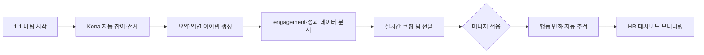

## Summary

15Five가 2025년 5월 출시한 **Kona**는 AI 기반 매니저 효과성 코치로, 1:1 미팅에 자동 참여해 대화를 전사(transcribe)하고 요약·액션 아이템을 생성하며, 성과 리뷰·engagement 설문·이전 미팅 맥락을 통합 분석해 실시간 코칭 팁을 제공한다. **ReUp Education**이 초기 도입 고객으로 파일럿 → 전사 매니저 롤아웃을 완료했다. [[sources/15five-kona-launch-2025-05.md]]

## Problem / Why

- 신임 매니저에게 코칭을 제공하고 싶지만 **전문 코치 비용이 높아 스케일 불가**
- 매니저의 1:1 미팅이 형식적으로 흐르기 쉬움 — **구조화된 피드백·후속 조치 부재**
- HR 팀이 매니저 효과성을 측정할 수 있는 **행동 변화 데이터 부족**
- ReUp Education은 빠르게 성장하는 조직에서 **신임 매니저 지원**이 시급했음 [[sources/15five-kona-launch-2025-05.md]]

## Solution Architecture (요약)

### A. Process (프로세스)

- **Before**: 매니저가 1:1 미팅을 자유 형식으로 진행 → 노트 수동 작성 → 후속 조치 누락 빈번 → HR이 매니저 효과성 파악 어려움
- **After**: Kona가 1:1 미팅에 자동 참여 → 대화 전사·요약·액션 아이템 생성 → engagement·성과 데이터 기반 실시간 코칭 팁 전달 → 매니저 행동 변화 자동 추적 [[sources/15five-kona-launch-2025-05.md]]
- **HITL 지점**: 매니저가 코칭 팁을 수용·적용하는 것은 자율 판단. HR 리더가 대시보드에서 행동 변화 추이를 모니터링
- **Trigger & Frequency**: 1:1 미팅 이벤트 기반 (주 1~2회 통상)
- **Scope of autonomy**: Recommend (코칭 팁 제안) — 실행은 매니저 자율

### B. System & Infrastructure

- **Core 플랫폼**: 15Five (performance management SaaS)
- **AI 시스템**: Kona — 15Five 플랫폼 내장 AI 에이전트
- **연동**: Slack 통합, 화상회의 도구 연동 (미팅 자동 참여) [[sources/15five-kona-launch-2025-05.md]]
- **사용자 접점**: 미팅 내 실시간 + Slack + 15Five 웹
- 나머지 상세 (배포 환경, 인증 등): _미공개 (not disclosed)_

### C. Data

- **입력**: engagement 설문, 성과 리뷰, 이전 1:1 대화 기록, 비즈니스 시스템 데이터 [[sources/15five-kona-launch-2025-05.md]]
- **전처리**: _미공개 (not disclosed)_
- **학습 vs RAG**: _미공개 (not disclosed)_

### D. Model

- **Foundation model**: _미공개 (not disclosed)_
- **Model 유형**: LLM (대화 분석·요약·코칭 생성) + 행동 패턴 분석
- 나머지: _미공개 (not disclosed)_

### E. Organization & Team

- **ReUp Education 도입**: 파일럿 → 전사 매니저 롤아웃. ⚠️ 벤더 주장: "기술 설정 수분 내 완료, 변화관리가 심플" [[sources/15five-kona-launch-2025-05.md]]
- 팀 규모·기간: _미공개 (not disclosed)_

## Impact / Metrics

### 기대효과 요약

매니저 코칭의 스케일 확장 + 행동 변화 자동 측정. 단, 구체 정량 지표는 미공개.

| 지표 | 값 | 출처 | 성격 |
|---|---|---|---|
| 기술 설정 시간 | "수분 내 완료" | 15Five 공식 | ⚠️ 벤더 주장 |
| 매니저 행동 변화 추적 | 자동 측정 가능 | 15Five 공식 | ⚠️ 벤더 주장 |
| ReUp Education 도입 범위 | 파일럿 → 전사 매니저 | 15Five 공식 | ⚠️ 자사 보고 |

**구체 outcome metric (retention·engagement score 변화 등)은 _미공개 (not disclosed)_.**

## Governance & Risk

- 1:1 미팅 전사(recording)에 대한 **직원 동의·프라이버시** 이슈 중요
- 코칭 팁의 편향 가능성 (특정 리더십 스타일 편향) — 감사 메커니즘 _미공개_
- 데이터 보존·접근 권한: _미공개 (not disclosed)_

## Consulting Angle

### 활용 포인트
- **매니저 코칭 스케일링 논의의 앵커**: BetterUp(고비용 1:1 코칭)과 15Five Kona(미팅 내장 경량 코칭)를 비교하면 "코칭 스펙트럼"을 클라이언트에 제시 가능
- **"Meeting intelligence + coaching" 융합 트렌드**: Otter.ai/Fireflies 같은 미팅 전사 도구와 차별화 — 15Five는 HR 데이터(성과·engagement)를 결합
- **한국 적용 시 고려**: 1:1 미팅 녹음·전사에 대한 한국 개인정보보호법(PIPA) 동의 요건, 한국어 지원 여부 미확인

### 주의
- ⚠️ 전체 수치가 벤더 주장·자사 보고. 독립 검증 없음 (confidence 0.25)
- ReUp Education은 소규모 ed-tech — 대기업 레퍼런스 아님
