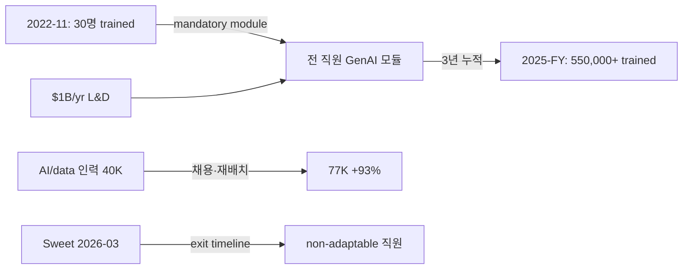

## Summary

Accenture가 2022-11~2025-FY 사이 **30명 → 550,000+ 직원** GenAI 교육. AI/data 전문 인력은 **40,000(2023) → 77,000(2025)** 증가. 연간 ~$1B L&D 투자. CEO Julie Sweet (2026-03 발언): "AI를 사용하지 못하면 승진·고용이 위험" + "non-adaptable 직원은 compression timeline으로 exit". 가장 강력한 mass reskilling reference.

## Problem / Why

- **Before**: 770K+ 글로벌 컨설팅 인력 — 직원 AI 역량 분포 편차 큰
- **Pain point**: 컨설팅 비즈니스 자체가 AI를 사용·판매·구현해야 함 → 직원 AI literacy가 직접 매출 영향
- **Trigger**: ChatGPT 출시 직후 (2022-11) Sweet CEO가 즉각 mass reskilling 결단

## Solution Architecture

### A. Process

- **Before**: AI 교육은 데이터 사이언티스트 등 specific 직군에 한정
- **After**:
  1. 2022-11 시점 GenAI trained 직원 = 30명
  2. mandatory GenAI fundamentals 모듈 전 직원 배포
  3. AI/data 전문 인력 채용·재배치 가속 — 2023년 40K → 2025년 77K
  4. 매년 ~$1B L&D 투자 (대부분 AI 비중)
  5. 2025-FY 종료 시점 trained 직원 = 550,000+
  6. Sweet 2026-03: "AI 미사용 직원 승진·고용 risk + exit timeline"
- **HITL**: HR + 사업부 SME + Sweet CEO 직접 거버넌스

### B/C/D/E. System

- Accenture 자체 LMS + 외부 vendor 콘텐츠 혼합
- 데이터: 직원 학습 이력·AI 사용 metric
- 오너십: Accenture HR (CHRO) + 사업부 P&L 책임자

### F. Diagrams

## Impact / Metrics

### 기대효과 요약
3년 만에 30명 → 550,000+ trained = **>18,300x 확장**. AI/data 인력 +93%. 컨설팅 시장에서 AI 매출 비중 가속.

- ✅ Tier 2 multi-source: CNBC + CIO Dive + Fortune + HR Brew (4개 매체 cross-reference)
- 550,000+ trained
- AI/data 인력 40,000 → 77,000 (+93%)
- $1B/yr L&D investment
- Sweet 2026-03: non-adaptable 직원 exit compression timeline

## Governance & Risk

- ⚠️ "non-adaptable 직원 exit" 발언이 KR 노동법·노조 컨텍스트에서 risk — 인용 시 sensitivity 필수
- ⚠️ 550K trained의 quality (단순 모듈 수료 vs 실제 활용) _세부 미공개_
- ⚠️ AI/data 인력 +93% 중 신규 채용 vs 기존 reskilling 비율 _미공개_

## Consulting Angle

- **KR 컨설팅 핵심 reference (Top 5)**:
  - 한국 대기업 AI 전사 교육 ROI 논쟁의 **canonical benchmark** — 550K·$1B·3년 timeline
  - SK·LG·CJ·신세계 등 그룹 HRD 센터 RFP 대응 시 Accenture를 "글로벌 모범"으로 reference
- **2026 Q3-Q4 임원 발표 핵심 슬라이드**:
  - "30 → 550,000 in 3 years" 헤드라인이 가장 강력한 hook
  - Sweet "exit non-adaptable" 발언은 KR 임원 동기 부여 가능, 단 노조 sensitivity 필수
- **AI/data 인력 +93%**: KR 대기업 자체 AI 인력 확보 명분 — 외부 채용 + 내부 reskilling 결합 패턴
- **반면교사**:
  - "exit timeline" 발언 그대로 KR 임원 입에 옮기면 노조 충돌 위험 — "성장 기회·재배치"로 reframe 권장
  - 컨설팅 회사 = AI를 직접 판매하는 특수 업종 → KR 제조·금융·유통 그룹과 적용 강도 차별 필요
- **Cross-link [[accenture-ai-learning-workforce]] 와 통합**: 기존 use case는 일부 측면만, 본 페이지가 종합 view
