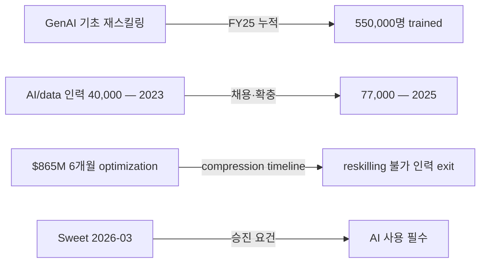

## Summary

⚠️ 자사 보고: Accenture가 **550,000명** 직원에게 생성형 AI 기초 재스킬링 완료 (FY25 Q4 실적 콜, CEO Julie Sweet). AI/data 전문 인력은 **40,000(2023) → 77,000(2025)** 증가. 6개월 $865M business optimization 프로그램(퇴직·감원 비용). [[sources/cnbc-accenture-exiting-staff-ai-reskilling-2025-09.md]] Sweet (2026-03 발언): "승진하려면 AI를 써야 한다" + reskilling이 불가능한 인력은 "compression timeline"으로 exit; 3년 $3B AI 투자, AI 인력 80,000명 목표, 직원 770,000명+. [[sources/fortune-accenture-sweet-ai-required-promotion-2026-03.md]] 가장 강력한 mass reskilling reference. (2026-09-27 grounding 점검: 종전 "2022-11 30명 시작", "연간 $1B L&D 투자" 수치는 인용 소스에 없어 제거 — Contradictions 참조.)

## Problem / Why (도입 배경)

- **Before**: ✅ 직원 770,000명+ 글로벌 컨설팅 인력. [[sources/fortune-accenture-sweet-ai-required-promotion-2026-03.md]] AI 역량 분포 baseline ❓ 미공개
- **Pain point**: ✅ Sweet: "AI proficiency is a mandatory part of working at the consultancy and moving up its ranks" — 컨설팅 비즈니스 운영 자체가 AI 사용을 전제. [[sources/fortune-accenture-sweet-ai-required-promotion-2026-03.md]]
- **Trigger**: ✅ 2023년 발표한 3년 $3B AI 투자 — AI 인력 2배(80,000명) 목표의 일환. [[sources/fortune-accenture-sweet-ai-required-promotion-2026-03.md]] (프로그램 시작 시점 세부 _미공개_)

## Solution Architecture

### A. Process (프로세스)

- **Before**: _미공개 (not disclosed)_ — 소스는 프로그램 이전 교육 범위를 기술하지 않음
- **After** (⚠️ 자사 보고 — CEO 발언 전달):
  1. ✅ 생성형 AI 기초(fundamentals) 재스킬링 — 550,000명 완료. [[sources/cnbc-accenture-exiting-staff-ai-reskilling-2025-09.md]]
  2. ✅ AI/data 전문 인력 확충 — 2023년 40,000 → 2025년 77,000 (채용 지속). [[sources/cnbc-accenture-exiting-staff-ai-reskilling-2025-09.md]]
  3. ✅ 6개월 $865M business optimization 프로그램 — 수천 명 재스킬링 + 적응 거부자 exit. [[sources/cnbc-accenture-exiting-staff-ai-reskilling-2025-09.md]] [[sources/fortune-accenture-sweet-ai-required-promotion-2026-03.md]]
  4. ✅ "3년에 걸친 점진적 전환" — 기술 적응 → 사용자 친화 workbench → "이것이 Accenture 운영 방식" 선언. [[sources/fortune-accenture-sweet-ai-required-promotion-2026-03.md]]
  5. ✅ Sweet 2026-03: AI 사용이 승진 요건 ("If you want to get promoted, you've got to do the things that we do"). [[sources/fortune-accenture-sweet-ai-required-promotion-2026-03.md]]
- **HITL**: ✅ CEO Sweet 직접 발언·거버넌스. [[sources/cnbc-accenture-exiting-staff-ai-reskilling-2025-09.md]] HR·사업부 역할 _미공개_

### F. Diagrams (도식)

```mermaid
flowchart LR
    Mass[GenAI 기초 재스킬링] -->|FY25 누적| End[550,000명 trained]
    AIData2023[AI/data 인력 40,000 — 2023] -->|채용·확충| AIData2025[77,000 — 2025]
    Opt[$865M 6개월 optimization] -->|compression timeline| NonAdapt[reskilling 불가 인력 exit]
    Sweet[Sweet 2026-03] -->|승진 요건| AIUse[AI 사용 필수]
```
범례: 실선 = [[sources/cnbc-accenture-exiting-staff-ai-reskilling-2025-09.md]] [[sources/fortune-accenture-sweet-ai-required-promotion-2026-03.md]] 확인.

### B. System & Infrastructure (시스템·인프라)

- **Core HRIS / 기반 시스템**: _미공개 (not disclosed)_
- **AI 시스템 배치**: _미공개 (not disclosed)_ (종전 LearnVantage·Udacity 서술은 인용 소스에 없는 외부 URL 기반이라 2026-09-27 grounding 점검에서 제거)
- **배포 환경**: _미공개 (not disclosed)_
- **연동·통합**: _미공개 (not disclosed)_
- **사용자 접점**: ✅ Sweet: "사용자 친화적이고 올바른 workbench" 마련 언급 — 구체 플랫폼 _미공개_. [[sources/fortune-accenture-sweet-ai-required-promotion-2026-03.md]]
- **인증·권한**: _미공개 (not disclosed)_

### C. Data (데이터)

- **입력 데이터 소스**: _미공개 (not disclosed)_
- **데이터 규모**: ⚠️ 자사 보고: 550,000명 trained (CEO Sweet 발언). [[sources/cnbc-accenture-exiting-staff-ai-reskilling-2025-09.md]]
- **전처리·정제**: _미공개 (not disclosed)_
- **학습 vs RAG vs In-context**: _미공개 (not disclosed)_
- **데이터 거버넌스**: _미공개 (not disclosed)_
- **민감정보 처리**: _미공개 (not disclosed)_

### D. Model (모델)

- **Foundation model**: _미공개 (not disclosed)_
- **모델 유형**: _미공개 (not disclosed)_
- **제공 방식**: _미공개 (not disclosed)_
- **커스터마이징 기법**: _미공개 (not disclosed)_
- **Orchestration 프레임워크**: _미공개 (not disclosed)_
- **평가·가드레일**: _미공개 (not disclosed)_

### E. Organization & Team (조직·팀 구조)

- **오너십**: ✅ CEO Julie Sweet가 직접 전략·발언 주도 ("investing in upskilling our reinventors, which is our primary strategy"). [[sources/cnbc-accenture-exiting-staff-ai-reskilling-2025-09.md]] HR 조직 역할 _미공개_
- **참여 역할**: ✅ CFO Angie Park — $1B+ 절감 재투자 발언. [[sources/cnbc-accenture-exiting-staff-ai-reskilling-2025-09.md]]
- **팀 규모·기간**: ✅ 3년 $3B AI 투자(2023 발표), 6개월 optimization 프로그램. [[sources/fortune-accenture-sweet-ai-required-promotion-2026-03.md]] [[sources/cnbc-accenture-exiting-staff-ai-reskilling-2025-09.md]]
- **거버넌스 체계**: _미공개 (not disclosed)_
- **변화관리**: ✅ 3년 점진적 전환 → 승진 요건화. [[sources/fortune-accenture-sweet-ai-required-promotion-2026-03.md]]
- **파트너**: _미공개 (not disclosed)_

## Impact / Metrics (기대효과)

### 기대효과 요약
Before: _Before 수치 미공개_ → After: ⚠️ 자사 보고 550,000명 GenAI 기초 재스킬링 완료; AI/data 인력 40,000(2023) → 77,000(2025). 학습 성과(활용률·생산성) 수치는 _미공개_.

- ✅ Tier 2 cross-reference: CNBC 2025-09 + Fortune 2026-03 (HR Brew 2025-10은 원문 미확보로 인용 불가)
- ⚠️ 자사 보고: 550,000명 trained. [[sources/cnbc-accenture-exiting-staff-ai-reskilling-2025-09.md]]
- ⚠️ 자사 보고: AI/data 인력 40,000 → 77,000. [[sources/cnbc-accenture-exiting-staff-ai-reskilling-2025-09.md]]
- ⚠️ 자사 보고: $865M 6개월 optimization 프로그램, $1B+ 절감 재투자 계획 (L&D 투자액 아님). [[sources/cnbc-accenture-exiting-staff-ai-reskilling-2025-09.md]]
- ✅ Sweet 2026-03: reskilling 불가 인력 exit compression timeline, AI 사용 승진 요건. [[sources/fortune-accenture-sweet-ai-required-promotion-2026-03.md]]

## Governance & Risk

- ⚠️ "non-adaptable 직원 exit" 발언이 KR 노동법·노조 컨텍스트에서 risk — 인용 시 sensitivity 필수
- ⚠️ 550K trained의 quality (단순 모듈 수료 vs 실제 활용) _세부 미공개_
- ⚠️ AI/data 인력 증가분 중 신규 채용 vs 기존 reskilling 비율 _미공개_

## Contradictions

> [!note] 2026-09-27 grounding — 종전 본문의 "2022-11 시점 30명 trained", "연간 ~$1B L&D 투자", "+93퍼센트 환산", "CIO Dive 교차 확인", LearnVantage·Udacity·Stanford Online 연동 서술은 인용 소스 4건의 raw 어디에도 없어 제거·_미공개_ 처리. CNBC의 $1B는 optimization 절감액이지 L&D 투자액이 아님. HR Brew 소스는 원문 미확보(403)로 수치 인용 불가. accenture-reinvention-genai-report-2024-01은 Accenture 자체 리서치(1,500명 C-suite 설문)이며 "Gartner methodology" 표기는 근거 없음.

## Consulting Angle

- **KR 컨설팅 핵심 reference (Top 5)**:
  - 한국 대기업 AI 전사 교육 ROI 논쟁의 **canonical benchmark** — 550K trained·$3B 3년 AI 투자·3년 점진 전환 timeline
  - SK·LG·CJ·신세계 등 그룹 HRD 센터 RFP 대응 시 Accenture를 "글로벌 모범"으로 reference
- **2026 Q3-Q4 임원 발표 핵심 슬라이드**:
  - "550,000명 GenAI 기초 재스킬링 + AI 사용 = 승진 요건" 헤드라인이 가장 강력한 hook
  - Sweet "exit non-adaptable" 발언은 KR 임원 동기 부여 가능, 단 노조 sensitivity 필수
- **AI/data 인력 40,000 → 77,000**: KR 대기업 자체 AI 인력 확보 명분 — 외부 채용 + 내부 reskilling 결합 패턴
- **반면교사**:
  - "exit timeline" 발언 그대로 KR 임원 입에 옮기면 노조 충돌 위험 — "성장 기회·재배치"로 reframe 권장
  - 컨설팅 회사 = AI를 직접 판매하는 특수 업종 → KR 제조·금융·유통 그룹과 적용 강도 차별 필요
- **Cross-link [[accenture-ai-learning-workforce]] 와 통합**: 기존 use case는 일부 측면만, 본 페이지가 종합 view
