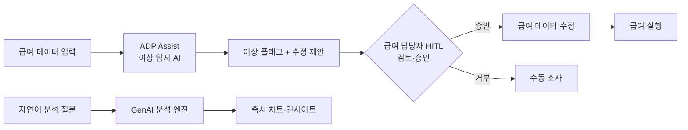

## Summary

ADP는 Innovation Day 2025(2025-09-03)에서 ADP Assist의 새로운 AI 기능을 발표했다: ① 급여 이상 탐지 및 자동 수정 제안, ② 대화형 GenAI 분석(자연어 질문 → 즉시 차트/인사이트), ③ 규정 준수 자동화. 조기 도입 기업들이 급여 사이클당 최대 30분 절감을 보고했다(자사 보고). TechTarget(Tier 2)이 독립 보도. 플랫폼: Workforce Now, Global Payroll, Lyric HCM.

## Problem / Why

- 급여 담당자가 수작업으로 급여 데이터 이상 감지 → 오류 감지 누락 시 수정 비용 발생
- 급여 분석 리포트 생성 시 복잡한 쿼리·수작업 → 경영진 보고 지연
- 글로벌 100+ 관할권 규정 준수 모니터링을 수작업으로 처리

## Solution Architecture

### A. Process (프로세스)

- **Before (As-is)**:
  1. 급여 담당자가 급여 실행 전 수작업으로 데이터 검토
  2. 이상 발견 시 수작업 조사 + 수정
  3. 분석 리포트는 수동 쿼리/Excel 집계

- **After (To-be)**:
  1. AI가 급여 실행 전 이상 자동 탐지 + 수정 제안 생성
  2. 급여 담당자가 제안 검토·승인(HITL)
  3. 자연어로 "초과근무 비용 트렌드는?" → 즉시 차트·인사이트 생성
  4. 규정 변경 자동 모니터링 + 컴플라이언스 태스크 자동 실행

- **Human-in-the-loop**: 이상 수정 제안 → 급여 담당자 검토·승인 후 실행
- **Trigger & Frequency**: 급여 사이클(monthly/biweekly) + 이상 탐지 상시(daily)
- **Scope of autonomy**: autonomous (이상 탐지); approve-then-act (수정 실행)

범례: 실선 = TechTarget / ADP Innovation Day PR에서 확인

### B. System & Infrastructure (시스템·인프라)

- **Core HRIS**: ADP Workforce Now® / ADP Global Payroll® / ADP Lyric HCM® (자체 플랫폼)
- **AI 시스템 배치**: ADP Assist (HCM 내장 AI 레이어)
- **배포 환경**: ADP 클라우드 (전용 인프라)
- **연동·통합**: 자체 HCM 생태계 내 통합 (외부 시스템 연동 상세 미공개)
- **사용자 접점**: ADP 웹/모바일 앱 내 인라인 Assist 인터페이스

### C. Data (데이터)

- **입력**: 급여 마스터 데이터, 이력 급여 패턴, 직원 변동 이력
- **학습**: 지속 학습 (계절성·조직 변화 반영하여 패턴 갱신) — ⚠️ 벤더 주장
- **데이터 규모**: ADP 고객 80,000+ 기업 집계 데이터 학습 — ⚠️ 벤더 주장 (확인 방식 미공개)
- **거버넌스**: ADP 자체 데이터 보안 정책; 고객별 데이터 격리 (구체 아키텍처 미공개)

### D. Model (모델)

- **Foundation model**: _미공개 (not disclosed)_
- **Model 유형**: 이상 탐지 (시계열 + 패턴 분류), LLM (자연어 분석 쿼리)
- **제공 방식**: ADP 자체 구축 (외부 LLM 활용 여부 미공개)

### E. Organization & Team (조직·팀 구조)

- **오너십**: ADP (플랫폼 벤더) — 고객사 HR/급여팀이 사용
- **고객 규모**: 중소기업(50~150명)이 주 타겟 (Workforce Now Next-Gen); 대기업까지 확장

## Impact / Metrics (기대효과)

### 기대효과 요약
Before: _미공개 (기존 급여 사이클당 소요 시간)_ → After: ⚠️ 자사 보고 최대 30분 절감 (ADP "조기 도입 기업" 집계). 미드마켓 고객 차세대 플랫폼 전환율 80%+ (자사 보고).

| 지표 | 결과 | 신뢰도 |
|---|---|---|
| 급여 사이클당 시간 절감 | 최대 **30분** | ⚠️ 자사 보고 (ADP — "조기 도입 기업" 집계) |
| 명시된 고객사 사례 | 없음 (집계 수치만 공개) | — |
| 미드마켓 신규 고객 Workforce Now Next-Gen 전환율 | 80%+ | ⚠️ 자사 보고 (ADP 실적 발표) |

## Governance & Risk

- 이상 탐지 오탐(false positive) 시 급여 처리 지연 가능성 → 수정 메커니즘 미공개
- AI 학습 데이터에 고객 급여 데이터 사용 시 개인정보·계약 리스크 → 데이터 사용 정책 미공개
- GDPR·한국 개인정보보호법 적용 시 학습 데이터 관련 추가 검토 필요

## Contradictions

없음.

## Consulting Angle

- **급여 자동화 ROI**: 급여 사이클당 30분 절감 × 연간 급여 사이클 수 × 급여 담당자 인건비 = 연간 절감액 계산 가능
- **중소·중견기업 적용**: 전담 급여팀 없는 기업에서 ADP AI가 "가상 급여 감사자" 역할 — HR SaaS 선택 가이드에 활용
- **한국 적용 시 제약**: 한국은 연말정산·퇴직금 계산 등 한국 특유 급여 항목이 많아 ADP 글로벌 솔루션의 로컬 커버리지 확인 필요 — 더존비즈온·SAP와 비교 검토
- **파생 질문**: "ADP Assist의 이상 탐지 알고리즘이 한국 특유 공제 항목(연차수당·퇴직금 충당)을 정확히 처리하는가?"
