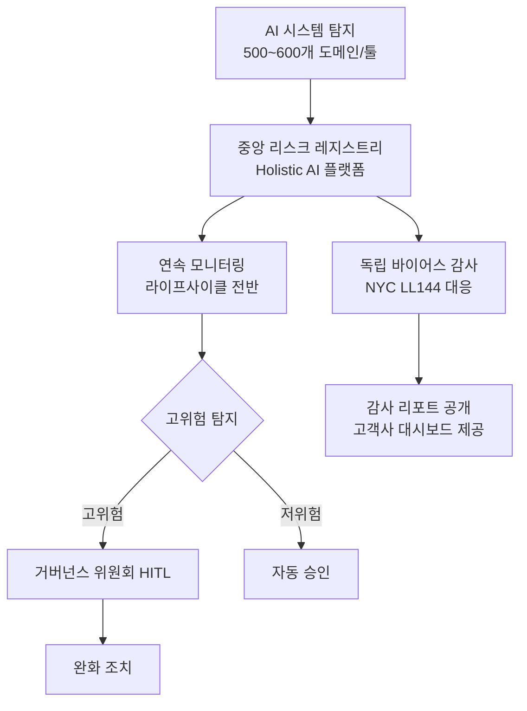

## Summary

Allegis Group (글로벌 인재·스태핑 기업, ~$12B 매출, 9개 운영 자회사)이 Holistic AI의 거버넌스 플랫폼을 도입해 기존 145개로 파악하던 AI 시스템이 실제 500~600개 도메인·툴에 달한다는 사실을 발견하고, 중앙화된 리스크 레지스트리와 연속 모니터링 체계를 구축했다. 고위험 AI 프로젝트 50% 감소, 감사 시간 수주 → 수시간 단축이 주요 성과로 보고되었다(⚠️ 벤더 주장). 2025년 6월 공개.

## Problem / Why

- 9개 운영 자회사 간 AI 사용 현황 가시성 없음 — "shadow AI" 규모 파악 불가
- NYC Local Law 144 (채용 AI 바이어스 감사 의무화), EU AI Act (고위험 시스템 등록 의무화) 등 규제 대응 필요
- 포춘 500 고객사들이 스태핑 파트너의 AI 거버넌스를 계약 조건으로 요구하기 시작

## Solution Architecture

### A. Process (프로세스)

- **Before (As-is)**:
  1. 각 자회사 개별적으로 AI 툴 도입 — 중앙 파악 없음
  2. 내부 파악: 145개 AI 시스템
  3. 신규 AI 도입 시 리스크 평가 체계 없음; 감사 수행 시 수 주 소요

- **After (To-be)**:
  1. Holistic AI 플랫폼을 통해 전사 AI 시스템 500~600개 탐지·등록
  2. 중앙화된 리스크 레지스트리 — 시스템별 리스크 카테고리·완화 전략 경영진 가시화
  3. AI 라이프사이클 전반 연속 모니터링
  4. NYC LL144 대응: 채용 AEDT에 대한 독립 바이어스 감사 수행·공개

- **Human-in-the-loop (HITL) 지점**: 고위험 프로젝트 검토·승인은 거버넌스 위원회 담당
- **Trigger & Frequency**: 신규 AI 시스템 도입 시 + 연간 정기 감사 (NYC LL144 요건)
- **Scope of autonomy**: 자동 탐지·리스크 분류(autonomous); 고위험 판정·대응 결정(approve-then-act)

범례: 실선 = Newswire PR / Holistic AI 케이스 스터디에서 확인

### B. System & Infrastructure (시스템·인프라)

- **Core HRIS / 기반 시스템**: _미공개 (not disclosed)_
- **AI 시스템 배치**: Holistic AI 플랫폼 (SaaS) — 전사 AI 거버넌스 레이어
- **배포 환경**: _미공개 (not disclosed)_
- **연동·통합**: _미공개 (not disclosed)_
- **사용자 접점**: 경영진 대시보드, 리크루터용 고객사 컴플라이언스 대시보드 (실시간)
- **가용성**: _미공개 (not disclosed)_

### C. Data (데이터)

- **입력 데이터**: AI 시스템 메타데이터 (기능·리스크 카테고리·사용처·접근권한)
- **바이어스 감사 입력**: AEDT 처리 결과 데이터 (성별·인종·민족 기반 분산 영향 분석)
- **데이터 규모**: 500~600개 AI 도메인/툴 등록
- **거버넌스**: 중앙화된 리스크 레지스트리 — 경영진 접근 통제
- **민감정보**: 채용 결정 데이터 (NYC LL144 대상) — GDPR·EU AI Act 대응 병행

### D. Model (모델)

- **Foundation model**: _미공개 (not disclosed)_ — Holistic AI 플랫폼 내부 분류·탐지 모델
- **Model 유형**: Classifier (AI 시스템 리스크 분류), 바이어스 측정 알고리즘
- **커스터마이징**: Allegis 9개 자회사 맞춤 리스크 기준 설정
- **평가·가드레일**: 바이어스 감사 5개 리스크 축(bias, efficacy, robustness, explainability, privacy)

### E. Organization & Team (조직·팀 구조)

- **오너십**: 중앙 AI 거버넌스 팀 (자회사 공통)
- **참여 역할**: Legal, Compliance, HR Tech — 구체 팀 구성 미공개
- **거버넌스 체계**: 중앙화된 AI 리스크 위원회 (구체 명칭·구성 미공개)
- **비즈니스 임팩트**: 포춘 500 고객사에 실시간 컴플라이언스 대시보드 제공 → 영업 차별화 요소화

## Impact / Metrics (기대효과)

### 기대효과 요약
AI 거버넌스 도입으로 고위험 AI 프로젝트 50% 감소, AI 감사 소요시간 수주에서 수시간으로 단축 (벤더 주장 기반).

| 지표 | 결과 | 신뢰도 |
|---|---|---|
| 탐지된 AI 시스템 | 145 → 500~600개 발견 | ⚠️ 벤더 주장 |
| 고위험 AI 프로젝트 감소 | -50% | ⚠️ 벤더 주장 |
| 감사 소요 시간 | 수주 → 수시간 | ⚠️ 벤더 주장 |
| 보험료 절감 | "수백만 달러" | ⚠️ 벤더 주장 (금액 미명시) |

모든 수치는 Holistic AI 자사 PR에서 도입 기업(Allegis)의 확인을 인용한 것으로, Tier 1/2 독립 검증 없음.

## Governance & Risk

- 이 케이스 자체가 거버넌스 사례이므로 메타적 관점 필요
- **NYC LL144 준수**: 채용 AEDT에 대한 연간 독립 감사 + 공개 의무 이행
- **EU AI Act 대응**: 2026-08 고위험 AI 시스템 컴플라이언스 데드라인 준비 중 (구체 내용 미공개)
- **Shadow AI 리스크**: 145개 파악 → 500~600개 실제 — 이 Gap이 핵심 리스크 신호

## Contradictions

없음 (단일 소스 구조).

## Consulting Angle

- **제안서 활용**: "AI 거버넌스 사각지대" 문제 제기 슬라이드에 즉시 활용 — 기업이 파악하는 AI 도구 수가 실제의 1/4 수준일 수 있다는 데이터 포인트
- **한국 대기업 적용 시**: 개인정보보호위원회의 AI 영향평가 요건(2024~), 고용노동부 AI 채용 가이드라인과 연계 검토 필요
- **반면교사**: 중앙 거버넌스 없이 AI 도입 → 규제 위반 노출, 고객 계약 리스크 → Allegis 사례가 "사전 거버넌스 투자"의 ROI를 보여줌
- **파생 질문**: "한국의 유사 스태핑·컨설팅 기업에서 내부 AI 거버넌스 체계는 어느 단계인가?"
