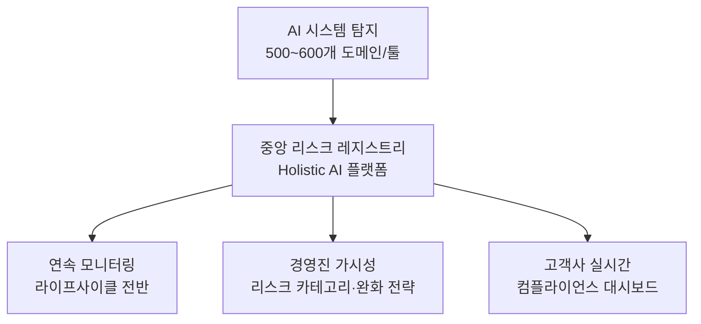

## Summary

Allegis Group (글로벌 인재·스태핑 기업, ~$12B 매출, 9개 운영 자회사)이 Holistic AI의 거버넌스 플랫폼을 도입해 기존 145개로 파악하던 AI 시스템이 실제 500~600개 도메인·툴에 달한다는 사실을 발견하고, 중앙화된 리스크 레지스트리와 연속 모니터링 체계를 구축했다. 고위험 AI 프로젝트 50% 감소, 감사 시간 수주 → 수시간 단축이 주요 성과로 보고되었다(⚠️ 벤더 주장). 2025년 6월 공개.

## Problem / Why (도입 배경)

- 9개 운영 자회사 간 AI 사용 현황 가시성 없음 — "shadow AI" 규모 파악 불가
- NYC Local Law 144 (채용 AI 바이어스 감사 의무화), EU AI Act (고위험 시스템 등록 의무화) 등 규제 대응 필요
- 포춘 500 고객사들이 스태핑 파트너의 AI 거버넌스를 계약 조건으로 요구하기 시작

## Solution Architecture

### A. Process (프로세스)

- **Before (As-is)**:
  1. 각 자회사 개별적으로 AI 툴 도입 — 중앙 파악 없음
  2. 내부 파악: 145개 AI 시스템
  3. 신규 AI 도입 시 리스크 평가 체계 없음; 감사 수행 시 수 주 소요

- **After (To-be)**:
  1. Holistic AI 플랫폼을 통해 전사 AI 시스템 500~600개 탐지·등록
  2. 중앙화된 리스크 레지스트리 — 시스템별 리스크 카테고리·완화 전략 경영진 가시화
  3. AI 라이프사이클 전반 연속 모니터링
  4. ⚠️ 벤더 주장: 리크루터가 Fortune 500 고객사에 실시간 컴플라이언스 대시보드를 제시. [[sources/holistic-ai-allegis-bias-audit-2025.md]] (NYC LL144 독립 바이어스 감사 사례는 같은 소스의 Hired 사례이며 Allegis 건이 아님 — 2026-09-27 grounding 점검으로 분리)

- **Human-in-the-loop (HITL) 지점**: _미공개 (not disclosed)_ — 소스는 "경영진 가시성"만 언급
- **Trigger & Frequency**: _미공개 (not disclosed)_
- **Scope of autonomy**: _미공개 (not disclosed)_

```mermaid
flowchart TB
    Disc[AI 시스템 탐지\n500~600개 도메인/툴] --> Reg[중앙 리스크 레지스트리\nHolistic AI 플랫폼]
    Reg --> Monitor[연속 모니터링\n라이프사이클 전반]
    Reg --> Exec[경영진 가시성\n리스크 카테고리·완화 전략]
    Reg --> Dash[고객사 실시간\n컴플라이언스 대시보드]
```
범례: 실선 = [[sources/holistic-ai-allegis-bias-audit-2025.md]] (Holistic AI 벤더 PR) 확인. 고위험 판정·위원회 검토 흐름은 소스에 없어 도식에서 제거.

### B. System & Infrastructure (시스템·인프라)

- **Core HRIS / 기반 시스템**: _미공개 (not disclosed)_
- **AI 시스템 배치**: ⚠️ 벤더 주장: Holistic AI 거버넌스 플랫폼 — 중앙화된 리스크 레지스트리 + 연속 모니터링. [[sources/holistic-ai-allegis-bias-audit-2025.md]]
- **배포 환경**: _미공개 (not disclosed)_
- **연동·통합**: _미공개 (not disclosed)_
- **사용자 접점**: ⚠️ 벤더 주장: 경영진 가시성(executive visibility), 리크루터가 고객사에 제시하는 실시간 컴플라이언스 대시보드. [[sources/holistic-ai-allegis-bias-audit-2025.md]]
- **가용성**: _미공개 (not disclosed)_

### C. Data (데이터)

- **입력 데이터**: ⚠️ 벤더 주장: AI 시스템 인벤토리 — 시스템·리스크 카테고리·완화 전략. [[sources/holistic-ai-allegis-bias-audit-2025.md]] 세부 메타데이터 항목 _미공개_
- **바이어스 감사 입력**: _미공개 (not disclosed)_ — Allegis 건에 대한 바이어스 감사 내용은 소스에 없음 (Hired 사례와 혼동 주의)
- **데이터 규모**: ⚠️ 벤더 주장: 기존 파악 ~145개 → 추가 발견 500~600개 AI 관련 도메인/툴. [[sources/holistic-ai-allegis-bias-audit-2025.md]]
- **거버넌스**: ⚠️ 벤더 주장: 중앙화된 리스크 레지스트리 + 경영진 가시성. [[sources/holistic-ai-allegis-bias-audit-2025.md]] 접근 통제 세부 _미공개_
- **민감정보**: _미공개 (not disclosed)_

### D. Model (모델)

- **Foundation model**: _미공개 (not disclosed)_
- **Model 유형**: _미공개 (not disclosed)_
- **커스터마이징**: _미공개 (not disclosed)_
- **평가·가드레일**: _미공개 (not disclosed)_

### E. Organization & Team (조직·팀 구조)

- **오너십**: _미공개 (not disclosed)_ — ⚠️ 벤더 주장: 9개 운영 자회사에 중앙화된 AI 가시성 부재가 도입 배경. [[sources/holistic-ai-allegis-bias-audit-2025.md]]
- **참여 역할**: _미공개 (not disclosed)_
- **거버넌스 체계**: _미공개 (not disclosed)_
- **비즈니스 임팩트**: ⚠️ 벤더 주장: 포춘 500 고객사에 실시간 컴플라이언스 대시보드 제공 → 영업 차별화 요소화. [[sources/holistic-ai-allegis-bias-audit-2025.md]]

## Impact / Metrics (기대효과)

### 기대효과 요약
AI 거버넌스 도입으로 고위험 AI 프로젝트 50% 감소, AI 감사 소요시간 수주에서 수시간으로 단축 (벤더 주장 기반).

| 지표 | 결과 | 신뢰도 |
|---|---|---|
| 탐지된 AI 시스템 | 145 → 500~600개 발견 | ⚠️ 벤더 주장 |
| 고위험 AI 프로젝트 감소 | -50% | ⚠️ 벤더 주장 |
| 감사 소요 시간 | 수주 → 수시간 | ⚠️ 벤더 주장 |
| 보험료 절감 | "수백만 달러" | ⚠️ 벤더 주장 (금액 미명시) |

모든 수치는 Holistic AI 자사 PR에서 도입 기업(Allegis)의 확인을 인용한 것으로, Tier 1/2 독립 검증 없음.

## Governance & Risk

- 이 케이스 자체가 거버넌스 사례이므로 메타적 관점 필요
- **NYC LL144·EU AI Act**: ⚠️ 벤더 주장: 규제 압력이 도입 배경. [[sources/holistic-ai-allegis-bias-audit-2025.md]] Allegis 자체의 LL144 감사 이행 여부는 _미공개_ (소스의 LL144 감사 사례는 Hired 건)
- **EU AI Act 대응**: 구체 준비 내용 _미공개_
- **Shadow AI 리스크**: 145개 파악 → 500~600개 실제 — 이 Gap이 핵심 리스크 신호

## Contradictions

> [!note] 2026-09-27 grounding — 종전 본문의 NYC LL144 독립 바이어스 감사 수행·공개(연간 감사), AEDT 성별·인종 분산 영향 분석, 5개 리스크 축, 거버넌스 위원회 HITL, 9개 자회사 맞춤 리스크 기준은 인용 소스에서 Allegis가 아닌 Hired 사례이거나 근거가 없어 제거·_미공개_ 처리. 원문 스냅샷 미확보(unavailable) — 소스 페이지 요약만 근거.

## Consulting Angle

- **제안서 활용**: "AI 거버넌스 사각지대" 문제 제기 슬라이드에 즉시 활용 — 기업이 파악하는 AI 도구 수가 실제의 1/4 수준일 수 있다는 데이터 포인트
- **한국 대기업 적용 시**: 개인정보보호위원회의 AI 영향평가 요건(2024~), 고용노동부 AI 채용 가이드라인과 연계 검토 필요
- **반면교사**: 중앙 거버넌스 없이 AI 도입 → 규제 위반 노출, 고객 계약 리스크 → Allegis 사례가 "사전 거버넌스 투자"의 ROI를 보여줌
- **파생 질문**: "한국의 유사 스태핑·컨설팅 기업에서 내부 AI 거버넌스 체계는 어느 단계인가?"
