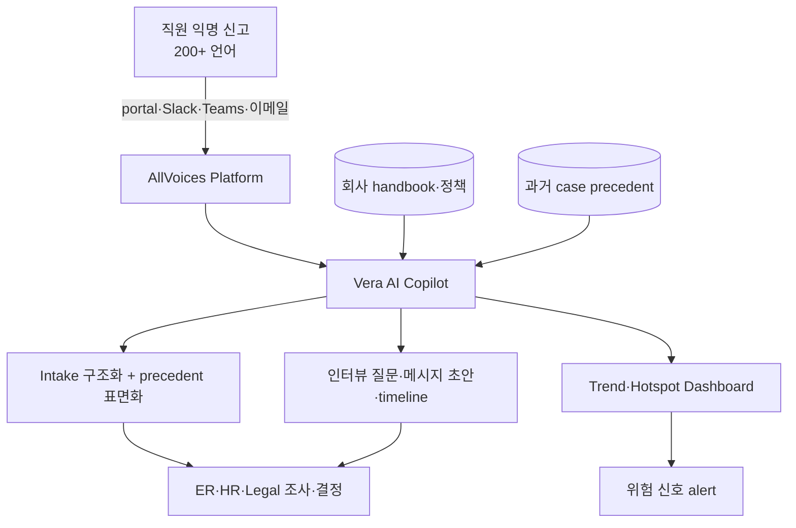

## Summary

AllVoices는 **AI-native employee relations platform**. 2024년 **Vera AI Copilot** 출시 — 회사 handbook·로컬 정책으로 학습된 **ER 전용 AI assistant**. 200+ 언어 익명 신고 → AI 자동 intake·investigation 지원·precedent (유사사례) 표면화. G2에서 **Employee Engagement·HR Case Management·Whistleblowing 카테고리 leader**. **HR Acuity 직접 경쟁자**. Title IX, SB 553, Joint Commission 등 컴플라이언스 표준 준수. Zero Data Retention (Enterprise OpenAI).

## Problem / Why (도입 배경)

- **Before**: 사내 익명 신고는 (a) 외부 hotline 위탁 (NAVEX·Convercent 등) (b) 자체 portal — case management는 별도 도구. AI 분석·precedent 검색은 사람이 수작업
- **Pain point**:
  - **익명 신고 → ER case 단절**: hotline은 신고만 받고, ER team이 별도 시스템에 옮겨 처리 → 정보 분산
  - **다국어 지원 한계**: 글로벌 기업의 200+ 언어 신고 자동 번역 없으면 처리 지연
  - **유사사례 (precedent) 검색**: 과거 case 검색 수작업 → 일관성 결여 + investigation 시간 over-burden
  - **AI 안전성**: ER 데이터는 PII + legal hold + GDPR 영역 → 일반 LLM 사용 불가
- **Trigger**: GenAI + ER 시장 진입 신생 벤더로 HR Acuity·NAVEX 등 기존 leader에 도전. AI-native architecture로 차별화

## Solution Architecture

### A. Process (프로세스)

- **Before**: 직원 익명 신고 (hotline) → HR이 ER tool로 옮겨 처리 → 과거 case 수작업 검색 → 인터뷰 질문·요약 수작업 작성
- **After (Vera AI 통합 architecture)**:
  1. 직원이 AllVoices portal·Slack·Teams·이메일 익명 신고 (200+ 언어 자동 인식)
  2. **Intake**: Vera가 신고 내용 구조화 + 유사 precedent 자동 검색 표면화
  3. **Investigation 지원**: 인터뷰 질문 자동 생성 + 메시지 초안 작성 + case timeline 자동 작성
  4. **Insight**: 부서·매니저별 trend·hotspot dashboard + 위험 신호 alert
  5. ER team이 case 진행·결정 (Vera는 분석·문서화·precedent만)
- **HITL**: ER·HR·legal이 모든 결정·인터뷰·resolution 진행. Vera는 분류·요약·precedent·드래프트만
- **Frequency**: 24/7 익명 신고 + daily case 처리
- **Scope of autonomy**: assist + automate (분류·요약·precedent·드래프트 자율, 결정·인터뷰는 사람)

### B. System & Infrastructure (시스템·인프라)

- **Core platform**: AllVoices SaaS (cloud-hosted)
- **AI 시스템 배치**: Vera AI Copilot 모듈 + 익명 신고 intake (모두 platform 내장)
- **연동**: Slack, MS Teams, Workday, Okta SSO
- **사용자 접점**: web portal, mobile app, Slack/Teams bot, 익명 hotline
- **인증**: 익명 + RBAC + role-based case visibility

### C. Data (데이터)

- **입력 데이터**:
  - 익명 신고 내용 (200+ 언어)
  - 회사 handbook·로컬 정책 (Vera 학습 corpus)
  - 과거 case (precedent 검색 base)
  - HRIS 일부 (case 연계 시)
- **모델 구조**: LLM (Enterprise OpenAI, Zero Data Retention) + 자연어 분류 + semantic search (precedent)
- **Data governance**:
  - ⚠️ 벤더 주장: **Zero Data Retention** (OpenAI Enterprise) — 고객 데이터 모델 학습 안 함
  - SOC 2 Type II, GDPR, EU Whistleblower Directive
  - Title IX, California SB 553 (workplace violence prevention) 준수

### D. Model (모델)

- **Foundation model**: Enterprise OpenAI (Zero Data Retention)
- **Customization**: 고객사 handbook·정책 fine-tuning + 200+ 언어
- **Guardrails**: ⚠️ 벤더 주장 — 결정 도출 금지·HITL 강제·고객 데이터 학습 안 함

### E. Organization & Team (조직·팀 구조)

- **오너십**: AllVoices 벤더 — 고객은 ER·HR·compliance·legal 부서가 사용
- **거버넌스**: G2 카테고리 leader (Employee Engagement·HR Case Management·Whistleblowing) — 시장 검증

### F. Diagrams (도식)

범례: 모든 연결 ⚠️ AllVoices 공식 + G2 reviews 검증.

## Impact / Metrics (기대효과)

### 기대효과 요약
**AI-native ER platform** — HR Acuity 직접 경쟁자, 200+ 언어 + Vera AI 통합 architecture로 차별화. ⚠️ 모든 customer outcome metric은 AllVoices 자사 발표 + G2 reviews.

| 지표 | 값 | 출처 | 성격 |
|---|---|---|---|
| 지원 언어 | **200+** | AllVoices 공식 | ⚠️ 벤더 주장 |
| **G2 카테고리 leader** | Employee Engagement·HR Case Management·Whistleblowing | G2 | ✅ Fact (Tier 1·2) |
| Vera AI 출시 | 2024 | AllVoices 공식 | ✅ Fact |
| Zero Data Retention | Enterprise OpenAI | AllVoices 공식 | ⚠️ 벤더 주장 |
| 컴플라이언스 표준 | Title IX, SB 553, Joint Commission | AllVoices 공식 | ✅ Fact |

## Governance & Risk

- ✅ G2 카테고리 leader (다수 카테고리) — 시장 검증
- ✅ Zero Data Retention (Enterprise OpenAI) — 고객 데이터 모델 학습 우려 해소
- ⚠️ HR Acuity 대비 더 신생 — Forrester TEI/Brandon Hall 등 Tier 1·2 awards는 부족
- ⚠️ 한국 적용 시:
  - **한국어 200+ 언어 포함** (Vera 한국어 정확도 검증 필요)
  - **PIPA + 직장 내 괴롭힘 금지법** customization 필요
  - **노조 사전 합의 필수** (한국 노조법)
  - 한국 customer reference _미공개_

## Consulting Angle

- **HR Acuity 대안**: 한국 대기업 ER AI 도입 검토 시 HR Acuity vs AllVoices 양자 비교 — AllVoices가 더 AI-native + 다국어 + 익명 신고 통합. HR Acuity가 더 성숙·G2 1위·Brandon Hall Gold
- **익명 신고 + ER case 통합**:
  - 한국 대기업의 직장 내 괴롭힘 신고 (직장 내 괴롭힘 금지법 의무) → 외부 hotline 위탁 + 사내 ER case 분리 운영이 일반적
  - AllVoices는 **익명 hotline + ER case + AI 분석을 단일 platform**으로 통합 → 한국 시장에 차별화 가치
- **vs Diligent Vault** [[diligent-vault-active-integrity-speakup]]:
  - Vault: 익명 신고 + ethics focus (2025-05 Diligent 인수)
  - AllVoices: 익명 신고 + ER case + AI investigation
  - 한국 도입: AllVoices가 ER team 사용 더 자연스러움
- **vs NAVEX EthicsPoint** [[navex-ethicspoint-nca-compliance]]:
  - NAVEX: 13K+ 조직, whistleblowing 전문 (글로벌 표준)
  - AllVoices: AI-native, ER 통합, 신생
  - 보수적 한국 대기업은 NAVEX 선호, agile/scale-up은 AllVoices
- **한국 적용 한계**:
  - 한국 customer reference 미공개 — POC 시 한국어 정확도·PIPA·노조 fit 검증 필수
  - 한국 ER 시장 미성숙 — 글로벌 SaaS + 노무법인 hybrid 모델 권장
- **2026 Q3-Q4 컨설팅 deck**:
  - "한국 대기업 ER AI 4-vendor 비교": HR Acuity (성숙) vs AllVoices (AI-native) vs Vault (익명·ethics) vs NAVEX (whistleblowing 전통)
- **Watch list**: AllVoices 한국 진출·G2 Magic Quadrant 등재·Forrester Wave 발표 시 confidence 재조정
