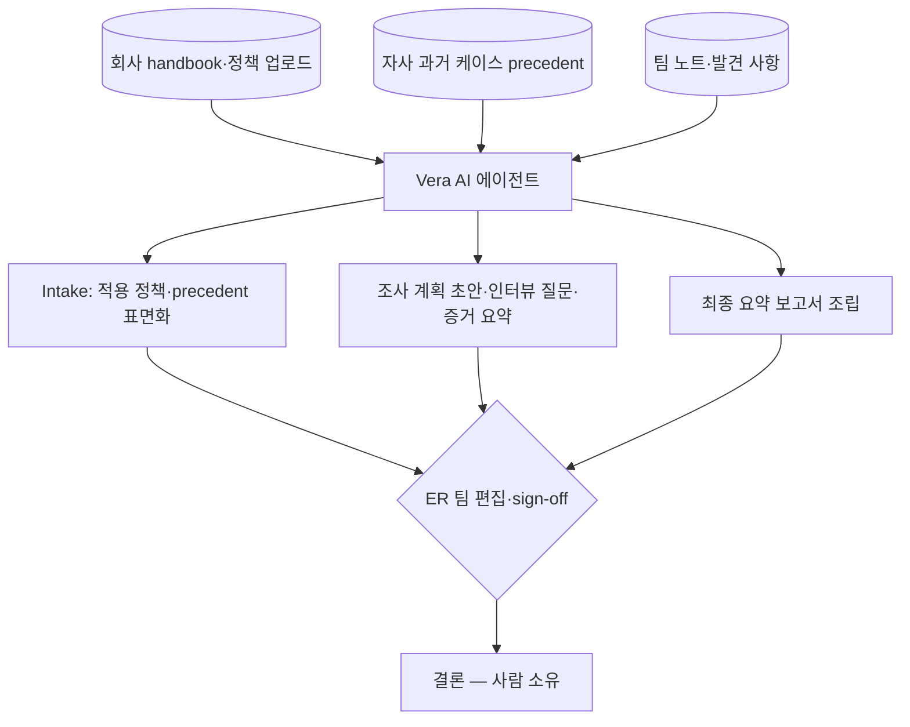

## Summary

AllVoices의 ER(employee relations) AI 에이전트 **Vera** — ⚠️ 벤더 주장: 케이스 intake부터 최종 보고서까지 조사 계획 초안·인터뷰 질문 제안·증거 요약·요약 보고서 작성을 수행하며, 회사가 업로드한 handbook·정책과 과거 케이스(precedent)를 참조. 모든 결론은 사람이 소유(human-owned). Enterprise OpenAI 계약의 Zero Data Retention, SOC 2 Type 2·ISO 27001·GDPR·CCPA 준수 주장. [[sources/allvoices-vera-ai-product.md]] G2 리뷰 페이지는 원문 미확보. [[sources/g2-allvoices-reviews-2025.md]] 출시 시점·지원 언어 수·컴플라이언스 표준(Title IX 등)·G2 카테고리 leader 배지는 _미공개_ (2026-09-27 grounding 점검 — Contradictions 참조).

## Problem / Why (도입 배경)

- 벤더 제품이므로 특정 기업의 도입 배경은 고객별 상이. 🚫 일반론 표기: 아래는 ER 영역의 일반적 pain point
- **Before**: ❓ baseline 미공개 — 🚫 일반론: 익명 신고 접수와 ER case 처리가 분리되고, 과거 case 검색·인터뷰 질문·요약 작성이 수작업
- **Pain point**:
  - ⚠️ 벤더 주장: 소비자용 AI 도구는 붙여넣은 case 데이터를 보존·학습할 수 있어 ER 데이터에 실질적 리스크 → Enterprise OpenAI ZDR 계약으로 대응. [[sources/allvoices-vera-ai-product.md]]
  - ⚠️ 벤더 주장: 과거 유사 상황 처리 방식(precedent)과 적용 정책을 케이스마다 표면화해야 하는 필요. [[sources/allvoices-vera-ai-product.md]]
- **Trigger**: ❓ 미공개 (시장 진입 배경·경쟁 구도는 소스에 없음)

## Solution Architecture

### A. Process (프로세스)

- **Before**: _미공개 (not disclosed)_ — 🚫 일반론: 과거 case 수작업 검색, 인터뷰 질문·요약 수작업 작성
- **After** (⚠️ 벤더 주장, [[sources/allvoices-vera-ai-product.md]]):
  1. 팀이 handbook·정책 문서를 한 번 업로드 → Vera가 모든 케이스에서 참조
  2. **Intake**: 케이스 intake 단계부터 Vera가 적용 정책과 과거 유사 상황 처리 방식(precedent) 표면화
  3. **Investigation 지원**: 조사 계획 초안·인터뷰 질문 제안·증거 요약
  4. **보고**: 팀의 노트·발견 사항으로 최종 요약 보고서 조립 — 팀 승인 전까지 모든 초안 편집 가능
  5. 결론은 사람이 소유 ("Every conclusion stays human-owned")
- **HITL**: ⚠️ 벤더 주장: 모든 초안은 팀 sign-off까지 편집 가능, 결론은 사람 소유. [[sources/allvoices-vera-ai-product.md]]
- **Frequency**: _미공개 (not disclosed)_
- **Scope of autonomy**: ⚠️ 벤더 주장: 초안·요약·precedent 표면화(recommend); 결정은 사람. [[sources/allvoices-vera-ai-product.md]]

### B. System & Infrastructure (시스템·인프라)

- **Core platform**: ⚠️ 벤더 주장: AllVoices 인스턴스 (case 데이터가 인스턴스를 벗어나지 않음). [[sources/allvoices-vera-ai-product.md]]
- **AI 시스템 배치**: ⚠️ 벤더 주장: Vera — 회사 단위로 비활성화 가능, AI 기능 선택적 활성화. [[sources/allvoices-vera-ai-product.md]]
- **연동**: _미공개 (not disclosed)_
- **사용자 접점**: _미공개 (not disclosed)_
- **인증**: _미공개 (not disclosed)_

### C. Data (데이터)

- **입력 데이터**: ⚠️ 벤더 주장: 회사가 업로드한 handbook·정책 문서, 자사 과거 케이스, 팀의 노트·발견 사항 — "open internet이 아닌 조직이 제공한 것만". [[sources/allvoices-vera-ai-product.md]]
- **데이터 규모**: _미공개 (not disclosed)_
- **모델 구조**: ⚠️ 벤더 주장: Enterprise OpenAI 계약 기반 LLM. [[sources/allvoices-vera-ai-product.md]] 검색 구조 세부 _미공개_
- **Data governance**:
  - ⚠️ 벤더 주장: **Zero Data Retention** — case 데이터가 외부 모델을 학습시키지 않고 공유되지 않으며 인스턴스를 벗어나지 않음. [[sources/allvoices-vera-ai-product.md]]
  - ⚠️ 벤더 주장: SOC 2 Type 2, ISO 27001, GDPR, CCPA 준수. [[sources/allvoices-vera-ai-product.md]]
  - 지원 언어 수·Title IX·SB 553 등 기타 컴플라이언스 표준: _미공개 (not disclosed)_

### D. Model (모델)

- **Foundation model**: ⚠️ 벤더 주장: OpenAI (Enterprise 계약, Zero Data Retention) — 모델 버전 _미공개_. [[sources/allvoices-vera-ai-product.md]]
- **Customization**: ⚠️ 벤더 주장: 업로드된 handbook·정책·과거 케이스 참조 (fine-tuning 여부 _미공개_). [[sources/allvoices-vera-ai-product.md]]
- **Guardrails**: ⚠️ 벤더 주장: 결론은 사람 소유, 초안은 sign-off까지 편집 가능, 회사 단위 비활성화. [[sources/allvoices-vera-ai-product.md]]

### E. Organization & Team (조직·팀 구조)

- **오너십**: AllVoices 벤더 제품 — 고객사 ER 팀이 사용 (구체 조직 _미공개_)
- **거버넌스**: ⚠️ 벤더 주장: AI 기능 선택적 활성화 (intake·요약부터 시작해 확대). [[sources/allvoices-vera-ai-product.md]]

### F. Diagrams (도식)

```mermaid
flowchart TB
    Handbook[(회사 handbook·정책 업로드)] --> Vera[Vera AI 에이전트]
    Past[(자사 과거 케이스 precedent)] --> Vera
    Notes[(팀 노트·발견 사항)] --> Vera
    Vera --> Intake[Intake: 적용 정책·precedent 표면화]
    Vera --> Plan[조사 계획 초안·인터뷰 질문·증거 요약]
    Vera --> Report[최종 요약 보고서 조립]
    Intake --> ER{ER 팀 편집·sign-off}
    Plan --> ER
    Report --> ER
    ER --> Conclusion[결론 — 사람 소유]
```

범례: 실선 = [[sources/allvoices-vera-ai-product.md]] (벤더 제품 페이지) 확인. 신고 채널·대시보드·알림 노드는 소스에 없어 제거.

## Impact / Metrics (기대효과)

### 기대효과 요약
⚠️ 기대효과 수치 미공개 — 벤더 제품 페이지는 기능 설명 위주이며 고객 outcome metric·고객명 없음. ⚠️ 벤더 주장만 존재.

| 지표 | 값 | 출처 | 성격 |
|---|---|---|---|
| 지원 언어 | _미공개_ | — | (수치 근거 미확보 — 2026-09-27 grounding 점검) |
| G2 카테고리 leader 배지 | _미공개_ (원문 403) | [[sources/g2-allvoices-reviews-2025.md]] | ❓ 미검증 |
| Vera AI 출시 시점 | _미공개_ | — | (소스에서 확인 불가) |
| Zero Data Retention | Enterprise OpenAI | [[sources/allvoices-vera-ai-product.md]] | ⚠️ 벤더 주장 |
| 보안 인증 | SOC 2 Type 2, ISO 27001, GDPR, CCPA | [[sources/allvoices-vera-ai-product.md]] | ⚠️ 벤더 주장 |
| 고객 outcome (처리 시간 등) | _미공개_ | — | — |

## Governance & Risk

- ⚠️ 벤더 주장: Zero Data Retention (Enterprise OpenAI) — 고객 데이터 모델 학습 우려 대응. [[sources/allvoices-vera-ai-product.md]]
- ⚠️ 벤더 주장: 회사 단위 비활성화·선택적 활성화로 단계적 도입 가능. [[sources/allvoices-vera-ai-product.md]]
- ⚠️ G2 카테고리 leader 여부·평점·리뷰 수는 원문 미확보로 검증되지 않음. [[sources/g2-allvoices-reviews-2025.md]]
- ⚠️ 독립 검증(Tier 1·2 분석기관 평가) 없음
- ⚠️ 한국 적용 시:
  - **한국어 지원 여부 미확인** (지원 언어 수 소스에 없음 — POC에서 검증 필요)
  - **PIPA + 직장 내 괴롭힘 금지법** customization 필요
  - **노조 사전 합의 필수** (한국 노조법)
  - 한국 customer reference _미공개_

## Contradictions

> [!note] 2026-09-27 grounding — 종전 본문의 "200+ 언어", "2024년 Vera AI Copilot 출시", "G2 Employee Engagement·HR Case Management·Whistleblowing 카테고리 leader", "Title IX·SB 553·Joint Commission 준수", "Slack·Teams·Workday·Okta 연동", "mobile app·RBAC", "trend·hotspot 대시보드·위험 신호 alert", "fine-tuning", "EU Whistleblower Directive"는 인용 소스 2건(Vera 제품 페이지; G2는 원문 미확보) 어디에도 없어 제거·_미공개_ 처리. G2 요약에 언급된 고객명(Zillow·Sweetgreen 등)은 검색 스니펫 기반이라 인용하지 않음.

## Consulting Angle

- **HR Acuity 대안**: 한국 대기업 ER AI 도입 검토 시 HR Acuity vs AllVoices 양자 비교 — AllVoices는 handbook·precedent 참조형 조사 지원 에이전트(⚠️ 벤더 주장). HR Acuity가 더 성숙 (별도 HR Acuity 페이지 참조 — 존재 여부 grep 확인 필요)
- **익명 신고 + ER case 통합**:
  - 한국 대기업의 직장 내 괴롭힘 신고 (직장 내 괴롭힘 금지법 의무)는 외부 hotline 위탁 + 사내 ER case 분리 운영 사례가 많음 (🚫 일반론 — 소스 없음)
  - AllVoices Vera는 **ER case 조사 지원(초안·precedent·보고서)** 을 AI로 보조 → 한국 시장에 차별화 가치 (익명 신고 채널 통합 여부는 소스 미확인)
- **vs Diligent Vault** [[diligent-vault-active-integrity-speakup]]:
  - Vault: 익명 신고 + ethics focus (2025-05 Diligent 인수)
  - AllVoices: 익명 신고 + ER case + AI investigation
  - 한국 도입: AllVoices가 ER team 사용 더 자연스러움
- **vs NAVEX EthicsPoint** [[navex-ethicspoint-nca-compliance]]:
  - NAVEX: whistleblowing 전문 (글로벌 표준) — 고객 수는 [[navex-ethicspoint-nca-compliance]] 참조
  - AllVoices: AI 조사 지원 에이전트(Vera), ER 특화
  - 보수적 한국 대기업은 NAVEX 선호, agile/scale-up은 AllVoices
- **한국 적용 한계**:
  - 한국 customer reference 미공개 — POC 시 한국어 정확도·PIPA·노조 fit 검증 필수
  - 한국 ER 시장 미성숙 — 글로벌 SaaS + 노무법인 hybrid 모델 권장
- **2026 Q3-Q4 컨설팅 deck**:
  - "한국 대기업 ER AI 4-vendor 비교": HR Acuity (성숙) vs AllVoices (AI-native) vs Vault (익명·ethics) vs NAVEX (whistleblowing 전통)
- **Watch list**: AllVoices 한국 진출·Gartner MQ 등재·Forrester Wave 발표 시 confidence 재조정
