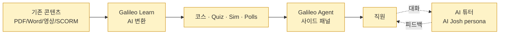

# Josh Bersin Co. — Galileo Learn (AI-native 기업 학습 플랫폼)

> **2026-04-12 업데이트**: Bersin의 2025-06-01 follow-up 분석 ([[bersin-ld-revolution-2025-06]]) 확보로 **Workday internal leadership academy**가 Sana/Galileo Learn의 첫 공개 외부 customer임이 확인됨. 또한 Bersin이 COI를 본문에 명시적으로 공개 — 신뢰도·투명성 동시 상승. 여전히 실증 ROI metric은 부재.

## Summary

Josh Bersin Co.가 2025년 5월에 발표한 **AI-native 기업 학습 플랫폼**. Sana Labs의 AI foundation을 기반으로, 기존 콘텐츠(PDF·Word·오디오·비디오·SCORM)를 자동으로 코스·assessment·simulation으로 변환. **외부 공개 고객**: ✅ **Workday internal leadership academy** (Bersin 2025-06 follow-up에서 확인). Bersin Co. 자체 HR Academy 재전환 사례(8년 자료 → 5개월 만에 750 learning objects)와 함께 2건의 deployment 레퍼런스.

## 시장 포지션 (Bersin 2025-06 독립 분석 기준)

Bersin이 2025-06 follow-up에서 제시한 3-way 비교:

| 플랫폼 | Customer base | Architecture | 시장 위치 |
|---|---|---|---|
| **Cornerstone OnDemand** | 7,000+ 고객 | Traditional LMS + AI | "One of the best in the traditional architecture" |
| **Docebo** | 3,900+ 대형 고객 | Recently AI-native (transitioning) | 상장사, customer education·high-scale business models 강점 |
| **Sana / Galileo Learn** | 미공개 (Workday + Bersin Co. 확인) | "All-AI" native | ⚠️ Bersin 주장: "Most pure-play revolutionary platform" (COI 있음) |

→ 출처: [[bersin-ld-revolution-2025-06]]

## Problem / Why (도입 배경)

Bersin 기사가 제시하는 문제 진술:
- **$360 billion** 글로벌 training 산업 규모이지만 **68%가 "administrative" 지출** (consultative·creative 가치 생산 못 함)
- 74% of companies가 급격한 스킬 수요 변화를 따라가지 못함 (Bersin 선행 연구)
- 기존 LMS/LXP는 콘텐츠 제작·업데이트·현행화에 느림

> 이 problem은 **Bersin이 자사 제품을 팔기 위한 프레이밍**이므로 독립 학술 검증은 아님 (⚠️ 벤더 주장).

## Solution Architecture

### A. Process (프로세스)

- **Before (As-is)**: 전통적 LMS/LXP — 코스 수동 제작, 업데이트 느림, 다국어 번역 별도 작업
- **After (To-be)** (⚠️ 벤더 주장):
  1. 기존 콘텐츠(문서·영상·SCORM)를 플랫폼에 업로드
  2. AI가 "with your guidance" 자동으로 코스·assessment·polls·exercises·시뮬레이션 생성
  3. Galileo agent가 업무 중 사이드 패널로 학습 제공 (Workflow-embedded)
  4. AI 튜터·"AI Josh" avatar persona와 대화형 학습
- **Human-in-the-loop**: "with your guidance" 라는 표현으로 미루어 콘텐츠 담당자가 review·수정, 그러나 구체 HITL 수준 ❓ 미공개
- **Trigger & Frequency**: 업무 흐름 중 수시 (flow-embedded)
- **Scope of autonomy**: 콘텐츠 생성 자동 + 사람 review (명시적 확인은 없음)

_범례: 노랑 = 벤더 주장 (제품 설명에서 직접 읽힘). 실증 customer 사례가 없으므로 실행 여부는 미검증._

### B. System & Infrastructure (시스템·인프라)

- **Core HRIS**: N/A (별도 SaaS, HRIS 의존 낮음)
- **AI 시스템 배치**: Galileo agent의 일부 (plugin/integration)
- **배포 환경**: SaaS (cloud provider 미공개)
- **연동·통합**: HRIS·LMS(SuccessFactors·Cornerstone·Workday Learning 등)와의 통합 여부 ❓ 미공개
- **사용자 접점**: Galileo agent UI (사이드 패널 embedded)
- **인증·권한**: _미공개_

### C. Data (데이터)

- **입력 데이터 소스**: 조직의 기존 학습 콘텐츠 (문서·영상·SCORM 등)
- **데이터 규모**: Bersin 자사 — 8년 누적, 750 learning objects
- **전처리·정제**: 자동 ("with your guidance")
- **학습 vs RAG vs In-context 구분**: **Sana Labs foundation 기반** — Sana Labs의 아키텍처에 따름. 세부 ❓ 미공개
- **데이터 거버넌스**: _미공개_ — 고객 콘텐츠가 Sana·Bersin·Galileo 어디에 저장되고 어떻게 분리되는지 공개 없음
- **민감정보 처리**: _미공개_

### D. Model (모델)

- **Foundation model**: **Sana Labs AI** (기반 파트너). 내부에서 어떤 foundation model을 쓰는지 Sana가 공개한 바에 따름 — Bersin 기사엔 미공개
- **모델 유형**: 콘텐츠 생성 + 대화형 튜터 = LLM 중심
- **제공 방식**: Bersin Co. 플랫폼 (Sana Labs OEM)
- **커스터마이징 기법**: _미공개_
- **평가·가드레일**: _미공개_. 콘텐츠 정확성·편향·HR Capability Model 매핑 품질 감사 결과 공개 없음
- **비용·성능 지표**:
  - **가격: $495/year per person** ($49/월), $200 add-on for existing Galileo users — ✅ Fact (공개)
  - 성능 지표 (latency·토큰 비용·응답 품질 등) _미공개_

### E. Organization & Team (조직·팀 구조)

- **제품 소유**: Josh Bersin Co. (CEO Josh Bersin)
- **기술 파트너**: Sana Labs
- **Galileo Learn 개발 팀 구성**: _미공개_
- **Josh Bersin 본인의 역할**: 제품 홍보·"AI Josh" persona의 인물 모델
- **외부 customer 조직 사례**: ✅ **Workday internal leadership academy** (Bersin 2025-06 follow-up에서 확인). 그 외 공개 고객은 현재까지 0건.

### F. Diagrams (도식)
- 기능 플로우 1개 (A 섹션). 실증 deployment 부재로 시스템·org 도식 생략.

---

**Fact 품질 요약**:
- ✅ Fact: 제품의 존재, 런칭 일자(2025-05), 가격, Sana Labs 파트너십, Bersin Co. 자체 deployment 사실
- ⚠️ 벤더 주장: 기능 설명·산업 통계·효과 주장 전반
- ❓ 미공개: 기술 아키텍처 세부, 외부 customer, 실제 ROI

## Impact / Metrics (기대효과)

### 기대효과 요약
Before: Bersin 8년 HR Academy (기존 LMS) → After: 5개월 만에 AI-native LMS 전환, 750 learning objects 구축 (⚠️ 벤더 자사 사용). 정량적 customer outcome (ROI·완수율·만족도) 수치 0건.

### 공개된 Deployment 사례 (2026-04 기준)

| Customer | 사용 용도 | 출처 | 성격 |
|---|---|---|---|
| Josh Bersin Co. (자사) | 8년 HR Academy → 5개월 재전환, 750 learning objects | [[bersin-galileo-learn-2025-05]] | ⚠️ 벤더 자사 사용 |
| **Workday** | Internal leadership academy | [[bersin-ld-revolution-2025-06]] | ⚠️ Bersin 전달 (Bersin/Sana 파트너십 맥락) |

### 정량 outcome metric
**0건** — 두 customer 모두 ROI·완수율·만족도 등 outcome 수치 공개 없음. output metric만 존재 (learning object 수).

### Workday 사례의 가치
- Workday는 글로벌 HCM 벤더 — 같은 벤더가 Paradox Olivia를 채용에도 쓰고 있음 ([[paradox]] 페이지 참조). 즉 Workday 자체가 **여러 HR AI 제품의 early adopter**
- 단 "internal leadership academy"는 규모·효과 공개 없음 → 현재는 "존재 확인" 수준

## Governance & Risk

- **학습 콘텐츠 품질 검증 부재**: AI 생성 콘텐츠의 정확성·편향·법적 준수 여부에 대한 공개된 평가 프로세스 없음
- **HR Capability Model 매핑의 taxonomy 리스크**: Bersin의 HR 모델에 기반한 매핑이 **조직마다 다른 HR 구조**와 fit할지 검증 없음
- **데이터 소유권**: 고객이 업로드한 콘텐츠가 Sana/Bersin의 모델 개선에 쓰이는지 여부 공개 없음
- **단일 deployment 리스크**: 제품이 설계대로 작동한다는 증거가 vendor 자체 사용 1건뿐 — 다양한 조직에서의 실증 부재

## Contradictions
_없음 — 단일 소스_

## Consulting Angle

- **사용처**:
  - AI-native LMS **시장 동향** 설명 시 대표 사례
  - 전통 LMS/LXP(Cornerstone, Docebo, Degreed, 360Learning 등)와의 **차이점 설명**에 참고
  - 절대 **"검증된 솔루션"**으로 제시 금지
- **제시 시 주의점**:
  - Josh Bersin의 **분석가 vs vendor 이중 역할**을 명확히 고지 — 그의 일반 Bersin 분석과 Galileo Learn 홍보는 구분
  - 외부 customer 0건을 솔직히 말해야 함 — "유망한 접근법이지만 실증 부재"
- **실질 교훈**:
  1. **AI-native LMS는 아직 초기** — 2026년 1Q 기준, 실증된 대규모 customer가 희소
  2. **기존 콘텐츠 활용**이 핵심 value prop — 새 콘텐츠 제작보다 기존 자산의 AI 변환이 entry point
  3. **flow-embedded learning**이 차기 UX 방향 — Galileo처럼 agent 사이드 패널 형태
- **파생 질문**:
  1. 한국 대기업의 LMS 교체 주기(통상 5~7년)에서 AI-native LMS로의 이행 타이밍은?
  2. 한국어 콘텐츠 품질·법정 교육(산업안전·윤리 등) 대응력은?
  3. 기존 Cornerstone/SAP 등과의 migration 경로는?

## 다음 ingest 우선순위

- Cornerstone·Docebo·SAP SuccessFactors Learning 등 전통 LMS 벤더의 AI 기능 추가 (비교용)
- 실제 customer deployment가 있는 AI-native 학습 사례 (특히 Microsoft Viva Learning, Workday Learning AI 기능)
- 국내 LXP 사례 (크리데일·휴넷·멀티캠퍼스 AI 기능 등)
