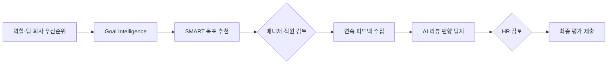

## Summary

Betterworks가 2026년 1월 **NextGen** AI-native 성과관리 플랫폼을 출시. **400+** 고객 우선순위 기능을 반영, **Goal Intelligence** (역할·팀·회사 우선순위 기반 SMART 목표 자동 추천), AI 기반 평가 편향 감소·일관성 향상, 부서·지역별 AI 기능 단계적 활성화를 지원. **Colgate-Palmolive, Intuit, ATB Financial, Kuehne+Nagel** 등이 고객. 2026 State of Performance 보고서에서 임원 vs 직원의 AI 성과관리 준비도 인식 **6배 차이**를 발견. [[sources/betterworks-nextgen-2026-01.md]]

## Problem / Why

- 전통 성과 관리가 연 1~2회 이벤트에 그침 → **연속 피드백·목표 관리** 수요 증가
- 목표 설정 시 매니저·직원이 SMART 기준에 맞추기 어려움 → **비구체적·비측정 목표 남발**
- 성과 리뷰에서 **평가자 편향**(recency bias, halo effect) 문제
- 글로벌 기업에서 지역별 규제(EU AI Act, GDPR 등)에 맞춰 **AI 기능 차별 적용** 필요
- 임원은 AI 성과관리 준비됐다고 보지만 직원은 6배 덜 준비됐다고 인식 [[sources/betterworks-nextgen-2026-01.md]]

## Solution Architecture (요약)

### A. Process (프로세스)

- **Before**: 연 1~2회 목표 설정 → 수동 리뷰 작성 → 편향 보정 없음
- **After**: Goal Intelligence가 역할·팀·회사 맥락 기반 SMART 목표 추천 → 연속 피드백 수집 → AI가 리뷰 편향 탐지·일관성 향상 → 부서·지역별 단계적 AI 활성화 [[sources/betterworks-nextgen-2026-01.md]]
- **HITL 지점**: 목표 추천은 매니저·직원이 검토·수정. 평가 편향 탐지 결과를 HR/매니저가 검토
- **Scope of autonomy**: Recommend (목표 추천) + Assist (편향 탐지)

### B. System & Infrastructure

- **Core 플랫폼**: Betterworks (Performance Enablement SaaS)
- **AI**: NextGen AI-native 플랫폼 — Betterworks 내장 [[sources/betterworks-nextgen-2026-01.md]]
- **거버넌스 기능**: 부서·지역별 AI 기능 활성화/비활성화 토글 → 규제 컴플라이언스 대응 [[sources/betterworks-nextgen-2026-01.md]]
- 연동·배포 상세: _미공개 (not disclosed)_

### C. Data

- **입력**: 역할 정보, 팀 구조, 회사 전략·우선순위, 과거 목표·성과 데이터 [[sources/betterworks-nextgen-2026-01.md]]
- 나머지: _미공개 (not disclosed)_

### D. Model

- **Foundation model**: _미공개 (not disclosed)_
- **커스터마이징**: Goal Intelligence — 역할·팀·회사 맥락 기반 추천 로직 [[sources/betterworks-nextgen-2026-01.md]]
- 나머지: _미공개 (not disclosed)_

### E. Organization & Team

- 고객: Colgate-Palmolive, Intuit, ATB Financial, Ferrer, University of Phoenix, Kuehne+Nagel (19개 플랫폼 평가 후 선택) [[sources/betterworks-nextgen-2026-01.md]]
- 구체 조직·팀 구조: _미공개 (not disclosed)_

## Impact / Metrics

### 기대효과 요약

AI 기반 목표 추천 + 평가 편향 감소. 구체 outcome metric 미공개.

| 지표 | 값 | 출처 | 성격 |
|---|---|---|---|
| 고객 우선순위 기능 반영 | 400+ | Betterworks 공식 | ⚠️ 벤더 주장 |
| 임원 vs 직원 AI 준비도 인식 격차 | 6배 | Betterworks 2026 보고서 (n=2,387) | ⚠️ 벤더 주장 (자체 조사) |
| Kuehne+Nagel 선정 | 19개 플랫폼 비교 후 선택 | Betterworks 공식 | ⚠️ 자사 보고 |

## Governance & Risk

- 부서·지역별 AI 기능 단계적 활성화 기능은 **EU AI Act/GDPR 대응의 실용적 접근** [[sources/betterworks-nextgen-2026-01.md]]
- Goal Intelligence의 추천이 조직 전략에 과도하게 편향될 위험 — 개인 성장 목표 vs 조직 목표 균형

## Consulting Angle

### 활용 포인트
- **OKR/목표 AI 자동화의 대표 사례**: "Goal Intelligence"는 구체적 기능명으로 제안서에 직접 활용 가능
- **글로벌 기업의 AI 단계적 롤아웃 모델**: 부서·지역별 AI 활성화 토글은 한국 대기업의 글로벌 AI 거버넌스 논의에 참고
- **임원-직원 AI 인식 격차 6배**: 변화관리(Change Management) 워크숍에서 "경영진은 준비됐다고 생각하지만 현장은 다르다" 논점으로 활용

### 주의
- 모든 수치가 벤더 자체 주장. Colgate-Palmolive·Intuit의 구체 outcome은 미공개
- confidence 0.25 — Tier 1·2 독립 검증 필요
