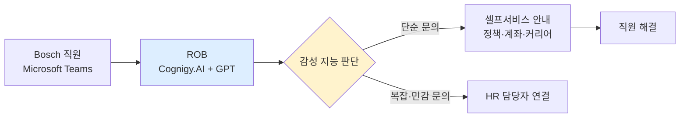

## Summary

Bosch는 창업자 Robert Bosch의 이름을 딴 HR AI 디지털 어시스턴트 "ROB"를 25개국에 배포했다. ✅ **Fact** Cognigy.AI 플랫폼과 GPT 기반으로 구동되며, Microsoft Teams를 통해 직원에게 제공된다. 은행 계좌 정보 업데이트, 커리어 개발 정보 탐색, 회사 정책 안내, HR 셀프서비스 프로세스 안내 등을 처리하며, 감성 지능(emotional intelligence)을 활용해 추가 인간 지원이 필요한 시점을 식별한다. [[sources/cognigy-bosch-case-study.md]] [[sources/hrgrapevine-bosch-rob-2025-01.md]]

## Problem / Why

Bosch는 글로벌 360,000명 이상의 직원이 다양한 국가별 HR 정책과 셀프서비스 프로세스를 쉽게 탐색할 수 없는 문제를 안고 있었다. HR 팀으로의 인바운드 문의가 과도했으며, 특히 다국어 환경에서 일관된 서비스 제공이 어려웠다.

## Solution Architecture

> **최우선 원칙**: 이 섹션은 **공개된 사실만** 기록한다.

### A. Process (프로세스)

- **Before (As-is)**: HR 정책·셀프서비스 문의를 직원이 이메일·전화로 HR 팀에 직접 요청.
- **After (To-be)**:
  1. ✅ **Fact** ROB가 계좌 정보 업데이트, 정책 안내, 커리어 정보 탐색 등의 셀프서비스 프로세스 안내. [[sources/cognigy-bosch-case-study.md]]
  2. ✅ **Fact** 대화 중 감성 지능으로 추가 인간 지원 필요 여부 식별 → HR 담당자 연결. [[sources/hrgrapevine-bosch-rob-2025-01.md]]
  3. ✅ **Fact** 직원 대화를 통해 지속적으로 개선. [[sources/cognigy-bosch-case-study.md]]
- **Human-in-the-loop (HITL) 지점**: ✅ **Fact** 감성 지능이 감지한 복잡·민감 문의는 인간 HR 담당자로 에스컬레이션. [[sources/hrgrapevine-bosch-rob-2025-01.md]]
- **Trigger & Frequency**: 직원 문의 발생 시 수시(on-demand). 일상적 사용.
- **Scope of autonomy**: ✅ **Fact** 단순 정책 안내·셀프서비스 안내는 자율 처리; 복잡한 케이스는 HITL. [[sources/hrgrapevine-bosch-rob-2025-01.md]]

범례: 실선 = [[sources/cognigy-bosch-case-study.md]] [[sources/hrgrapevine-bosch-rob-2025-01.md]] 확인.

### B. System & Infrastructure (시스템·인프라)

- **Core HRIS / 기반 시스템**: _미공개 (not disclosed)_
- **AI 시스템 배치**: ✅ **Fact** Cognigy.AI 플랫폼 기반 SaaS 솔루션. [[sources/cognigy-bosch-case-study.md]]
- **배포 환경**: _미공개 (not disclosed)_
- **연동·통합**: ✅ **Fact** Microsoft Teams 인터페이스. IT 서비스 티켓 생성 등 백엔드 시스템 연동. [[sources/hrgrapevine-bosch-rob-2025-01.md]]
- **사용자 접점 (UX layer)**: ✅ **Fact** Microsoft Teams. [[sources/cognigy-bosch-case-study.md]]
- **인증·권한**: _미공개 (not disclosed)_

### C. Data (데이터)

- **입력 데이터 소스**: HR 정책 문서, 직원 마스터 데이터(셀프서비스용), 직원-ROB 대화 이력.
- **데이터 규모**: ✅ **Fact** 25개국 배포. [[sources/cognigy-bosch-case-study.md]]
- **전처리·정제**: _미공개 (not disclosed)_
- **학습 vs RAG vs In-context 구분**: _미공개 (not disclosed)_
- **데이터 거버넌스**: ✅ **Fact** ROB와의 대화 내용은 기록·저장하지 않는다고 공개. [[sources/hrgrapevine-bosch-rob-2025-01.md]]
- **민감정보 처리**: ✅ **Fact** Bosch AI Code of Ethics(2020) 준수. [[sources/cognigy-bosch-case-study.md]]

### D. Model (모델)

- **Foundation model**: ✅ **Fact** GPT 기반. 구체 버전 _미공개 (not disclosed)_. [[sources/cognigy-bosch-case-study.md]]
- **Model 유형**: LLM (대화형), 감성 분류.
- **제공 방식**: Cognigy.AI 플랫폼을 통한 GPT 연동.
- **커스터마이징 기법**: ✅ **Fact** 직원 대화를 통해 지속적으로 개선(continuous learning from interactions). [[sources/cognigy-bosch-case-study.md]]
- **평가·가드레일**: ✅ **Fact** Bosch AI Code of Ethics 2020 기반 AI 제품 거버넌스. [[sources/cognigy-bosch-case-study.md]]

### E. Organization & Team (조직·팀 구조)

- **오너십**: HR 부서 주도.
- **배포 목적**: ✅ **Fact** 직원 경험 향상 및 HR 팀 인바운드 문의 부담 감소. [[sources/hrgrapevine-bosch-rob-2025-01.md]]
- **팀 규모·기간**: _미공개 (not disclosed)_
- **거버넌스 체계**: ✅ **Fact** Bosch AI Code of Ethics(2020)로 AI 제품 전체 거버넌스. "Invented for Life" 원칙과 혁신의 조화. [[sources/cognigy-bosch-case-study.md]]
- **변화관리**: ✅ **Fact** ROB에 이름과 개성을 부여하여 "또 다른 챗봇이 아닌 동료"로 느끼게 설계. [[sources/hrgrapevine-bosch-rob-2025-01.md]]

## Impact / Metrics (기대효과)

### 기대효과 요약
Before: _미공개 (기존 HR 인바운드 문의 건수·처리 시간)_ → After: 25개국 글로벌 배포 완료, HR 팀 인바운드 문의 부담 감소 (⚠️ 자사 보고, 구체 수치 _미공개_).

- ✅ **Fact**: 25개국 배포 완료. [[sources/cognigy-bosch-case-study.md]]
- ⚠️ **자사 보고**: HR 팀의 인바운드 문의 부담이 줄어들었다고 보고. 구체 수치 _미공개 (not disclosed)_. [[sources/hrgrapevine-bosch-rob-2025-01.md]]

## Governance & Risk

- ✅ **Fact**: Bosch AI Code of Ethics (2020) — AI 제품이 "Invented for Life" 원칙과 사회적 책임에 부합해야 함. [[sources/cognigy-bosch-case-study.md]]
- ✅ **Fact**: 직원 대화 내용 미저장 정책으로 프라이버시 보호. [[sources/hrgrapevine-bosch-rob-2025-01.md]]
- GDPR 적용 환경(유럽 기반 대기업). 구체 DPIA 내용 _미공개 (not disclosed)_.

## Contradictions

없음 (현재 기준).

## Consulting Angle

- **변화관리 설계의 교훈**: 단순 "챗봇" 대신 이름·개성·감성 지능을 가진 "AI 동료"로 포지셔닝한 점은 HR AI 도입 시 직원 수용성을 높이는 설계 원칙으로 활용 가능.
- **글로벌 제조업 다국어 대응**: 25개국 다국어 HR 정책 통합 Q&A는 국내 글로벌 제조기업(현대·삼성·LG의 해외 공장 HR)에 직접 적용 가능한 패턴.
- **프라이버시 우선 설계**: 대화 미저장 정책은 유럽 GDPR·국내 개인정보법 규제 환경 클라이언트에게 참고 사례로 제시 가능.
- **대화 미저장 트레이드오프**: 대화 데이터 미저장은 프라이버시 보호에는 유리하지만 지속 학습(continuous learning) 주장과 논리적으로 충돌할 수 있으므로, 클라이언트에게는 이 트레이드오프를 명시적으로 논의할 것.
