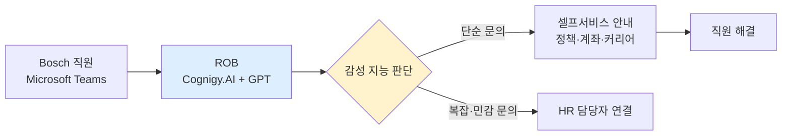

## Summary

Bosch는 창업자 Robert Bosch와 'robot'에서 이름을 딴 HR AI 디지털 어시스턴트 "ROB"를 429,000명 associate 대상 셀프서비스 HR 도구로 배포했다 (2024-03 개발 착수). ✅ **Fact** GenAI·ChatGPT-4o로 HR 데이터베이스 기반 질의응답. [[sources/hrgrapevine-bosch-rob-2025-01.md]] ⚠️ 벤더 주장: Cognigy.AI 플랫폼 기반, 25개국 배포, Microsoft Teams 통합 — 은행 계좌 정보 업데이트, 커리어 개발 정보, 회사 정책 안내 처리. [[sources/cognigy-bosch-case-study.md]] ⚠️ 자사 보고 (Bosch UK HR 총괄 기고): 감성 지능(emotional intelligence)으로 추가 인간 지원이 필요한 시점을 식별하며, 대다수 Bosch 국가에 배포. [[sources/personneltoday-bosch-hr-ai-2025.md]]

## Problem / Why (도입 배경)

- **Before**: ✅ "fragmented portal knowledge" — 분산된 포털 지식을 활용해 다른 것을 만들려는 시도에서 출발 (Fehrling). [[sources/hrgrapevine-bosch-rob-2025-01.md]] 인바운드 문의 건수 baseline ❓ 미공개
- **Pain point**: ⚠️ 자사 보고: associate의 삶을 편하게 하고 HR 팀 인바운드 문의 부담을 줄이기 위해 — 셀프서비스 유도. [[sources/personneltoday-bosch-hr-ai-2025.md]]
- **Trigger**: ✅ 2024-03 개발 착수. [[sources/hrgrapevine-bosch-rob-2025-01.md]] 직접 계기 세부 _미공개_ (종전 "360,000명" 직원 수는 소스와 불일치 — HR Grapevine 기준 429,000명으로 정정, 2026-09-27 grounding 점검)

## Solution Architecture

> **최우선 원칙**: 이 섹션은 **공개된 사실만** 기록한다.

### A. Process (프로세스)

- **Before (As-is)**: ✅ 예: 휴가 잔여일을 알려면 매니저와 논의 필요 (Fehrling) — 분산된 포털 지식. [[sources/hrgrapevine-bosch-rob-2025-01.md]]
- **After (To-be)**:
  1. ✅ **Fact** ROB가 HR DB 기반으로 휴가 잔여일·병가 기록 등 HR 행정의 '기본' 질의에 응답 — 심층 이슈는 다루지 않는 설계. [[sources/hrgrapevine-bosch-rob-2025-01.md]]
  2. ⚠️ 벤더 주장: 계좌 정보 업데이트, 커리어 개발 정보, 회사 정책 안내. [[sources/cognigy-bosch-case-study.md]]
  3. ⚠️ 자사 보고: 셀프서비스 프로세스 안내 + 특정 HR 정책으로 연결; 감성 지능으로 인간 지원 필요 시점 식별 → 추가 지원 경로 안내. [[sources/personneltoday-bosch-hr-ai-2025.md]]
- **Human-in-the-loop (HITL) 지점**: ⚠️ 자사 보고: ROB는 associate 대신 결정을 내리지 않고 정보 안내만; 인간 지원 필요 시 경로 추천. [[sources/personneltoday-bosch-hr-ai-2025.md]]
- **Trigger & Frequency**: 직원 문의 발생 시 수시(on-demand). 주기 수치 _미공개_
- **Scope of autonomy**: ⚠️ 자사 보고: 정보 안내(recommend) — 의사결정 없음. [[sources/personneltoday-bosch-hr-ai-2025.md]]

```mermaid
flowchart LR
    A[Bosch 직원\nMicrosoft Teams] --> B[ROB\nCognigy.AI + GPT]
    B --> C{감성 지능 판단}
    C -->|단순 문의| D[셀프서비스 안내\n정책·계좌·커리어]
    C -->|복잡·민감 문의| E[HR 담당자 연결]
    D --> F[직원 해결]
    style B fill:#ddeeff
    style C fill:#fff3cd
```
범례: 실선 = [[sources/hrgrapevine-bosch-rob-2025-01.md]] (Teams·GPT-4o) [[sources/cognigy-bosch-case-study.md]] (Cognigy·Teams) [[sources/personneltoday-bosch-hr-ai-2025.md]] (감성 지능 에스컬레이션) 확인.

### B. System & Infrastructure (시스템·인프라)

- **Core HRIS / 기반 시스템**: _미공개 (not disclosed)_ — ✅ "HR database" 기반 응답이라고만 언급. [[sources/hrgrapevine-bosch-rob-2025-01.md]]
- **AI 시스템 배치**: ⚠️ 벤더 주장: Cognigy.AI를 전사 AI 오케스트레이션 플랫폼으로 채택 ('Bosch Chatbot Suite', 90개+ use case) — ROB는 그중 HR AI 에이전트. [[sources/cognigy-bosch-case-study.md]]
- **배포 환경**: _미공개 (not disclosed)_
- **연동·통합**: ✅ HR 데이터베이스. [[sources/hrgrapevine-bosch-rob-2025-01.md]] ⚠️ 자사 보고: My HR 지식베이스·HR 가이드라인 기반 응답. [[sources/personneltoday-bosch-hr-ai-2025.md]] (종전 "IT 서비스 티켓 생성 연동"은 인용 소스 key quote에 없어 제거)
- **사용자 접점 (UX layer)**: ⚠️ 벤더 주장: Microsoft Teams 통합. [[sources/cognigy-bosch-case-study.md]]
- **인증·권한**: _미공개 (not disclosed)_

### C. Data (데이터)

- **입력 데이터 소스**: ✅ HR 데이터베이스 [[sources/hrgrapevine-bosch-rob-2025-01.md]]; ⚠️ 자사 보고: My HR 지식베이스·HR 가이드라인. [[sources/personneltoday-bosch-hr-ai-2025.md]]
- **데이터 규모**: ✅ 429,000명 associate 대상. [[sources/hrgrapevine-bosch-rob-2025-01.md]] ⚠️ 벤더 주장: 25개국 배포. [[sources/cognigy-bosch-case-study.md]]
- **전처리·정제**: ✅ 데이터 중 약 5%는 아직 구조화가 부족하다고 인정. [[sources/hrgrapevine-bosch-rob-2025-01.md]] 세부 _미공개_
- **학습 vs RAG vs In-context 구분**: _미공개 (not disclosed)_
- **데이터 거버넌스**: ⚠️ 자사 보고: ROB와의 대화 내용은 기록되지 않음. [[sources/personneltoday-bosch-hr-ai-2025.md]]
- **민감정보 처리**: ⚠️ 자사 보고: 2020년 수립한 Bosch AI Code of Ethics. [[sources/personneltoday-bosch-hr-ai-2025.md]] 세부 _미공개_

### D. Model (모델)

- **Foundation model**: ✅ **Fact** GenAI·ChatGPT-4o. [[sources/hrgrapevine-bosch-rob-2025-01.md]]
- **Model 유형**: ✅ LLM (대화형 질의응답). [[sources/hrgrapevine-bosch-rob-2025-01.md]] 감성 지능 구현 방식 _미공개_
- **제공 방식**: ⚠️ 벤더 주장: Cognigy.AI 오케스트레이션 플랫폼 경유. [[sources/cognigy-bosch-case-study.md]]
- **커스터마이징 기법**: _미공개 (not disclosed)_ — ⚠️ 벤더 주장: 다국어·대화 맥락 유지·톤 기반 응답 조정. [[sources/cognigy-bosch-case-study.md]]
- **평가·가드레일**: ⚠️ 자사 보고: ROB는 결정을 내리지 않고 정보 안내만; Bosch AI Code of Ethics. [[sources/personneltoday-bosch-hr-ai-2025.md]] 평가 수치 _미공개_

### E. Organization & Team (조직·팀 구조)

- **오너십**: ✅ **Fact** HR 주도 — Niklas Fehrling (VP HR Digitalisation & Global HR IT), Deepak Sharma (Senior HR IT Project Manager). [[sources/hrgrapevine-bosch-rob-2025-01.md]]
- **배포 목적**: ⚠️ 자사 보고: associate의 삶을 편하게 하고 HR 팀 인바운드 문의 부담 감소. [[sources/personneltoday-bosch-hr-ai-2025.md]]
- **팀 규모·기간**: ✅ 2024-03 개발 착수. [[sources/hrgrapevine-bosch-rob-2025-01.md]] 팀 규모 _미공개_
- **거버넌스 체계**: ⚠️ 자사 보고: Bosch AI Code of Ethics (2020). [[sources/personneltoday-bosch-hr-ai-2025.md]]
- **변화관리**: ✅ **Fact** 창업자 이름 + robot에서 'ROB' 명명. [[sources/hrgrapevine-bosch-rob-2025-01.md]] (종전 "또 다른 챗봇이 아닌 동료" 표현은 key quote에 없어 제거)

## Impact / Metrics (기대효과)

### 기대효과 요약
Before: _미공개 (기존 HR 인바운드 문의 건수·처리 시간)_ → After: ⚠️ 벤더 주장 25개국 배포 / ⚠️ 자사 보고 대다수 Bosch 국가 배포, HR 팀 인바운드 문의 부담 감소 (구체 수치 _미공개_).

- ⚠️ **벤더 주장**: 25개국 배포. [[sources/cognigy-bosch-case-study.md]]
- ⚠️ **자사 보고**: 대다수 Bosch 국가에 배포, 사용자 경험 "significantly enhancing". [[sources/personneltoday-bosch-hr-ai-2025.md]]
- ⚠️ **자사 보고**: 인바운드 문의 부담 경감 목적 — 감소율 수치 _미공개 (not disclosed)_. [[sources/personneltoday-bosch-hr-ai-2025.md]]

## Governance & Risk

- ⚠️ **자사 보고**: Bosch AI Code of Ethics (2020). [[sources/personneltoday-bosch-hr-ai-2025.md]]
- ⚠️ **자사 보고**: 직원 대화 내용 미기록 정책으로 프라이버시 보호. [[sources/personneltoday-bosch-hr-ai-2025.md]]
- ⚠️ **자사 보고**: ROB는 associate 대신 결정을 내리지 않음 (human in control). [[sources/personneltoday-bosch-hr-ai-2025.md]]
- GDPR 적용 환경(유럽 기반 대기업). 구체 DPIA 내용 _미공개 (not disclosed)_.

## Contradictions

> [!note] 2026-09-27 grounding — 종전 본문의 "360,000명 직원"은 HR Grapevine의 "429,000 associates"와 불일치하여 정정. "GPT 기반"의 출처를 Cognigy(추출본에 GPT 언급 없음)에서 HR Grapevine(ChatGPT-4o)으로, 감성 지능 에스컬레이션·대화 미기록·AI Code of Ethics의 출처를 Personnel Today 기고로 재귀속. "IT 서비스 티켓 생성 연동", "직원 대화를 통한 지속 개선", "동료로 느끼게 설계"는 key quote에 없어 제거. unleash-bosch-rob-session 소스는 원문 404로 인용하지 않음. 배포 범위는 Cognigy "25개국" vs Personnel Today "대다수 국가"로 표현이 다르나 충돌은 아님. frontmatter `output:`의 "360,000명 직원" 표기는 본 점검에서 손대지 않음 (수정 필요).

## Consulting Angle

- **"기본만 잘 하는" 설계 철학**: ROB는 HR 행정의 '기본'(휴가 잔여·병가 기록)에 집중하고 심층 이슈는 다루지 않는다는 명시적 범위 설정 — HR AI 도입 시 scope creep을 막는 설계 원칙으로 활용 가능. [[sources/hrgrapevine-bosch-rob-2025-01.md]]
- **글로벌 제조업 다국어 대응**: 25개국(⚠️ 벤더 주장) 다국어 HR 정책 Q&A는 국내 글로벌 제조기업(현대·삼성·LG의 해외 공장 HR)에 적용 가능한 패턴.
- **프라이버시 우선 설계**: 대화 미기록 정책(⚠️ 자사 보고)은 유럽 GDPR·국내 개인정보법 규제 환경 클라이언트에게 참고 사례로 제시 가능.
- **데이터 준비도**: 데이터의 약 5%가 아직 구조화 부족이라는 Bosch의 인정은 "HR 지식베이스 정비가 챗봇 품질의 전제"라는 논점의 근거 — 클라이언트 진단 단계에서 인용.
- **정량 효과 부재**: 문의 감소율·해결률 수치가 공개되지 않았으므로 ROI 사례가 아닌 설계·거버넌스 사례로만 제시.
