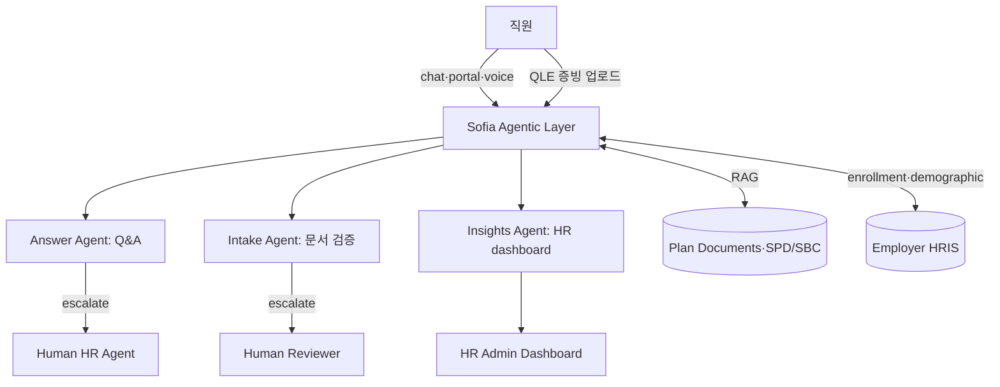

## Summary

Businessolver는 **US 복리후생 어드민 SaaS 벤더**로, 자체 AI 엔진 **Sofia**를 2010년대 후반부터 운영해왔으며 2025년 7월 **agentic framework**로 확장. 3개 specialist agent (**Intake / Answer / Insights**) 구조로 **문서 자동 검증·24/7 직원 Q&A·HR 운영 인사이트**를 동시 처리. ⚠️ 자사 보고: 2024년 OE(Open Enrollment) 기준 document 자동 검증 62%·chat 당일 해결 92%·콜타임 7M minutes 절감·만족도 4.25/5. 2025년 마감 기준 client NPS 83·retention 97% (벤더 자사 발표).

## Problem / Why (도입 배경)

- **Before**: 미국 employer의 OE(연 1회 plan 선택)는 직원 stress 최고점 — 정책 복잡(의료·치과·생명·FSA·HSA·HDHP), 문서 검증(QLE: qualifying life event — 결혼·출산·이혼시 plan 변경)·승인 워크플로 수작업
- **Pain point**: HR/벤처사 콜센터에 OE 시즌 콜 급증, 직원당 평균 통화 시간 길고 같은 질문 반복, document 검증은 사람 reviewer가 1건씩 처리
- **Trigger**: GenAI 등장으로 chat·문서 처리 자동화 가능. Businessolver 1998년 설립 이후 축적된 25년+ 도메인 데이터 + Sofia AI 엔진을 agentic으로 재구성
- 비교 reference: [[moderna-benefits-equity-gpts]]는 single-tenant Custom GPT, Sofia는 multi-tenant SaaS

## Solution Architecture

### A. Process (프로세스)

- **Before**: 직원이 전화·이메일·portal로 문의 → HR/벤처사 상담원이 plan 비교 설명 → QLE 시 직원이 증빙 PDF 업로드 → 사람이 1건씩 검증·승인 → plan 변경 반영
- **After (벤더 발표 architecture)**:
  1. 직원이 chat·portal·전화로 문의
  2. **Answer Agent**: 자연어 질문 (의료 plan 비교·HSA 적격성·deductible 계산 등) 즉시 답변 — 세션 내 multi-turn
  3. 직원이 QLE 증빙 (출생증명서·결혼증명서·이혼판결문 등) 업로드
  4. **Intake Agent**: 문서 OCR·정보 추출·정책 매칭·정합성 자동 검증 → 승인 또는 사람 escalation
  5. **Insights Agent**: 콜·티켓·document 처리 패턴을 HR 관리자에게 dashboard로 제공 — 어느 plan에 대한 문의가 급증하는가, 어떤 demographic이 어느 결정으로 가는가
  6. HR 관리자가 OE 캠페인·교육 자료·plan design을 인사이트 기반으로 조정
- **HITL**:
  - Answer Agent: 자가 답변 못하면 human agent로 escalate (Sofia가 conversation context 인계)
  - Intake Agent: 문서 거부·애매할 때 사람 reviewer escalation
  - Insights Agent: 권고만 — HR 의사결정은 사람
- **Frequency**: daily (chat·document) + OE 시즌 spike (10~12월 미국)
- **Scope of autonomy**: recommend + execute (chat 답변·document 자동 승인), HR plan design은 recommend-only

### B. System & Infrastructure (시스템·인프라)

- **Core platform**: Businessolver Benefitsolver SaaS (Cloud-hosted) — _구체 hyperscaler 미공개_
- **AI 시스템 배치**: Benefitsolver platform 내장 + 외부 employer HRIS 연동 (Workday, ADP, UKG 등 — 구체 매트릭스 _미공개_)
- **사용자 접점**: web portal, mobile app, embedded chat widget, voice (자사 IVR 통합), HR 관리자 dashboard
- **인증**: SSO (employer IdP), RBAC
- **AI 안전성**: Businessolver AI Policy 페이지가 단일 출처 — guardrail 27개·SHAP explainability·평가 50ms latency·hallucination 모니터링 명시 (⚠️ 벤더 주장)

### C. Data (데이터)

- **입력 데이터**:
  - Employer plan documents (SPD·SBC) → RAG 인덱스
  - 직원 enrollment history·demographic
  - QLE 증빙 문서 (출생·결혼·사망·이혼 등)
  - 25년+ 누적 콜·티켓·세션 transcript (Businessolver 벤더 주장)
- **모델 구조**: RAG (plan documents) + 분류기 (document 유형) + LLM (자연어 응답·요약) + classification 모델 (Insights Agent 패턴 인식)
- **Data governance**: HIPAA 준수 (US 의료 정보), SOC2, _구체 retention·crossborder 정책 미공개_

### D. Model (모델)

- **Foundation model**: _구체 모델·버전 미공개_ (Businessolver는 "proprietary AI engine Sofia"로만 표현, underlying LLM provider 비공개)
- **Customization**: domain-specific RAG (US benefits 정책 corpus) + 자체 fine-tuning (벤더 주장)
- **Guardrails**: ⚠️ 벤더 주장 — 27개 safeguard, SHAP-based explainability, real-time hallucination check (50ms eval)
- **Orchestration**: 자체 agentic framework (Intake/Answer/Insights specialist 분할)

### E. Organization & Team (조직·팀 구조)

- **오너십**: Businessolver 벤더 — 고객사(employer)는 SaaS 구독자
- **참여 역할**: Businessolver AI 팀 (Sofia 개발·운영) + 고객 HR/Benefits 팀 (plan design·OE 캠페인) + 고객 IT (HRIS 연동)
- **거버넌스**: Businessolver AI Policy (자사 발표) — 외부 governance 인증 _미공개_

### F. Diagrams (도식)

범례: 모든 연결은 ⚠️ 벤더 발표 기반 (Businessolver 자사 자료). Tier 1·2 독립 검증 없음.

## Impact / Metrics (기대효과)

### 기대효과 요약
복리후생 어드민의 **3축 자동화** (chat 답변·document 검증·HR 인사이트). ⚠️ 모든 metric은 Businessolver 자사 발표 — Forrester·Gartner 등 Tier 1 독립 검증 0건.

| 지표 | 값 | 출처 | 성격 |
|---|---|---|---|
| Document 자동 검증율 (2024 OE) | **62%** | Businessolver 2024 highlights blog | ⚠️ 벤더 주장 |
| Chat 당일 해결율 (2024 OE) | **92%** | Businessolver 2024 highlights blog | ⚠️ 벤더 주장 |
| 콜타임 절감 (2024 OE) | **7M minutes** | Businessolver 2024 highlights blog | ⚠️ 벤더 주장 |
| 직원 만족도 (2024 OE) | **4.25/5** | Businessolver 2024 highlights blog | ⚠️ 벤더 주장 |
| 자기서비스 메뉴 선택률 | **52%** | Businessolver 2024 highlights blog | ⚠️ 벤더 주장 |
| **Client NPS (2025 마감)** | **83** | Businessolver 2026-01 발표 | ⚠️ 벤더 주장 |
| **Client retention (2025 마감)** | **97%** | Businessolver 2026-01 발표 | ⚠️ 벤더 주장 |
| 평균 고객사 절감 | $3M | Businessolver 자사 자료 | ⚠️ 벤더 주장, 산정 방법론 _미공개_ |

## Governance & Risk

- ⚠️ **모든 metric은 ⚠️ 벤더 주장** — Tier 1 (Forrester·Gartner·Deloitte·Bersin) 독립 검증 0건. 클라이언트 인용 시 "Businessolver 자사 발표" 명시 필수
- ⚠️ Sofia underlying foundation model 미공개 → AI governance 평가 시 model provenance·비용·risk 추적 어려움
- ✅ 강점: HIPAA 준수, 자체 AI Policy 문서화 (SHAP·guardrail·hallucination check 명시) — 미국 employer benefits 컨텍스트에서 보수적 거버넌스 설계
- ⚠️ 한국 적용 시: US 복리후생 (FSA/HSA/HDHP/QLE) 구조 자체가 한국과 상이 — 직접 적용 불가, **multi-agent benefits admin pattern**만 reference 가치

## Consulting Angle

- **복리후생 admin AI 대표 reference**: Sofia는 **단일 chatbot이 아닌 3-agent specialist 분할** — 한국 대기업의 EX·HR운영 카테고리에서 "ask HR 챗봇 단일 모델 vs specialist agent 분할" 논의 시 reference
- **Vs Moderna [[moderna-benefits-equity-gpts]]**: Moderna는 단일 GPT (Custom GPT × 2종), Sofia는 specialist agent 멀티. SaaS 벤더와 self-build의 차이
- **Vs Nayya [[nayya-benefits-decision-support]]**: Nayya는 **decision support** (어느 plan을 선택할지 추천), Sofia는 **operations** (선택 후 admin·문서 처리·Q&A) — 보완적 포지션
- **한국 적용**: 복지포인트 관리·flex benefit·연말정산 자료 검증 등 한국 EX·HR운영 도메인에 **3-agent pattern** 적용 가능 (Intake = 증빙 OCR/검증, Answer = 정책 Q&A, Insights = 사용 패턴)
- **거버넌스 reference**: Businessolver AI Policy (27 guardrail·SHAP·50ms hallucination check) — 한국 AI 기본법 (2026-01-22) 고영향 AI 영향평가 deck에 sample governance 구조로 인용 가능 (단 자사 발표임 명시)
- **Watch list**: Forrester·Gartner의 Sofia evaluation report 발표 시 confidence 재조정
