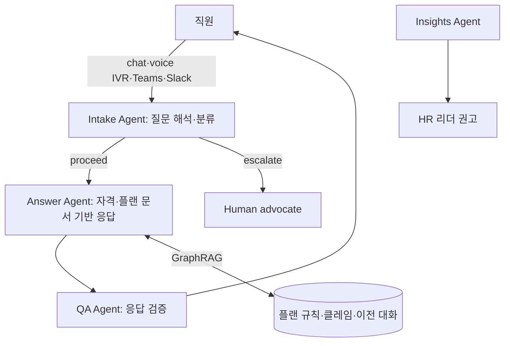

## Summary

Businessolver는 **US 복리후생 어드민 SaaS 벤더**로, 자체 AI 엔진 **Sofia**를 2025년 7월 **agentic framework**로 확장. ⚠️ 벤더 주장: 4개 specialist agent (**Intake / Answer / QA / Insights**) — Intake는 질문 해석·분류(clarify·escalate·deflect·proceed 판단), Answer는 플랜·자격 문서 기반 응답, QA는 응답 품질 검증, Insights는 HR 리더용 데이터 기반 권고. GraphRAG 통합, 음성(IVR) 지원, Teams·Slack 채널. [[sources/businessolver-sofia-agentic-2025-07.md]] ⚠️ 벤더 주장: Answer Agent 83% 7일+ 해결률, 연 1.7M+ 고유 질문; 2024 AE(annual enrollment) 기준 전체 채팅 95% Sofia 처리, 콜 볼륨 17% 감소 [[sources/businessolver-ae-2024-highlights.md]]; 2025년 마감 기준 client NPS 83·retention 97%, 당일 해결 90%, 고유 채팅 2.1M·사용자 19M. [[sources/businessolver-2025-results-2026-01.md]] (2026-09-27 grounding 점검: 종전 "3개 agent·Intake Agent = 문서 검증", "62퍼센트·92퍼센트·7M minutes·4.25/5·52퍼센트·$3M" 수치는 인용 소스에 없어 정정·제거 — Contradictions 참조.)

## Problem / Why (도입 배경)

- 벤더 제품이므로 특정 기업의 도입 배경은 고객별 상이. 🚫 일반론 표기: 아래는 US 복리후생 어드민의 일반적 pain point
- **Before**: ❓ baseline 미공개 — 🚫 일반론: 미국 employer의 연 1회 annual enrollment 시즌에 콜센터 문의 급증, 같은 질문 반복
- **Pain point**: ⚠️ 벤더 주장: 콜센터 대기·복잡한 메뉴 탐색 없이 답을 얻는 "더 지능적인 front door" 필요; HR 리더에게 데이터 기반 권고 제공. [[sources/businessolver-sofia-agentic-2025-07.md]]
- **Trigger**: ⚠️ 벤더 주장: 2023년 Sofia에 cognitive search·다중 질문 처리·ChatGPT 연동 추가 → 2025-07 agentic 프레임워크 확장. [[sources/businessolver-ae-2024-highlights.md]] [[sources/businessolver-sofia-agentic-2025-07.md]]
- 비교 reference: [[moderna-benefits-equity-gpts]]는 single-tenant Custom GPT, Sofia는 multi-tenant SaaS

## Solution Architecture

### A. Process (프로세스)

- **Before**: _미공개 (not disclosed)_ — 🚫 일반론: 직원이 전화·portal로 문의 → 상담원이 응답
- **After (⚠️ 벤더 발표 architecture, [[sources/businessolver-sofia-agentic-2025-07.md]])**:
  1. 직원이 chat·voice(IVR)·Teams·Slack 등으로 문의
  2. **Intake Agent**: 대화 워크플로의 첫 관문 — 질문을 해석하고 성격·긴급도에 따라 clarify / escalate / deflect / proceed 판단
  3. **Answer Agent**: Sofia 지식베이스에 사전 적재된 자격·플랜 문서를 읽어 응답
  4. **QA Agent**: 모든 응답의 사실 정확성·명확성·관련성 검증
  5. **Insights Agent**: HR 리더에게 데이터 기반 전략 권고 (Benefitsolver 생태계)
  6. 음성: 개인화 IVR 메뉴·예측 프롬프트·지능형 triage로 콜센터의 "더 지능적인 front door" 역할
  (종전 "Intake Agent = QLE 증빙 문서 OCR·검증" 서술은 소스 오독 — Intake Agent는 질문 분류 역할. 문서 검증 기능은 인용 소스에 없음)
- **HITL**: ⚠️ 벤더 주장: Intake Agent가 escalate 판단 → 인간 상담원(advocate) 연결. [[sources/businessolver-sofia-agentic-2025-07.md]] 2024 AE에서 채팅의 5%만 인간 상담원 요청. [[sources/businessolver-ae-2024-highlights.md]]
- **Frequency**: ⚠️ 벤더 주장: 연중 상시(24/7 — 업무시간 외 채팅 1/3 이상) + annual enrollment 시즌 피크. [[sources/businessolver-ae-2024-highlights.md]]
- **Scope of autonomy**: ⚠️ 벤더 주장: chat 응답 자율 처리 + escalate 판단; HR 권고는 recommend-only. [[sources/businessolver-sofia-agentic-2025-07.md]]

### B. System & Infrastructure (시스템·인프라)

- **Core platform**: ⚠️ 벤더 주장: Benefitsolver 생태계 (SaaS). [[sources/businessolver-sofia-agentic-2025-07.md]] hyperscaler _미공개_
- **AI 시스템 배치**: ⚠️ 벤더 주장: Sofia — Businessolver 자체 AI 엔진, platform 내장. [[sources/businessolver-sofia-agentic-2025-07.md]] 외부 HRIS 연동 매트릭스 _미공개_
- **사용자 접점**: ⚠️ 벤더 주장: chat, 음성(IVR — 개인화 메뉴·예측 프롬프트), Teams·Slack. [[sources/businessolver-sofia-agentic-2025-07.md]]
- **인증**: _미공개 (not disclosed)_
- **AI 안전성**: ⚠️ 벤더 주장: "industry-leading AI safeguards" (보도자료 제목) — 구체 guardrail 수·explainability·latency 수치는 인용 소스에 없어 _미공개_. [[sources/businessolver-sofia-agentic-2025-07.md]]

### C. Data (데이터)

- **입력 데이터**: ⚠️ 벤더 주장: Sofia 지식베이스에 사전 적재된 자격(eligibility)·플랜 문서; GraphRAG로 플랜 규칙·클레임 데이터·이전 대화 연결. [[sources/businessolver-sofia-agentic-2025-07.md]] QLE 증빙 문서·transcript 축적 여부 _미공개_
- **데이터 규모**: ⚠️ 벤더 주장: 연 1.7M+ 고유 질문 [[sources/businessolver-sofia-agentic-2025-07.md]]; 2025년 고유 채팅 2.1M, 사용자 19M. [[sources/businessolver-2025-results-2026-01.md]]
- **모델 구조**: ⚠️ 벤더 주장: GraphRAG(graph-enhanced RAG) 통합 — 1.4초 내 context-aware 응답. [[sources/businessolver-sofia-agentic-2025-07.md]] 분류기 등 세부 _미공개_
- **Data governance**: _미공개 (not disclosed)_ (HIPAA·SOC2 등 인증 여부는 인용 소스에 없음)

### D. Model (모델)

- **Foundation model**: _미공개 (not disclosed)_ — ⚠️ 벤더 주장: 2023년 ChatGPT 연동 추가. [[sources/businessolver-ae-2024-highlights.md]] 현재 underlying LLM provider _미공개_
- **Customization**: ⚠️ 벤더 주장: GraphRAG (플랜 규칙·클레임·대화 그래프). [[sources/businessolver-sofia-agentic-2025-07.md]] fine-tuning 여부 _미공개_
- **Guardrails**: ⚠️ 벤더 주장: QA Agent가 모든 응답의 정확성·명확성·관련성 검증. [[sources/businessolver-sofia-agentic-2025-07.md]] (종전 "27개 safeguard·SHAP·50ms" 수치는 인용 소스에 없어 제거)
- **Orchestration**: ⚠️ 벤더 주장: 자체 agentic framework (Intake/Answer/QA/Insights 4 specialist). [[sources/businessolver-sofia-agentic-2025-07.md]]

### E. Organization & Team (조직·팀 구조)

- **오너십**: Businessolver 벤더 — 고객사(employer)는 SaaS 구독자
- **참여 역할**: _미공개 (not disclosed)_
- **거버넌스**: _미공개 (not disclosed)_ — 외부 governance 인증 _미공개_

### F. Diagrams (도식)

```mermaid
flowchart TB
    Emp[직원] -->|chat·voice IVR·Teams·Slack| Intake[Intake Agent: 질문 해석·분류]
    Intake -->|proceed| Answer[Answer Agent: 자격·플랜 문서 기반 응답]
    Intake -->|escalate| HR[Human advocate]
    Answer --> QA[QA Agent: 응답 검증]
    QA --> Emp
    Answer <-->|GraphRAG| KB[(플랜 규칙·클레임·이전 대화)]
    Insights[Insights Agent] --> HRAdmin[HR 리더 권고]
```

범례: 모든 연결은 ⚠️ 벤더 발표 기반 [[sources/businessolver-sofia-agentic-2025-07.md]]. Tier 1·2 독립 검증 없음. 문서 검증·HRIS 연동 노드는 소스에 없어 제거.

## Impact / Metrics (기대효과)

### 기대효과 요약
복리후생 어드민의 **agentic 자동화** (질문 분류·문서 기반 응답·QA·HR 인사이트). ⚠️ 모든 metric은 Businessolver 자사 발표 — Forrester·Gartner 등 Tier 1 독립 검증 0건.

| 지표 | 값 | 출처 | 성격 |
|---|---|---|---|
| Sofia 채팅 처리율 (2024 AE) | **95%** (5%만 인간 상담원 요청) | [[sources/businessolver-ae-2024-highlights.md]] | ⚠️ 벤더 주장 |
| 업무시간 외 채팅 비중 | **1/3 이상** | [[sources/businessolver-ae-2024-highlights.md]] | ⚠️ 벤더 주장 |
| 콜 볼륨 (2023 vs 2022) | **17% 감소** (가입자 11% 증가에도) | [[sources/businessolver-ae-2024-highlights.md]] | ⚠️ 벤더 주장 |
| 평균 응답 속도 (통화 자동 요약) | **48% 개선** vs 2022 | [[sources/businessolver-ae-2024-highlights.md]] | ⚠️ 벤더 주장 |
| Answer Agent 7일+ 해결률 | **83%**, 연 **1.7M+** 고유 질문 | [[sources/businessolver-sofia-agentic-2025-07.md]] | ⚠️ 벤더 주장 |
| **Client NPS (2025 마감)** | **83** | [[sources/businessolver-2025-results-2026-01.md]] | ⚠️ 벤더 주장 |
| **Client retention (2025 마감)** | **97%** | [[sources/businessolver-2025-results-2026-01.md]] | ⚠️ 벤더 주장 |
| 직원 이슈 당일 해결 (2025) | **90%** | [[sources/businessolver-2025-results-2026-01.md]] | ⚠️ 벤더 주장 |
| Sofia 고유 채팅·사용자 (2025) | **2.1M** (전년 대비 5.3%↑), 사용자 **19M** | [[sources/businessolver-2025-results-2026-01.md]] | ⚠️ 벤더 주장 |
| Document 자동 검증율·콜타임 절감 minutes·만족도·평균 고객사 절감액 | _미공개_ | — | (종전 수치 근거 미확보 — 2026-09-27 grounding 점검) |

## Governance & Risk

- ⚠️ **모든 metric은 ⚠️ 벤더 주장** — Tier 1 (Forrester·Gartner·Deloitte·Bersin) 독립 검증 0건. 클라이언트 인용 시 "Businessolver 자사 발표" 명시 필수
- ⚠️ Sofia underlying foundation model 미공개 → AI governance 평가 시 model provenance·비용·risk 추적 어려움
- ⚠️ 벤더 주장: QA Agent에 의한 응답 검증, "industry-leading AI safeguards" — 구체 내용 _미공개_. HIPAA·SOC2 등 인증 여부 인용 소스에 없음
- ⚠️ 한국 적용 시: US 복리후생 (FSA/HSA/HDHP/QLE) 구조 자체가 한국과 상이 — 직접 적용 불가, **multi-agent benefits admin pattern**만 reference 가치

## Contradictions

> [!note] 2026-09-27 grounding — 종전 본문의 "3개 specialist agent(Intake/Answer/Insights)"는 보도자료 raw 기준 4개(Intake/Answer/QA/Insights)로 정정. "Intake Agent = QLE 증빙 문서 OCR·검증"은 오독 — raw의 Intake Agent는 질문 해석·분류(clarify/escalate/deflect/proceed) 역할이며 문서 검증 기능은 인용 소스에 없음. "62퍼센트 문서 검증·92퍼센트 당일 해결·7M minutes·4.25/5·52퍼센트·$3M 절감"은 2024 highlights 블로그(95퍼센트 채팅 처리·17퍼센트 콜 감소·48퍼센트 응답 속도)에 없어 제거. "27개 guardrail·SHAP·50ms·HIPAA·SOC2·Workday/ADP/UKG 연동·SSO/RBAC·25년+ transcript·fine-tuning"은 인용 소스 3건에 없어 _미공개_ 처리. frontmatter `output:`의 "Intake Agent — 출생증명서·결혼증명서·QLE 증빙 검증"은 본 점검에서 손대지 않음 (수정 필요).

## Consulting Angle

- **복리후생 admin AI 대표 reference**: Sofia는 **단일 chatbot이 아닌 4-agent specialist 분할(Intake/Answer/QA/Insights)** — 한국 대기업의 EX·HR운영 카테고리에서 "ask HR 챗봇 단일 모델 vs specialist agent 분할" 논의 시 reference (⚠️ 벤더 주장)
- **Vs Moderna [[moderna-benefits-equity-gpts]]**: Moderna는 단일 GPT (Custom GPT × 2종), Sofia는 specialist agent 멀티. SaaS 벤더와 self-build의 차이
- **Vs Nayya [[nayya-benefits-decision-support]]**: Nayya는 **decision support** (어느 plan을 선택할지 추천), Sofia는 **operations** (선택 후 admin·Q&A) — 보완적 포지션
- **한국 적용**: 복지포인트 관리·flex benefit 정책 Q&A 등 한국 EX·HR운영 도메인에 **triage → answer → QA → insights 패턴** 적용 가능 (Intake = 질문 분류·에스컬레이션 판단, Answer = 정책 Q&A, QA = 응답 검증, Insights = 사용 패턴) — 문서 검증 기능은 소스 미확인이므로 제안하지 않음
- **거버넌스 reference**: QA Agent를 별도 두어 응답을 검증하는 구조(⚠️ 벤더 주장)는 한국 AI 기본법 고영향 AI 영향평가 deck에서 "응답 검증 레이어" 예시로 인용 가능 (단 자사 발표임 명시, 구체 guardrail 수치 미공개)
- **Watch list**: Forrester·Gartner의 Sofia evaluation report 발표 시 confidence 재조정
