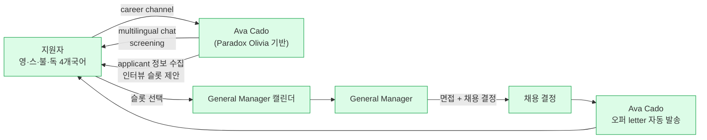

# Chipotle — "Ava Cado" (Paradox Olivia 기반) 대화형 채용 자동화

> ⚠ **소스 상태 업데이트 (2026-04-12)**: Tier 2 독립 소스 2건 추가 확보 — **HR Dive (2024-10-25)** + **CNBC (2025-07-28)**. CNBC 기사에서 **12일→3.5일 구체 수치**, **application completion rate 50%→85%** 등 기존 PR에 없던 신규 metric 확인. confidence 0.35→0.55. bias audit·편향 독립 검증은 여전히 부재.

## Summary

Chipotle Mexican Grill(3,500+ 레스토랑, 110,000+ 직원)이 2024년 10월 22일 공식 발표한 AI 채용 플랫폼. Paradox의 **대화형 AI 어시스턴트 Olivia** 기반이며, Chipotle는 이를 **"Ava Cado"**라는 자사 브랜딩으로 배포. North America + Europe 전 매장 대상으로 영·스·불·독 4개 언어 지원. **CHRO Ilene Eskenazi**가 press release에서 직접 quote 제공. ⚠️ 벤더+회사 공동 주장: **time-to-hire 75% 감소**.

## Problem / Why

- 매장 기반 고회전 인력 채용(식음료·retail)은 **지원자 수가 많고 매장별 분산**돼 있어, 전통적 ATS + 매장 매니저 수동 스크리닝이 병목
- 지원자의 단순 반복 질문(근무시간·시급·위치·교대)에 매니저가 시간 소비
- 우수 지원자가 **응답 지연으로 다른 곳에 가버리는 loss** — 시급 시장은 "먼저 연락한 곳이 승"
- **주의**: Chipotle 공식 problem statement는 본 wiki에 없음. 위는 food service 채용의 일반 맥락.

## Solution Architecture

### A. Process (프로세스) — Chipotle 공식 확인 기반 (2024-10-22 PR)

- **Before (As-is)**: _미공개_ (Chipotle의 이전 채용 플로우 세부)
- **After (To-be)** — ✅ Chipotle 공식 press release 확인 ([[chipotle-newsroom-ava-cado-2024-10]]):
  1. 지원자가 Chipotle 채용 채널에서 **"Ava Cado" 와 대화 시작** (multilingual chat — 영·스·불·독)
  2. Ava Cado가 **Candidate screening + applicant 정보 수집**
  3. Ava Cado가 **인터뷰 스케줄링** (매장 매니저와 연동)
  4. 매장 General Manager가 인터뷰 진행 + 채용 결정
  5. **Ava Cado가 채용 오퍼 전달** (offer letter 자동 발송)
- **Human-in-the-loop 지점**: **General Manager가 최종 채용 결정** — CHRO Eskenazi가 명시적으로 "freeing up more time for managers" 표현으로 확인
- **Trigger & Frequency**: 상시, 고볼륨
- **Scope of autonomy**: Screening·스케줄·오퍼 전달 자동, 채용 결정은 사람

_범례: 녹색 = Chipotle 공식 press release ([[chipotle-newsroom-ava-cado-2024-10]])에서 확인된 사실. 이제는 벤더 일반 플로우 추정이 아니라 회사 공식 프로세스._

### B. System & Infrastructure

- **Core HRIS**: _미공개_ — Chipotle이 Workday/Oracle/자체 구축 중 어느 것인지 공개 없음
- **AI 시스템 배치**: **Paradox 플랫폼** (별도 SaaS, HRMS 별도 layer)
- **배포 환경**: Paradox cloud (세부 cloud provider 미공개)
- **연동·통합**: 매장 매니저의 캘린더 및 ATS와의 통합 필요 — Paradox 일반 기능이나 Chipotle 특정 구현 ❓ 미공개
- **사용자 접점**: Olivia chatbot (web + text/SMS). 언어·모바일 지원 디테일 ❓ 미공개
- **인증·권한**: _미공개_

### C. Data (데이터)

- **입력 데이터 소스**: 지원자의 자연어 응답·text/SMS 메시지
- **데이터 규모**: _미공개_ (월간 지원자 수·대화 수)
- **전처리·정제**: _미공개_
- **학습 vs RAG vs In-context 구분**: Paradox의 대화 엔진 세부 미공개
- **데이터 거버넌스**: _미공개_
- **민감정보 처리**: _미공개_. 지원자 PII 처리·EEOC 준수 (미국 채용 법규)·retention 정책 공개 없음

### D. Model (모델)

- **Foundation model**: _미공개_ (Paradox는 자사 LLM·OpenAI 래핑·하이브리드 중 어느 것인지 공개 안 함)
- **모델 유형**: 대화형 NLU + intent classification + 일정 관리 agent
- **제공 방식**: Paradox 상용 SaaS
- **커스터마이징 기법**: _미공개_
- **평가·가드레일**: **채용 AI는 미국 NYC LL144·Colorado AI Act·EEOC 가이드라인 등 규제 대상** — 편향 감사(adverse impact)·disclosure 요구사항에 대한 Paradox의 대응 공개 없음. Chipotle specific disclosure도 ❓ 미공개
- **비용·성능 지표**: _미공개_

### E. Organization & Team (조직·팀 구조)

- **Chipotle 측 오너십**: ✅ **Ilene Eskenazi, Chief Human Resources Officer** ([[chipotle-newsroom-ava-cado-2024-10]]) — 공식 press release 발언자
- **Eskenazi 공식 Quote**: *"Paradox operates as if we've hired additional admin support for all restaurants, freeing up more time for managers."*
- **Paradox 측 구현 팀**: _미공개_
- **거버넌스**: _미공개_. press release에 bias audit·EEOC compliance 언급 **없음**
- **변화관리 (매장 매니저 교육·수용)**: 암묵적으로 General Manager가 "operations and guest hospitality" 에 더 집중하도록 재설계됐다는 narrative — 구체 교육·이전 프로세스 미공개
- **Rollout 규모 및 일정**: ✅ **3,500+ restaurants (North America + Europe), 2024년 10월 완료 목표** ([[chipotle-newsroom-ava-cado-2024-10]])

### F. Diagrams
- Process flowchart 1개 (A 섹션, 일반 Paradox 플로우에서 유추). 다른 도식은 Chipotle-specific 정보 부재로 생략.

---

**Fact 품질 요약 (2026-04-12 업데이트 — Tier 2 소스 추가)**:
- ✅ Fact (CNBC Tier 2 독립 취재 확인): **12일→3.5일** time-to-hire, **50%→85%** application completion rate, 연 300개 신규 매장·9,000~10,000명 채용 수요
- ✅ Fact (Chipotle 공식 + Paradox + HR Dive 교차 확인): 플랫폼명 "Ava Cado", Paradox vendor, 3,500+ restaurants, 4개국어 지원, CHRO Eskenazi quote, process 단계
- ⚠️ 자사 보고: 지원자 수 "dramatically increased" (구체 수치 미공개)
- ❓ 미공개: 기술 스택 세부·bias 감사·비용·채용 품질(retention·performance) 후속 데이터

## Impact / Metrics (기대효과)

### 기대효과 요약
Before: 12일 (지원→채용 준비) → After: 3.5일 (75% 감소, CNBC 독립 취재 확인). Application completion rate 50%→85%. 3,500+ 매장, 4개국어 대상 전사 rollout 완료(Fact). 연 9,000~10,000명 신규 채용 수요 대응.

| 지표 | 값 | 출처 | 성격 |
|---|---|---|---|
| Time-to-hire 감소 | **"up to 75%"** (12일→3.5일) | [[cnbc-chipotle-ava-cado-2025-07]] (CNBC) + [[chipotle-newsroom-ava-cado-2024-10]] | ✅ Fact (Tier 2 CNBC 독립 취재로 구체 수치 확인) |
| Application completion rate | **50% → 85%** (+35pp) | [[cnbc-chipotle-ava-cado-2025-07]] (CNBC) | ✅ Fact (CNBC 독립 취재, 기존 PR에 없던 신규 metric) |
| 지원자 수 변화 | **"dramatically increased"** | [[cnbc-chipotle-ava-cado-2025-07]] (CNBC) | ⚠️ 자사 보고 (구체 수치 미공개) |
| 신규 채용 수요 | 연 **300개 신규 레스토랑** × 30명 = **9,000~10,000명/년** | [[cnbc-chipotle-ava-cado-2025-07]] (CNBC) | ✅ Fact |
| 다국어 지원 규모 | **4개 언어** (영·스·불·독) | [[chipotle-newsroom-ava-cado-2024-10]] | ✅ Fact |
| Rollout 규모 | **3,500+ restaurants** (NA + Europe) | [[chipotle-newsroom-ava-cado-2024-10]] | ✅ Fact |

**주의**: "75% 감소"를 제안서에 그대로 쓰면 클라이언트가 반드시 물어볼 것: "75%의 기준은? 이전이 얼마였나? 측정 기간은?" — **전부 답할 수 없음**. 단독 인용 금지.

## Governance & Risk

- **채용 AI 규제**:
  - 미국 NYC LL144 (2023~): bias audit 요구, annual 공시. Paradox·Chipotle 대응 여부 ❓ 미공개
  - Colorado AI Act (2026~): high-risk 시스템 disclosure 의무. 대응 여부 ❓ 미공개
  - EEOC 가이드라인: adverse impact 모니터링 의무. Chipotle-specific 감사 결과 ❓ 미공개
- **Bias 리스크**: 대화형 AI가 **언어·억양·지역별 영어 능력** 등으로 특정 그룹에 불리할 수 있음. 공개된 감사 **0건**
- **지원자 UX 리스크**: AI가 "인간 대체"로 느껴지면 브랜드 이미지 훼손 (특히 Chipotle 같은 브랜드 감수성 있는 회사)
- **한국 적용 시**: 개인정보보호법·채용절차공정화법 대응 필요 — Paradox가 한국 규정에 얼마나 준비됐는지 ❓ 미공개

## Contradictions
_없음 — 단일 소스_

## Consulting Angle

- **사용처**:
  - **고볼륨 시급직 채용** 컨설팅의 대표 벤치마크 (식음료·소매·hospitality)
  - 한국 적용: 편의점·카페·delivery 프랜차이즈 대형사 대상 제안 시
- **제시 시 주의점**:
  - "75% 감소" 수치는 **벤더 주장임을 명시** — 단독 인용 시 클라이언트 pushback 불가피
  - Chipotle 공식 case study가 아니라 **Paradox 벤더 사이트의 요약**임을 고지
  - 정규직·지식노동자 채용에는 fit이 다름 (적용 범위 제한)
- **핵심 교훈 (유효한 것)**:
  1. **고볼륨 시급직에는 "응답 속도 = 채용 성공"** — AI가 가장 큰 레버를 제공하는 지점
  2. **매장 매니저 캘린더 연동**이 구현 핵심 — HR tech만으론 부족, 운영 시스템과의 통합 필수
  3. **규제 대응이 제품 선정 기준의 first filter가 돼야 함** — 벤더의 bias audit·disclosure 준비 상태 확인
- **반면교사 질문**:
  1. Chipotle의 "75%"가 사실이라 해도, **그 75%가 어디에서 왔는가?** (대기 시간 단축? 매니저 시간 절약? 지원자 이탈률 감소? → 벤더 주장은 이를 분리하지 않음)
  2. 채용 후 **유지율·퍼포먼스**에는 어떤 영향? (빠른 채용이 반드시 좋은 채용은 아님)
  3. **AI 스크리닝에서 탈락한 후보자**에게 공정한 기회가 주어졌는가? (adverse impact 감사)

## 다음 ingest 우선순위

- Chipotle 공식 press release·IR 자료에서 Paradox 언급 찾기
- HR Dive / SHRM / Restaurant Business Magazine 독립 커버리지 확보
- Paradox의 bias audit 공시 여부 확인 (NYC LL144 준수 문서 존재 여부)
