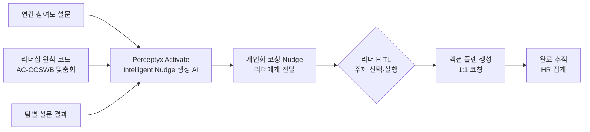

## Summary

Arca Continental Coca-Cola Southwest Beverages (AC-CCSWB, 미국 최대 코카콜라 보틀러 중 하나, 9,000+ 직원)이 Perceptyx Activate의 AI Intelligent Nudges를 통해 리더들에게 참여도 조사 결과 기반의 개인화 코칭 프롬프트를 제공했다. 2020~2025년 5년간 리더십 지수가 65% → 89.3%로 상승하고, 2024 연간 설문 주기에서 93%의 리더가 1,191개 액션 플랜을 생성했다. 2025 Perceptyx EX Impact Award 수상 + 2025 Coca-Cola Candler Cup(글로벌 보틀러 최우수상) 수상.

## Problem / Why

- 매장·물류 현장 관리자들이 데이터를 해석하는 데 시간이 부족 → 참여도 데이터가 행동으로 연결되지 않음
- 참여도 조사의 3대 개선 드라이버 확인: 정기 피드백, 명확한 커뮤니케이션, 경력 성장
- 리더십 원칙 실천 일관성 부족 → 리더십 지수 정체

## Solution Architecture

### A. Process (프로세스)

- **Before (As-is)**: 연간 설문 → 데이터 취합 → HR 분석 → 리더 브리핑 → 자체 액션 플랜 수립 (완결율 저조)
- **After (To-be)**:
  1. 연간 설문 완료
  2. AI가 각 리더의 팀 결과 + AC-CCSWB 리더십 원칙·코드 기반으로 개인화 Intelligent Nudge 생성
  3. 리더가 본인 팀 피드백과 가장 관련 높은 Nudge 주제 선택 (개인화)
  4. 1:1 코칭·개발 집중 → 액션 플랜 자동 추적
- **Human-in-the-loop (HITL) 지점**: 리더가 Nudge 주제 선택 + 액션 플랜 내용 확정; HR은 집계 현황 모니터링
- **Trigger & Frequency**: 연간 설문 완료 후 + 지속적 Nudge 전달 (adhoc/ongoing)
- **Scope of autonomy**: AI = recommend(Nudge 생성·주제 추천); 리더 = approve-then-act

범례: 실선 = Perceptyx EX Impact Award 케이스 스터디에서 확인

### B. System & Infrastructure (시스템·인프라)

- **Core HRIS**: _미공개 (not disclosed)_
- **AI 시스템 배치**: Perceptyx 플랫폼 SaaS (Activate 모듈)
- **배포 환경**: _미공개 (not disclosed)_
- **연동·통합**: _미공개 (not disclosed)_
- **사용자 접점**: 리더 웹 포털 (Nudge 수신·액션 플랜 작성)
- **데이터 기반**: 1.5억+ 직원 응답 데이터 (Perceptyx 전체 고객 누적) 기반 AI 모델

### C. Data (데이터)

- **입력**: 연간 참여도 설문 결과 (팀별), 리더십 원칙·코드 문서, 직전 년도 Nudge 이력
- **데이터 규모**: 9,000+ 직원; 1,191개 액션 플랜, 1,871개 활동 (2024 사이클)
- **학습 vs RAG**: _미공개 (not disclosed)_
- **거버넌스**: _미공개 (not disclosed)_

### D. Model (모델)

- **Foundation model**: _미공개 (not disclosed)_ — Perceptyx Activate 내부 AI 모델
- **Model 유형**: NLP (설문 텍스트 분석) + 추천(Nudge 개인화)
- **데이터 기반**: Perceptyx 누적 1.5B+ 직원 응답 학습 (⚠️ 벤더 주장)

### E. Organization & Team (조직·팀 구조)

- **오너십**: HR 주도
- **참여 역할**: HR, 현장 관리자(리더)
- **변화관리**: 리더 대상 1:1 코칭·리더십 집중 개발 병행
- **파트너**: Perceptyx (플랫폼 + 컨설팅)

## Impact / Metrics (기대효과)

### 기대효과 요약
AI Nudge 기반 리더십 개발로 리더십 지수 65%에서 89.3%로 향상(5년간), 리더 액션 플랜 생성율 93% 달성 (자사 보고 기반).

| 지표 | 기간 | 결과 | 신뢰도 |
|---|---|---|---|
| 리더십 지수 | 2020→2025 (5년) | 65% → 89.3% (+24.3pp) | ⚠️ 자사 보고 |
| 리더십 지수 전년 대비 상승 | 최근 1년 (Activate Nudge 적용 후) | +1pp | ⚠️ 자사 보고 |
| 리더 액션 플랜 생성율 | 2024 사이클 | 93% (1,191개 플랜, 1,871개 활동) | ⚠️ 자사 보고 |
| 수상 | 2025 | Coca-Cola Candler Cup (글로벌 최우수 보틀러) | ✅ Fact |

## Governance & Risk

- 개인별 리더십 점수와 AI Nudge의 편향 가능성: 특정 리더십 스타일을 과대/과소 표현하는 AI 추천 리스크 → 미공개
- 설문 익명성 vs. 팀 단위 분석 시 소규모 팀에서의 개인 식별 위험 → 미공개

## Contradictions

없음.

## Consulting Angle

- **참여도 조사 투자 ROI 논거**: "설문만 하고 액션 안 함"의 전형적 실패 패턴을 AI Nudge가 깬 사례 — 설문 → 행동 완결율 93%는 벤치마크로 활용 가능
- **현장 관리자 대상**: 매장·물류 등 시간 부족 현장 관리자에게 AI 요약·코칭 제공 — 리테일·물류 클라이언트에 적합한 아키텍처
- **한국 대기업 적용**: 연간 인재개발 시스템과 연계, 팀장 리더십 개발 프로그램 AI화 가능성 — MBO·OKR 피드백 자동화와 연결 검토
- **파생 질문**: "5년 누적 상승분에서 Activate AI의 기여 vs. 기타 개발 개입 효과는 어떻게 분리하는가?" — 인과추론 이슈로 추가 연구 가치 있음
