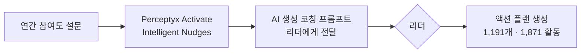

## Summary

Arca Continental Coca-Cola Southwest Beverages (AC-CCSWB, 미국 최대 코카콜라 보틀러 중 하나, 9,000+ 직원)이 Perceptyx Activate의 AI Intelligent Nudges를 통해 리더들에게 참여도 조사 결과 기반의 개인화 코칭 프롬프트를 제공했다. 2020~2025년 5년간 리더십 지수가 65% → 89.3%로 상승하고, 2024 연간 설문 주기에서 93%의 리더가 1,191개 액션 플랜을 생성했다. 2025 Perceptyx EX Impact Award 수상 + 2025 Coca-Cola Candler Cup(글로벌 보틀러 최우수상) 수상.

## Problem / Why (도입 배경)

- **Before**: ⚠️ 자사 보고: 리더십 지수 favorability 65% (2020). [[sources/perceptyx-ex-impact-awards-2025.md]]
- **Pain point**: ⚠️ 자사 보고: retention과 workforce respect 과제에 직면 → 리더십·문화 가치를 내재화하는 multi-tiered 접근 필요. [[sources/perceptyx-ex-impact-awards-2025.md]]
- **Trigger**: ❓ 미공개 (종전 "3대 개선 드라이버" 서술은 소스에 없어 제거 — 2026-09-27 grounding 점검)

## Solution Architecture

### A. Process (프로세스)

- **Before (As-is)**: _미공개 (not disclosed)_ — 소스는 도입 전 프로세스를 기술하지 않음
- **After (To-be)** (⚠️ 자사 보고, [[sources/perceptyx-ex-impact-awards-2025.md]]):
  1. 연간 참여도 설문 실시 (2024 annual survey cycle)
  2. AI-assisted Intelligent Nudges가 참여도 결과 기반으로 리더에게 actionable behavior를 안내
  3. 리더가 액션 플랜 생성 — 2024 사이클 1,191개 플랜·1,871개 활동, 리더 93% 참여
  (종전 "리더십 원칙·코드 기반 개인화", "Nudge 주제 선택", "1:1 코칭" 단계는 소스에 없어 제거)
- **Human-in-the-loop (HITL) 지점**: ⚠️ 자사 보고: 리더가 액션 플랜 생성. [[sources/perceptyx-ex-impact-awards-2025.md]] HR 검토 절차 _미공개_
- **Trigger & Frequency**: ⚠️ 자사 보고: 연간 설문 사이클. [[sources/perceptyx-ex-impact-awards-2025.md]] Nudge 전달 주기 _미공개_
- **Scope of autonomy**: AI = recommend(Nudge); 리더 = act (액션 플랜)

```mermaid
flowchart LR
    Survey[연간 참여도 설문] --> AI[Perceptyx Activate\nIntelligent Nudges]
    AI --> Nudge[AI 생성 코칭 프롬프트\n리더에게 전달]
    Nudge --> Leader{리더}
    Leader --> Plan[액션 플랜 생성\n1,191개 · 1,871 활동]
```
범례: 실선 = [[sources/perceptyx-ex-impact-awards-2025.md]] (Perceptyx 벤더 페이지) 확인. 리더십 원칙 입력·주제 선택·HR 집계 노드는 소스에 없어 제거.

### B. System & Infrastructure (시스템·인프라)

- **Core HRIS**: _미공개 (not disclosed)_
- **AI 시스템 배치**: ⚠️ 벤더 주장: Perceptyx Activate (Intelligent Nudges) — 별도 SaaS. [[sources/perceptyx-ex-impact-awards-2025.md]]
- **배포 환경**: _미공개 (not disclosed)_
- **연동·통합**: _미공개 (not disclosed)_
- **사용자 접점**: _미공개 (not disclosed)_
- **데이터 기반**: _미공개 (not disclosed)_ (종전 "1.5억명+ 직원 응답 데이터" 수치 근거 미확보 — 2026-09-27 grounding 점검)

### C. Data (데이터)

- **입력**: ⚠️ 벤더 주장: 참여도 설문 결과 기반 AI 생성 코칭 프롬프트. [[sources/perceptyx-ex-impact-awards-2025.md]] 리더십 원칙 문서·Nudge 이력 등 세부 입력 _미공개_
- **데이터 규모**: ⚠️ 자사 보고: 9,000+ associates; 1,191개 액션 플랜·1,871개 활동 (2024 연간 설문 사이클). [[sources/perceptyx-ex-impact-awards-2025.md]]
- **학습 vs RAG**: _미공개 (not disclosed)_
- **거버넌스**: _미공개 (not disclosed)_

### D. Model (모델)

- **Foundation model**: _미공개 (not disclosed)_
- **Model 유형**: ⚠️ 벤더 주장: 참여도 결과 기반 AI 생성 코칭 프롬프트(Intelligent Nudges). [[sources/perceptyx-ex-impact-awards-2025.md]] 모델 구성 _미공개_
- **데이터 기반**: _미공개 (not disclosed)_ (종전 "1.5B명+ 직원 응답 학습" 수치 근거 미확보 — 2026-09-27 grounding 점검)

### E. Organization & Team (조직·팀 구조)

- **오너십**: _미공개 (not disclosed)_
- **참여 역할**: ⚠️ 자사 보고: 리더 93%가 액션 플랜 생성. [[sources/perceptyx-ex-impact-awards-2025.md]] HR 역할 세부 _미공개_
- **변화관리**: _미공개 (not disclosed)_
- **파트너**: ⚠️ 벤더 주장: Perceptyx (플랫폼). [[sources/perceptyx-ex-impact-awards-2025.md]] 컨설팅 관여 _미공개_

## Impact / Metrics (기대효과)

### 기대효과 요약
AI Nudge 기반 리더십 개발로 리더십 지수 65%에서 89.3%로 향상(5년간), 리더 액션 플랜 생성율 93% 달성 (자사 보고 기반).

| 지표 | 기간 | 결과 | 신뢰도 |
|---|---|---|---|
| 리더십 지수 favorability | 2020→2025 (5년) | 65% → 89.3% (+24.3pp) | ⚠️ 자사 보고 [[sources/perceptyx-ex-impact-awards-2025.md]] |
| 리더십 지수 전년 대비 상승 | 최근 1년 | _미공개_ | (종전 "+1pp" 수치 근거 미확보 — 2026-09-27 grounding 점검) |
| 리더 액션 플랜 생성율 | 2024 사이클 | 93% (1,191개 플랜, 1,871개 활동) | ⚠️ 자사 보고 [[sources/perceptyx-ex-impact-awards-2025.md]] |
| 수상 | 2025 | Coca-Cola Candler Cup (글로벌 보틀러 excellence award), Perceptyx EX Impact Award | ⚠️ 벤더 페이지 전달 [[sources/perceptyx-ex-impact-awards-2025.md]] |

## Governance & Risk

- 개인별 리더십 점수와 AI Nudge의 편향 가능성: 특정 리더십 스타일을 과대/과소 표현하는 AI 추천 리스크 → 미공개
- 설문 익명성 vs. 팀 단위 분석 시 소규모 팀에서의 개인 식별 위험 → 미공개

## Contradictions

> [!note] 2026-09-27 grounding — 종전 본문의 "1.5억명+(1.5B명+) 직원 응답 데이터 기반 AI 모델", "전년 대비 +1pp", "3대 개선 드라이버(정기 피드백·명확한 커뮤니케이션·경력 성장)", "리더십 원칙·코드 기반 개인화·Nudge 주제 선택·1:1 코칭"은 유일한 인용 소스(Perceptyx EX Impact Awards 페이지) raw에 없어 제거·_미공개_ 처리. 모든 수치는 벤더 페이지에 게재된 고객 자사 보고.

## Consulting Angle

- **참여도 조사 투자 ROI 논거**: "설문만 하고 액션 안 함"의 전형적 실패 패턴을 AI Nudge가 깬 사례 — 설문 → 행동 완결율 93%는 벤치마크로 활용 가능
- **현장 관리자 대상**: 매장·물류 등 시간 부족 현장 관리자에게 AI 요약·코칭 제공 — 리테일·물류 클라이언트에 적합한 아키텍처
- **한국 대기업 적용**: 연간 인재개발 시스템과 연계, 팀장 리더십 개발 프로그램 AI화 가능성 — MBO·OKR 피드백 자동화와 연결 검토
- **파생 질문**: "5년 누적 상승분에서 Activate AI의 기여 vs. 기타 개발 개입 효과는 어떻게 분리하는가?" — 인과추론 이슈로 추가 연구 가치 있음
