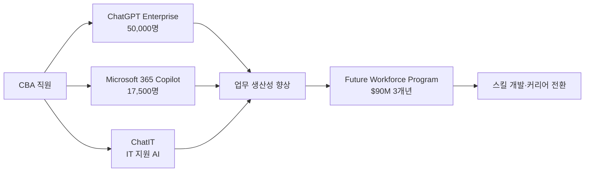

## Summary

Commonwealth Bank of Australia(CBA)는 OpenAI ChatGPT Enterprise를 50,000명 직원에게 배포하고, Microsoft 365 Copilot을 17,500명에게 제공하며 AI 역량 구축을 전사적으로 추진하고 있다. ✅ **Fact** 2026년 2월에는 $90M(호주 달러) 3개년 "Future Workforce Program"을 발표하여 직원 스킬 개발과 커리어 전환 지원을 목표로 한다. 다만 AI 챗봇으로 45명 고객 서비스 직원을 대체하려다 노조 압박으로 결정을 번복한 사례도 주목된다. [[sources/openai-cba-case-study.md]] [[sources/cba-future-workforce-90m-2026.md]]

## Problem / Why

CBA는 오세아니아 최대 은행으로서 AI를 통한 운영 효율화와 동시에 대규모 AI 역량 구축이 필요했다. AI가 일부 업무를 자동화함에 따라 직원들의 역할 전환을 지원하고 AI 시대 경쟁력을 유지하는 것이 전략적 과제다.

## Solution Architecture

> **최우선 원칙**: 이 섹션은 **공개된 사실만** 기록한다.

### A. Process (프로세스)

- **Before (As-is)**: 전통적 IT 지원 프로세스, 수동 데이터 분석, 역량 개발 개인 주도.
- **After (To-be)**:
  1. ✅ **Fact** ChatGPT Enterprise — 50,000명 배포로 AI 역량 구축. [[sources/openai-cba-case-study.md]]
  2. ✅ **Fact** Microsoft 365 Copilot — 17,500명 배포. 84%의 10,000명 사용자가 "Copilot 없이 돌아가기 싫다"고 응답. [[sources/microsoft-cba-copilot-case-study.md]]
  3. ✅ **Fact** ChatIT — Microsoft Teams 기반 AI IT 지원 어시스턴트 (Azure + Copilot Studio 기반). [[sources/microsoft-cba-copilot-case-study.md]]
  4. ✅ **Fact** $90M(AUD) 3개년 Future Workforce Program 발표 (2026-02). [[sources/cba-future-workforce-90m-2026.md]]
- **Human-in-the-loop**: 최종 금융 결정·고객 에스컬레이션은 인간 처리.
- **Trigger & Frequency**: 일상 업무 중 수시(on-demand). AI 역량 교육은 체계적 프로그램.
- **Scope of autonomy**: 업무 보조(recommend) 수준. 일부 IT 지원은 자동 처리.

범례: 실선 = [[sources/openai-cba-case-study.md]] [[sources/microsoft-cba-copilot-case-study.md]] [[sources/cba-future-workforce-90m-2026.md]] 확인.

### B. System & Infrastructure (시스템·인프라)

- **AI 플랫폼**: ✅ **Fact** OpenAI ChatGPT Enterprise + Microsoft 365 Copilot + Microsoft Azure (ChatIT용). [[sources/openai-cba-case-study.md]] [[sources/microsoft-cba-copilot-case-study.md]]
- **Core HRIS**: _미공개 (not disclosed)_
- **데이터 마이그레이션**: ✅ **Fact** 61,000개 이상 데이터 파이프라인을 AWS로 마이그레이션 완료 (2024~2025). [[sources/openai-cba-case-study.md]]
- **사용자 접점**: ✅ **Fact** Microsoft Teams (ChatIT). [[sources/microsoft-cba-copilot-case-study.md]]

### C. Data (데이터)

- **데이터 규모**: ✅ **Fact** 61,000+ 데이터 파이프라인 AWS 마이그레이션. [[sources/openai-cba-case-study.md]]
- **직원 AI 역량 지표**: ✅ **Fact** 직원 참여도 85% (2025-05 기준). [[sources/microsoft-cba-copilot-case-study.md]]
- **데이터 거버넌스**: _미공개 (not disclosed)_ — 호주 금융 규제 환경.

### D. Model (모델)

- **Foundation model**: ✅ **Fact** OpenAI GPT 기반(ChatGPT Enterprise), Microsoft AI(Copilot). [[sources/openai-cba-case-study.md]]
- **ChatIT**: ✅ **Fact** Microsoft Azure + Copilot Studio 기반, 내부 지식베이스 연동. [[sources/microsoft-cba-copilot-case-study.md]]

### E. Organization & Team (조직·팀 구조)

- **오너십**: HR + IT 공동 주도.
- **팀 규모·기간**: _미공개 (not disclosed)_
- **거버넌스 체계**: _미공개 (not disclosed)_

## Impact / Metrics (기대효과)

### 기대효과 요약
Before: _미공개 (Copilot 도입 전 반복 업무 소요 시간)_ → After: ⚠️ 자사 보고 초기 도입자 16% 시간 절감 (반복 업무 감소), 84%가 "Copilot 없이 일하기 싫다" 응답. $90M(AUD) 3개년 투자 집행(Fact), 직원 참여도 85%(Fact).

- ⚠️ **자사 보고**: Microsoft 365 Copilot 사용자의 84%가 Copilot 없이 일하기 싫다고 응답. [[sources/microsoft-cba-copilot-case-study.md]]
- ⚠️ **자사 보고**: 초기 도입자들이 16% 시간 절감(반복 업무 감소 덕분). [[sources/microsoft-cba-copilot-case-study.md]]
- ✅ **Fact**: $90M(AUD) 3개년 Future Workforce Program 공식 발표. [[sources/cba-future-workforce-90m-2026.md]]
- ✅ **Fact**: 직원 참여도 85% (2025-05). [[sources/microsoft-cba-copilot-case-study.md]]

## Governance & Risk

> [!contradiction] 2025-08 — AI 챗봇 고객 서비스 직원 대체 번복
> - 기존 행동: CBA가 AI 챗봇 도입을 이유로 45명 고객 서비스 직원 감원 계획 발표 (2025-07).
> - 변경: 호주 금융 서비스 노동조합(FSU) 압박으로 감원 결정 번복 (2025-08). [[sources/bloomberg-cba-job-cuts-reversed-2025.md]]
> - 상태: resolved (감원 취소)
> - 교훈: AI 도입 시 노동조합·직원 단체와의 사전 협의 필수.

## Contradictions

(위 Governance & Risk 섹션의 [!contradiction] 참조 — 이미 resolved)

## Consulting Angle

- **"AI로 해고했다가 번복한" 사례**: CBA의 45명 감원 취소는 "AI 도입 = 자동 감원"이 아니라는 점과, 노동조합·직원 단체 협의 없이 진행하면 평판 리스크가 크다는 것을 보여주는 교과서적 반면교사. 클라이언트 AI 도입 거버넌스 설계 시 노조·공동 협의 단계를 반드시 포함시키는 근거로 활용.
- **$90M Future Workforce Program**: AI 배포 비용 + 직원 역량 개발 투자를 동시에 발표하는 "책임있는 AI 도입" 프레임. 국내 기업의 AI 전환 발표 시 직원 영향 프로그램을 함께 패키징하는 커뮤니케이션 전략 참고.
- **Copilot 채택률 수치**: "84% 사용자가 Copilot 없이 돌아가기 싫다"는 수치는 Microsoft 365 Copilot 도입 효과성의 강력한 레퍼런스 (단, 자사 보고임을 명시).
- **파생 질문**: "호주 금융 서비스 노조(FSU)의 AI 협상 패턴은 한국 금융 노조(전국금융산업노동조합)의 대응과 어떻게 비교될 수 있는가?"
