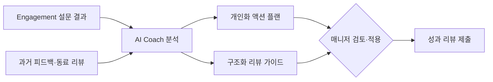

## Summary

Culture Amp이 2025년 Q3부터 **AI Coach**를 전 플랫폼에 확장 배포. Engage(설문 분석) + Perform(성과 리뷰)에 과학 기반 대화형 AI 코칭을 제공하며, **6,800+ 기업·25M 직원** 기반에 추가 비용 없이 제공. **Asana** Head of People Analytics가 "AI Coach puts an expert coach in every manager's pocket"으로 평가. 2026년 3월 Performance Culture Quadrant(PCQ) 발표 — 1,800개 기업 데이터에서 문화-성과 연결 기업이 시장가치 47% 프리미엄을 보인다는 자체 연구 공개. [[sources/cultureamp-ai-coach-expansion-2025-10.md]]

## Problem / Why

- 매니저가 성과 리뷰 작성 시 **빈 페이지 앞에서 막힘** — 과거 피드백·동료 리뷰를 직접 종합해야 하는 부담
- engagement 설문 결과를 받아도 **구체적 액션 플랜 수립이 어려움**
- 전문 코칭을 모든 매니저에게 확장하기엔 **비용·시간 제약**
- C-suite 96%가 AI의 생산성 향상을 기대하나, 직원 77%는 AI가 업무량을 늘렸다고 보고 — **AI 도입 기대-현실 갭** [[sources/cultureamp-ai-coach-expansion-2025-10.md]]

## Solution Architecture (요약)

### A. Process (프로세스)

- **Before**: 매니저가 성과 리뷰를 빈 페이지에서 시작 → engagement 결과를 수동 해석 → 액션 플랜 없이 방치
- **After**: AI Coach가 과거 피드백·동료 리뷰를 자동 통합 → 구조화된 리뷰 가이드 제공 → engagement 결과 기반 개인화 액션 플랜 → 매니저에게 대화형 코칭 [[sources/cultureamp-ai-coach-expansion-2025-10.md]]
- **HITL 지점**: AI Coach는 추천(recommend) 수준 — 매니저가 리뷰·액션을 최종 결정
- **Trigger & Frequency**: 성과 리뷰 주기(반기/연간) + engagement 설문 후 + 수시 매니저 요청
- **Scope of autonomy**: Recommend

### B. System & Infrastructure

- **Core 플랫폼**: Culture Amp (Employee Experience + Performance Management SaaS)
- **AI Coach**: Culture Amp 플랫폼 내장, 추가 비용 없음 [[sources/cultureamp-ai-coach-expansion-2025-10.md]]
- **데이터 기반**: 15년간 축적된 People Science 연구 + 1.5B 직원 응답 데이터셋 [[sources/cultureamp-ai-coach-expansion-2025-10.md]]
- 배포 환경, 연동 상세: _미공개 (not disclosed)_

### C. Data

- **입력**: engagement 설문 응답, 성과 리뷰, 동료 피드백, 회사 프로필 데이터 [[sources/cultureamp-ai-coach-expansion-2025-10.md]]
- **데이터 규모**: ⚠️ 벤더 주장: 1.5B 직원 응답 데이터 기반 People Science [[sources/cultureamp-ai-coach-expansion-2025-10.md]]
- **학습 vs RAG**: _미공개 (not disclosed)_

### D. Model

- **Foundation model**: _미공개 (not disclosed)_
- **커스터마이징**: People Science 프레임워크 기반 코칭 로직 내장
- 나머지: _미공개 (not disclosed)_

### E. Organization & Team

- Asana: John Joseph (Head of People Analytics) — AI Coach 도입 [[sources/cultureamp-ai-coach-expansion-2025-10.md]]
- 나머지 도입 기업(Canva, McDonald's, Nasdaq 등)의 구체 조직·팀 정보: _미공개 (not disclosed)_

## Impact / Metrics

### 기대효과 요약

6,800+ 기업에 매니저 AI 코칭 스케일링. 성과 리뷰 작성 시간 절감 + engagement 액션 실행률 향상 기대. 단, 구체 고객 outcome metric 미공개.

| 지표 | 값 | 출처 | 성격 |
|---|---|---|---|
| 도입 기업 수 | 6,800+ | Culture Amp 공식 | ⚠️ 벤더 주장 |
| 직원 수 | 25M | Culture Amp 공식 | ⚠️ 벤더 주장 |
| 문화-시장가치 프리미엄 | 47% | Culture Amp PCQ 연구 (1,800 기업) | ⚠️ 벤더 주장 (자체 연구) |
| AI Coach 비용 | 추가 비용 없음 (기존 고객 포함) | Culture Amp 공식 | ⚠️ 벤더 주장 |

**Asana 등 개별 고객의 정량적 outcome (리뷰 시간 단축·engagement 점수 변화 등)은 _미공개 (not disclosed)_.**

## Governance & Risk

- 코칭 추천의 편향 (People Science 모델의 문화적 전제) — 글로벌 다양성 대응 여부 _미공개_
- 성과 리뷰에 AI가 개입하는 것에 대한 직원 수용성 이슈
- GDPR·개인정보 처리: _미공개 (not disclosed)_

## Consulting Angle

### 활용 포인트
- **"AI Coach at no extra cost" 모델**: HR SaaS 벤더의 AI 번들 전략 분석 시 참조 — Workday Illuminate(유료 credit)와 대비
- **People Science 기반 코칭의 차별화**: BetterUp(행동 과학) vs Culture Amp(조직 심리학 15년 데이터) vs 15Five(미팅 인텔리전스) — 코칭 접근법 비교 프레임워크
- **47% 시장가치 프리미엄 연구**: 문화-성과 연결 논의에서 "so what" 데이터로 활용 가능, 단 자체 연구이므로 caveat 필수

### 한국 적용
- Culture Amp는 APAC에 시드니 기반 본사 → 한국 진출 가능성
- 국내 대기업에서 engagement survey + 성과관리를 통합한 플랫폼 수요 증가와 맞닿음
- 한국어 지원 여부 미확인
