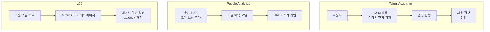

## Summary

싱가포르 최대 은행 DBS Bank는 인사 전 영역에 AI를 내재화한 아시아 금융권 선도 사례다. ✅ **Fact** 핵심 세 가지: (1) AI 채용 플랫폼 JIM(Jobs Intelligence Maestro) — 이력서 스크리닝·면접 일정·초기 평가 자동화로 채용 소요시간을 32일→8일 단축, (2) 이탈 예측 모델 — 학습·보상·휴가 패턴 등 다변수 분석으로 이탈 징후 조기 감지, (3) iGrow 커리어 어드바이저 — 10,000개 이상 내부 과정 기반 개인화 커리어 경로 추천. [[sources/emerj-dbs-ai-cases.md]] [[sources/adriantan-dbs-ai-recruiting.md]]

## Problem / Why (도입 배경)

DBS는 디지털 전환과 함께 대규모 기술 인재 채용과 기존 직원 역량 전환을 동시에 추진해야 했다. 채용 소요시간 단축, 고성과자 이탈 예방, 직원 커리어 개발 기회 확대가 핵심 과제였다. McKinsey 케이스에 따르면 DBS는 "기술 회사로서 은행 면허를 보유"하는 정체성 전환을 추진했다. [[sources/mckinsey-dbs-ai-transformation.md]]

## Solution Architecture

> **최우선 원칙**: 이 섹션은 **공개된 사실만** 기록한다.

### A. Process (프로세스)

#### (1) JIM — AI 채용 플랫폼
- **Before (As-is)**: 채용 담당자가 수동으로 이력서 검토·면접 일정 조율·초기 평가 진행. 32일 소요.
- **After (To-be)**: ✅ **Fact** JIM이 이력서 스크리닝, 면접 일정 자동 조율, 초기 후보자 평가를 수행. [[sources/adriantan-dbs-ai-recruiting.md]]
- **HITL 지점**: 최종 채용 결정은 인간 면접관이 수행.
- **Scope of autonomy**: 스크리닝·일정 조율 자동화(autonomous); 최종 선발 recommend.

#### (2) 이탈 예측 모델
- **Before (As-is)**: HR이 주관적 판단으로 이탈 징후 파악.
- **After (To-be)**: ✅ **Fact** 직원 교육 현황, 보상, 휴가 패턴 등 데이터를 분석하여 이탈 가능성 예측 → HR이 조기 개입. [[sources/emerj-dbs-ai-cases.md]]
- **HITL 지점**: 예측 결과에 따른 개입 행동은 HRBP가 결정.
- **Scope of autonomy**: 예측(recommend) 수준.

#### (3) iGrow — AI 커리어 어드바이저
- **Before (As-is)**: 직원이 커리어 개발 방향을 스스로 탐색.
- **After (To-be)**: ✅ **Fact** iGrow가 직원의 스킬·커리어 포부를 분석하여 10,000개+ 내부 과정 중 맞춤형 개발 경로·기회 추천. [[sources/emerj-dbs-ai-cases.md]]
- **Scope of autonomy**: Recommend 수준.

범례: 실선 = [[sources/emerj-dbs-ai-cases.md]] [[sources/adriantan-dbs-ai-recruiting.md]] 확인.

### B. System & Infrastructure (시스템·인프라)

- **Core HRIS / 기반 시스템**: _미공개 (not disclosed)_
- **AI 시스템 배치**: ✅ **Fact** 내부 개발 플랫폼(JIM, 이탈 예측 모델, iGrow). [[sources/emerj-dbs-ai-cases.md]]
- **배포 환경**: _미공개 (not disclosed)_
- **연동·통합**: _미공개 (not disclosed)_
- **사용자 접점 (UX layer)**: _미공개 (not disclosed)_

### C. Data (데이터)

- **입력 데이터 소스**:
  - JIM: 이력서, JD, 후보자 데이터
  - 이탈 예측: ✅ **Fact** 직원 교육 현황, 보상 데이터, 휴가 패턴. [[sources/emerj-dbs-ai-cases.md]]
  - iGrow: 직원 스킬 프로파일, 커리어 포부, 내부 과정 카탈로그
- **데이터 규모**: _미공개 (not disclosed)_
- **학습 vs RAG vs In-context**: _미공개 (not disclosed)_
- **데이터 거버넌스**: _미공개 (not disclosed)_ — 싱가포르 PDPA 적용 환경.
- **민감정보 처리**: _미공개 (not disclosed)_

### D. Model (모델)

- **Foundation model**: _미공개 (not disclosed)_ — 내부 개발 ML 모델. 구체 기술 스택 미공개.
- **Model 유형**: ML 분류/회귀(이탈 예측), NLP(이력서 파싱), 추천 시스템(iGrow).
- **커스터마이징 기법**: _미공개 (not disclosed)_

### E. Organization & Team (조직·팀 구조)

- **오너십**: ✅ **Fact** DBS 내부 AI/데이터 조직 주도. 700명 데이터 전문가(데이터 사이언티스트 250명 포함) 보유. [[sources/mckinsey-dbs-ai-transformation.md]]
- **조직 모델**: ✅ **Fact** "Data Chapter" — 데이터 전문가들이 각 사업 유닛에 배치되어 일하면서도 중앙 조직에 소속되어 업스킬링·기회·소속감을 공유하는 연방형 모델. [[sources/mckinsey-dbs-ai-transformation.md]]
- **파트너**: ✅ **Fact** McKinsey가 DBS AI 전환의 주요 케이스 스터디 파트너로 문서화. HBS도 DBS AI 전략 케이스 스터디 발표(아시아 은행 최초). [[sources/mit-slr-dbs-piyush-gupta.md]]

## Impact / Metrics (기대효과)

### 기대효과 요약
AI 채용봇(JIM)으로 채용 소요시간 32일에서 8일로 75% 단축 (Fact). 커리어 개발 도구(iGrow)의 retention 효과는 구체 수치 미공개.

- ✅ **Fact**: JIM — 채용 소요시간 32일→8일 단축. [[sources/adriantan-dbs-ai-recruiting.md]]
- ⚠️ **자사 보고**: iGrow 등 커리어 개발 도구가 고성과자 유지 및 직원 만족도 향상에 기여. 구체 수치 _미공개 (not disclosed)_.

## Governance & Risk

- DBS는 AI를 HR 전략의 핵심으로 내재화한 "tech company with a banking license" 모델. CEO Piyush Gupta가 직접 AI 전략 리더십 발휘 (MIT SMR 기사). [[sources/mit-slr-dbs-piyush-gupta.md]]
- 싱가포르 PDPA 및 금융 규제 적용 환경. 세부 대응 _미공개 (not disclosed)_.
- ⚠️ **자사 보고**: "DBS가 수백 개 AI 모델로 4,000명 직원을 교체"한다는 보도 — DBS 측이 정확한 맥락 없이 왜곡된 보도라고 입장 표명. 실제로는 일부 역할 재설계.

## Contradictions

없음 (현재 기준).

## Consulting Angle

- **아시아 금융 HR AI 선도 사례**: DBS는 APAC 금융권에서 HR AI 내재화를 가장 체계적으로 실행한 사례. 싱가포르·홍콩·일본 금융사 대상 제안 시 핵심 레퍼런스.
- **"Data Chapter" 연방형 조직 모델**: 데이터 전문가를 중앙 집중형이 아닌 연방형으로 배치하는 설계는 국내 대기업 HR AI CoE 설계 시 참고 가능.
- **내재화 vs SaaS 선택**: JIM·이탈 예측·iGrow 모두 내부 개발. "내재화 투자를 할 수 있는 규모(700명 데이터 팀)가 있어야 가능한 모델"임을 클라이언트에게 명시.
- **JIM 채용 자동화 수치 (32일→8일)**는 채용 AI ROI 계산의 강력한 벤치마크.
