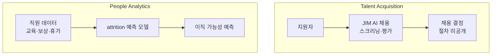

## Summary

싱가포르 최대 은행 DBS Bank는 HR 영역에 AI를 내재화한 아시아 금융권 선도 사례다. ✅ **Fact** (MIT SMR): 기술 배경이 없는 HR 책임자가 skunkworks 프로그램으로 (1) 대량 채용 직군용 AI 채용 도구 JIM(Job Intelligence Maestro), (2) 교육·보상·휴가 패턴 등으로 이직 가능성을 예측하는 attrition 예측 모델을 개발. [[sources/mit-slr-dbs-piyush-gupta.md]] ⚠️ 벤더 주장 (Emerj가 impress.ai 사례 재인용): JIM은 impress.ai와 공동 개발, 2018 도입 후 월 40시간 절감·time-to-hire 75% 단축·후보 이탈 15%→3%. [[sources/emerj-dbs-ai-cases.md]] (2026-09-27 grounding 점검: 종전 "32일→8일", "iGrow 커리어 어드바이저·10,000개 과정"은 인용 소스 raw에 없어 제거·_미공개_ — Contradictions 참조.)

## Problem / Why (도입 배경)

- **Before**: ✅ Gupta 취임(2009) 당시 DBS는 싱가포르 은행 중 고객 서비스 최하위. [[sources/mit-slr-dbs-piyush-gupta.md]] HR baseline(채용 소요시간 등) ❓ 미공개
- **Pain point**: ✅ 대량 채용 직군(high-volume roles)의 적합 인재를 더 효율적으로 채용 + 이직 가능성 조기 파악. [[sources/mit-slr-dbs-piyush-gupta.md]]
- **Trigger**: ✅ CEO Gupta의 AI 리더십 — 2013 A*STAR AI 랩 계약 등 초기 실패를 시그널링으로 활용, 사업부에 데이터 사이언티스트 채용 재량 부여. [[sources/mit-slr-dbs-piyush-gupta.md]] McKinsey 소스의 "기술 회사로서 은행 면허 보유" 인용은 원문 미확보로 검증 불가. [[sources/mckinsey-dbs-ai-transformation.md]]

## Solution Architecture

> **최우선 원칙**: 이 섹션은 **공개된 사실만** 기록한다.

### A. Process (프로세스)

#### (1) JIM — AI 채용 도구
- **Before (As-is)**: _미공개 (not disclosed)_ (종전 "32일 소요"는 인용 소스 raw에 없어 제거)
- **After (To-be)**: ✅ **Fact** JIM(Job Intelligence Maestro) — 대량 채용 직군의 적합 인재를 더 효율적으로 채용하도록 HR skunkworks가 개발. [[sources/mit-slr-dbs-piyush-gupta.md]] ⚠️ 벤더 주장 (Emerj·impress.ai 재인용): 이력서 스크리닝·후보 평가·점수화, ATS(Taleo/Workday/SuccessFactors) 연동, DBS 채용 프로세스에 맞춤. [[sources/emerj-dbs-ai-cases.md]]
- **HITL 지점**: _미공개 (not disclosed)_
- **Scope of autonomy**: _미공개 (not disclosed)_

#### (2) 이탈 예측 모델
- **Before (As-is)**: _미공개 (not disclosed)_
- **After (To-be)**: ✅ **Fact** HR이 개발한 attrition 예측 모델 — 직원의 교육, 보상, 휴가 패턴 등 데이터 포인트를 분석해 이직 가능성 예측. [[sources/mit-slr-dbs-piyush-gupta.md]]
- **HITL 지점**: _미공개 (not disclosed)_
- **Scope of autonomy**: 예측(recommend) 수준 — 개입 절차 _미공개_

#### (3) 커리어 개발 도구
- _미공개 (not disclosed)_ — 종전 "iGrow 커리어 어드바이저(10,000개+ 과정)" 서술은 인용 소스 4건 어디에도 없어 제거 (2026-09-27 grounding 점검)

```mermaid
flowchart TB
    subgraph TA [Talent Acquisition]
        A[지원자] --> JIM[JIM AI 채용\n스크리닝·평가]
        JIM --> C[채용 결정\n절차 미공개]
    end
    subgraph PA [People Analytics]
        D[직원 데이터\n교육·보상·휴가] --> E[attrition 예측 모델]
        E --> F[이직 가능성 예측]
    end
```
범례: 실선 = [[sources/mit-slr-dbs-piyush-gupta.md]] (JIM·attrition 모델) [[sources/emerj-dbs-ai-cases.md]] (JIM 기능) 확인. iGrow subgraph는 소스 부재로 제거.

### B. System & Infrastructure (시스템·인프라)

- **Core HRIS / 기반 시스템**: _미공개 (not disclosed)_
- **AI 시스템 배치**: ✅ **Fact** HR skunkworks 내부 개발 (JIM, attrition 예측 모델). [[sources/mit-slr-dbs-piyush-gupta.md]] ⚠️ 벤더 주장: JIM은 impress.ai와 공동 개발. [[sources/emerj-dbs-ai-cases.md]]
- **배포 환경**: _미공개 (not disclosed)_
- **연동·통합**: ⚠️ 벤더 주장 (Emerj 재인용): ATS(Taleo/Workday/SuccessFactors) 연동. [[sources/emerj-dbs-ai-cases.md]] DBS 실제 연동 대상 _미공개_
- **사용자 접점 (UX layer)**: _미공개 (not disclosed)_

### C. Data (데이터)

- **입력 데이터 소스**:
  - JIM: ⚠️ 벤더 주장: 이력서·후보자 응답. [[sources/emerj-dbs-ai-cases.md]]
  - 이탈 예측: ✅ **Fact** 직원 교육, 보상, 휴가 패턴 등. [[sources/mit-slr-dbs-piyush-gupta.md]]
- **데이터 규모**: _미공개 (not disclosed)_
- **학습 vs RAG vs In-context**: _미공개 (not disclosed)_
- **데이터 거버넌스**: _미공개 (not disclosed)_ — 싱가포르 PDPA 적용 환경.
- **민감정보 처리**: _미공개 (not disclosed)_

### D. Model (모델)

- **Foundation model**: _미공개 (not disclosed)_
- **Model 유형**: ✅ 예측 모델(attrition) [[sources/mit-slr-dbs-piyush-gupta.md]]; ⚠️ 벤더 주장: 후보 평가·점수화(JIM). [[sources/emerj-dbs-ai-cases.md]] 알고리즘 세부 _미공개_
- **커스터마이징 기법**: ⚠️ 벤더 주장: JIM을 DBS 채용 프로세스에 맞춤. [[sources/emerj-dbs-ai-cases.md]]

### E. Organization & Team (조직·팀 구조)

- **오너십**: ✅ **Fact** 기술 배경 없는 HR 책임자가 skunkworks 프로그램으로 HR AI 애플리케이션 식별·파일럿. [[sources/mit-slr-dbs-piyush-gupta.md]]
- **참여 역할**: ✅ **Fact** CEO Piyush Gupta의 AI 리더십; 사업부에 준(準) 데이터 사이언티스트 채용 재량. [[sources/mit-slr-dbs-piyush-gupta.md]]
- **팀 규모**: _미공개 (not disclosed)_ (종전 "700명 데이터 전문가·250명 데이터 사이언티스트·Data Chapter"는 McKinsey 소스 원문 미확보로 인용 불가 — 2026-09-27 grounding 점검)
- **파트너**: ⚠️ 벤더 주장: impress.ai (JIM 공동 개발, DBS Startup Xchange). [[sources/emerj-dbs-ai-cases.md]] McKinsey의 AI 전환 지원은 원문 미확보. [[sources/mckinsey-dbs-ai-transformation.md]]

## Impact / Metrics (기대효과)

### 기대효과 요약
Before: _Before 수치 미공개_ → After: ⚠️ 벤더 주장 (impress.ai 사례, Emerj 재인용) JIM 도입(2018) 후 월 40시간 절감, time-to-hire 75% 단축, 후보 이탈 15%→3%, 800건+ 채용, 문의 97% 자동 응답. attrition 모델·커리어 도구의 효과 수치 _미공개_.

- ⚠️ **벤더 주장** (Emerj가 impress.ai 사례 재인용): 월 40시간 절감, time-to-hire 75%↓, 후보 이탈 15%→3%. [[sources/emerj-dbs-ai-cases.md]]
- 채용 소요시간 일수(종전 "32일→8일"): _미공개_ (수치 근거 미확보 — 2026-09-27 grounding 점검; adriantan 소스 원문 미확보, 스니펫은 검토 시간 37분→8분)
- attrition 예측 모델 정확도·효과: _미공개 (not disclosed)_

## Governance & Risk

- ✅ CEO Piyush Gupta가 직접 AI 전략 리더십 발휘 — 초기 실패(2013 A*STAR 랩)를 시그널링으로 활용. [[sources/mit-slr-dbs-piyush-gupta.md]]
- 싱가포르 PDPA 및 금융 규제 적용 환경. 세부 대응 _미공개 (not disclosed)_.
- attrition 예측·채용 스크리닝은 고영향 AI 검토 대상 — 편향 감사·설명가능성 장치 _미공개_

## Contradictions

> [!note] 2026-09-27 grounding — 종전 본문의 "채용 소요시간 32일→8일"(adriantan 소스 원문 404, 스니펫에도 없음), "iGrow 커리어 어드바이저·10,000개+ 과정"(어느 소스에도 없음), "700명 데이터 전문가·250명 데이터 사이언티스트·Data Chapter 연방형 모델·'tech company with a banking license'"(McKinsey 소스 원문 미확보), "HBS 케이스 스터디", "4,000명 직원 교체 보도" 는 인용 소스 raw로 뒷받침되지 않아 제거·_미공개_ 처리. emerj 소스는 JIM(impress.ai 재인용)과 AML 거래 감시만 다루므로 attrition 모델 근거를 MIT SMR로 재귀속.

## Consulting Angle

- **아시아 금융 HR AI 선도 사례**: DBS는 APAC 금융권에서 HR AI 내재화를 가장 체계적으로 실행한 사례. 싱가포르·홍콩·일본 금융사 대상 제안 시 핵심 레퍼런스.
- **HR skunkworks 모델**: 기술 배경 없는 HR 책임자가 소규모 skunkworks로 AI 파일럿을 식별·실행한 사례 — 국내 대기업 HR AI CoE 설계 시 "HR 주도 + 사업부 데이터 인력 재량" 패턴으로 참고 가능 (조직 규모 수치는 미공개).
- **내재화 vs 스타트업 협업**: JIM은 impress.ai와 공동 개발(⚠️ 벤더 주장), attrition 모델은 HR 자체 개발 — "완전 내재화"가 아닌 hybrid 경로임을 클라이언트에게 명시.
- **JIM 채용 자동화 수치**: time-to-hire 75%↓·월 40시간 절감은 ⚠️ 벤더(impress.ai) 주장의 재인용 — 채용 AI ROI 계산 시 "벤더 주장"으로만 인용.
