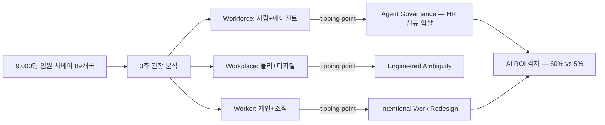

## Summary

Deloitte 2026 Global Human Capital Trends는 89개국·9,000명 임원 서베이 기반 capstone 리포트. 핵심 발견 — **임원 60%가 AI를 의사결정에 사용하지만, 5%만 잘 관리한다**. AI 도입 자체보다 work redesign과 거버넌스 격차가 ROI를 결정. "intentional work redesign" 조직은 AI ROI 기대치 초과 확률 2배. HR 기능이 "agent governance" 역할로 재정의되는 글로벌 trend 데이터 — 모든 KR HR 임원 발표·제안서 첫 슬라이드 인용 가능.

## Problem / Why (도입 배경)

본 페이지는 use case가 아닌 **글로벌 trend reference**. 컨설팅 프로젝트에서 다음 상황에 활용:

- **Pain point**: KR HR 임원에게 "AI 도입은 80%가 검토 중인데 실제 ROI는 모호하다"는 직관을 데이터로 입증해야 할 때
- **Trigger**: 한국 대기업 CHRO가 글로벌 분석가 reference를 요구하는 상황 (보드 보고·이사회 발표)

## Solution Architecture

> Deloitte의 분석 framework이 곧 "solution"의 framework. 실제 솔루션이 아닌 **사고 framework** 차원에서 정리.

### A. Process (Deloitte의 trend 분석 framework)

- **3축 긴장 → tipping points** 프레임:
  1. Workforce 차원: 사람-에이전트 통합 → "agent governance"
  2. Workplace 차원: 물리적 공간 vs digital-first → "engineered ambiguity"
  3. Worker 차원: 개인 motivation vs 조직 capability → "intentional work redesign"
- 각 축에서 "tension"이 "tipping point"로 변환되는 임계점 분석

### B. System & Infrastructure (지지 데이터)

- 89개국·9,000명 임원 서베이 (Tier 1 표본)
- 매년 발행되는 capstone 리포트 (2010~ 누적 데이터)
- HR Executive·HR Brew·SHRM 등 Tier 2 매체에서 광범위 인용

### C. Data (핵심 발견 수치)

- **60% vs 5% 갭**: 임원 60%가 AI를 의사결정에 사용 — 그러나 5%만 거버넌스가 잘 됨
- **2배 ROI 격차**: "intentional work redesign" 조직이 AI ROI 기대치 초과 확률 2배
- **Investor disclosure 압력**: SEC·EU CSRD 인적자본 공시 의무 가속화
- **HR의 "agent governance" 역할 신규 부상**: Workday ASOR 등 상용 인프라와 부합

### D. Model (분석 frameworks)

- Deloitte 자체 longitudinal 분석 + 외부 academic·analyst 인용
- "Tensions to tipping points" 프레임 (2026 신규)

### E. Organization & Team

- Deloitte Global Human Capital Practice (수천명 컨설턴트)
- 한국 Deloitte Anjin도 KR-specific 보고서 별도 발간

### F. Diagrams

## Impact / Metrics (기대효과)

### 기대효과 요약
KR HR 임원 대상 발표·제안서·이사회 보고에서 글로벌 baseline trend 데이터로 인용 가능. "한국만의 문제"가 아닌 글로벌 보편 격차임을 입증.

- **Before → After**:
  - HR 임원 보고: 일화·벤더 주장 위주 → Tier 1 글로벌 서베이 데이터로 보강
  - AI 거버넌스 어젠다: ad-hoc → "60/5 갭 해소" framework로 구조화
  - Work redesign 투자 명분: 직관적 호소 → "2배 ROI" 정량 근거
- **활용 예시**:
  - 컨설팅 제안서 1page: "Deloitte 2026: 60% AI 사용 vs 5% well-managed → 본 프로젝트가 갭 해소"
  - 이사회 deck: "글로벌 9,000 임원 중 5%만 AI 거버넌스 성숙 → 한국 대기업도 동일 격차 가설"
  - HRBP 교육: "intentional work redesign" 워크숍 framework

## Governance & Risk

- ✅ Tier 1 글로벌 분석가 리포트 — 신뢰도 높음
- ⚠️ Korea 응답자 비율 별도 공개 안 됨 — KR 적용 시 "글로벌 평균"으로만 인용 권장
- ⚠️ "5% well-managed" 정의 기준 다소 주관적 (self-report) — 수치 절대화 자제
- ⚠️ paid 리포트에서만 sector·기업 규모별 break-down 제공 — Deloitte client 통해 입수 필요

## Contradictions

(없음)

## Consulting Angle

- **모든 KR HR AI 프로젝트 제안서 1page 공통 인용**: "Deloitte 2026 — 60% vs 5% 갭" + "intentional work redesign 2배 ROI"
- **이사회·CHRO 발표용 capstone reference**: 한국만의 문제 아닌 글로벌 보편임을 입증해 prioritization 명분 강화
- **컨설팅 메뉴 매핑**:
  - "AI Governance Maturity Diagnostic" — 60/5 갭 측정 framework
  - "Work Redesign Workshop" — intentional work redesign 운영
  - "HR-as-Agent-Owner" 직무 재설계
- **Deloitte Anjin 협업 또는 비교**: KR-specific 추가 데이터를 Deloitte Anjin이 별도 발간 — 직접 입수 또는 비교 분석
- **trend 갱신 주기**: 매년 3월 발간 — 2027년 신규 trend 출시 시 본 페이지 link 갱신
- **반면교사 포인트**: Tier 1 capstone에 의존만 하면 generic 컨설팅으로 보임 — 반드시 KR 클라이언트별 case 연결 필수
