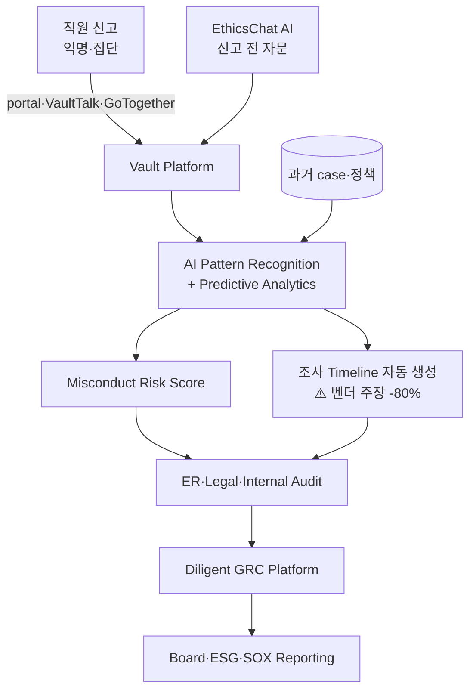

> 📌 **인수 배경 (2025-05-22)**: Diligent (글로벌 GRC/governance 플랫폼)가 Vault Platform (UK 기반 ethics·compliance 신고 플랫폼)을 인수. 통합 product line은 **"Active Integrity"**로 brand. AI-powered ethics·compliance의 새로운 시대 표방.

## Summary

Diligent (글로벌 GRC/board management leader)가 2025년 5월 **Vault Platform (UK)을 인수** — AI-powered ethics·compliance speak-up + investigation. **EthicsChat AI** (대화형 ethical guidance), **VaultTalk·GoTogether** (집단 신고 — 한국 직장 내 괴롭힘 환경에 매칭), AI pattern recognition·predictive analytics로 misconduct 조기 감지. **조사 timeline 최대 80% 단축** (벤더 주장). GDPR·ISO 27001·SOC 2 인증.

## Problem / Why

- **Before**: 사내 윤리·컴플라이언스 신고는 hotline (NAVEX·Convercent) 또는 자체 portal — 익명 신고 단발 처리, 패턴 분석·예측 기능 부족, 글로벌 GRC 통합 부재
- **Pain point**:
  - **익명 신고 단발 처리**: 1건씩 처리 → 패턴·systemic risk 식별 어려움
  - **EU Whistleblower Directive (2023~)**: EU 50인+ 기업 의무 — 신고 mechanism 구축 + 조치 timeline 의무
  - **집단 신고 mechanism 부재**: 1인 신고는 retaliation risk → 다수 직원이 함께 신고하는 mechanism 필요
  - **GRC 통합**: ESG·board governance·내부감사와 연결 안 됨 → C-suite 가시성 부족
- **Trigger**: Diligent (글로벌 GRC leader)의 ethics·compliance 영역 확장 전략 + Vault의 AI-native architecture 매력 → 인수 (2025-05)

## Solution Architecture

### A. Process

- **Before**: 직원 익명 신고 → HR/legal 1건씩 조사 → 사후 trend 보고서 (분기·연간)
- **After (Active Integrity 통합 architecture)**:
  1. 직원이 Vault portal·VaultTalk·GoTogether 익명 신고 (1인 또는 집단)
  2. **EthicsChat AI**: 신고 전 AI 자문 — "이게 신고 대상인가?", "어떤 채널?", "어떤 증거?" 가이드
  3. AI pattern recognition: 신고 내용 분석 + 과거 case·부서·매니저 패턴 결합 → **misconduct predictive risk score**
  4. ER·legal·internal audit이 case 진행 → 조사 timeline 자동 생성 (벤더 주장 80% 단축)
  5. Diligent GRC platform 통합: case → board reporting·ESG·SOX audit trail 자동 연계
  6. 익명 → 신원 공개 신고로 escalation 가능 (사용자 동의 시)
- **HITL**: 조사·결정·resolution 모두 사람. AI는 분류·요약·predictive risk·문서화만
- **Frequency**: 24/7 익명 신고 + daily case 처리 + 분기·연간 board reporting
- **Scope of autonomy**: assist (AI는 분석·문서화·predictive)

### B. System & Infrastructure

- **Core platform**: Diligent platform (글로벌 GRC SaaS)
- **AI 시스템 배치**: Vault Platform (Speak-Up + Investigation) + EthicsChat AI 모듈
- **연동**: Diligent board portal·ESG·SOX audit·내부감사 모듈
- **사용자 접점**: web portal, mobile, 익명 hotline, EthicsChat 인터페이스
- **인증**: 익명 + RBAC + role-based case visibility

### C. Data

- **입력 데이터**:
  - 익명·신원 신고 내용
  - 회사 윤리강령·정책·과거 case
  - HRIS (case 연계 시)
  - GRC data (board minutes·audit·ESG metrics)
- **모델 구조**: LLM (EthicsChat·요약) + classification (case type·severity) + predictive (misconduct risk score) + clustering (pattern·hotspot)
- **Data governance**:
  - **GDPR·ISO 27001·SOC 2** 인증
  - EU Whistleblower Directive 준수
  - 익명 보호 + retaliation 방지 mechanism

### D. Model

- **Foundation model**: _구체 LLM provider 미공개_ (Diligent enterprise stack)
- **Customization**: ethics·compliance 도메인 fine-tuning + GRC 통합
- **Predictive analytics**: pattern recognition으로 misconduct 조기 감지

### E. Organization & Team

- **오너십**: Diligent (인수 후 통합) + 기존 Vault Platform 팀
- **거버넌스**: 글로벌 GRC platform 통합 → C-suite·board 가시성

### F. Diagrams

범례: 모든 연결 ⚠️ Vault·Diligent 공식 + 인수 발표 (2025-05) 기반.

## Impact / Metrics (기대효과)

### 기대효과 요약
**GRC 통합 ethics·compliance** — Diligent C-suite 가시성 + Vault AI-native speak-up. ⚠️ 모든 customer outcome metric은 Vault·Diligent 자사 발표.

| 지표 | 값 | 출처 | 성격 |
|---|---|---|---|
| Diligent 인수 발표 | 2025-05-22 | Diligent newsroom + BusinessWire | ✅ Fact (Tier 4) |
| 인수 brand | "Active Integrity" | Diligent 발표 | ✅ Fact |
| **조사 timeline 단축** | **최대 80%** | Vault Platform 자사 자료 | ⚠️ 벤더 주장 |
| 컴플라이언스 인증 | GDPR, ISO 27001, SOC 2 | Vault 공식 | ✅ Fact |
| 집단 신고 mechanism | VaultTalk + GoTogether | Vault 공식 | ✅ Fact |
| EU Whistleblower Directive | 준수 | Vault 공식 | ✅ Fact |

## Governance & Risk

- ✅ Diligent 인수 → 글로벌 GRC leader 통합 → 엔터프라이즈 보안·신뢰성 검증
- ✅ GDPR·ISO 27001·SOC 2 인증 → 한국 PIPA 대응 base
- ✅ EU Whistleblower Directive 준수 → 한국 EU 진출 기업 의무 대응
- ⚠️ 조사 timeline 80% 단축은 ⚠️ 벤더 주장 — Tier 1·2 독립 검증 부재
- ⚠️ Misconduct predictive analytics는 **인사 의사결정 영향 가능성** → 한국 AI 기본법 (2026-01-22) 고영향 AI 분류 가능
- ⚠️ 한국 적용 시:
  - 한국어 LLM 정확도 검증 필요
  - **직장 내 괴롭힘 금지법** + **PIPA** + 노조 사전 합의 필수
  - 집단 신고 mechanism (GoTogether)은 한국 노조 환경에서 단협 위반 risk 검토 필요

## Consulting Angle

- **GRC 통합 ethics·compliance 대표 reference**: 한국 대기업의 ESG·SOX·내부감사·ER 통합 거버넌스 검토 시 Diligent platform 전체 reference
- **vs HR Acuity** [[hr-acuity-oliver-er-companion]]:
  - HR Acuity: ER 전용·case management 성숙 (G2 #1, Brandon Hall Gold)
  - Diligent Vault: GRC 통합 + ethics focus + 익명 집단 신고
  - 양자 보완: HR Acuity = ER 운영 / Vault = ethics·whistleblowing
- **vs AllVoices** [[allvoices-vera-ai-er-copilot]]:
  - AllVoices: AI-native ER copilot (Vera AI), 200+ 언어
  - Vault: GRC 통합 + 집단 신고 + EthicsChat
  - 한국 도입: GRC·SOX 의무 큰 대기업은 Vault, ER 운영 효율은 AllVoices
- **vs NAVEX EthicsPoint** [[navex-ethicspoint-nca-compliance]]:
  - NAVEX: 13K+ 조직, whistleblowing 전통 (글로벌 표준)
  - Vault: AI-native + GRC 통합 + 신생
  - 보수적 한국 대기업은 NAVEX, agile은 Vault
- **집단 신고 (GoTogether)** — 한국 직장 내 괴롭힘 사례에서 1인 신고 retaliation risk 회피 가능 → 한국 노무 컨설팅에서 차별화 가치
- **EU Whistleblower Directive 대응**: 한국 대기업 EU 법인 (50인+) 의무 — Vault 직접 적용 가능
- **한국 적용 한계**:
  - 한국 customer reference 미공개 (Diligent 한국 진출 부분적)
  - 한국어 + PIPA + 노조 fit 검증 필요
  - 미국 SOX·EU GDPR 중심 → 한국 노동법 customization 필요
- **Watch list**: Diligent Korea 진출 가시화·Active Integrity 한국 customer reference·Forrester Wave for Whistleblowing 발표 시 confidence 재조정
