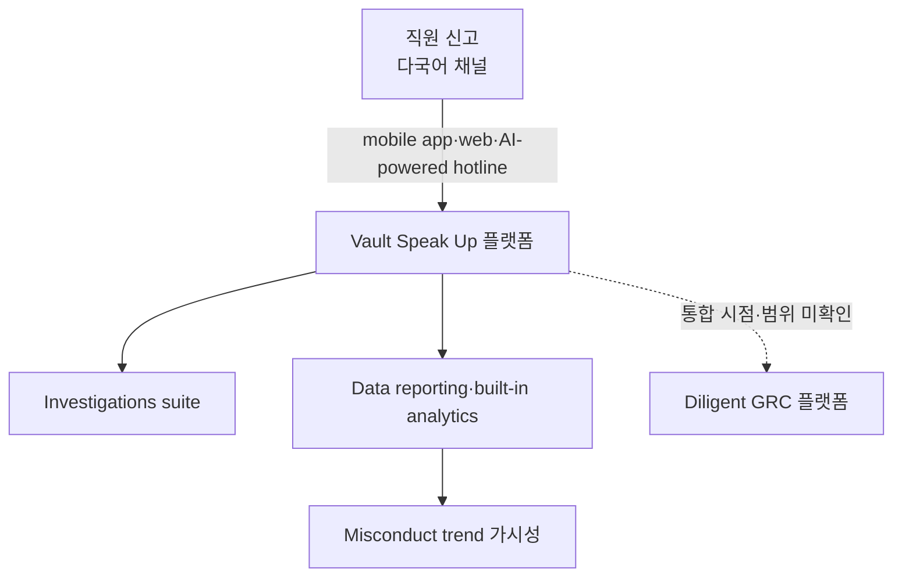

> 📌 **인수 배경 (2025-05-22)**: Diligent (GRC SaaS)가 Vault (AI 기반 ethics·compliance speak-up 플랫폼, New York·London)를 인수 [[sources/diligent-acquires-vault-2025-05]]. Vault는 자사를 **"Active Integrity"** 리더로 소개 [[sources/diligent-acquires-vault-2025-05]] [[sources/vault-platform-product-page]].

## Summary

Diligent (GRC SaaS)가 2025-05-22 **Vault를 인수** — AI 기반 ethics·compliance speak-up + investigations + data reporting 플랫폼 [[sources/diligent-acquires-vault-2025-05]]. ⚠️ 벤더 주장: 다국어 신고 채널·localized compliance 기능, mobile app·web·AI-powered hotline 신고 채널, misconduct trend에 대한 end-to-end 가시성 [[sources/diligent-acquires-vault-2025-05]]. Vault 홈페이지는 "AI-driven automation, ethical risk intelligence and secure Speak Up"으로 포지셔닝 [[sources/vault-platform-product-page]]. 기존 페이지에 있던 EthicsChat·VaultTalk·GoTogether(집단 신고)·"조사 timeline 최대 80% 단축"·GDPR/ISO 27001/SOC 2 인증은 인용 소스(인수 발표·홈페이지) 어디에도 없어 _미공개 (not disclosed)_ 처리 (2026-09-27 grounding 점검 — 하위 제품 페이지·EthicsChat 보도자료 미확보).

## Problem / Why (도입 배경)

- **Before (baseline)**: ❓ baseline 미공개 — 벤더 제품이므로 특정 기업의 도입 배경은 고객별 상이. Diligent 발표는 "outdated ethics and compliance systems의 한계"만 언급 [[sources/diligent-acquires-vault-2025-05]].
- **Pain point**: ⚠️ 벤더 주장: 사후 컴플라이언스 체크("checking the compliance box")로는 부족하며 상시·선제적 접근이 필요 [[sources/vault-platform-product-page]]; 리스크 조기 감지·신속 대응·직원 신뢰 [[sources/diligent-acquires-vault-2025-05]].
- **Trigger**: Diligent의 ethics·compliance 영역 확장 — 2025년 초 Spark Compliance 인수에 이은 Vault 인수 [[sources/diligent-acquires-vault-2025-05]]. 고객사 측 도입 계기는 _미공개 (not disclosed)_.
- 🚫 일반론 표기: EU Whistleblower Directive 등 규제 배경은 인용 소스에 없으므로 기술하지 않음.

## Solution Architecture

### A. Process (프로세스)

- **Before**: _미공개 (not disclosed)_
- **After** (⚠️ 벤더 주장, 인수 발표 기술 범위 [[sources/diligent-acquires-vault-2025-05]]):
  1. 직원이 mobile app·web platform·AI-powered hotline 등 신고 채널로 안전·기밀 신고 (다국어 채널)
  2. Vault 플랫폼이 Speak Up → investigations → data reporting을 한 곳에서 관리 (misconduct reporting·investigations·built-in analytics의 control center)
  3. 조직은 misconduct trend에 대한 end-to-end 가시성 확보
  4. Vault Speak Up 기술을 Diligent GRC 플랫폼에 통합 (통합 시점·범위 _미공개_)
- **HITL**: _미공개 (not disclosed)_ — "investigation suite" 제공만 언급, 사람의 개입 지점은 소스에 없음
- **Trigger & Frequency**: _미공개 (not disclosed)_
- **Scope of autonomy**: _미공개 (not disclosed)_

### B. System & Infrastructure (시스템·인프라)

- **Core platform**: Diligent GRC 플랫폼에 Vault Speak Up 기술 통합 [[sources/diligent-acquires-vault-2025-05]]
- **AI 시스템 배치**: _미공개 (not disclosed)_ — "AI-first technology"·"AI-driven automation"으로만 기술 [[sources/diligent-acquires-vault-2025-05]] [[sources/vault-platform-product-page]]
- **배포 환경**: _미공개 (not disclosed)_
- **연동·통합**: _미공개 (not disclosed)_ — Diligent GRC 통합 외 board portal·ESG·SOX 모듈 연동은 소스에 없음
- **사용자 접점**: ⚠️ 벤더 주장: mobile apps, web platforms, AI-powered hotlines [[sources/diligent-acquires-vault-2025-05]]
- **인증·권한**: _미공개 (not disclosed)_

### C. Data (데이터)

- **입력 데이터 소스**: ⚠️ 벤더 주장: 직원 신고(다국어 채널) [[sources/diligent-acquires-vault-2025-05]]; 그 외 정책 문서·과거 case·HRIS 연계는 _미공개 (not disclosed)_
- **데이터 규모**: _미공개 (not disclosed)_ — 홈페이지는 "thousands of whistleblower reports" 분석 리포트를 언급하나 플랫폼 규모 수치는 없음 [[sources/vault-platform-product-page]]
- **전처리·정제**: _미공개 (not disclosed)_
- **학습 vs RAG vs In-context**: _미공개 (not disclosed)_
- **데이터 거버넌스**: _미공개 (not disclosed)_ — GDPR·ISO 27001·SOC 2 인증은 인용 소스에 없음
- **민감정보 처리**: ⚠️ 벤더 주장: "safe, confidential" 신고 채널 [[sources/diligent-acquires-vault-2025-05]] — 구체 익명화 방식 _미공개_
- **데이터 출처의 오너십**: _미공개 (not disclosed)_

### D. Model (모델)

- **Foundation model**: _미공개 (not disclosed)_
- **Model 유형**: _미공개 (not disclosed)_ — "built-in analytics"·"ethical risk intelligence"로만 기술 [[sources/diligent-acquires-vault-2025-05]] [[sources/vault-platform-product-page]]; predictive risk score·classification 여부 소스에 없음
- **제공 방식**: _미공개 (not disclosed)_
- **커스터마이징 기법**: _미공개 (not disclosed)_
- **Orchestration 프레임워크**: _미공개 (not disclosed)_
- **평가·가드레일**: _미공개 (not disclosed)_
- **비용·성능 지표**: _미공개 (not disclosed)_
- **Fallback·degradation 전략**: _미공개 (not disclosed)_

### E. Organization & Team (조직·팀 구조)

- **오너십**: Diligent (인수 주체) — Vault CEO Neta Meidav, Diligent Amanda Carty 인용 [[sources/diligent-acquires-vault-2025-05]]
- **참여 역할**: _미공개 (not disclosed)_
- **팀 규모·기간**: _미공개 (not disclosed)_
- **거버넌스 체계**: _미공개 (not disclosed)_
- **변화관리**: _미공개 (not disclosed)_
- **파트너**: 인수 자문 — District Capital Partners(재무), Willkie Farr & Gallagher(법률, Diligent 측), Raz. Dlugin & Co.(법률, Vault 측) [[sources/diligent-acquires-vault-2025-05]]; 구현 파트너 _미공개_

### F. Diagrams (도식)

```mermaid
flowchart TB
    Emp[직원 신고<br/>다국어 채널] -->|mobile app·web·AI-powered hotline| Vault[Vault Speak Up 플랫폼]
    Vault --> Inv[Investigations suite]
    Vault --> Rep[Data reporting·built-in analytics]
    Rep --> Trend[Misconduct trend 가시성]
    Vault -.->|통합 시점·범위 미확인| Diligent[Diligent GRC 플랫폼]
```

범례: 실선 = Diligent 인수 발표(2025-05-22)에서 확인 [[sources/diligent-acquires-vault-2025-05]]; 점선 = 통합 계획만 언급(미확인).

## Impact / Metrics (기대효과)

### 기대효과 요약
⚠️ 기대효과 수치 미공개 — 인용 소스에는 고객 outcome metric이 없음. 인수 발표는 "detect risks earlier, respond faster, build greater trust"라는 정성 효과만 기술 [[sources/diligent-acquires-vault-2025-05]].

| 지표 | 값 | 출처 | 성격 |
|---|---|---|---|
| Diligent 인수 발표 | 2025-05-22 | Diligent newsroom | ✅ Fact (자사 발표) |
| 인수 brand | "Active Integrity" | Diligent 발표·Vault 홈페이지 | ⚠️ 벤더 주장 |
| 신고 채널 | mobile app·web·AI-powered hotline, 다국어 | Diligent 발표 | ⚠️ 벤더 주장 |
| **조사 timeline 단축** | _미공개_ (기존 "최대 80%"는 인용 소스에 없음) | — | ❓ |
| 컴플라이언스 인증 | _미공개_ (GDPR·ISO 27001·SOC 2 인증은 인용 소스에 없음) | — | ❓ |
| 집단 신고 mechanism | _미공개_ (VaultTalk·GoTogether는 인용 소스에 없음) | — | ❓ |
| 인수 조건 | 비공개 | Diligent 발표 | ✅ Fact |

## Governance & Risk

- ⚠️ 벤더 주장: "safe, confidential" 신고 채널, localized compliance·global regulation 준수 지원 [[sources/diligent-acquires-vault-2025-05]] — 구체 인증·DPIA·익명 보호 mechanism은 _미공개_
- ⚠️ 모든 제품 효과 주장은 Tier 3 자사 발표 — Tier 1·2 독립 검증 부재
- ⚠️ misconduct trend 분석·"ethical risk intelligence"가 개인 단위 예측·인사 조치에 쓰이면 한국 AI 기본법 고영향 AI 검토 대상 가능 — 실제 predictive 기능 여부는 _미공개_
- ⚠️ 한국 적용 시: 한국어 지원 미확인, 직장 내 괴롭힘 금지법·PIPA·노조 협의 필요

## Contradictions

> [!note] 2026-09-27 grounding — 인용 소스 3건(Diligent 인수 발표, Business Wire 동일 발표문[스냅샷 불가], Vault 홈페이지) 어디에도 EthicsChat·VaultTalk·GoTogether·"조사 timeline 최대 80% 단축"·GDPR/ISO 27001/SOC 2 인증·EU Whistleblower Directive 준수·predictive risk score·board/ESG/SOX 연동이 없어 모두 _미공개_로 변경. Business Wire 배포본은 Diligent 뉴스룸 게시본과 동일 문서이므로 독립 소스로 계산하지 않음. 하위 제품 페이지·EthicsChat 보도자료 확보 시 복원 검토(/hr-research).

## Consulting Angle

- **GRC 통합 ethics·compliance 대표 reference**: 한국 대기업의 ESG·SOX·내부감사·ER 통합 거버넌스 검토 시 Diligent platform 전체 reference
- **vs HR Acuity** [[hr-acuity-oliver-ai-er-companion]]:
  - HR Acuity: ER 전용·case management 성숙 (G2 #1, Brandon Hall Gold)
  - Diligent Vault: GRC 통합 + ethics focus + 다국어 speak-up 채널
  - 양자 보완: HR Acuity = ER 운영 / Vault = ethics·whistleblowing
- **vs AllVoices** [[allvoices-vera-ai-er-copilot]]:
  - AllVoices: AI-native ER copilot (Vera AI), 200+ 언어
  - Vault: GRC 통합 + 다국어 speak-up (세부 기능 미공개)
  - 한국 도입: GRC·SOX 의무 큰 대기업은 Vault, ER 운영 효율은 AllVoices
- **vs NAVEX EthicsPoint** [[navex-ethicspoint-nca-compliance]]:
  - NAVEX: whistleblowing 전통 (글로벌 표준; 조직 수는 [[navex-ethicspoint-nca-compliance]] 참조)
  - Vault: AI-native + GRC 통합 + 신생
  - 보수적 한국 대기업은 NAVEX, agile은 Vault
- **집단 신고 기능** — 인용 소스에서 미확인(_미공개_); 확인되면 한국 직장 내 괴롭힘 사례에서 1인 신고 retaliation risk 회피 가치로 활용 가능
- **EU Whistleblower Directive 대응**: 한국 대기업 EU 법인 의무 — Vault의 Directive 준수 여부는 인용 소스에서 미확인
- **한국 적용 한계**:
  - 한국 customer reference 미공개 (Diligent 한국 진출 부분적)
  - 한국어 + PIPA + 노조 fit 검증 필요
  - 미국 SOX·EU GDPR 중심 → 한국 노동법 customization 필요
- **Watch list**: Diligent Korea 진출 가시화·Active Integrity 한국 customer reference·Forrester Wave for Whistleblowing 발표 시 confidence 재조정
