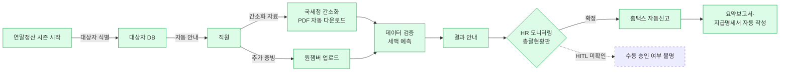

# 더존비즈온 — ONE AI 연말정산

> 🇰🇷 **한국 특유 Total Rewards AI 최초 수집 사례**. 연말정산은 글로벌 벤더(Workday·SAP SuccessFactors)가 구조적으로 커버하기 어려운 한국 특유 프로세스 — 국내 벤더의 moat 영역. [[workday-as-customer-paradox]] 가 제기한 "suite vs point solution" 논의에서 **국내 맥락의 핵심 argument**.

## Summary

더존비즈온(국내 ERP·급여 dominant player)이 자사 ONE AI 제품군에 포함시킨 **연말정산 end-to-end 자동화** 서비스. 대상자 선정부터 결과 안내까지 전 과정을 자동화. 국세청 간소화 자료 자동 다운로드·세액 예측·홈택스 자동신고·총괄현황판 등 제공. 2024-12 기준 1,000개 기업 추가 계약 보고(⚠ 벤더 주장). 중소·중견기업 타겟.

## Problem / Why

한국 HR의 연말정산은 다음과 같은 구조적 부담을 가짐:
- **법정 프로세스** — 매년 1~3월 연말정산 + 2월 지급명세서 신고 의무
- **복잡한 소득·세액공제** — 45종 증빙자료 (2026-01 기준), 개인별 상황에 따라 공제 내역이 완전히 다름
- **국세청 간소화 시스템 연동** — 각 직원의 간소화 자료를 수집·검증·반영
- **오류 리스크** — 잘못된 세액 계산은 개인·기업 모두에게 법적·재무 부담
- **반복성** — 수백~수천 명 기업에서는 HR 2~3명이 수 개월 투입되는 작업

→ HR 팀의 **"가장 반복적이고 규제 엄격한 계산 업무"** 중 하나. AI의 sweet spot.

## Solution Architecture

### A. Process (프로세스)

- **Before (As-is)**: _미공개 (기업별 상이)_. 일반적 한국 기업의 기존 연말정산 플로우는 HR 담당자가 직원별로 국세청 간소화 자료 수집·입력·검증하는 수작업이나, 소스에 기업별 구체 기술은 없음 (🚫 일반 지식)
- **After (To-be)** — ✅ [[taxwatch-douzone-one-ai-2024-12]] 확인:
  1. **대상자 선정** — ONE AI가 직원 DB에서 연말정산 대상자 자동 식별
  2. **안내** — 대상자에게 일정·필요 자료 자동 고지
  3. **자료 입력** — 국세청 간소화 서비스에서 PDF 자동 다운로드, 시스템에 반영
  4. **검토** — 연말정산 데이터 검증 + 세액 예측
  5. **추가 증빙 수집** — 원챔버 연동으로 직원이 추가 증빙 업로드
  6. **결과 안내** — 세액 계산 결과를 직원·HR에 자동 통보
  7. **신고 처리** — 홈택스 자동신고 + 요약보고서·지급명세서 자동 작성·신고
  8. **HR 모니터링** — 총괄현황판으로 전사 진행상황 실시간 관리
- **Human-in-the-loop 지점**: _미공개_ — "모든 과정 자동화" 주장이지만 HR 담당자가 최종 검토·승인하는 지점은 공개 없음
- **Trigger & Frequency**: **연 1회** (1월 중순 ~ 3월 초 연말정산 시즌)
- **Scope of autonomy**: "end-to-end" = **decide-then-act** 수준 (신고까지 자동). HR 검토 개입은 미공개

_범례: 녹색 = TaxWatch 2024-12 기사 확인. 점선 = HITL 개입 여부 미확인._

### B. System & Infrastructure (시스템·인프라)

- **Core HRIS**: **더존 Smart HR / 급여** (자사 ERP 통합, 새로 HR 시스템 도입 불필요)
- **AI 시스템 배치**: 더존 ONE AI 플랫폼 (ERP 내장)
- **배포 환경**: _미공개_ (더존 클라우드 vs 고객 서버 on-prem 모두 가능할 수 있음)
- **연동·통합**:
  - **국세청 홈택스 API** (간소화 자료 다운로드 + 자동신고)
  - **원챔버** (더존 자체 증빙 수집 플랫폼)
  - **더존 ERP 급여 모듈** (기존 급여·인사 데이터)
- **사용자 접점**: 더존 ERP UI + 직원 원챔버 포털
- **인증·권한**: _미공개_
- **SLA**: _미공개_

### C. Data (데이터)

- **입력 데이터 소스**:
  - 직원 급여·인사 데이터 (더존 ERP 내부)
  - 국세청 간소화 자료 45종
  - 직원 추가 증빙 (원챔버 업로드)
- **데이터 규모**: _미공개_
- **전처리·정제**: _미공개_. 국세청 간소화 PDF는 구조화된 XML/JSON으로도 제공되므로 parsing은 가능
- **학습 vs RAG vs In-context 구분**: _미공개_
- **데이터 거버넌스**:
  - 한국 개인정보보호법 준수 필수 — 급여·세액은 민감 정보
  - 더존비즈온 개인정보 처리방침 기준 (세부는 이 소스에 없음)
- **민감정보 처리**: _미공개 세부_. HR 직원 수준 미만의 담당자가 개인 세액을 볼 수 있는지 권한 모델 공개 없음

### D. Model (모델)

- **Foundation model**: _미공개_. LLM 기반인지, 전통 rule-engine + ML 혼합인지 불명
- **"AI"라는 용어의 범위**: 더존의 ONE AI 브랜딩이 의미하는 것이 LLM인지 기존 자동화의 리브랜딩인지 공개 없음 → 추측 금지
- **모델 유형**: 세액 예측은 deterministic 계산 (세법 rule) + 증빙 검증에 ML 사용 가능
- **제공 방식**: 더존 자체 플랫폼
- **커스터마이징 기법**: _미공개_
- **Orchestration 프레임워크**: _미공개_
- **평가·가드레일**: _미공개_.
  - 세액 계산 정확도 (국세청 기준 대비 오차율) 공개 없음
  - 잘못된 계산에 대한 **책임 소재·보증** 공개 없음 — 컨설팅 관점에서 critical gap
- **비용·성능 지표**: _미공개_

### E. Organization & Team (조직·팀 구조)

- **벤더 (더존비즈온) 측**: ONE AI 제품 팀, 구체 조직 ❓ 미공개
- **도입 기업 측**: HR 담당자·세무 담당자가 운영하는 전형적 pattern — specific 사례 공개 없음
- **파트너**: _미공개_

### F. Diagrams
- Process flowchart 1개 (A). B·C·D는 벤더 세부 미공개로 도식 생략.

---

**Fact 품질 요약**:
- ✅ Fact (소스 확인): 제품 존재, 기능 범위, 국세청·원챔버 연동, 중소·중견기업 타겟
- ⚠️ 벤더 주장: "모든 과정 자동화", "1,000개 기업 추가 계약"
- ❓ 미공개: 기술 스택 (LLM vs rule engine), 정확도, HITL, 법적 책임

## Impact / Metrics (기대효과)

### 기대효과 요약
Before: _미공개 (기존 연말정산 처리 소요 시간·오류율)_ → After: ⚠️ 벤더 주장 end-to-end 자동화로 1,000개 기업 추가 계약 (2024-12). 시간 절감·세액 정확도·오류율 등 정량 성과 _미공개_.

| 지표 | 값 | 출처 | 성격 |
|---|---|---|---|
| 추가 계약 기업 수 | **1,000개** (2024-12 시점) | [[taxwatch-douzone-one-ai-2024-12]] | ⚠️ 벤더 주장 |
| 자동화 범위 | **end-to-end** (대상자 선정 → 신고) | [[taxwatch-douzone-one-ai-2024-12]] | ✅ Fact (기능 정의) |
| 세액 계산 정확도 | _미공개_ | — | — |
| 시간 절감 | _미공개_ | — | — |
| 오류율 | _미공개_ | — | — |

**제안서 사용 경고**: "1,000개 기업"은 매우 인상적인 수치이지만 **더존비즈온 자체 주장**이며 규모·업종 정보 없음. 그대로 인용 시 클라이언트 pushback 가능.

## Governance & Risk

- **법적 리스크**:
  - AI가 잘못된 세액을 계산하면 **개인 탈세·회사 신고 오류**로 이어질 수 있음
  - 더존비즈온의 **보증 범위·책임 소재** 공개 없음
  - 국세청 가산세 부과 시 누가 책임지는가? — 컨설팅 시 반드시 계약서 확인 필요
- **개인정보**:
  - 급여·세액 정보는 한국 개인정보보호법의 민감정보 범주 경계
  - HR 담당자의 접근 권한 모델 공개 없음
- **세법 변경 대응**:
  - 세법은 매년 개정됨 — ONE AI가 개정 대응을 얼마나 빠르게 하는지 공개 없음
- **공정성·편향**:
  - 연말정산은 편향 리스크가 낮은 영역 (법정 공식 기반)
  - 단, 증빙 검증에서 특정 증빙 유형을 잘못 거부할 가능성은 존재

## Contradictions
_없음 — 단일 소스_

## Consulting Angle

### 국내 Total Rewards AI 프로젝트에서의 위치
- **한국 대기업 HR AI 로드맵의 필수 점검 영역**: 연말정산·원천세·4대보험·퇴직정산은 한국 법정 프로세스로, 어떤 HR AI 프로젝트에서도 커버 여부를 반드시 확인
- **글로벌 HCM 도입 시 "Korea Payroll gap"의 전형**: Workday·SAP SuccessFactors 를 도입해도 연말정산은 별도 솔루션이 필요하다는 사실을 클라이언트에 납득시킬 때 이 use case가 reference

### 경쟁 landscape (추후 ingest 대상)
- **영림원소프트랩** (국내 ERP 경쟁사)
- **SAP SuccessFactors Korea Payroll** — 한국 특화 모듈
- **워크데이 Payroll** — 글로벌 벤더의 한국 대응 수준
- 세무 SaaS (삼쩜삼·토스 등) — 개인 세무 위주이지만 B2B 진입 가능성

### 파생 질문 (반드시 벤더에게)

1. **AI**가 실제로 LLM 기반인가, 기존 rule engine의 리브랜딩인가? (더존은 이 질문에 답할 의무 있음)
2. **잘못된 계산에 대한 책임**은 벤더인가 고객 기업인가?
3. **세법 개정 시 업데이트 lead time**은?
4. **대기업 규모(1만 명+)** 에서의 처리 속도·안정성은?
5. **외국인 직원**의 복잡한 세무 상황 대응력은?
6. **개인정보보호법 심사** 결과 있는가?

### 반면교사 경고
- 더존 연말정산 AI가 "완벽"하다고 믿고 HR 검토를 생략하면 **첫해에 사고**가 날 수 있음 — 세무 전문가 감독 유지 필수
- 이는 [[moderna-self-review-gpt]] 와 같은 패턴: **자동화는 검토를 없애는 것이 아니라 검토의 초점을 바꾸는 것**

## 다음 ingest 우선순위

- 더존비즈온 공식 ONE AI 제품 페이지·백서 직접 fetch
- 실제 도입 기업의 independent case study (한경비즈니스·머니투데이 커버리지)
- 경쟁 벤더 (영림원·SAP Korea·워크데이 한국 담당) 비교 ingest
- 2025년 연말정산 결과 후 follow-up 기사 (오류율·만족도 보도)
