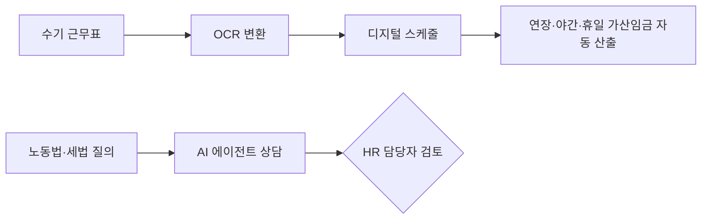

## Summary

**플렉스(flex)**는 한국 올인원 HR SaaS 플랫폼으로, **6만+ 기업** 가입·**ARR 300억원** 돌파, 기업가치 **5,000억원** 평가. 인사·급여·채용·성과관리·전자계약·비용관리를 단일 플랫폼에 통합. 2025년 **OCR 기반 수기 근무표 자동변환** + **노동법·세법 AI 에이전트 상담** 기능의 순차 도입을 발표하며, "SaaS → Service as a Software" 패러다임 전환을 선언. [[sources/flex-korea-hr-saas-2025.md]]

## Problem / Why

- 한국 중소·중견기업의 HR 업무가 **엑셀·수기 관리**에 의존 — 특히 급여·근태
- 노동법·세법이 복잡하고 빈번히 변경 → **전문 인력 없는 기업이 컴플라이언스 위험** 노출
- 수기 근무표 → 디지털 전환 시 **입력 오류·시간 낭비**
- 국내 HR SaaS 시장에서 AI 기능은 아직 초기 단계

## Solution Architecture (요약)

### A. Process (프로세스)

- **Before**: 수기 근무표 → 엑셀 입력 → 급여 수동 계산 → 노동법 변경 시 수동 반영
- **After (계획)**: OCR이 수기 근무표를 앱 내 스케줄로 자동 변환 → AI 에이전트가 노동법·세법 이슈 상담 → 근태 데이터 기반 연장·야간·휴일 가산임금 자동 산출 [[sources/flex-korea-hr-saas-2025.md]]
- **HITL 지점**: AI 상담 결과는 참고 수준 — 최종 급여·근태 의사결정은 HR 담당자
- **Stage**: pilot (AI 기능은 순차 도입 중, 아직 프로덕션 아님)
- **Scope of autonomy**: Recommend (AI 상담)

### B. System & Infrastructure

- **Core 플랫폼**: flex (자체 개발 SaaS) — 웹 + 모바일 앱 [[sources/flex-korea-hr-saas-2025.md]]
- **AI 기능**: OCR (근무표 변환) + AI 에이전트 (노동법·세법 상담) — 순차 도입 중 [[sources/flex-korea-hr-saas-2025.md]]
- **기능 범위**: 인사·급여·채용·성과관리·전자계약·비용관리·단체보험 [[sources/flex-korea-hr-saas-2025.md]]
- 배포 환경·연동 상세: _미공개 (not disclosed)_

### C~E. Data / Model / Organization

- _미공개 (not disclosed)_

## Impact / Metrics

### 기대효과 요약

한국 중소·중견기업 HR 디지털 전환 + 노동법 컴플라이언스 자동화. AI 기능은 도입 초기 단계.

| 지표 | 값 | 출처 | 성격 |
|---|---|---|---|
| 가입 기업 수 | **6만+** | flex 공식 블로그 | ⚠️ 자사 보고 |
| ARR | **300억원** | flex 공식 블로그 | ⚠️ 자사 보고 |
| 기업가치 | **5,000억원** | 투자 발표 | ⚠️ 자사 보고 (공개 투자 정보) |
| AI 기능 상태 | OCR + 노동법 AI 에이전트 — **순차 도입 중** | flex 공식 | ⚠️ 자사 보고 |

**AI 기능 자체의 outcome metric (상담 정확도·시간 절감 등)은 _미공개 (not disclosed)_.**

## Governance & Risk

- 노동법·세법 AI 상담의 **정확성**: 잘못된 법률 조언 → 사업주 리스크
- 한국 개인정보보호법(PIPA) 하에서 **근태·급여 데이터의 AI 활용** 범위
- AI 에이전트가 대체하는 것은 자문(상담) 수준 — 법적 책임은 여전히 사업주에게

## Consulting Angle

### 활용 포인트
- **한국 HR SaaS 시장의 AI 전환 현주소**: flex는 시장 선도자(6만 기업)이나 AI는 아직 pilot — "한국 HR tech의 AI 성숙도"를 보여주는 바로미터
- **더존(Douzone) vs 플렉스(flex) vs 시프티(Shiftee)**: 한국 HR AI 삼각 비교 — 더존(연말정산 AI), 플렉스(올인원 + AI 에이전트), 시프티(근태 특화)
- **"SaaS → Service as a Software" 방향성**: 단순 도구 제공을 넘어 AI 상담까지 — HR 컨설팅 영역과 겹치기 시작

### 한국 대기업 적용
- flex는 주로 중소·중견 → 대기업은 SAP SF/Workday가 주 → 그러나 flex의 AI 에이전트 모델(노동법 상담)은 대기업 HRIS에도 적용 가능한 개념
