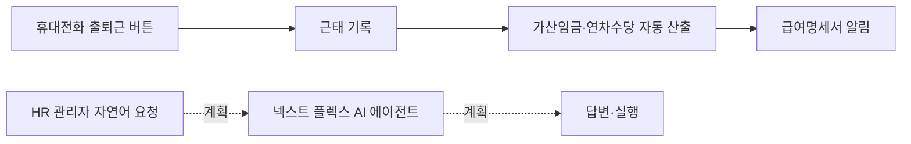

## Summary

**플렉스(flex)**는 한국 올인원 HR SaaS 플랫폼으로, 누적 가입 기업 **6만곳+**·**ARR 300억원** 돌파, 100억원 규모 브릿지 투자로 기업가치 **5000억원** 평가 [[sources/flex-korea-hr-saas-2025]]. 인사·급여·채용·성과관리를 웹·모바일 앱으로 제공하고 근태 데이터 기반 연장·야간·휴일근로 가산임금·미사용 연차수당을 자동 산출 [[sources/flex-korea-hr-saas-2025]]. 차기 성장 엔진 **'넥스트 플렉스'** 프로젝트: HR 관리자가 자연어로 요청("승진 대상자 추려줘", "연봉 인상률 제안해줘")하면 **AI 에이전트**가 답변·실행하고 성과관리 알림·제안을 병행하는 것이 **목표** [[sources/flex-korea-hr-saas-2025]]. 기존 페이지의 "OCR 수기 근무표 변환"·"노동법·세법 AI 상담"·"Service as a Software" 서술은 인용 소스 raw에서 확인되지 않아 _미공개_ 처리 (2026-09-27 grounding 점검).

## Problem / Why (도입 배경)

- **Before (baseline)**: 중소기업이 엑셀·수기로 근로시간·급여·휴가를 관리 → 초과수당 과소 지급·세금 공제 누락 등 오류 빈발; 직원 50명 초과 시 업무량 급증하나 전문 인사팀 두기엔 인건비 부담 [[sources/flex-korea-hr-saas-2025]]
- **Pain point**: 단순반복 행정 업무(데이터 입력·서류 관리·급여 계산)에 HR 시간 소모 — 창업자 장해남 대표의 대기업 HR 경험 [[sources/flex-korea-hr-saas-2025]]
- **Trigger**: 2019년 창업; AI 에이전트('넥스트 플렉스')는 투자 유치 후 "다음 성장 엔진"으로 가동 [[sources/flex-korea-hr-saas-2025]]

## Solution Architecture

### A. Process (프로세스)

- **Before**: 수기·엑셀 근태 → 며칠 걸리는 급여 정산 → 연말정산 오류 [[sources/flex-korea-hr-saas-2025]]
- **After (현행 SaaS)**: 구성원이 휴대전화로 출퇴근 버튼 → 근태 기록 저장 → 연장·야간·휴일근로 가산임금·미사용 연차수당을 적법성 판단해 자동 산출 → 급여명세서 알림 전달; 연말정산은 홈택스 자료를 자동 분석·적용 [[sources/flex-korea-hr-saas-2025]]
- **After (계획 — '넥스트 플렉스' AI 에이전트)**: 경영진·HR 관리자가 "올해 성과 평가를 바탕으로 내년 승진 대상자를 추려줘", "물가 인상율을 고려해 연초 연봉 인상율을 제안해줘" 등을 입력하면 AI 에이전트가 답변하거나 실행; 구성원 일정·할 일·목표 달성도를 적시에 상기시키고 개선점 제안 [[sources/flex-korea-hr-saas-2025]]
- **HITL 지점**: _미공개 (not disclosed)_ — 소스는 "답변을 내놓거나 실행한다"고만 기술
- **Stage**: announced — '넥스트 플렉스'는 "목표"로 기술된 프로젝트 [[sources/flex-korea-hr-saas-2025]]
- **Scope of autonomy**: _미공개 (not disclosed)_ ("답변 또는 실행"으로 혼재)

```mermaid
flowchart LR
    A[휴대전화 출퇴근 버튼] --> B[근태 기록]
    B --> C[가산임금·연차수당 자동 산출]
    C --> D[급여명세서 알림]
    E[HR 관리자 자연어 요청] -.->|계획| F[넥스트 플렉스 AI 에이전트]
    F -.->|계획| G[답변·실행]
```

범례: 실선 = 소스 확인(현행 기능), 점선 = 계획(넥스트 플렉스).

### B. System & Infrastructure (시스템·인프라)

- **Core 플랫폼**: flex (자체 개발 올인원 SaaS) — 웹 + 모바일 앱 [[sources/flex-korea-hr-saas-2025]]
- **AI 시스템 배치**: '넥스트 플렉스' AI 에이전트 — 플랫폼 내장 예정 [[sources/flex-korea-hr-saas-2025]]; 배치 형태 세부 _미공개 (not disclosed)_
- **기능 범위**: 인사·급여·채용·성과관리·비용관리(법인카드 영수증·출장비·팀 예산 연동) [[sources/flex-korea-hr-saas-2025]]; 소상공인용 '플렉스 미니' [[sources/flex-korea-hr-saas-2025]]
- **데이터 스토어**: '뉴 코어' — 국가별 급여 세율·사회보험료·공휴일 캘린더 실시간 업데이트 (해외 진출용) [[sources/flex-korea-hr-saas-2025]]
- **배포 환경·연동 상세**: _미공개 (not disclosed)_

### C. Data (데이터)

- **입력 데이터 소스**: 근태 기록, 급여·연차 데이터, 홈택스 연말정산 자료, 성과 평가·보상 데이터(AI 에이전트 계획) [[sources/flex-korea-hr-saas-2025]]
- **데이터 규모**: 누적 가입 기업 6만곳+ [[sources/flex-korea-hr-saas-2025]]; 사용자 수 _미공개 (not disclosed)_
- **전처리·정제**: _미공개 (not disclosed)_
- **학습 vs RAG vs In-context**: _미공개 (not disclosed)_
- **데이터 거버넌스**: _미공개 (not disclosed)_
- **민감정보 처리**: _미공개 (not disclosed)_

### D. Model (모델)

- **Foundation model**: _미공개 (not disclosed)_
- **Model 유형**: _미공개 (not disclosed)_ — "AI 에이전트"로만 기술 [[sources/flex-korea-hr-saas-2025]]
- **제공 방식**: _미공개 (not disclosed)_
- **커스터마이징 기법**: _미공개 (not disclosed)_
- **평가·가드레일**: _미공개 (not disclosed)_

### E. Organization & Team (조직·팀 구조)

- **오너십**: 플렉스팀 자체 (장해남 대표 창업, 2019) [[sources/flex-korea-hr-saas-2025]]
- **참여 역할**: _미공개 (not disclosed)_
- **팀 규모·기간**: _미공개 (not disclosed)_
- **거버넌스 체계**: _미공개 (not disclosed)_
- **파트너**: 투자자 한리버파트너스 (100억원 브릿지) [[sources/flex-korea-hr-saas-2025]]; 구현 파트너 _미공개_

## Impact / Metrics (기대효과)

### 기대효과 요약

한국 중소·중견기업 HR 디지털 전환(근태·급여·연말정산 자동화). AI 에이전트는 계획 단계로 outcome metric _미공개_.

| 지표 | 값 | 출처 | 성격 |
|---|---|---|---|
| 누적 가입 기업 수 | **6만곳+** | flex 블로그(기사 전재) | ⚠️ 자사 보고 |
| ARR | **300억원** 돌파 | flex 블로그(기사 전재) | ⚠️ 자사 보고 |
| 기업가치 | **5000억원** (100억원 브릿지 투자) | flex 블로그(기사 전재) | ⚠️ 자사 보고 |
| 누적 투자 유치 | **800억원대** (7월 기준, 신보 보증 포함) | flex 블로그(기사 전재) | ⚠️ 자사 보고 |
| AI 에이전트 상태 | '넥스트 플렉스' — **계획(목표)** | flex 블로그(기사 전재) | ⚠️ 자사 보고 |
| 고객 정성 효과 | 급여 정산 "엑셀 작업만도 며칠" → 자동 산출 (A대표 인용) | flex 블로그(기사 전재) | ⚠️ 자사 보고 |

**AI 에이전트 자체의 outcome metric은 _미공개 (not disclosed)_.**

## Governance & Risk

- AI 에이전트가 승진 대상자 선별·연봉 인상률·처우 협상안을 제안·실행하는 것이 목표 [[sources/flex-korea-hr-saas-2025]] → 평가·승진·보상 의사결정 관여 = AI 기본법 고영향 AI 검토 대상(`kr-high-impact-review`) 가능성; 근로자대표 협의 필요
- 가산임금 "적법성 판단" 자동 산출의 오류 책임은 사업주에게 귀속 — HITL 검증 절차 _미공개_
- 한국 개인정보보호법(PIPA) 하에서 근태·급여·평가 데이터의 AI 활용 범위·동의 절차 _미공개_

## Contradictions

> [!note] 2026-09-27 grounding — 인용 소스(flex 블로그의 기사 전재, raw 확인)에는 "OCR 기반 수기 근무표 자동변환", "노동법·세법 AI 에이전트 상담", "SaaS → Service as a Software", "전자계약·단체보험"이 없음. raw에 실제로 기술된 AI 계획은 '넥스트 플렉스' AI 에이전트(승진 대상자·연봉 인상률·처우 협상안 제안, 성과관리 알림)이므로 본문을 이에 맞춰 재작성하고, 소스가 "목표"로 기술한 점을 반영해 stage를 pilot → announced로 조정. frontmatter `output`은 기존 서술을 유지하고 있어 재검토 필요.

## Consulting Angle

### 활용 포인트
- **한국 HR SaaS 시장의 AI 전환 현주소**: flex는 시장 선도자(6만 기업)이나 AI 에이전트는 아직 계획 단계 — "한국 HR tech의 AI 성숙도"를 보여주는 바로미터
- **더존(Douzone) vs 플렉스(flex) vs 시프티(Shiftee)**: 한국 HR AI 삼각 비교 — 더존(연말정산 AI), 플렉스(올인원 + AI 에이전트), 시프티(근태 특화)
- **AI 에이전트 방향성**: 단순 도구 제공을 넘어 승진·보상 의사결정 지원까지 — HR 컨설팅 영역과 겹치기 시작

### 한국 대기업 적용
- flex는 주로 중소·중견 → 대기업은 SAP SF/Workday가 주 → 그러나 flex의 AI 에이전트 모델(자연어 HR 의사결정 지원)은 대기업 HRIS에도 적용 가능한 개념
