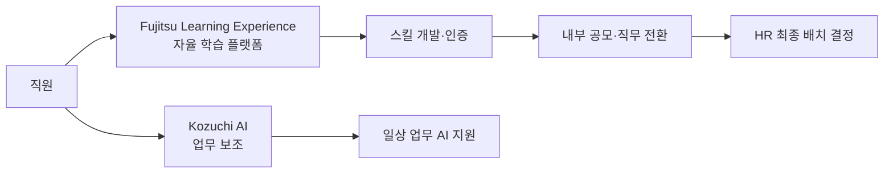

## Summary

Fujitsu는 73,000명(일본 기준)의 직원에 대한 스킬 기반 HR 전환을 추진하며, 내부 개발 AI 플랫폼 Kozuchi를 전사 배포했다. ✅ **Fact** Kozuchi는 월 69,000명 이상의 활성 사용자와 하루 약 380,000건의 사용량을 기록하고 있다. FY2020~FY2022 기간에 일본 직원의 약 25%(약 20,000명)가 자발적으로 내부 공모직에 지원했다. ⚠️ **자사 보고** [[sources/diginomica-fujitsu-hcm-ai-2025.md]] [[sources/unleash-fujitsu-chro-ai-2025.md]]

## Problem / Why (도입 배경)

Fujitsu는 글로벌 IT 서비스 시장 변화 속에서 기존 직무 중심 HR 관리 시스템으로는 스킬 기반의 유연한 인력 배치가 불가능하다는 문제를 인식했다. 또한 일본의 경직된 노동 시장에서 자발적 경력 개발과 내부 이동성을 높이는 것이 과제였다.

## Solution Architecture

> **최우선 원칙**: 이 섹션은 **공개된 사실만** 기록한다.

### A. Process (프로세스)

- **Before (As-is)**: 직무(Job) 중심의 경직된 HR 관리. 내부 이동 기회 제한.
- **After (To-be)**:
  1. ✅ **Fact** 모든 직무 역할에 스킬을 할당하여 지역별 스킬 갭 파악 → 업스킬링·리스킬링 프로그램 실행. [[sources/unleash-fujitsu-chro-ai-2025.md]]
  2. ✅ **Fact** Fujitsu Learning Experience(온디맨드 학습 플랫폼) — 직원이 커리어 목표를 설정하고 자율적으로 학습. [[sources/unleash-fujitsu-chro-ai-2025.md]]
  3. ✅ **Fact** 내부 공모제 — FY2020~FY2022에 일본 73,000명 중 약 25%(20,000명)가 자발적 지원. [[sources/unleash-fujitsu-chro-ai-2025.md]]
  4. ✅ **Fact** Kozuchi AI 플랫폼 전사 배포 — 업무 AI 보조, 월 69,000명 활성 사용자, 일 380,000건 사용. [[sources/diginomica-fujitsu-hcm-ai-2025.md]]
- **Human-in-the-loop**: 최종 직무 배치·승진 결정은 인간(매니저·HR).
- **Trigger & Frequency**: 학습 온디맨드; 스킬 갭 분석 주기적.
- **Scope of autonomy**: Recommend 수준.

범례: 실선 = [[sources/unleash-fujitsu-chro-ai-2025.md]] [[sources/diginomica-fujitsu-hcm-ai-2025.md]] 확인.

### B. System & Infrastructure (시스템·인프라)

- **AI 플랫폼**: ✅ **Fact** Kozuchi — Fujitsu 자체 개발 내부 AI 플랫폼. [[sources/diginomica-fujitsu-hcm-ai-2025.md]]
- **학습 플랫폼**: ✅ **Fact** Fujitsu Learning Experience (온디맨드). [[sources/unleash-fujitsu-chro-ai-2025.md]]
- **Core HRIS**: _미공개 (not disclosed)_
- **배포 환경**: _미공개 (not disclosed)_

### C. Data (데이터)

- **데이터 규모**: ✅ **Fact** 일본 73,000명, 글로벌 직원 규모 더 큼. [[sources/unleash-fujitsu-chro-ai-2025.md]]
- **Kozuchi 사용 데이터**: ✅ **Fact** 월 69,000 활성 사용자, 일 380,000건 사용. [[sources/diginomica-fujitsu-hcm-ai-2025.md]]
- **데이터 거버넌스**: _미공개 (not disclosed)_

### D. Model (모델)

- **Foundation model**: _미공개 (not disclosed)_ — Kozuchi 내부 모델. 구체 LLM 미공개.
- **커스터마이징 기법**: _미공개 (not disclosed)_

### E. Organization & Team (조직·팀 구조)

- **CHRO 리더십**: ✅ **Fact** Fujitsu CHRO가 "AI는 HR을 신뢰받는 비즈니스 파트너로 전환할 수 있다"는 비전을 공개 천명. [[sources/unleash-fujitsu-chro-ai-2025.md]]
- **전략 프레임워크**: ✅ **Fact** Human Capital Value Enhancement Model — AI 공존, 인간 중심 조직 전환, 데이터 기반 HR 세 축. [[sources/unleash-fujitsu-chro-ai-2025.md]]
- **팀 규모**: _미공개 (not disclosed)_

## Impact / Metrics (기대효과)

### 기대효과 요약
일본 직원 25%(20,000명) 내부 공모 자발적 지원, AI 플랫폼 Kozuchi 월 69,000 활성 사용자 확보 (자사 보고 기반).

- ⚠️ **자사 보고**: FY2020~FY2022에 일본 직원 25%(20,000명)가 내부 공모 자발적 지원. [[sources/unleash-fujitsu-chro-ai-2025.md]]
- ⚠️ **자사 보고**: Kozuchi — 월 69,000 활성 사용자, 일 380,000건 사용. [[sources/diginomica-fujitsu-hcm-ai-2025.md]]

## Governance & Risk

- 일본 노동 규제 환경 — 직무 전환 시 근로계약법 관련 이슈. _미공개 (not disclosed)_.
- CHRO의 "인간 중심(Human-centric)" 원칙: AI를 통한 인력 감축이 아닌 역량 강화 철학을 공개적으로 표명.

## Contradictions

없음 (현재 기준).

## Consulting Angle

- **일본 기업의 HR AI 선도 패턴**: 일본 기업의 전형적인 종신 고용·연공서열 문화를 탈피하고 스킬 기반·내부 공모제로 전환하는 과정에서 AI가 핵심 역할. 일본 법인을 가진 한국 기업 클라이언트에게 참고 사례.
- **내부 공모제 활성화 + AI**: 25% 자발적 지원율은 "AI가 내부 이동성을 진짜로 높일 수 있다"는 증거. 국내 기업의 사내 공모제 활성화 제안 시 수치 레퍼런스.
- **자체 AI 플랫폼 Kozuchi**: 대형 IT 서비스 기업이 자사 AI 플랫폼을 HR에 내부 배포하는 사례 — 삼성SDS·LG CNS 등 유사 기업의 내부 AI 플랫폼 HR 적용 가능성 논의에 참고.
- **CHRO의 비전 리더십**: "AI가 HR을 전략적 파트너로 전환"이라는 프레임은 HR 리더십 워크숍·제안서 도입부에 인용 가능.
