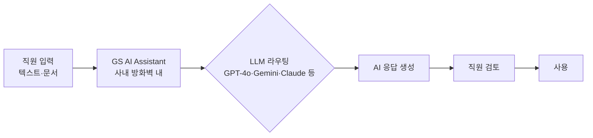

## Summary

Goldman Sachs는 2025년 1월 GS AI Assistant를 10,000명 파일럿으로 시작, 2025년 6월 전 지식노동자 대상 전사 배포를 완료했다. ✅ **Fact** 이 도구는 다수의 LLM(OpenAI GPT-4o/o3-mini, Google Gemini 2.0, Anthropic Claude 3.7 포함)을 단일 인터페이스로 접근하는 멀티모델 어시스턴트로, 문서 요약·리서치 노트 초안·규제 문서 분석·코드 생성·다국어 번역 등을 지원한다. [[sources/fortune-goldman-gs-ai-2025-06.md]]

## Problem / Why (도입 배경)

Goldman Sachs의 지식노동자들은 리서치 노트 작성, 규제 문서 요약, 클라이언트 쿼리 응답 등 정형화된 고숙련 작업에 많은 시간을 소비하고 있었다. 외부 AI 도구 사용 시 민감 금융·고객 데이터가 방화벽 외부로 유출될 위험이 있었다.

## Solution Architecture

> **최우선 원칙**: 이 섹션은 **공개된 사실만** 기록한다.

### A. Process (프로세스)

- **Before (As-is)**: 지식노동자가 직접 문서 작성, 수동 검색, 개별 도구 사용.
- **After (To-be)**: ✅ **Fact** GS AI Assistant를 통해 문서 요약, 리서치 노트·코드·번역 초안 생성. 다양한 부서(채용·운영·리서치 등)에서 사용. [[sources/fortune-goldman-gs-ai-2025-06.md]]
- **Human-in-the-loop (HITL) 지점**: AI 생성 콘텐츠는 직원이 검토 후 사용. 완전 자율 의사결정 없음.
- **Trigger & Frequency**: 일상 업무 중 수시(on-demand).
- **Scope of autonomy**: Recommend 수준.

범례: 실선 = [[sources/fortune-goldman-gs-ai-2025-06.md]] 확인.

### B. System & Infrastructure (시스템·인프라)

- **Core HRIS / 기반 시스템**: _미공개 (not disclosed)_
- **AI 시스템 배치**: ✅ **Fact** 사내 방화벽 내 격리 운영. 외부 LLM들과 연동하되 데이터가 외부로 나가지 않도록 설계. [[sources/cnbc-goldman-gs-ai-assistant-2025-01.md]]
- **배포 환경**: _미공개 (not disclosed)_
- **사용자 접점 (UX layer)**: _미공개 (not disclosed)_ — 웹 인터페이스로 추정되나 소스에 명시 없음.
- **인증·권한**: _미공개 (not disclosed)_

### C. Data (데이터)

- **입력 데이터 소스**: 직원이 입력하는 텍스트·문서. 내부 지식베이스 연동 여부 _미공개 (not disclosed)_.
- **데이터 거버넌스**: ✅ **Fact** 사내 방화벽 격리로 민감 데이터 유출 차단. [[sources/cnbc-goldman-gs-ai-assistant-2025-01.md]]
- **민감정보 처리**: _미공개 (not disclosed)_

### D. Model (모델)

- **Foundation model**: ✅ **Fact** OpenAI GPT-4o, GPT-4o-mini, o3-mini; Google Gemini 2.0 Flash, Gemini 2.0 Flash Vision, Gemini 1.5 Flash, Gemini 1.5 Pro; Anthropic Claude 3.7 Sonnet; 오픈소스 모델. [[sources/fortune-goldman-gs-ai-2025-06.md]]
- **Model 유형**: LLM (생성형), 멀티모델.
- **제공 방식**: 다수 외부 벤더 API + 내부 포털 라우팅.
- **커스터마이징 기법**: _미공개 (not disclosed)_

### E. Organization & Team (조직·팀 구조)

- **오너십**: _미공개 (not disclosed)_
- **팀 규모**: ✅ **Fact** 2024년에만 AI 엔지니어 500명 이상 신규 채용. [[sources/hrkatha-goldman-ai-assistant-2025.md]]
- **거버넌스 체계**: _미공개 (not disclosed)_

## Impact / Metrics (기대효과)

### 기대효과 요약
10,000명 파일럿에서 전사 확대(Fact). 파일럿 참여자가 효율 개선 및 시간 절약 보고하나 구체 수치 미공개 (자사 보고).

- ✅ **Fact**: 10,000명 파일럿 → 전사 지식노동자 전체로 확대 (2025년 6월). [[sources/fortune-goldman-gs-ai-2025-06.md]]
- ⚠️ **자사 보고**: 파일럿 참여자들이 효율 개선 및 정확도 향상, 시간 절약 보고. 독립 검증 미확인. [[sources/fortune-goldman-gs-ai-2025-06.md]]

## Governance & Risk

- 사내 방화벽 내 격리 운영으로 금융 민감 데이터 보호.
- 향후 agentic AI(멀티스텝 자율 실행) 도입 계획 공개 — 현재는 생성 보조 수준.
- 세부 AI 윤리·편향 감사 체계: _미공개 (not disclosed)_

## Consulting Angle

- JPMorgan LLM Suite와 함께 "월가 지식노동자 AI 생산성 플랫폼" 대표 사례로 짝으로 제시. 두 사례 모두 멀티모델·내부 방화벽 격리·전사 배포의 공통 패턴.
- 국내 증권사·보험사 AI 도입 로드맵 제안 시, 파일럿(10,000명) → 전사(전체) 단계적 확대 전략의 실증 레퍼런스.
- **반면교사**: 2024년 AI 엔지니어 500명 신규 채용은 "내재화 전략의 비용 현실"을 보여줌. 외부 벤더 SaaS 대비 내재화 비용 비교 시 활용.
