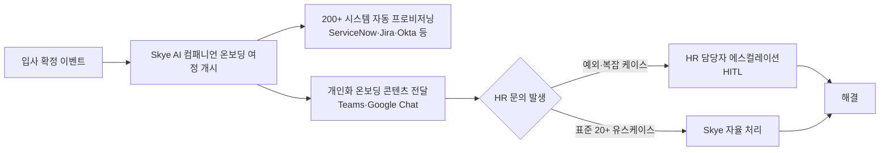
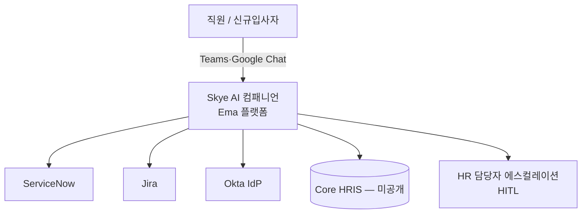

## Summary

Hitachi는 Ema의 에이전틱 AI 플랫폼 위에 **Skye**라는 HR 전담 AI 컴패니언을 구축했다. 5개 사업부 + 공유 HR 서비스 조직(40,000명+ 지원)을 대상으로 2025년 초 파일럿을 시작했으며, 온보딩·교육·복리후생·오프보딩 등 20개+ 유스케이스를 커버한다. 초기 온보딩 기간을 4일 단축하고 HR 담당자 개입 시간을 신규입사자 1인당 20시간 → 12시간으로 줄였다.

## Problem / Why

- 신규 입사자 온보딩에 최대 15일 소요 — 수작업 서류 + 부서 간 단편화된 커뮤니케이션
- HR 문의 평균 해결 시간 5일 이상 (인력 분산: 미국·일본·유럽)
- 수만 건 규모의 연간 신규입사자 처리 시 확장성 부재

## Solution Architecture

### A. Process (프로세스)

- **Before (As-is)**:
  1. HR 담당자가 각 신규입사자에게 개별 이메일·서류 안내
  2. ServiceNow·Jira·Okta 등 다수 시스템에 수작업 등록
  3. HR 문의는 담당자 직접 응답 — 평균 5일+ 소요
  4. 온보딩 완료까지 최대 15일

- **After (To-be)**:
  1. Skye가 입사 확정 시점에 개인화 온보딩 여정 자동 개시
  2. ServiceNow·Jira·Okta·Teams·Google Chat 등 200+ 시스템 자동 연동·프로비저닝
  3. HR 문의 → Skye가 1차 처리 (20+ 유스케이스 대응); 복잡 건만 담당자 에스컬레이션
  4. 온보딩 완료: 기존 대비 4일 단축

- **Human-in-the-loop (HITL) 지점**: 복잡한 개인 사정·예외 케이스 에스컬레이션 → HR 담당자 최종 처리
- **Trigger & Frequency**: 입사 확정 이벤트 기반 (daily); HR 문의는 상시(daily)
- **Scope of autonomy**: 온보딩 표준 태스크 + 정보 안내 = autonomous; 예외 처리 = approve-then-act

범례: 실선 = HR Executive / Ema 케이스 스터디에서 확인

### B. System & Infrastructure (시스템·인프라)

- **Core HRIS / 기반 시스템**: _미공개 (not disclosed)_
- **AI 시스템 배치**: Ema 에이전틱 AI 플랫폼 (별도 SaaS) 위에 자사 전용 Skye 구축
- **배포 환경**: _미공개 (not disclosed)_
- **연동·통합**: ✅ Fact — ServiceNow, Jira, Okta, Microsoft Teams, Google Chat (200+ 사전 통합 커넥터)
- **사용자 접점 (UX layer)**: Microsoft Teams, Google Chat (봇 인터페이스)
- **인증·권한**: _미공개 (not disclosed)_
- **사용 언어·지역**: 미국·일본·유럽 멀티-리전

범례: 실선 = 소스 확인 / 점선 없음 (미확인 연결은 도식에서 제외)

### C. Data (데이터)

- **입력 데이터 소스**: 직원 마스터 데이터 (입사 확정 이벤트), 정책·절차 문서, 온보딩 태스크 체크리스트
- **데이터 규모**: 40,000+ 직원 대상 지원 범위; 연간 신규 입사자 수 불명
- **전처리·정제**: _미공개 (not disclosed)_
- **학습 vs RAG vs In-context**: _미공개 (not disclosed)_
- **데이터 거버넌스**: _미공개 (not disclosed)_
- **민감정보 처리**: _미공개 (not disclosed)_

### D. Model (모델)

- **Foundation model**: _미공개 (not disclosed)_ — Ema 플랫폼 내부 모델 아키텍처
- **Model 유형**: Agentic AI (tool-use, 멀티시스템 오케스트레이션)
- **제공 방식**: _미공개 (not disclosed)_
- **커스터마이징 기법**: _미공개 (not disclosed)_
- **평가·가드레일**: _미공개 (not disclosed)_

### E. Organization & Team (조직·팀 구조)

- **오너십**: HR 부서 주도 (5개 사업부 + 공유 HR 서비스 조직)
- **참여 역할**: _미공개 (not disclosed)_
- **팀 규모·기간**: 2025년 초 파일럿 개시 (구체 기간·인력 규모 미공개)
- **거버넌스 체계**: _미공개 (not disclosed)_
- **파트너**: Ema (플랫폼 파트너)

## Impact / Metrics (기대효과)

### 기대효과 요약
온보딩 소요 기간 4일 단축, HR 담당자 개입 시간 20시간에서 12시간으로 40% 감소 (자사 보고 기반).

| 지표 | 이전 | 이후 | 신뢰도 |
|---|---|---|---|
| 온보딩 소요 기간 | 최대 15일 | 4일 단축 | ⚠️ 자사 보고 (HR Executive 매개) |
| HR 담당자 개입 시간/신규입사자 | 20시간 | 12시간 | ⚠️ 자사 보고 |
| HR 문의 평균 해결 시간 | 5일+ | 미공개 | ✅ Fact (HR Executive) |
| 전체 HR 활동 시간 절감 (예측) | — | 50–70% | ⚠️ 벤더 주장 (Ema) |

## Governance & Risk

- HITL 지점: 예외·복잡 케이스는 담당자 에스컬레이션
- 다국적 데이터 처리(미·일·유럽) 관련 개인정보 거버넌스: _미공개 (not disclosed)_
- 에이전틱 AI의 멀티시스템 쓰기 권한 범위 및 오류 복구 메커니즘: _미공개 (not disclosed)_

## Contradictions

없음 (단일 소스 구조).

## Consulting Angle

- **벤치마크 활용**: 온보딩 기간 단축(15→11일) + HR 시간 절감(20→12h) 지표는 제조·글로벌 기업 HR 자동화 ROI 제안에 즉시 활용 가능
- **아키텍처 참고**: 200+ 커넥터 기반 에이전틱 통합은 "API 연동 복잡도"를 걱정하는 클라이언트에 대한 반박 사례로 유효
- **한국 대기업 적용 시 제약**: 국내 개인정보보호법상 해외 클라우드 저장 제약, 카카오워크·네이버웍스 등 국내 메신저 통합 여부 별도 검토 필요
- **파생 질문**: "Skye의 에스컬레이션 기준 로직은 어떻게 설계되어 있는가?" — 미공개이므로 추가 조사 필요
