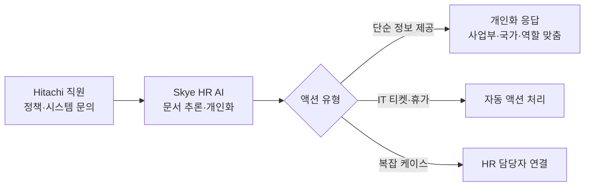

## Summary

Hitachi는 2025년 초 HR AI 어시스턴트 "Skye"를 도입했다. ✅ **Fact** Skye는 사업부·국가·역할에 따라 문서를 추론하고 응답을 개인화하며, IT 서비스 티켓 생성·휴가 요청 처리 등 인텔리전트 액션도 수행한다. Hitachi의 접근이 특별한 이유는 **문화 설계**에 있다: Skye에 이름과 개성을 부여하여 직원들이 "또 다른 챗봇"이 아닌 "동료 AI"로 인식하도록 설계했다. [[sources/hrexecutive-hitachi-skye-2025.md]]

## Problem / Why (도입 배경)

- **Before (baseline)**: Hitachi는 **다수의 사업부(BU)와 다국가 운영** 환경에서 HR 정책·복리후생·시스템이 BU·국가별로 상이. 직원이 자기에게 맞는 정책을 찾으려면 **어느 문서를, 어떤 버전으로, 어느 부서에 물어야 하는지** 파악이 어려움. ❓ **구체 수치(월간 HR 문의 건수·평균 해결 시간) 미공개**
- **Pain point**: (1) **정책 탐색의 복잡성** — BU·국가·역할별로 적용되는 정책이 다르기 때문에 "하나의 답"이 없음 → 직원 불만·프로세스 지연. (2) **HR 팀에 반복 문의 집중** — 같은 유형의 질문(복리후생·휴가·IT 요청)이 반복적으로 HR에 유입 → HR의 전략적 업무 시간 잠식
- **Trigger**: Hitachi가 "**문화 설계**" 관점에서 AI를 도입하기로 결정 — 단순 챗봇이 아니라 **이름(Skye)과 개성을 부여한 "동료 AI"**로 설계해 직원 수용도를 높이겠다는 차별화 전략

## Solution Architecture

> **최우선 원칙**: 이 섹션은 **공개된 사실만** 기록한다.

### A. Process (프로세스)

- **Before (As-is)**: 직원이 복잡한 HR 정책·복리후생·시스템을 탐색하다 막히면 HR 팀에 문의.
- **After (To-be)**:
  1. ✅ **Fact** Skye가 정책 문서를 추론하여 사업부·국가·역할에 맞게 개인화된 응답 제공. [[sources/hrexecutive-hitachi-skye-2025.md]]
  2. ✅ **Fact** IT 서비스 티켓 생성, 휴가 요청 처리 등 지능적 액션 수행. [[sources/hrexecutive-hitachi-skye-2025.md]]
  3. ✅ **Fact** 채용·온보딩·리텐션 영역의 유스케이스 개발 진행 중. [[sources/hrexecutive-hitachi-skye-2025.md]]
- **Human-in-the-loop**: 복잡한 케이스 에스컬레이션. 세부 _미공개 (not disclosed)_.
- **Trigger & Frequency**: 직원 문의 발생 시 수시(on-demand).
- **Scope of autonomy**: ✅ **Fact** 티켓 생성·휴가 요청 등 일부 액션은 자율 처리(autonomous). 복잡 케이스는 recommend. [[sources/hrexecutive-hitachi-skye-2025.md]]

범례: 실선 = [[sources/hrexecutive-hitachi-skye-2025.md]] 확인.

### B. System & Infrastructure (시스템·인프라)

- **Core HRIS**: _미공개 (not disclosed)_
- **AI 시스템 배치**: _미공개 (not disclosed)_ — 구체 플랫폼/벤더 미공개.
- **연동·통합**: ✅ **Fact** IT 서비스 시스템 연동 (티켓 생성). [[sources/hrexecutive-hitachi-skye-2025.md]]
- **사용자 접점**: _미공개 (not disclosed)_

### C. Data (데이터)

- **입력 데이터 소스**: HR 정책 문서, 복리후생 문서. 사업부·국가·역할별 개인화 데이터.
- **데이터 규모**: _미공개 (not disclosed)_
- **학습 vs RAG vs In-context**: ✅ **Fact** 문서 추론(document reasoning) 능력이 핵심으로 언급 — RAG 방식으로 추정되나 명시적 확인 없음. [[sources/hrexecutive-hitachi-skye-2025.md]]
- **데이터 거버넌스**: _미공개 (not disclosed)_

### D. Model (모델)

- **Foundation model**: _미공개 (not disclosed)_
- **커스터마이징 기법**: _미공개 (not disclosed)_

### E. Organization & Team (조직·팀 구조)

- **오너십**: HR 주도.
- **변화관리**: ✅ **Fact** Skye에 이름과 개성을 부여하여 "동료 AI"로 포지셔닝. 직원 마인드셋을 "AI = 도구"에서 "AI = 동료"로 전환하는 것이 핵심 과제였다고 공개. [[sources/hrexecutive-hitachi-skye-2025.md]]
- **팀 규모**: _미공개 (not disclosed)_

## Impact / Metrics (기대효과)

### 기대효과 요약
HR 문의 부담이 Skye로 이전되어 직원들의 빠른 답변 확보 보고되나, 구체 수치 미공개 (자사 보고 기반).

- ⚠️ **자사 보고**: HR 업무의 상당 부분이 HR 팀에서 Skye로 이전되어 직원들이 빠르게 답변을 얻는다고 보고. 구체 수치 _미공개 (not disclosed)_. [[sources/hrexecutive-hitachi-skye-2025.md]]

## Governance & Risk

- 세부 AI 거버넌스 체계 _미공개 (not disclosed)_.
- 일본 노동 규제 환경(근로계약법·노사관계) 적용. 구체 대응 _미공개 (not disclosed)_.

## Contradictions

없음 (현재 기준).

## Consulting Angle

- **"AI 동료 vs AI 도구" 설계 철학**: Hitachi의 Skye와 Bosch의 ROB 모두 이름·개성을 부여한 HR AI 어시스턴트. 이는 직원 채택률을 높이는 UX 설계 패턴으로, 국내 기업 HR AI 도입 시 "도구처럼 만들지 말고 동료처럼 만들라"는 설계 원칙으로 제시 가능.
- **일본 제조업 HR AI 선도 사례**: 일본의 낮은 AI 도입률(2024 기준 조직 24%만 AI 도입) 대비 Hitachi는 선도적 사례. 일본 사업 클라이언트(한국 기업의 일본 법인 등) 대상 참고 가능.
- **문서 추론 기반 개인화**: 사업부·국가·역할별 정책이 다른 글로벌 기업에서 단일 AI가 개인화 응답을 생성하는 패턴 — 복잡한 지주회사 구조의 국내 대기업(삼성·현대·LG 계열사)에 특히 적합한 아키텍처 방향.
- **데이터 부족**: HR Executive 단일 소스이며 수치·기술 스택 미공개 — stub 에 가까운 수준. 추가 검증 소스 필요.
