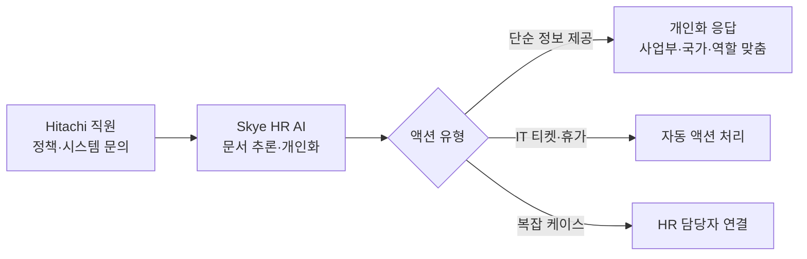
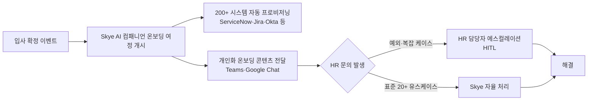
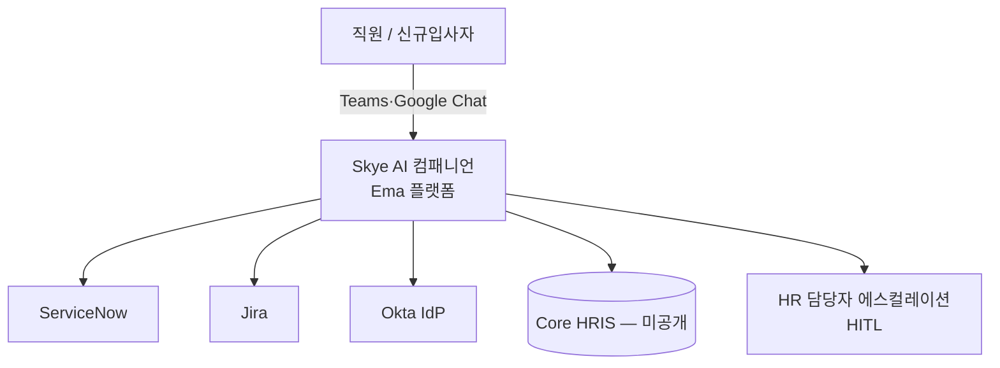

> [!contradiction] 2026-05-06 — PwC ER deck 분류 정정
> - **PwC 자료 주장 (2026-05)**: Hitachi AI HR Companion "Skye" Case (2022)를 **준법지원 (compliance·ER)** 영역의 통합 DB·후속 조치 reference로 분류
> - **공개 자료 검증 (2026-05-06)**: (a) Skye는 **2025년 출시** (2022년 아님, 출처: Ema customer story·HR Executive 기사·Constellation Research 모두 2025년) (b) Skye는 Hitachi 자체 빌드 아닌 **Ema 플랫폼 기반** (c) 공개 28 use case는 **온보딩·교육·성장·복리후생·오프보딩** 영역 — ER·노사·징계·고충처리 **명시되지 않음**
> - **결론**: Skye는 일반 HR 자가서비스 + onboarding/benefits 도구 — ER reference로 분류 부적합. PwC 자료의 출처 재확인 필요. Hitachi 별도 compliance hotline (50개 언어 글로벌)이 존재하나 Skye와 연동 여부 _미공개_

## Summary

Hitachi는 2025년 **Ema 플랫폼 기반 HR AI 어시스턴트 "Skye"**를 도입. ✅ Fact: 8주 미만(<8 weeks)에 go-live, **5개 사업부·40,000명+ 직원** 대상 [[sources/ema-hitachi-agentic-hr-2025.md]]; **20개+ systems of record** 환경 [[sources/hrexecutive-hitachi-skye-2025.md]]. ServiceNow·Jira·Okta 통합 + MS Teams·Google Chat 양방향 [[sources/ema-hitachi-agentic-hr-2025.md]]. (기존 "3개 BU·28 use case" 표기는 인용 소스에 없어 수정 — Contradictions 참조) 사업부·국가·역할에 따라 문서 추론·개인화 응답 + IT 서비스 티켓 생성·휴가 요청 처리 등 인텔리전트 액션. ⚠️ 벤더 주장 (Ema): **70% HR operational efficiency 향상**. Hitachi 차별화: **문화 설계** — Skye에 이름·개성 부여 → "AI = 도구"가 아닌 "AI = 동료" 마인드셋 전환. [[sources/hrexecutive-hitachi-skye-2025.md]] **온보딩 성과** (⚠️ 자사 보고, HR Executive 매개): 온보딩 최대 15일 → 4일 단축, 신규입사자 1인당 HR 개입 20h → 12h; 초기 배포는 5개 사업부 + 40,000명+ 지원 공유 HR 서비스 조직(미국·일본·유럽), 2025년 초 파일럿 개시. [[sources/ema-hitachi-agentic-hr-2025.md]] (2026-09-27 `hitachi-ema-agentic-hr-onboarding` 페이지 병합)

## Problem / Why (도입 배경)

- **Before (baseline)**: Hitachi는 **다수의 사업부(BU)와 다국가 운영** 환경에서 HR 정책·복리후생·시스템이 BU·국가별로 상이. 직원이 자기에게 맞는 정책을 찾으려면 **어느 문서를, 어떤 버전으로, 어느 부서에 물어야 하는지** 파악이 어려움. ✅ **Fact** 도입 전 HR 문의 평균 해결 시간 **5일 이상** (인력이 미국·일본·유럽에 분산) [[sources/ema-hitachi-agentic-hr-2025.md]]; ❓ **월간 HR 문의 건수 미공개**
- **Pain point**: (1) **정책 탐색의 복잡성** — BU·국가·역할별로 적용되는 정책이 다르기 때문에 "하나의 답"이 없음 → 직원 불만·프로세스 지연. (2) **HR 팀에 반복 문의 집중** — 같은 유형의 질문(복리후생·휴가·IT 요청)이 반복적으로 HR에 유입 → HR의 전략적 업무 시간 잠식
- **Trigger**: Hitachi가 "**문화 설계**" 관점에서 AI를 도입하기로 결정 — 단순 챗봇이 아니라 **이름(Skye)과 개성을 부여한 "동료 AI"**로 설계해 직원 수용도를 높이겠다는 차별화 전략
- **온보딩 특화 배경 (2026-09-27 병합 이관)**:
  - ✅ **Fact** 신규 입사자 온보딩에 **최대 15일** 소요 — 수작업 서류 + 부서 간 단편화된 커뮤니케이션 [[sources/ema-hitachi-agentic-hr-2025.md]]
  - ✅ **Fact** 신규입사자 1인당 HR 담당자 개입 **20시간** (도입 전) [[sources/ema-hitachi-agentic-hr-2025.md]]
  - 초기 대상: 5개 사업부 + 40,000명+ 직원을 지원하는 공유 HR 서비스 조직 (미국·일본·유럽) [[sources/ema-hitachi-agentic-hr-2025.md]]; ❓ 연간 신규입사자 수 미공개

## Solution Architecture

> **최우선 원칙**: 이 섹션은 **공개된 사실만** 기록한다.

### A. Process (프로세스)

- **Before (As-is)**: 직원이 복잡한 HR 정책·복리후생·시스템을 탐색하다 막히면 HR 팀에 문의.
- **After (To-be)**:
  1. ✅ **Fact** Skye가 정책 문서를 추론하여 사업부·국가·역할에 맞게 개인화된 응답 제공. [[sources/hrexecutive-hitachi-skye-2025.md]]
  2. ✅ **Fact** IT 서비스 티켓 생성, 휴가 요청 처리 등 지능적 액션 수행. [[sources/hrexecutive-hitachi-skye-2025.md]]
  3. ✅ **Fact** 채용·온보딩·리텐션 영역의 유스케이스 개발 진행 중. [[sources/hrexecutive-hitachi-skye-2025.md]]
- **온보딩 워크플로 (2026-09-27 병합 이관, 출처 [[sources/ema-hitachi-agentic-hr-2025.md]])**:
  - Before (As-is): (1) HR 담당자가 각 신규입사자에게 개별 이메일·서류 안내 → (2) ServiceNow·Jira·Okta 등 다수 시스템에 수작업 등록 → (3) HR 문의는 담당자 직접 응답(평균 5일+) → (4) 온보딩 완료까지 최대 15일
  - After (To-be): (1) Skye가 입사 확정 시점에 개인화 온보딩 여정 자동 개시 → (2) ServiceNow·Jira·Okta·Teams·Google Chat 등 200+ 사전 통합 커넥터로 자동 연동·프로비저닝 → (3) HR 문의는 Skye가 1차 처리(20+ 유스케이스), 복잡 건만 담당자 에스컬레이션 → (4) 온보딩 완료: 기존 대비 4일 단축 (⚠️ 자사 보고, HR Executive 매개)
- **Human-in-the-loop**: 복잡한 개인 사정·예외 케이스 에스컬레이션 → HR 담당자 최종 처리. 에스컬레이션 기준 로직 _미공개 (not disclosed)_.
- **Trigger & Frequency**: 직원 문의 발생 시 수시(on-demand); 온보딩은 입사 확정 이벤트 기반(daily).
- **Scope of autonomy**: ✅ **Fact** 티켓 생성·휴가 요청 등 일부 액션은 자율 처리(autonomous). 복잡 케이스는 recommend. [[sources/hrexecutive-hitachi-skye-2025.md]] 온보딩 표준 태스크(프로비저닝·콘텐츠 전달) = autonomous; 예외 처리 = approve-then-act [[sources/ema-hitachi-agentic-hr-2025.md]]

```mermaid
flowchart LR
    A[Hitachi 직원\n정책·시스템 문의] --> B[Skye HR AI\n문서 추론·개인화]
    B --> C{액션 유형}
    C -->|단순 정보 제공| D[개인화 응답\n사업부·국가·역할 맞춤]
    C -->|IT 티켓·휴가| E[자동 액션 처리]
    C -->|복잡 케이스| F[HR 담당자 연결]
```
범례: 실선 = [[sources/hrexecutive-hitachi-skye-2025.md]] 확인.

온보딩 플로우 (2026-09-27 병합 이관):

```mermaid
flowchart LR
    A[입사 확정 이벤트] --> B[Skye AI 컴패니언 온보딩 여정 개시]
    B --> C[200+ 시스템 자동 프로비저닝\nServiceNow·Jira·Okta 등]
    B --> D[개인화 온보딩 콘텐츠 전달\nTeams·Google Chat]
    D --> E{HR 문의 발생}
    E -->|표준 20+ 유스케이스| F[Skye 자율 처리]
    E -->|예외·복잡 케이스| G[HR 담당자 에스컬레이션\n HITL]
    G --> H[해결]
    F --> H
```
범례: 실선 = HR Executive / Ema 케이스 스터디 [[sources/ema-hitachi-agentic-hr-2025.md]]에서 확인

### B. System & Infrastructure (시스템·인프라)

- **Core HRIS**: _미공개 (not disclosed)_
- **AI 시스템 배치**: ✅ **Fact** Ema 에이전틱 AI 플랫폼 (별도 SaaS) 위에 Hitachi 전용 Skye 구축. [[sources/ema-hitachi-agentic-hr-2025.md]] 배포 환경(클라우드·리전) _미공개 (not disclosed)_.
- **연동·통합**: ✅ **Fact** IT 서비스 시스템 연동 (티켓 생성). [[sources/hrexecutive-hitachi-skye-2025.md]] ✅ **Fact** ServiceNow, Jira, Okta, Microsoft Teams, Google Chat (200+ 사전 통합 커넥터). [[sources/ema-hitachi-agentic-hr-2025.md]]
- **사용자 접점**: ✅ **Fact** Microsoft Teams, Google Chat (봇 인터페이스). [[sources/ema-hitachi-agentic-hr-2025.md]]
- **인증·권한**: _미공개 (not disclosed)_
- **사용 언어·지역**: 미국·일본·유럽 멀티-리전 [[sources/ema-hitachi-agentic-hr-2025.md]]

```mermaid
flowchart TB
    User[직원 / 신규입사자] -->|Teams·Google Chat| Skye[Skye AI 컴패니언\nEma 플랫폼]
    Skye --> SNow[ServiceNow]
    Skye --> Jira[Jira]
    Skye --> Okta[Okta IdP]
    Skye --> HRIS[(Core HRIS — 미공개)]
    Skye --> HR[HR 담당자 에스컬레이션\nHITL]
```
범례: 실선 = [[sources/ema-hitachi-agentic-hr-2025.md]] 확인 / 미확인 연결은 도식에서 제외

### C. Data (데이터)

- **입력 데이터 소스**: HR 정책 문서, 복리후생 문서. 사업부·국가·역할별 개인화 데이터. 온보딩: 직원 마스터 데이터(입사 확정 이벤트), 절차 문서, 온보딩 태스크 체크리스트 [[sources/ema-hitachi-agentic-hr-2025.md]]
- **데이터 규모**: 40,000명+ 직원 지원 범위 (초기 배포: 5개 사업부 + 공유 HR 서비스 조직) [[sources/ema-hitachi-agentic-hr-2025.md]]; 연간 신규 입사자 수·문서 수 _미공개 (not disclosed)_
- **학습 vs RAG vs In-context**: ✅ **Fact** 문서 추론(document reasoning) 능력이 핵심으로 언급 [[sources/hrexecutive-hitachi-skye-2025.md]]; Ema 자료는 문서 ingestion·OCR·API·DB 통합과 human-in-the-loop training을 기술 [[sources/ema-hitachi-agentic-hr-2025.md]]. RAG/fine-tuning 여부 _미공개 (not disclosed)_.
- **데이터 거버넌스**: _미공개 (not disclosed)_

### D. Model (모델)

- **Foundation model**: _미공개 (not disclosed)_
- **Model 유형**: Agentic AI (tool-use, 멀티시스템 오케스트레이션) [[sources/ema-hitachi-agentic-hr-2025.md]]
- **제공 방식**: _미공개 (not disclosed)_
- **커스터마이징 기법**: _미공개 (not disclosed)_
- **평가·가드레일**: _미공개 (not disclosed)_

### E. Organization & Team (조직·팀 구조)

- **오너십**: HR 주도 — 초기 배포는 5개 사업부 + 공유 HR 서비스 조직 [[sources/ema-hitachi-agentic-hr-2025.md]]
- **변화관리**: ✅ **Fact** Skye에 이름과 개성을 부여하여 "동료 AI"로 포지셔닝. 직원 마인드셋을 "AI = 도구"에서 "AI = 동료"로 전환하는 것이 핵심 과제였다고 공개. [[sources/hrexecutive-hitachi-skye-2025.md]]
- **팀 규모·기간**: 2025년 초 파일럿 개시 (구체 기간·인력 규모 _미공개 (not disclosed)_) [[sources/ema-hitachi-agentic-hr-2025.md]]
- **파트너**: Ema (플랫폼 파트너)

## Impact / Metrics (기대효과)

### 기대효과 요약
HR 문의 부담이 Skye로 이전되어 직원들의 빠른 답변 확보; 온보딩 소요 기간 4일 단축, 신규입사자 1인당 HR 개입 시간 20시간 → 12시간 (40% 감소) (자사 보고 기반).

- ⚠️ **자사 보고**: HR 업무의 상당 부분이 HR 팀에서 Skye로 이전되어 직원들이 빠르게 답변을 얻는다고 보고. 구체 수치 _미공개 (not disclosed)_. [[sources/hrexecutive-hitachi-skye-2025.md]]

온보딩 지표 (2026-09-27 병합 이관):

| 지표 | 이전 | 이후 | 신뢰도 |
|---|---|---|---|
| 온보딩 소요 기간 | 최대 15일 | 4일 단축 | ⚠️ 자사 보고 (HR Executive 매개) [[sources/ema-hitachi-agentic-hr-2025.md]] |
| HR 담당자 개입 시간/신규입사자 | 20시간 | 12시간 | ⚠️ 자사 보고 [[sources/ema-hitachi-agentic-hr-2025.md]] |
| HR 문의 평균 해결 시간 | 5일+ | 미공개 | ✅ Fact (HR Executive) [[sources/ema-hitachi-agentic-hr-2025.md]] |
| 전체 HR 활동 시간 절감 (예측) | — | 50–70% | ⚠️ 벤더 주장 (Ema) [[sources/ema-hitachi-agentic-hr-2025.md]] |

## Governance & Risk

- 세부 AI 거버넌스 체계 _미공개 (not disclosed)_.
- 일본 노동 규제 환경(근로계약법·노사관계) 적용. 구체 대응 _미공개 (not disclosed)_.
- HITL 지점: 예외·복잡 케이스는 담당자 에스컬레이션 (에스컬레이션 기준 로직 _미공개_). [[sources/ema-hitachi-agentic-hr-2025.md]]
- 다국적 데이터 처리(미·일·유럽) 관련 개인정보 거버넌스: _미공개 (not disclosed)_
- 에이전틱 AI의 멀티시스템 쓰기 권한 범위(자동 프로비저닝) 및 오류 복구 메커니즘: _미공개 (not disclosed)_

## Contradictions

> [!note] 2026-09-27 중복 페이지 병합
> `hitachi-ema-agentic-hr-onboarding` (Onboarding & Transitions / New-hire Onboarding, confidence 0.35) 페이지를 이 페이지로 병합. 온보딩 지표·프로세스·통합 커넥터 사실을 이관하고 [[sources/ema-hitachi-agentic-hr-2025.md]]를 sources에 추가.
> - **"20+ use cases" vs "28 use cases"**: Ema 케이스 스터디는 "20+ 유스케이스"; 기존 Summary의 "28 use case"·"3개 BU"는 인용 소스 raw 어디에도 없어 2026-09-27 grounding 점검에서 삭제(Ema raw는 5개 사업부). HR Executive 기사(raw 확보)는 "20-plus systems of records"·30개+ HR use case 확장 전망을 언급.
> - **"70% 효율 향상" vs "50–70% 절감 예측"**: 동일 Ema 자료의 제목은 70%, 본문 인용은 "50–70% 시간 절감 예측(projection)". 70%는 예측 범위의 상한이며 실측치 아님 — 모두 ⚠️ 벤더 주장.

## Consulting Angle

- **"AI 동료 vs AI 도구" 설계 철학**: Hitachi의 Skye와 Bosch의 ROB 모두 이름·개성을 부여한 HR AI 어시스턴트. 이는 직원 채택률을 높이는 UX 설계 패턴으로, 국내 기업 HR AI 도입 시 "도구처럼 만들지 말고 동료처럼 만들라"는 설계 원칙으로 제시 가능.
- **일본 제조업 HR AI 선도 사례**: 일본의 낮은 AI 도입률(2024 기준 조직 24%만 AI 도입) 대비 Hitachi는 선도적 사례. 일본 사업 클라이언트(한국 기업의 일본 법인 등) 대상 참고 가능.
- **문서 추론 기반 개인화**: 사업부·국가·역할별 정책이 다른 글로벌 기업에서 단일 AI가 개인화 응답을 생성하는 패턴 — 복잡한 지주회사 구조의 국내 대기업(삼성·현대·LG 계열사)에 특히 적합한 아키텍처 방향.
- **데이터 부족**: HR Executive 단일 소스이며 수치·기술 스택 미공개 — stub 에 가까운 수준. 추가 검증 소스 필요. (2026-09-27 병합으로 Ema 케이스 스터디 기반 온보딩 수치·통합 커넥터 정보 보강)
- **온보딩 ROI 벤치마크 (병합 이관)**: 온보딩 기간 단축(최대 15일 → 4일 단축) + 신규입사자당 HR 시간(20h → 12h) 지표는 제조·글로벌 기업 HR 자동화 ROI 제안에 즉시 활용 가능 — 단, ⚠️ 자사 보고(HR Executive 매개) 표기 필수
- **아키텍처 참고 (병합 이관)**: 200+ 사전 통합 커넥터 기반 에이전틱 통합(ServiceNow·Jira·Okta)은 "API 연동 복잡도"를 우려하는 클라이언트에 대한 반박 사례로 유효
- **한국 대기업 적용 시 제약 (병합 이관)**: 국내 개인정보보호법상 해외 클라우드 저장 제약, 카카오워크·네이버웍스 등 국내 메신저 통합 여부 별도 검토 필요
- **파생 질문 (병합 이관)**: "Skye의 에스컬레이션 기준 로직은 어떻게 설계되어 있는가?" — 미공개이므로 추가 조사 필요
