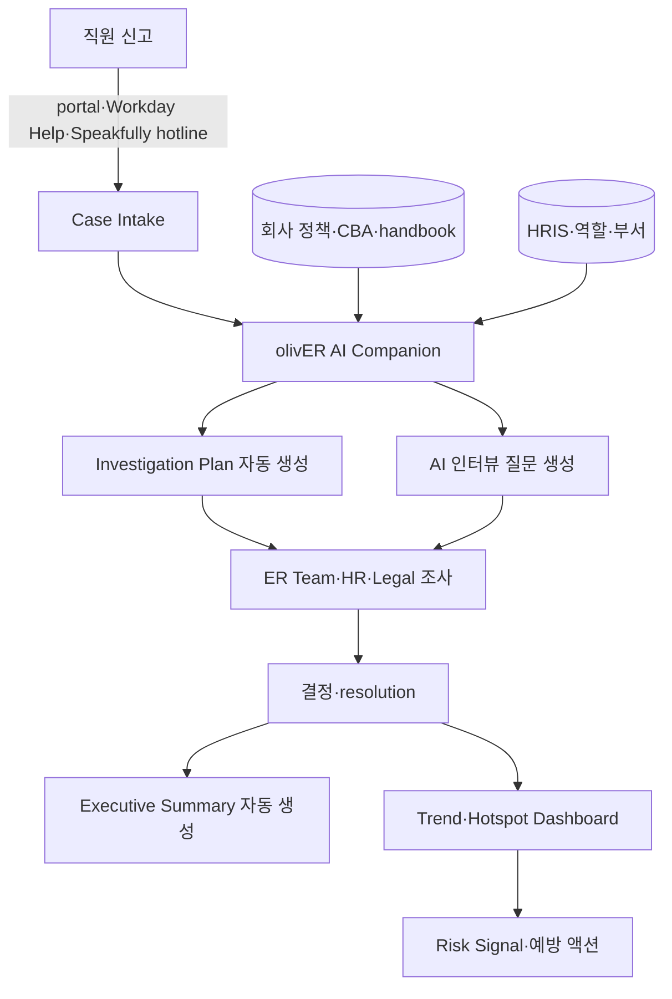

## Summary

HR Acuity는 **미국 최대 ER 전용 case management 플랫폼**. 2024년 **olivER™ AI Companion** 출시 (2025년 본격화) — ER 케이스의 intake → investigation → documentation → trend analysis 전 단계 자동화. **G2 Spring 2025 Enterprise HR Case Management 1위** + **Fall 2025 Enterprise Investigation Management 1위**, **Brandon Hall Group 2025 Gold Award (Best Ethical AI & Responsible Technology)**, **Forrester TEI 520% ROI** (벤더 commission), **Workday Innovation Partner**. 고객사: LinkedIn, Lyft, Adobe, Verizon, General Mills, Workday, Akamai, Equinox, Waymo, Yelp 등.

> 📌 **PwC ER deck 정정**: PwC 자료의 "LiKHR AI Companion"은 본 olivER로 추정 (이름·기능 일치). PwC 자료의 Waymo·Yelp는 모두 HR Acuity 고객.

## Problem / Why

- **Before**: 미국 기업의 ER (employee relations) 처리는 ServiceNow·Jira 같은 **범용 ticketing tool** 또는 spreadsheet — case 분류·문서화 일관성 부재, audit trail 약함, 다국어 intake 한계
- **Pain point**:
  - **ER 전문성 부재 도구**: 일반 ticketing은 grievance·discipline·investigation 도메인 모름 → 변호사·노무사가 수작업 분류·요약
  - **Case 처리 시간**: 1건당 intake → investigation plan 작성 시간 over-burden
  - **익명 신고·다국어**: 글로벌 기업은 다국어 + 익명 hotline 필요. 자체 구축 시 PII·legal hold 복잡
  - **트렌드·hotspot 식별 어려움**: 부서·매니저별 패턴 분석 수작업
- **Trigger**: GenAI 등장 + #MeToo·SOX·EU Whistleblower Directive 등 ER 컴플라이언스 의무 강화

## Solution Architecture

### A. Process

- **Before**: 직원 신고 → ServiceNow/이메일 ticket → HR이 수작업 분류·인터뷰 질문 작성·case 기록 → 분기별 spreadsheet 트렌드 분석
- **After (olivER + Speakfully 통합 architecture)**:
  1. **Case intake**:
     - 직원이 HR Acuity portal·Speakfully 익명 hotline·Workday Help integration으로 신고
     - olivER가 intake notes를 구조화된 **investigation plan**으로 자동 변환 (case type·involved parties·timeline 추출)
  2. **Investigation 지원**:
     - olivER가 case type 기반 **AI 인터뷰 질문 자동 생성** (grievance·harassment·discipline 별 템플릿)
     - Case timeline 자동 작성 (이벤트 → 액션 → resolution 시각화)
     - 충돌·누락 정보 식별 → 추가 조사 지점 제안
  3. **Compliance Q&A** (대화형):
     - "olivER에게 데이터 질의" — "지난 분기 부서별 grievance 트렌드?" 같은 자연어 query
     - 회사 정책·과거 case 기반 답변
  4. **Documentation**:
     - olivER가 case 종료 시 **executive summary 자동 생성** — 사실·조치·결론 분리
     - "결론은 내리지 않음" 원칙 (HITL 유지) — AI는 데이터만 정리, 결정은 사람
  5. **Trend analysis**:
     - 실시간 risk signal·hotspot 감지 (부서·매니저·case type별)
     - AI category mapping — 신고 내용 자동 분류
- **HITL**: ER team·HR·legal이 모든 결정·인터뷰·resolution 진행. AI는 분류·문서화·요약·시각화만
- **Frequency**: daily (case 처리·신고 접수) + 분기 trend report
- **Scope of autonomy**: assist + automate (분류·요약·timeline 자율, 결정·교섭·결론은 사람)

### B. System & Infrastructure

- **Core platform**: HR Acuity SaaS (cloud-hosted)
- **AI 시스템 배치**: olivER AI 모듈 + Speakfully AI hotline (모두 platform 내장)
- **연동**: Workday Help (Innovation Partner), ServiceNow, Microsoft Teams, Slack, SSO (대부분 IdP)
- **사용자 접점**: web portal, mobile app, embedded chat, 익명 hotline (전화·web·SMS·다국어)
- **인증**: RBAC + role-based case visibility (HR·legal·매니저 권한 분리)

### C. Data

- **입력 데이터**:
  - Case intake notes (직원 자유 입력 + structured form)
  - HRIS (인사·역할·부서·매니저)
  - 회사 정책 문서·CBA·employee handbook
  - 과거 case 이력 (anonymized)
  - 익명 신고 (Speakfully)
- **모델 구조**: LLM (intake → plan 변환·요약·자연어 query) + classification (case type·grievance category) + clustering (trend·hotspot 식별)
- **Data governance**:
  - ⚠️ 벤더 주장: **고객 데이터로 모델 학습 안 함** (privacy-by-design)
  - SOC 2 Type II, GDPR, EU Whistleblower Directive 대응
  - PII 분리 + 익명화 옵션 (Speakfully)

### D. Model

- **Foundation model**: _구체 LLM provider 일부 미공개_ (벤더는 "enterprise-grade LLM" 표현)
- **Customization**: ER 도메인 fine-tuning (case type·investigation 템플릿)
- **Guardrails**: ⚠️ 벤더 주장 — 결론 도출 금지 원칙·사람 검토 강제·고객 데이터 학습 안 함

### E. Organization & Team

- **오너십**: HR Acuity 벤더 — 고객은 ER team·HR·legal·compliance 부서가 사용
- **Workday partnership**: Workday Innovation Partner — Workday Help의 ER case가 자동으로 HR Acuity로 routing
- **거버넌스**: Brandon Hall Group 2025 Gold Award (Best Ethical AI) — 외부 거버넌스 인정

### F. Diagrams

범례: 모든 연결 ✅ HR Acuity 공식 + Brandon Hall + Forrester TEI 검증.

## Impact / Metrics (기대효과)

### 기대효과 요약
ER 케이스 처리의 **intake → investigation → documentation 전 단계 자동화**. ⚠️ 일부 metric은 벤더 commissioned Forrester TEI + 자사 발표.

| 지표 | 값 | 출처 | 성격 |
|---|---|---|---|
| **Forrester TEI ROI** | **520%** | Forrester TEI (HR Acuity commission) | ✅ Tier 1 (단 commissioned) |
| **G2 Spring 2025** | **Enterprise HR Case Management #1** | G2 | ✅ Fact (Tier 1·2) |
| **G2 Fall 2025** | **Enterprise Investigation Management #1** | G2 | ✅ Fact |
| **Brandon Hall 2025 Gold** | Best Ethical AI & Responsible Technology | Brandon Hall Group | ✅ Fact (Tier 2) |
| **G2 2025 H1 badges** | **41개** | G2 | ✅ Fact |
| Workday Innovation Partner | 정식 통합 | Workday + HR Acuity 공식 | ✅ Fact |
| **Waymo reporting time 단축** | **92%** | HR Acuity Waymo case study | ⚠️ 자사 보고 |
| 고객 도메인 reference | LinkedIn·Lyft·Adobe·Verizon·GM·Workday·Akamai·Equinox·Waymo·Yelp | HR Acuity 공식 | ✅ Fact (logo 공개) |

## Governance & Risk

- ✅ **Brandon Hall Group 2025 Gold (Best Ethical AI)** — 외부 거버넌스 인정 (HR AI 윤리·책임 영역 최고 등급)
- ✅ Workday Innovation Partner — 엔터프라이즈 보안·integration 검증
- ⚠️ Forrester TEI는 HR Acuity commissioned study — 520% ROI는 Forrester 분석가가 작성했으나 벤더 자금. 클라이언트 인용 시 commission 명시
- ⚠️ olivER 효과 수치 (case 처리 시간 단축 등 구체 metric)는 ⚠️ 벤더 주장 — Tier 1·2 독립 정량 검증 부재
- ⚠️ 한국 적용 시:
  - **한국어 지원 검증 필요** (Speakfully는 다국어 hotline이나 olivER LLM의 한국어 정확도 미공개)
  - **한국 노무법 compliance** (근로기준법·산업안전보건법·직장 내 괴롭힘 금지법) customization 필요
  - **PIPA(개인정보보호법)** + 노조 사전 합의 필수 (ER 데이터는 개인정보 + 노조 영역)

## Consulting Angle

- **글로벌 ER AI 카테고리 leader**: 한국 대기업의 ER AI 도입 검토 시 **HR Acuity = 1차 reference**. G2/Brandon Hall/Forrester 3중 검증 + 다수 Fortune 100 customer
- **vs 경쟁사**:
  - **vs AllVoices** [[allvoices-vera-ai-er-copilot]]: Vera AI는 후발주자. olivER가 더 성숙
  - **vs NAVEX EthicsPoint**: NAVEX는 13K+ 조직, whistleblowing focus. HR Acuity는 ER 전반
  - **vs Diligent Vault**: Vault는 익명 신고 + ethics focus, 5월 2025 인수. olivER는 case management focus
  - **vs Sodales** [[sodales-spire-energy-labor-relations]]: Sodales는 SAP-native 다중 노조 utility. HR Acuity는 multi-vendor + 일반 ER
- **Workday × HR Acuity 통합** = 한국 대기업이 Workday 도입 후 **즉시 제안 가능한 ER 보강 옵션**
- **PwC ER deck 정정**: PwC 자료가 "LiKHR Companion" + "Waymo·Yelp"를 언급했으나 본 olivER 통합 페이지로 처리 권장
- **한국 적용 한계**:
  - 한국어 LLM 정확도 검증 필수
  - 한국 노조법 (복수노조·단협·부당노동행위) customization 필요
  - 한국 ER 시장 미성숙 — 노무법인 협업 + 글로벌 SaaS hybrid 모델 권장
- **2026 Q3-Q4 컨설팅 deck**:
  - "한국 대기업 ER AI 도입 로드맵" — 정부 [[moel-ai-labor-law-consultation|고용노동부 AI]] 학습용 + HR Acuity case management + Vault 익명 신고 3-tier 조합
- **Watch list**: Gartner Magic Quadrant for Employee Relations 등재·한국 진출·Forrester Wave 발표 시 confidence 재조정
