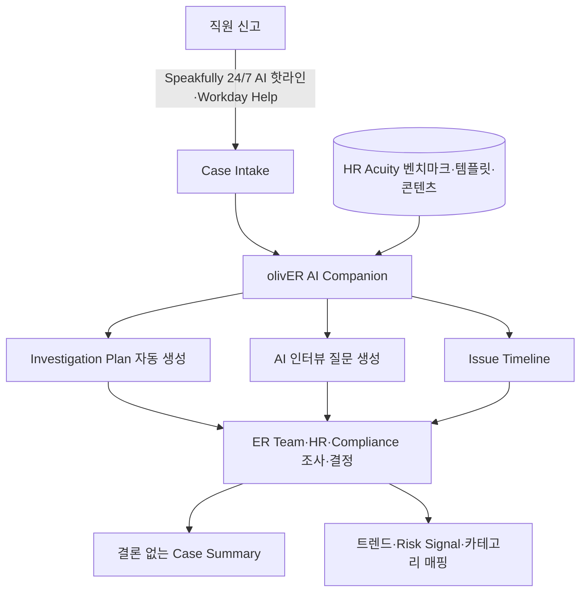

## Summary

HR Acuity는 **ER(employee relations) 전용 case management·investigation 소프트웨어**의 category leader를 자처하는 벤더 [[sources/hr-acuity-brandon-hall-2025]]. AI 동료 **olivER™**가 intake notes → investigation plan 자동 생성, issue timeline, 결론을 내리지 않는 case summary, AI 인터뷰 질문 생성, 벤치마킹 제안, 언어 번역을 제공 [[sources/hr-acuity-oliver-product-page]]. 2025 상반기: **Speakfully 24/7 AI 핫라인** 출시, AI 카테고리 매핑·벤치마킹 분석, **Workday Help 통합**, **G2 배지 41개**(Enterprise HR Case Management 등 리더) [[sources/hr-acuity-2025-growth-prnewswire]]. **Brandon Hall Group 2025 Gold (Best Ethical AI & Responsible Technology)** [[sources/hr-acuity-brandon-hall-2025]]. ⚠️ 벤더 커미션 Forrester TEI(2019): 3년 ROI 520% [[sources/hr-acuity-forrester-tei]] — olivER 이전 시점 연구. 고객사명(LinkedIn·Lyft 등)·olivER 출시일(2024)은 인용 소스에서 미확인 → _미공개_ (2026-09-27 grounding 점검).

> 📌 **PwC ER deck 정정**: PwC 자료의 "LiKHR AI Companion"은 이름·기능상 본 olivER와 일치하는 것으로 보이나 소스 확인 필요 [[sources/pwc-er-ai-deck-2026-05]]. PwC 자료가 인용한 Waymo·Yelp는 HR Acuity 활용 사례로 기재 [[sources/pwc-er-ai-deck-2026-05]].

## Problem / Why (도입 배경)

- **Before (baseline)**: ❓ baseline 미공개 (벤더 제품 — 고객별 상이). Forrester TEI composite 조직 기준: ER 팀이 데이터 입력·리포트 작성에 시간 소모 [[sources/hr-acuity-forrester-tei]]
- **Pain point** (⚠️ 벤더 제시 [[sources/hr-acuity-oliver-product-page]]): 속도만 앞세운 자동화는 일관성 없는 결과·편향된 결정·책임 증가로 이어짐; 조사 기록이 소송(deposition)에서 방어 가능해야 함; 글로벌 팀의 다국어 이슈 처리
- **Trigger**: _미공개 (not disclosed)_ — 기존 "#MeToo·SOX·EU Whistleblower Directive" 서술은 인용 소스에 없어 삭제
- 🚫 일반론 표기: 벤더 제품이므로 특정 기업의 도입 배경은 고객별 상이

## Solution Architecture

### A. Process (프로세스)

- **Before**: _미공개 (not disclosed)_ — 기존 "ServiceNow/이메일 ticket → spreadsheet 트렌드" 서술은 소스에 없어 삭제
- **After (olivER + Speakfully, ⚠️ 벤더 주장 [[sources/hr-acuity-oliver-product-page]] [[sources/hr-acuity-2025-growth-prnewswire]])**:
  1. **Case intake**: 직원 신고 — Speakfully 24/7 AI 핫라인이 실시간 응답 [[sources/hr-acuity-2025-growth-prnewswire]]; Workday Help 통합 고객은 ER case를 한 곳에서 routing·관리 [[sources/hr-acuity-2025-growth-prnewswire]]
  2. **Investigation plan**: olivER가 intake notes를 구조화된 defensible investigation plan으로 수 초 내 변환 [[sources/hr-acuity-oliver-product-page]]
  3. **Investigation 지원**: case 맥락에 맞춘 AI 인터뷰 질문 생성; case 세부·첨부에서 issue timeline 자동 생성 → 충돌·누락 정보·후속 조치 식별 [[sources/hr-acuity-oliver-product-page]]
  4. **Documentation**: 결론을 내리지 않는(without drawing conclusions) 사실 기반 case summary [[sources/hr-acuity-oliver-product-page]]
  5. **Analytics**: 실시간 트렌드·risk signal 시각화, AI 카테고리 매핑, 벤치마킹 제안 [[sources/hr-acuity-oliver-product-page]] [[sources/hr-acuity-2025-growth-prnewswire]]
  6. **Q&A**: olivER가 preloaded prompt와 HR Acuity 지원 자료 기반으로 답변 [[sources/hr-acuity-oliver-product-page]]
- **HITL**: ⚠️ 벤더 주장: "never draws conclusions, makes decisions" — 팀이 결정 주체 [[sources/hr-acuity-oliver-product-page]]
- **Frequency**: 핫라인 24/7 [[sources/hr-acuity-2025-growth-prnewswire]]; 그 외 _미공개_
- **Scope of autonomy**: assist (분류·요약·timeline·질문 생성; 결정은 사람) [[sources/hr-acuity-oliver-product-page]]

### B. System & Infrastructure (시스템·인프라)

- **Core platform**: HR Acuity SaaS [[sources/hr-acuity-forrester-tei]]
- **AI 시스템 배치**: olivER (플랫폼 내장 generative AI) + Speakfully AI 핫라인 [[sources/hr-acuity-oliver-product-page]] [[sources/hr-acuity-2025-growth-prnewswire]]
- **연동**: ✅ Workday Help 통합 (mutual customers, case routing) [[sources/hr-acuity-2025-growth-prnewswire]]; Emtrain 파트너십(문화·컴플라이언스 콘텐츠) [[sources/hr-acuity-2025-growth-prnewswire]]; ServiceNow·Teams·Slack·SSO 연동 _미공개 (not disclosed)_
- **사용자 접점**: Speakfully 핫라인(24/7) [[sources/hr-acuity-2025-growth-prnewswire]]; 플랫폼 내 olivER [[sources/hr-acuity-oliver-product-page]]; web/mobile/SMS 채널 세부 _미공개 (not disclosed)_
- **인증·권한**: _미공개 (not disclosed)_
- **가용성·SLA**: _미공개 (not disclosed)_

### C. Data (데이터)

- **입력 데이터**: case intake notes·case 세부·첨부 파일 [[sources/hr-acuity-oliver-product-page]]; 직원 신고(Speakfully) [[sources/hr-acuity-2025-growth-prnewswire]]; HRIS·CBA·handbook 연계 _미공개 (not disclosed)_
- **학습 데이터(벤더 측)**: ⚠️ 벤더 주장: "two decades" ER 전문성·자체 프레임워크·벤치마크·템플릿·수천 페이지의 proprietary 콘텐츠로 학습 [[sources/hr-acuity-oliver-product-page]] [[sources/hr-acuity-brandon-hall-2025]]
- **벤치마크 데이터**: 9회 연례 ER Benchmark Study — 284개 조직·8.7M 직원 [[sources/hr-acuity-2025-growth-prnewswire]]
- **데이터 규모(고객 측)**: _미공개 (not disclosed)_
- **전처리·정제**: _미공개 (not disclosed)_
- **학습 vs RAG vs In-context**: ⚠️ 벤더 주장: generative AI가 HR Acuity trusted resources에서 답변 도출 [[sources/hr-acuity-oliver-product-page]] — 방식 세부 _미공개_
- **데이터 거버넌스**: ⚠️ 벤더 주장: 고객 데이터를 모델 학습에 사용하지 않음, 오픈 인터넷에서 가져오지 않음, AI Governance Policy 공개 [[sources/hr-acuity-oliver-product-page]]; SOC 2·GDPR·EU Whistleblower Directive 대응은 _미공개 (not disclosed)_
- **민감정보 처리**: ⚠️ 벤더 주장: 인구통계 데이터를 추천에 사용하지 않음 [[sources/hr-acuity-oliver-product-page]]

### D. Model (모델)

- **Foundation model**: _미공개 (not disclosed)_
- **Model 유형**: ⚠️ 벤더 주장: generative AI (요약·질문 생성·Q&A) + 분석(카테고리 매핑·트렌드) [[sources/hr-acuity-oliver-product-page]] [[sources/hr-acuity-2025-growth-prnewswire]]
- **제공 방식**: _미공개 (not disclosed)_
- **커스터마이징 기법**: _미공개 (not disclosed)_ — "trained on proprietary frameworks" 표현만 존재 [[sources/hr-acuity-oliver-product-page]]; fine-tuning 여부 불명
- **Orchestration 프레임워크**: _미공개 (not disclosed)_
- **Guardrails**: ⚠️ 벤더 주장 — 결론·결정 도출 금지, 인구통계 데이터 배제, 고객 데이터 학습 금지 [[sources/hr-acuity-oliver-product-page]]
- **비용·성능 지표**: _미공개 (not disclosed)_
- **Fallback·degradation 전략**: _미공개 (not disclosed)_

### E. Organization & Team (조직·팀 구조)

- **오너십**: HR Acuity 벤더 (CEO Deb Muller) [[sources/hr-acuity-brandon-hall-2025]] — 고객 측 사용 조직은 HR·ER·컴플라이언스 팀 대상으로 설계 [[sources/hr-acuity-oliver-product-page]]
- **Workday partnership**: Workday Help 통합 [[sources/hr-acuity-2025-growth-prnewswire]] — "Innovation Partner" 명칭은 인용 소스에서 미확인
- **거버넌스**: Brandon Hall Group 2025 Gold (Best Ethical AI & Responsible Technology) [[sources/hr-acuity-brandon-hall-2025]]
- **파트너**: Emtrain [[sources/hr-acuity-2025-growth-prnewswire]]

### F. Diagrams (도식)

```mermaid
flowchart TB
    Emp[직원 신고] -->|Speakfully 24/7 AI 핫라인·Workday Help| Intake[Case Intake]
    Intake --> olivER[olivER AI Companion]
    olivER --> Plan[Investigation Plan 자동 생성]
    olivER --> Questions[AI 인터뷰 질문 생성]
    olivER --> Timeline[Issue Timeline]
    KB[(HR Acuity 벤치마크·템플릿·콘텐츠)] --> olivER
    Plan --> ER[ER Team·HR·Compliance 조사·결정]
    Questions --> ER
    Timeline --> ER
    ER --> Doc[결론 없는 Case Summary]
    ER --> Trend[트렌드·Risk Signal·카테고리 매핑]
```

범례: 실선 = HR Acuity 제품 페이지 [[sources/hr-acuity-oliver-product-page]]·2025 성장 보도자료 [[sources/hr-acuity-2025-growth-prnewswire]] 확인. HRIS·CBA 입력 노드는 소스 미확인으로 제외.

## Impact / Metrics (기대효과)

### 기대효과 요약
ER 케이스 처리의 intake → investigation → documentation 지원. ⚠️ 정량 metric은 2019년 벤더 커미션 Forrester TEI(olivER 이전)뿐이며 olivER 자체 효과 수치는 _미공개_.

| 지표 | 값 | 출처 | 성격 |
|---|---|---|---|
| **Forrester TEI ROI (3년, composite)** | **520%** | Forrester TEI 2019 (HR Acuity commission) [[sources/hr-acuity-forrester-tei]] | ⚠️ 벤더 커미션 (stale, AI 이전) |
| 법적 리스크·비용 회피 | **$2.4M** | Forrester TEI 2019 [[sources/hr-acuity-forrester-tei]] | ⚠️ 벤더 커미션 |
| ER 팀 효율 개선 | **20%** (HR/BP 효율 $345K) | Forrester TEI 2019 [[sources/hr-acuity-forrester-tei]] | ⚠️ 벤더 커미션 |
| **G2 2025 H1 badges** | **41개** — Enterprise HR Case Management·Investigation Management·Whistleblowing·HR Compliance·HR Analytics 리더 | HR Acuity 보도자료 [[sources/hr-acuity-2025-growth-prnewswire]] | ⚠️ 자사 발표 (G2 리뷰 기반) |
| **Brandon Hall 2025 Gold** | Best Ethical AI & Responsible Technology | HR Acuity 보도자료 [[sources/hr-acuity-brandon-hall-2025]] | ⚠️ 자사 발표 (수상 사실) |
| Workday Help 통합 | 제공 중 | HR Acuity 보도자료 [[sources/hr-acuity-2025-growth-prnewswire]] | ⚠️ 자사 발표 |
| Waymo reporting time 단축 | _미공개_ (기존 수치는 인용 소스에 없음; [[waymo-hr-acuity-er-case-management]] 참조) | — | ❓ |
| 고객 reference | _미공개_ (인용 소스에 고객사명 없음 — "hundreds of leading enterprises") [[sources/hr-acuity-2025-growth-prnewswire]] | — | ❓ |

## Governance & Risk

- ⚠️ 자사 발표: **Brandon Hall Group 2025 Gold (Best Ethical AI)** [[sources/hr-acuity-brandon-hall-2025]] — 심사 기준·경쟁 후보 정보 없음
- ⚠️ 벤더 주장: 결론 도출 금지·인구통계 데이터 배제·고객 데이터 학습 금지·AI Governance Policy 공개 [[sources/hr-acuity-oliver-product-page]] — 독립 감사 결과 _미공개_
- ⚠️ Forrester TEI는 HR Acuity commissioned study(2019, 고객 5개사 composite) — 520% ROI 인용 시 commission·stale 명시 [[sources/hr-acuity-forrester-tei]]
- ⚠️ olivER 효과 수치 (case 처리 시간 단축 등)는 _미공개_ — Tier 1·2 독립 정량 검증 부재
- ⚠️ 한국 적용 시:
  - **한국어 지원 검증 필요** — olivER 언어 번역 기능은 있으나 [[sources/hr-acuity-oliver-product-page]] 한국어 정확도 미공개
  - **한국 노무법 compliance** (근로기준법·산업안전보건법·직장 내 괴롭힘 금지법) customization 필요
  - **PIPA(개인정보보호법)** + 노조 사전 합의 필수 (ER 데이터는 개인정보 + 노조 영역)

## Contradictions

> [!note] 2026-09-27 grounding — 인용 소스 raw 4건(제품 페이지·Brandon Hall 보도자료·Forrester TEI 보도자료·2025 성장 보도자료)에 없는 서술을 정리: 고객사명(LinkedIn·Lyft·Adobe·Verizon·General Mills·Workday·Akamai·Equinox·Waymo·Yelp), Waymo reporting time 단축률, G2 Spring/Fall 2025 개별 1위 표기, ServiceNow·Teams·Slack·SSO 연동, mobile·SMS 채널, RBAC, SOC 2·GDPR·EU Whistleblower Directive, HRIS·CBA 입력, "ER 도메인 fine-tuning", "enterprise-grade LLM", "Workday Innovation Partner" 명칭, olivER 2024 출시 시점, #MeToo·SOX 트리거 → 모두 삭제 또는 _미공개_. Gartner Peer Insights·PwC deck 소스는 raw 미확보(403/internal). Forrester TEI(2019)는 olivER 이전 플랫폼 연구이므로 AI 효과로 인용 불가.

## Consulting Angle

- **글로벌 ER AI 카테고리 leader**: 한국 대기업의 ER AI 도입 검토 시 **HR Acuity = 1차 reference**. G2 배지·Brandon Hall 수상·Forrester TEI(벤더 커미션, 2019)는 모두 자사 발표 경유 — 고객사명은 _미공개_
- **vs 경쟁사**:
  - **vs AllVoices** [[allvoices-vera-ai-er-copilot]]: Vera AI는 후발주자. olivER가 더 성숙
  - **vs NAVEX EthicsPoint**: NAVEX는 whistleblowing focus([[navex-ethicspoint-nca-compliance]] 참조). HR Acuity는 ER 전반
  - **vs Diligent Vault**: Vault는 익명 신고 + ethics focus, 5월 2025 인수. olivER는 case management focus
  - **vs Sodales** [[sodales-spire-energy-labor-relations]]: Sodales는 SAP-native 다중 노조 utility. HR Acuity는 multi-vendor + 일반 ER
- **Workday Help × HR Acuity 통합** [[sources/hr-acuity-2025-growth-prnewswire]] = 한국 대기업이 Workday 도입 후 **즉시 제안 가능한 ER 보강 옵션**
- **PwC ER deck 정정**: PwC 자료가 "LiKHR Companion" + "Waymo·Yelp"를 언급했으나 본 olivER 통합 페이지로 처리 권장
- **한국 적용 한계**:
  - 한국어 LLM 정확도 검증 필수
  - 한국 노조법 (복수노조·단협·부당노동행위) customization 필요
  - 한국 ER 시장 미성숙 — 노무법인 협업 + 글로벌 SaaS hybrid 모델 권장
- **2026 Q3-Q4 컨설팅 deck**:
  - "한국 대기업 ER AI 도입 로드맵" — 정부 [[moel-ai-labor-law-consultation|고용노동부 AI]] 학습용 + HR Acuity case management + Vault 익명 신고 3-tier 조합
- **Watch list**: Gartner Magic Quadrant for Employee Relations 등재·한국 진출·Forrester Wave 발표 시 confidence 재조정
