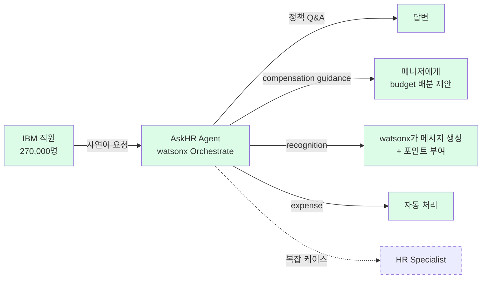

# IBM — AskHR 에이전트

> ⭐ **엔터프라이즈 HR AI 최대 scale 사례**: 270,000명 IBM 직원 대상, 연 210만 대화, 80+ HR 태스크 자동화. Moderna Ask HR의 "routing GPT" 수준을 넘어 **compensation guidance·recognition 생성·expense 처리까지 agentic 수준**으로 진화한 사례.

## Summary

IBM의 내부 HR 가상 에이전트 **AskHR**은 270,000 IBM 직원에게 HR 정책·보상·복리후생 등 전반적 질문에 답하는 AI 서비스. 초기 rule-based 챗봇에서 시작해, 2025년에 **IBM watsonx Orchestrate**를 통합하며 **agentic automation 수준**으로 진화. ⚠️ 자사 보고: 80+ HR 태스크 자동화, 연간 2.1M 대화 처리. IBM CEO Arvind Krishna가 "a couple hundred HR workers의 업무가 AI로 대체됐고 프로그래머·영업 채용이 증가"했다고 공개 발언.

## Problem / Why

- IBM은 **270,000명** 규모의 글로벌 기업 — HR service center로의 문의 볼륨이 방대
- 기존 AskHR는 FAQ 수준의 단순 응답 → "진짜 업무를 수행하는" agentic 수준으로 진화 필요
- 반복적 행정 업무(expense report, recognition 작성, benefits 안내)에 HR 인력이 과도 투입

## Solution Architecture

### A. Process (프로세스)

- **Before (As-is)**: _미공개_ (IBM 내부 HR service center의 기존 운영)
- **After (To-be)** — ⚠️ 자사 보고 (HR Brew 2025-06, 2025-10):
  1. IBM 직원이 AskHR에 자연어 질문/요청 입력
  2. AskHR이 **80+ 자동화된 HR 태스크** 중 해당 작업 식별
  3. 처리 유형에 따라:
     - **정책 Q&A** → 답변 제공
     - **Compensation guidance** → 매니저에게 "salary budget을 어떻게 배분할지" 제안
     - **Recognition** → watsonx가 "meaningful recognition message" 자동 생성 + 포인트 부여
     - **Expense troubleshooting** → 자동 처리
  4. 해결 안 되면 human HR specialist에 에스컬레이션
- **Human-in-the-loop**: 대부분 자동 처리(agentic), 복잡 케이스만 사람에게 넘김
- **Trigger & Frequency**: **daily** (270k 직원, 연 2.1M 대화 = 일 ~5,700건)
- **Scope of autonomy**: **Agent-level** — Q&A뿐 아니라 "작업 수행"까지

### B. System & Infrastructure

- **Core HRIS**: IBM 내부 시스템 (자체 구축 추정, 세부 _미공개_)
- **AI 시스템 배치**: **IBM watsonx Orchestrate** (2025년 통합)
- **배포 환경**: IBM Cloud (추정, self-dogfooding)
- **사용자 접점**: _미공개_ (웹/모바일/Slack 등 채널 세부)
- **연동**: expense·compensation·recognition 시스템과 통합 (세부 _미공개_)

### C~E. 데이터·모델·조직

- **데이터**: IBM HR 정책·보상·복리후생 지식베이스 (규모 _미공개_)
- **모델**: IBM watsonx foundation model 계열 (세부 버전 _미공개_)
- **조직**: IBM HR + IBM Digital 공동 운영 추정. **특이 사례**: 기존 필리핀 기반 HR phone agent가 "**conversational AI specialist**"로 역할 전환 — prompt engineering 수행

## Impact / Metrics (기대효과)

### 기대효과 요약
270,000명 대상, 연간 2.1M 대화, 80+ 태스크 자동화. 필리핀 HR phone agent가 AI specialist로 역할 전환 (자사 보고 기반).

| 지표 | 값 | 출처 | 성격 |
|---|---|---|---|
| 대상 직원 수 | **270,000명** | HR Brew 2025-06 | ⚠️ 자사 보고 |
| 연간 대화 수 | **2.1M** | IBM 공식 case study | ⚠️ 자사 보고 |
| 자동화 태스크 수 | **80+** | IBM 공식 case study | ⚠️ 자사 보고 |
| HR 인력 영향 | "couple hundred HR workers" 업무 대체 | IBM CEO Arvind Krishna (WSJ) | ⚠️ 자사 보고 |
| 직무 전환 사례 | 필리핀 phone agent → conversational AI specialist | HR Brew 2025-06 | ⚠️ 자사 보고 |
| HR 채용 변화 | 프로그래머·영업 채용 증가 (HR 인력 감소 대신) | Krishna (WSJ) | ⚠️ 자사 보고 |

**주의**: IBM은 **벤더이자 고객** (watsonx를 자사에 적용). 모든 수치가 자사 보고이며 독립 검증 없음. 그러나 **270k 규모의 self-dogfooding**이라는 점 자체가 가장 강력한 "실전 검증"이기도 함.

## Governance & Risk

- **HR 인력 대체 narrative의 정치적 위험**: Krishna의 "couple hundred workers replaced" 발언은 클라이언트 CHRO에게 **민감한 메시지** — 인용 시 반드시 "elevated" 프레이밍(역할 전환) 함께 제시
- **HITL 수준**: 80+ 태스크가 얼마나 자율인지 스펙트럼 _미공개_
- **Bias 감사**: compensation guidance agent가 성별·인종별 bias를 갖는지 감사 결과 _미공개_

## Contradictions
_없음_

## Consulting Angle

### 가장 큰 가치 — "HR AI scale의 proof point"
- **Moderna Ask HR (3,000+ GPT)과의 대비**: Moderna = GPT interface (답변), IBM = **agentic (작업 수행)**. HR Brew 2025-06이 이 대비를 명시적으로 기술.
- **HR AI maturity의 시각화**: `FAQ 챗봇 → routing GPT → agentic 자동화`라는 3단계 maturity를 IBM·Moderna 대비로 설명 가능
- **"HR 인력 대체 vs 전환" 논의의 앵커**: 필리핀 직원의 "conversational AI specialist" 전환 사례가 **생산적 논의의 출발점**
- **국내 대기업 적용 가능성**: 수만 명 규모의 국내 대기업이 IBM AskHR 수준을 목표로 할 때 필요한 전제조건(자체 AI 플랫폼, 대규모 HR 데이터, 직무 재설계 의지) 정리 가능

### 파생 질문
1. IBM의 270k → 국내 대기업(5만~30만명)에 scale하려면 한국어 NLU + 국내 HR 정책 지식베이스 구축이 선결 — 어떤 벤더가 이걸 할 수 있는가?
2. Compensation guidance agent의 한국 적용: 한국의 연봉 협상 문화·호봉제와 fit 하는가?
3. "couple hundred replaced"가 한국 노사관계에서 어떻게 인식될까?
