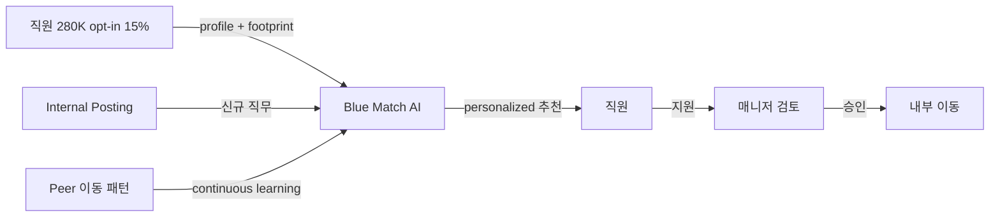

## Summary

IBM이 2015년 MVP로 시작한 **사내 talent marketplace**. opt-in 직원 280K+에게 AI로 추론한 스킬·경력·성과·근무지·디지털 footprint(블로그·코드·포럼 게시물) 기반 personalized 내부 직무 추천. peer 이동 패턴 continuous learning — A→B 이동이 5건 누적되면 유사 프로파일에게 동일 패턴 추천. ⚠️ 자사 보고: 40% 내부 채용 충원 증가, 1,000+ 측정 가능 placement.

## Problem / Why

- **Before**: IBM 내부 이동은 직원 본인 search에 의존 → silo·visibility 격차로 매칭 비효율
- **Pain point**: 280K 글로벌 조직에서 internal posting 게시판은 잘 작동 안 함 — 직원이 본인 옆 부서 외 기회를 모름
- **Trigger**: 핵심 인재 retention 위기 + 외부 talent marketplace 시장 형성 (Gloat·Eightfold) 전 자체 구축

## Solution Architecture

### A. Process

- **Before (As-is)**: 1) 매니저가 internal posting 게시 / 2) 직원이 게시판 검색 / 3) 직원이 지원 / 4) 매니저 검토
- **After (To-be)**:
  1. 직원이 opt-in (~15% 참여)
  2. AI가 스킬·경력·성과·근무지·digital footprint 분석 → 개인 프로파일 생성
  3. 신규 internal posting 발생 시 매칭 직원에게 personalized 추천
  4. peer 이동 패턴 학습 (A→B 5건 누적 시 유사 프로파일에 동일 추천)
  5. 직원 지원 → 매니저 검토 (기존 절차)
- **HITL**: 매니저 최종 승인. AI는 추천만.
- **Trigger & Frequency**: 신규 posting 발생 시 매칭 (continuous), 주간 digest 추정
- **Scope of autonomy**: recommend-only

### B. System & Infrastructure

- **Core HRIS**: IBM 내부 HCM (Workday 사용 추정 — IBM은 Workday customer)
- **AI 시스템 배치**: IBM 자체 구축 (watsonx 이전 세대)
- **배포 환경**: IBM Cloud 추정
- **연동·통합**: HCM, internal posting 시스템, 직원 디지털 footprint 소스(블로그·code·forum)
- **사용자 접점**: 사내 web/intranet (Bluepages 통합 추정)
- **인증·권한**: IBM SSO

### C. Data

- **입력 데이터 소스**: HCM 마스터, 성과 데이터, 학습 이력, 사내 블로그·코드·forum 게시물
- **데이터 규모**: 280K+ 직원 대상, opt-in ~15% = ~42K 활성 사용자
- **전처리·정제**: 디지털 footprint NLP 처리로 implicit 스킬 추론
- **학습 vs RAG vs In-context**: ML 매칭 모델 (LLM 이전 세대) + peer pattern reinforcement learning
- **데이터 거버넌스**: 직원 opt-in 동의 기반 — privacy-by-design
- **민감정보 처리**: 디지털 footprint 분석은 회사 자산만 사용 (외부 SNS 불포함 추정)

### D. Model

- **Foundation model**: 자체 ML (LLM 이전 세대), 2024-25 watsonx Orchestrate 통합 진행 추정
- **Model 유형**: 매칭 ML (collaborative filtering + content-based hybrid)
- **제공 방식**: IBM internal
- **커스터마이징**: 자체 학습 (opt-in 직원 데이터)
- **평가·가드레일**: bias 감사 _미공개_

### E. Organization & Team

- **오너십**: IBM HR + IBM Research (AI)
- **참여 역할**: HRBP·data scientist·ML engineer·privacy/legal
- **변화관리**: opt-in 캠페인 — "당신의 다음 기회를 AI가 찾아드립니다"

### F. Diagrams

## Impact / Metrics (기대효과)

### 기대효과 요약
사내 인재 visibility 향상으로 내부 채용 충원 40% 증가 + 핵심 인재 retention 보강.

- **Before → After**:
  - 내부 채용 충원: baseline → ⚠️ 자사 보고 40% 증가
  - 측정 가능 placement: 1,000+ (집계 기간 _미공개_)
  - opt-in rate: 15% (안정 운영)
- **벤더 주장 vs 독립 검증**: ⚠️ 자사 보고만 존재 — Tier 1 독립 검증 부재

## Governance & Risk

- ✅ opt-in 모델로 privacy 동의 명확
- ⚠️ peer pattern learning이 stereotyping 강화 가능성 (예: 여성 → marketing 이동 패턴 누적 시 유사 프로파일에 동일 추천 → 직무 segregation 강화)
- ⚠️ 디지털 footprint 분석의 직원 인지 수준 _미공개_

## Contradictions

(없음)

## Consulting Angle

- **KR 적용 1순위**: 삼성전자 사내공모/Career Mosaic, 현대차 internal posting, LG 횡적 이동 — 모두 division silo로 고전. Blue Match의 opt-in + peer pattern learning은 "강제 프로파일 유지 부담 없는" reference architecture
- **2026 Q3-Q4 talent marketplace 제안 deck**: Gloat (Schneider·Unilever) + Eightfold + Blue Match 3-way 비교. Blue Match는 "자체 구축으로 시작 가능" 옵션
- **반면교사 포인트**: peer pattern learning이 stereotyping 강화 가능성 — 한국 대기업 도입 시 "성별·학력·출신 학교" 등 protected attribute filter 명시 권장
- **Stage 검증 필요**: 2024-25에 watsonx Orchestrate로 통합 진행 추정 — 현재 운영 status 재확인 필수
