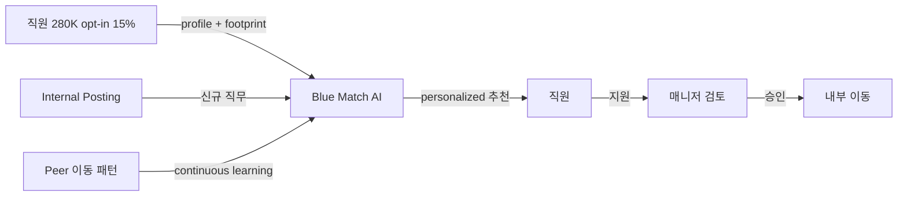

## Summary

IBM이 2015년 MVP로 시작한 **사내 talent marketplace**. opt-in 직원에게 AI로 추론한 스킬·경력·성과·근무지·디지털 footprint(블로그·코드·포럼 게시물) 기반 personalized 내부 직무 추천 + peer 이동 패턴 continuous learning. 2024-2026 IBM의 internal mobility 공식 메시지는 **"Blue 프로그램(개방 포지션의 50% 내부 충원)" + "My Career Advisor / Watson Career Coach" + "AskHR/watsonx Orchestrate Career Development agent"**의 3-tier 통합 narrative로 진화 — Blue Match의 brand surface는 약화 (단독 product 페이지 노출 줄어듦) 하나 기능은 IBM HR 자사 메시지에 지속 등장. ⚠️ 자사 보고: 40% 내부 채용 충원 증가(2018-2020 anchor) / 50% 내부 충원 비율(2024-2025 anchor — 지표 정의 다름, 혼동 주의).

## Problem / Why (도입 배경)

- **Before**: IBM 내부 이동은 직원 본인 search에 의존 → silo·visibility 격차로 매칭 비효율
- **Pain point**: 280K 글로벌 조직에서 internal posting 게시판은 잘 작동 안 함 — 직원이 본인 옆 부서 외 기회를 모름
- **Trigger**: 핵심 인재 retention 위기 + 외부 talent marketplace 시장 형성 (Gloat·Eightfold) 전 자체 구축

## Solution Architecture

### A. Process (프로세스)

- **Before (As-is)**: 1) 매니저가 internal posting 게시 / 2) 직원이 게시판 검색 / 3) 직원이 지원 / 4) 매니저 검토
- **After (To-be)**:
  1. 직원이 opt-in (~15% 참여)
  2. AI가 스킬·경력·성과·근무지·digital footprint 분석 → 개인 프로파일 생성
  3. 신규 internal posting 발생 시 매칭 직원에게 personalized 추천
  4. peer 이동 패턴 학습 (A→B 5건 누적 시 유사 프로파일에 동일 추천)
  5. 직원 지원 → 매니저 검토 (기존 절차)
- **HITL**: 매니저 최종 승인. AI는 추천만.
- **Trigger & Frequency**: 신규 posting 발생 시 매칭 (continuous), 주간 digest 추정
- **Scope of autonomy**: recommend-only

### B. System & Infrastructure (시스템·인프라)

- **Core HRIS**: IBM 내부 HCM (Workday 사용 추정 — IBM은 Workday customer)
- **AI 시스템 배치**: IBM 자체 구축 (LLM 이전 세대)
- **배포 환경**: IBM Cloud 추정
- **연동·통합**: HCM, internal posting 시스템, 직원 디지털 footprint 소스(블로그·code·forum)
- **사용자 접점**: 사내 web/intranet (Bluepages 통합 추정)
- **인증·권한**: IBM SSO
- ⚠️ **2025년 IBM은 AskHR을 watsonx Orchestrate로 마이그레이션 완료** (자사 보고). Blue Match의 watsonx 통합 여부는 _미공개_. **watsonx HR Agents 카탈로그**의 **Career Development agent**가 Blue Match 기능 일부 (skill gap 식별·학습 추천·매칭)와 중복 — 흡수/병행 운영 여부 추적 필요. ([IBM watsonx Orchestrate HR Agents](https://www.ibm.com/products/watsonx-orchestrate/ai-agent-for-hr))

### C. Data (데이터)

- **입력 데이터 소스**: HCM 마스터, 성과 데이터, 학습 이력, 사내 블로그·코드·forum 게시물
- **데이터 규모**: 300K+ 직원 across 175 countries (2024-2026 LaMoreaux 공개 발언), opt-in ~15% 가정 시 ~45K 활성 사용자
- **전처리·정제**: 디지털 footprint NLP 처리로 implicit 스킬 추론
- **학습 vs RAG vs In-context**: ML 매칭 모델 (LLM 이전 세대) + peer pattern reinforcement learning
- **데이터 거버넌스**: 직원 opt-in 동의 기반 — privacy-by-design
- **민감정보 처리**: 디지털 footprint 분석은 회사 자산만 사용 (외부 SNS 불포함 추정)

### D. Model (모델)

- **Foundation model**: 자체 ML (LLM 이전 세대), 2024-25 watsonx Orchestrate 통합 진행 추정
- **Model 유형**: 매칭 ML (collaborative filtering + content-based hybrid)
- **제공 방식**: IBM internal
- **커스터마이징**: 자체 학습 (opt-in 직원 데이터)
- **평가·가드레일**: bias 감사 _미공개_

### E. Organization & Team (조직·팀 구조)

- **오너십**: IBM HR + IBM Research (AI)
- **참여 역할**: HRBP·data scientist·ML engineer·privacy/legal
- **변화관리**: opt-in 캠페인 — "당신의 다음 기회를 AI가 찾아드립니다"

### F. Diagrams (도식)

## Impact / Metrics (기대효과)

### 기대효과 요약
사내 인재 visibility 향상으로 내부 채용 충원 강화 + 핵심 인재 retention 보강.

> ⚠️ **Stale metric 경고**: "1,000+ placements"는 2018 IBM/Benefit News 출처가 anchor이며 2024-2026 갱신 수치 미공개. "40% 내부 채용 충원 증가"(자사 보고, 2018-2020 anchor)와 "50% 내부 충원 비율"(2024-2025 anchor, Fuel50/IBM 자사)은 서로 다른 지표 — 혼동 주의.

| 지표 | 값 | 출처 | 성격 |
|---|---|---|---|
| 내부 채용 충원 증가 (2018-2020 anchor) | **40%** | IBM 자사 (Bersin 2020 인용) | ⚠️ 자사 보고 (stale) |
| **내부 충원 비율** (2024-2025 anchor) | **50%** of open positions | Fuel50 2024-10 + IBM 자사 | ⚠️ 자사 보고 |
| 측정 가능 placement | **1,000+** | IBM/Benefit News 2018 | ⚠️ 자사 보고 (stale anchor — 2024-2026 갱신 X) |
| 직원 규모 | **300K+** across 175 countries | LaMoreaux 2024-2026 공개 발언 | ⚠️ 자사 보고 |
| AskHR 통합 | **2.1M~16M interactions/년** (2025), 94% containment | HR Brew, Fortune 2026, IBM AskHR case study | ⚠️ 자사 보고 (Blue Match 직접 통합 여부 _미공개_) |
| skills inference 정확도 | **85-95%** | IBM Think Insights 2025 | ⚠️ 자사 보고 |
| 독립 검증 | Tier 1·2 (Gartner·Bersin·McKinsey·Deloitte) **단독 분석 0건** (2024-2026) | — | ⚠️ Brand surface 약화 신호 |

## Governance & Risk

- ✅ opt-in 모델로 privacy 동의 명확
- ⚠️ peer pattern learning이 stereotyping 강화 가능성 (예: 여성 → marketing 이동 패턴 누적 시 유사 프로파일에 동일 추천 → 직무 segregation 강화)
- ⚠️ 디지털 footprint 분석의 직원 인지 수준 _미공개_

## Contradictions

(없음)

## Consulting Angle

- **KR 적용 1순위**: 삼성전자 사내공모/Career Mosaic, 현대차 internal posting, LG 횡적 이동 — 모두 division silo로 고전. Blue Match의 opt-in + peer pattern learning은 "강제 프로파일 유지 부담 없는" reference architecture
- **2026 Q3-Q4 talent marketplace 제안 deck**: Gloat (Mastercard·Schneider·Unilever) + Eightfold + Blue Match 3-way 비교. Blue Match는 "자체 구축으로 시작 가능" 옵션
- **반면교사 포인트**: peer pattern learning이 stereotyping 강화 가능성 — 한국 대기업 도입 시 "성별·학력·출신 학교" 등 protected attribute filter 명시 권장
- **2026 추적 포인트** (신규):
  - Blue Match brand surface 약화 추세 — IBM의 internal mobility 제안 시 "Blue Match 단독" 보다 **"Blue 프로그램 + Career Advisor + watsonx HR Agents"** 3-tier 통합 모델로 reference 권장
  - 2018 anchor (1,000 placements, 40% 증가) 단독 인용은 클라이언트 deck에서 약점 — "stale, IBM 자사 메시지가 watsonx로 이동" caveat 병기 필수
  - **Tier 1·2 독립 분석가 커버리지 0건 (2024-2026)** — Bersin·Gartner·McKinsey·Deloitte 모두 Blue Match 단독 분석 부재. 분석가 관심은 AskHR + watsonx Orchestrate에 집중 → reference 가치 약화 가능성
- **Stage 검증 필요**: watsonx Orchestrate Career Development agent 출시 (2025) — Blue Match 흡수/병행 운영 모니터링
