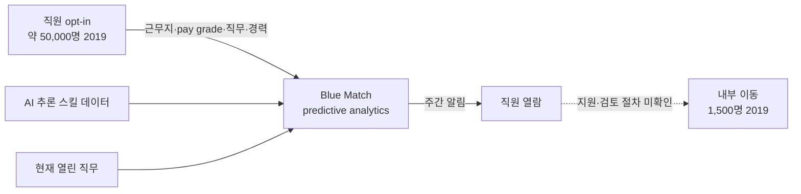

## Summary

IBM의 **사내 internal mobility 매칭 프로그램 "Blue Match(Blue Matching)"**. ⚠️ 자사 보고(SHRM 2019-05, Obed Louissaint): 약 50,000명 직원이 opt-in 등록, predictive analytics가 근무지·pay grade·직무·경력 등 기반으로 현재 열린 직무 리스트를 생성해 주간 알림 제공, 1,500명이 내부 이동 [[sources/shrm-ibm-transforms-hr-ai-2019-05]]. ⚠️ 자사 보고(CNBC 2019-04, Rometty): MYCA(My Career Advisor)의 companion인 Blue Match가 AI 추론 스킬 데이터 기반으로 직무 공고를 제시(opt-in); 2018년 신규 직무·승진을 받은 IBM 직원 27% 중 일부가 Blue Match의 도움 [[sources/cnbc-ibm-ai-predict-95-percent-quit-2019-04]]. 2024년 경쟁 벤더 Fuel50 인용: IBM "Blue" 프로그램이 개방 포지션의 50%를 내부 충원 [[sources/fuel50-what-is-internal-mobility-2024-10]]. 2025년 IBM HR 메시지는 AskHR·watsonx Orchestrate에 집중 — Blue Match 명칭은 최근 소스(HR Executive·IBM Think·Fortune·HR Brew)에 등장하지 않음 [[sources/hrexecutive-ibm-chro-time-in-the-sun-2025-09]] [[sources/ibm-think-ai-first-hr-2025-04]] [[sources/fortune-ibm-chro-talent-strategy-2026-04]] [[sources/hr-brew-ibm-chro-lamoreaux-skills-2026-02]]. 기존 페이지의 "2015 MVP·15% opt-in·디지털 footprint(블로그·코드·포럼)·peer 이동 패턴 학습·40% 내부 충원 증가·1,000+ placements·85-95% 스킬 추론 정확도" 서술은 인용 소스 raw 어디에도 없어 _미공개_ 처리 (2026-09-27 grounding 점검).

## Problem / Why (도입 배경)

- **Before (baseline)**: ❓ 정량 baseline 미공개. 배경: 경영진이 AI·자동화가 5~10년 내 모든 직무를 바꿀 것으로 보고 워크포스 정보를 활용해 직무 관점을 현대화 [[sources/shrm-ibm-transforms-hr-ai-2019-05]]
- **Pain point**: 직원이 경력 발전을 보지 못해 이탈하는 비용 — IBM은 sourcing·recruiting·hiring·training 회피 비용과 이탈 방지 가치를 합산해 절감액을 산정 [[sources/shrm-ibm-transforms-hr-ai-2019-05]]
- **Trigger**: _미공개 (not disclosed)_ — 기존 "retention 위기 + 외부 marketplace 시장 형성 전 자체 구축" 서술은 소스에 없어 삭제

## Solution Architecture

### A. Process (프로세스)

- **Before (As-is)**: _미공개 (not disclosed)_
- **After (To-be)** (⚠️ 자사 보고 [[sources/shrm-ibm-transforms-hr-ai-2019-05]] [[sources/cnbc-ibm-ai-predict-95-percent-quit-2019-04]]):
  1. 직원이 Blue Matching 서비스에 opt-in [[sources/shrm-ibm-transforms-hr-ai-2019-05]] [[sources/cnbc-ibm-ai-predict-95-percent-quit-2019-04]]
  2. predictive analytics가 근무지·pay grade·직무·경력 등 요인 기반으로 현재 열린 직무 리스트 생성 [[sources/shrm-ibm-transforms-hr-ai-2019-05]]; AI 추론 스킬 데이터 기반 직무 공고 제시 [[sources/cnbc-ibm-ai-predict-95-percent-quit-2019-04]]
  3. 주간 알림으로 잠재 매칭 직무 열람 [[sources/shrm-ibm-transforms-hr-ai-2019-05]]
  4. MYCA(My Career Advisor, Watson Career Coach)가 스킬 갭 식별을 보조 [[sources/shrm-ibm-transforms-hr-ai-2019-05]] [[sources/cnbc-ibm-ai-predict-95-percent-quit-2019-04]]
  5. 이후 지원·매니저 검토 절차: _미공개 (not disclosed)_
- **HITL**: _미공개 (not disclosed)_ — 매니저 승인 절차는 소스에 없음
- **Trigger & Frequency**: 주간 알림 (weekly notifications) [[sources/shrm-ibm-transforms-hr-ai-2019-05]]
- **Scope of autonomy**: recommend-only (직무 리스트 제시) [[sources/shrm-ibm-transforms-hr-ai-2019-05]]

### B. System & Infrastructure (시스템·인프라)

- **Core HRIS**: _미공개 (not disclosed)_
- **AI 시스템 배치**: IBM 자체 구축 — Watson 기반 (MYCA/Career Coach) [[sources/shrm-ibm-transforms-hr-ai-2019-05]] [[sources/cnbc-ibm-ai-predict-95-percent-quit-2019-04]]; Blue Match 자체 스택 세부 _미공개_
- **배포 환경**: _미공개 (not disclosed)_
- **연동·통합**: _미공개 (not disclosed)_
- **사용자 접점**: 주간 알림 [[sources/shrm-ibm-transforms-hr-ai-2019-05]]; 채널 세부 _미공개_
- **인증·권한**: _미공개 (not disclosed)_
- ⚠️ 2025년 IBM은 AskHR을 watsonx Orchestrate로 진화시켰다고 보고 [[sources/ibm-think-ai-first-hr-2025-04]] [[sources/hrexecutive-ibm-chro-time-in-the-sun-2025-09]]. Blue Match의 watsonx 통합 여부는 _미공개_. watsonx Orchestrate HR 에이전트 제품 페이지에는 Blue Match 명칭이 없음 [[sources/ibm-watsonx-orchestrate-hr-agents]].

### C. Data (데이터)

- **입력 데이터 소스**: 근무지·pay grade·직무·경력 등 [[sources/shrm-ibm-transforms-hr-ai-2019-05]]; AI 추론 스킬 데이터 [[sources/cnbc-ibm-ai-predict-95-percent-quit-2019-04]]; 디지털 footprint(블로그·코드·포럼) 분석은 _미공개 (not disclosed)_ (소스에 없음)
- **데이터 규모**: 약 50,000명 등록 (2019) [[sources/shrm-ibm-transforms-hr-ai-2019-05]]; 전체 직원 수·최근 등록 수 _미공개 (not disclosed)_
- **전처리·정제**: _미공개 (not disclosed)_
- **학습 vs RAG vs In-context**: predictive analytics [[sources/shrm-ibm-transforms-hr-ai-2019-05]]; 모델 방식 세부 _미공개_
- **데이터 거버넌스**: opt-in 동의 기반 [[sources/shrm-ibm-transforms-hr-ai-2019-05]] [[sources/cnbc-ibm-ai-predict-95-percent-quit-2019-04]]
- **민감정보 처리**: _미공개 (not disclosed)_

### D. Model (모델)

- **Foundation model**: _미공개 (not disclosed)_ (LLM 이전 세대 predictive analytics — Watson) [[sources/shrm-ibm-transforms-hr-ai-2019-05]]
- **Model 유형**: predictive analytics 기반 직무 매칭 [[sources/shrm-ibm-transforms-hr-ai-2019-05]]; AI 스킬 추론 [[sources/cnbc-ibm-ai-predict-95-percent-quit-2019-04]]
- **제공 방식**: IBM internal [[sources/shrm-ibm-transforms-hr-ai-2019-05]]
- **커스터마이징**: _미공개 (not disclosed)_
- **평가·가드레일**: bias 감사 _미공개 (not disclosed)_

### E. Organization & Team (조직·팀 구조)

- **오너십**: IBM HR — 발언자 Obed Louissaint(2019) [[sources/shrm-ibm-transforms-hr-ai-2019-05]], CEO Ginni Rometty(2019) [[sources/cnbc-ibm-ai-predict-95-percent-quit-2019-04]], CHRO Nickle LaMoreaux(2025~) [[sources/hrexecutive-ibm-chro-time-in-the-sun-2025-09]]
- **참여 역할**: _미공개 (not disclosed)_
- **변화관리**: _미공개 (not disclosed)_ — 기존 "opt-in 캠페인" 문구는 소스에 없어 삭제
- **거버넌스**: IBM은 연간 성과평가를 폐지하고 분기 스킬 성장 평가로 전환 [[sources/shrm-ibm-transforms-hr-ai-2019-05]]

### F. Diagrams (도식)

```mermaid
flowchart LR
    Emp[직원 opt-in<br/>약 50,000명 2019] -->|근무지·pay grade·직무·경력| Match[Blue Match<br/>predictive analytics]
    Skills[AI 추론 스킬 데이터] --> Match
    Posting[현재 열린 직무] --> Match
    Match -->|주간 알림| Emp2[직원 열람]
    Emp2 -.->|지원·검토 절차 미확인| Move[내부 이동<br/>1,500명 2019]
```

범례: 실선 = SHRM 2019 [[sources/shrm-ibm-transforms-hr-ai-2019-05]]·CNBC 2019 [[sources/cnbc-ibm-ai-predict-95-percent-quit-2019-04]] 확인; 점선 = 미확인.

## Impact / Metrics (기대효과)

### 기대효과 요약
사내 인재 visibility 향상으로 내부 충원·retention 보강. 모든 수치는 ⚠️ 자사 보고이며 최신 anchor는 2019(SHRM·CNBC)와 2024(Fuel50 2차 인용).

> ⚠️ **Stale metric 경고**: 2019 anchor(50,000 등록·1,500 이동·27% 신규 직무/승진)와 2024 anchor("Blue" 50% 내부 충원, 경쟁 벤더 2차 인용)는 지표 정의가 다름 — 혼동 주의. Bersin 2020의 40%/66%/30%는 IBM이 구축한 외부 고객사(보험) 채용 시스템 성과이므로 IBM 내부 이동 지표로 인용 금지 [[sources/bersin-ibm-hr-marketplace-2020-12]].

| 지표 | 값 | 출처 | 성격 |
|---|---|---|---|
| Blue Matching 등록 직원 | **약 50,000명** (2019) | SHRM 2019 [[sources/shrm-ibm-transforms-hr-ai-2019-05]] | ⚠️ 자사 보고 (stale) |
| 내부 이동 | **1,500명** (2019 기준 누적) | SHRM 2019 [[sources/shrm-ibm-transforms-hr-ai-2019-05]] | ⚠️ 자사 보고 (stale) |
| 신규 직무·승진 비율 | 2018년 IBM 직원 **27%** — 일부 Blue Match 지원 | CNBC 2019 [[sources/cnbc-ibm-ai-predict-95-percent-quit-2019-04]] | ⚠️ 자사 보고 (stale) |
| **내부 충원 비율** (2024 anchor) | **50%** of open positions ("Blue") | Fuel50 2024-10 (경쟁 벤더 2차 인용) [[sources/fuel50-what-is-internal-mobility-2024-10]] | ⚠️ 2차 인용 (원출처 미명시) |
| AI HR 도구 절감액 | **$100M+** (CogniPay·Blue Matching·Career Coach 합산, 연간) | SHRM 2019 [[sources/shrm-ibm-transforms-hr-ai-2019-05]] | ⚠️ 자사 보고 (IBM 자체 산정) |
| 내부 채용 충원 증가율 (기존 40%) | _미공개_ (인용 소스에 없음) | — | ❓ |
| Placements (기존 1,000+) | _미공개_ — 소스 수치는 1,500명 이동(2019) | — | ❓ |
| 직원 규모 | _미공개_ (기존 300K+/175개국 수치는 인용 소스에 없음) | — | ❓ |
| AskHR (참고) | **11.5M** interactions (2024), **94%** containment, HR 운영 예산 40% 감소 | IBM Think 2025 [[sources/ibm-think-ai-first-hr-2025-04]] · HR Executive 2025 [[sources/hrexecutive-ibm-chro-time-in-the-sun-2025-09]] | ⚠️ 자사 보고 (Blue Match 직접 통합 여부 _미공개_) |
| skills inference 정확도 | _미공개_ (기존 85-95% 수치는 인용 소스에 없음) | — | ❓ |
| 독립 검증 | Tier 1·2 단독 분석 없음 — Bersin 2020은 Blue Match를 직접 언급하지 않음 [[sources/bersin-ibm-hr-marketplace-2020-12]] | — | ⚠️ |

## Governance & Risk

- ✅ opt-in 모델로 privacy 동의 명확 [[sources/shrm-ibm-transforms-hr-ai-2019-05]] [[sources/cnbc-ibm-ai-predict-95-percent-quit-2019-04]]
- ⚠️ 매칭 요인에 pay grade·근무지 포함 [[sources/shrm-ibm-transforms-hr-ai-2019-05]] → 특정 집단 고착화 가능성; bias 감사 결과 _미공개_
- ⚠️ 스킬 추론 데이터의 출처·직원 인지 수준 _미공개_
- 규제 노출: 내부 이동·배치 추천은 AI 기본법 고영향 AI 검토 대상(`kr-high-impact-review`)·EU AI Act Annex III 4(b) 검토

## Contradictions

> [!note] 2026-09-27 grounding — 인용 소스 10건의 raw를 대조한 결과, "2015 MVP", "직원 수(28만 명대)", "15% opt-in", "디지털 footprint(블로그·코드·포럼) 분석", "peer 이동 패턴 학습(A→B 5건)", "40% 내부 채용 충원 증가", "1,000+ placements", "300K+ 직원·175개국", "85-95% 스킬 추론 정확도", "AskHR 연간 대화·interaction 수치(백만 단위)", "Workday HCM·IBM Cloud·Bluepages·SSO", "IBM Research 공동 오너십", "collaborative filtering·reinforcement learning"은 어느 raw에도 없어 삭제·_미공개_ 처리. 실제 소스 수치: 50,000명 등록·1,500명 이동·$100M+ 절감(SHRM 2019), 27%(CNBC 2019), 50% 내부 충원(Fuel50 2024). Bersin 2020의 40/66/30%는 외부 고객사 성과. 페이지 first_seen(2015-01-01)은 소스 근거 없음 — 확인 필요.

## Consulting Angle

- **KR 적용 1순위**: 삼성전자 사내공모/Career Mosaic, 현대차 internal posting, LG 횡적 이동 — 모두 division silo로 고전. Blue Match의 opt-in + 주간 알림 매칭은 "강제 프로파일 유지 부담 없는" reference architecture
- **2026 Q3-Q4 talent marketplace 제안 deck**: Gloat (Mastercard·Schneider·Unilever) + Eightfold + Blue Match 3-way 비교. Blue Match는 "자체 구축으로 시작 가능" 옵션
- **반면교사 포인트**: pay grade·근무지 기반 매칭이 집단 고착화를 강화할 가능성 — 한국 대기업 도입 시 "성별·학력·출신 학교" 등 protected attribute filter 명시 권장
- **2026 추적 포인트** (신규):
  - Blue Match brand surface 약화 추세 — IBM의 internal mobility 제안 시 "Blue Match 단독" 보다 **"Blue 프로그램 + Career Advisor + watsonx HR Agents"** 3-tier 통합 모델로 reference 권장
  - 2019 anchor (50,000 등록·1,500 이동·27%) 단독 인용은 클라이언트 deck에서 약점 — "stale, IBM 자사 메시지가 watsonx로 이동" caveat 병기 필수
  - **Tier 1·2 독립 분석가 커버리지 0건 (2024-2026)** — Bersin·Gartner·McKinsey·Deloitte 모두 Blue Match 단독 분석 부재. 분석가 관심은 AskHR + watsonx Orchestrate에 집중 → reference 가치 약화 가능성
- **Stage 검증 필요**: watsonx Orchestrate Career Development agent 출시 (2025) — Blue Match 흡수/병행 운영 모니터링
