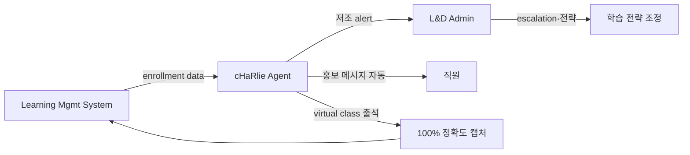

## Summary

IBM이 2023년 launch한 **cHaRlie** (Cognitive HR Learning EM Assistant) — Enterprise Learning Operations & Administration 팀을 위한 watsonx Orchestrate 기반 백오피스 에이전트. 학습 enrollment 모니터링·저조 alert·event 홍보·pre-event comms·virtual class 출석 자동 로깅. ⚠️ 자사 보고: learner NPS 15% 상승, 출석 캡처 100% 정확도, 출석부 turnaround 91% 단축, onboarding time 25% 감소.

## Problem / Why

- **Before**: L&D operations 팀이 enrollment 추적·홍보·출석 캡처·event 운영을 manual로 처리 — 270K 직원 규모에서 병목
- **Pain point**: 직원 facing AI(tutor·content)는 ROI 모호, 학습 ops 백오피스는 ROI 명확하지만 자동화 후순위
- **Trigger**: watsonx Orchestrate dogfooding + L&D 운영 효율 압박

## Solution Architecture

### A. Process

- **Before**: 1) L&D admin이 enrollment dashboard 수동 점검 / 2) 저조 코스에 manual outreach / 3) virtual class 끝나면 출석 명단 수동 export·집계 / 4) 다음 event 조율
- **After**:
  1. cHaRlie가 enrollment 모니터링 → 저조 시 admin alert
  2. event 홍보 메시지 자동 생성·배포
  3. virtual class 출석 자동 캡처 (100% 정확도)
  4. pre-event comms 자동 발송
  5. admin은 escalation·전략 결정만 처리
- **HITL**: admin이 alert 확인·outreach 승인. 출석 캡처는 fully autonomous
- **Frequency**: continuous (event-driven) + daily digest

### B/C/D/E. System

- watsonx Orchestrate 기반, IBM 내부 Learning Mgmt 시스템 통합
- 데이터: enrollment·출석·event metadata
- 모델: watsonx Granite + agent orchestration
- 오너십: Enterprise Learning Operations & Administration 팀

### F. Diagrams

### B. System & Infrastructure (Agent research, 2026-05)

- **Core HRIS / 기반 시스템**: ✅ IBM 내부 Learning Management System (이름 미공개)
- **AI 시스템 배치**: ✅ IBM watsonx Orchestrate 기반 (production)
- **배포 환경**: ✅ watsonx Orchestrate (IBM Cloud + AWS 옵션); cHaRlie 자체 배포 환경 _미공개_
- **연동·통합**: ✅ IBM 내부 LMS (enrollment, attendance, event metadata); virtual class 시스템 (Webex/Zoom 추정)
- **사용자 접점**: _미공개_ (L&D admin facing)
- **인증·권한**: _미공개_ (IBM SSO 추정)

### C. Data (Agent research)

- **입력 데이터 소스**: ✅ Enrollment data, virtual class attendance, event metadata, learner roster
- **데이터 규모**: _미공개_ (IBM 270K 직원 규모이나 cHaRlie 처리량 standalone 수치 미공개)
- **전처리·정제**: _미공개_
- **학습 vs RAG vs In-context**: _미공개_ (watsonx Orchestrate는 일반적으로 agent + tool-call 패턴)
- **데이터 거버넌스**: _미공개_
- **민감정보 처리**: _미공개_ (직원 attendance가 personal data)

### D. Model (Agent research)

- **Foundation model**: ✅ IBM Granite (watsonx Orchestrate 기본 model)
- **모델 유형**: ✅ Agentic LLM (Granite decoder 아키텍처) + automation/RPA 통합
- **제공 방식**: ✅ IBM watsonx Orchestrate (proprietary platform)
- **커스터마이징 기법**: _미공개_
- **Orchestration 프레임워크**: ✅ watsonx Orchestrate (IBM 자체 — 150+ enterprise connectors, observability dashboards)
- **평가·가드레일**: ⚠️ 자사 보고: 출석 캡처 100% 정확도, NPS +15%, turnaround 91% 단축, onboarding -25%

## Impact / Metrics

### 기대효과 요약
L&D 백오피스 자동화로 운영 부담 대폭 경감 + 직원 학습 경험 NPS 향상.

- ⚠️ 자사 보고:
  - learner NPS: baseline → +15%
  - 출석 캡처 정확도: manual error → 100%
  - 출석부 turnaround: baseline → 91% 단축
  - onboarding time: baseline → 25% 감소

## Governance & Risk

- ✅ 백오피스 자동화 — 직원 facing AI 대비 윤리·규제 리스크 낮음
- ⚠️ 출석 캡처 자동화의 직원 privacy 인지 수준 _미공개_

## Consulting Angle

- **KR 적용 1순위 — "사내대학·연수원" reference**: 삼성인력개발원·현대인재개발원·LG Aspire·SK mySUNI 모두 manual L&D ops 부담 큼. cHaRlie는 학습자 facing AI(tutor)보다 **ROI 명확한 백오피스 agent template**
- **2026 Q3-Q4 L&D AI 제안**: "직원 facing AI"는 ROI 입증 어려우니 백오피스부터 시작 — cHaRlie 패턴 인용
- **KR 그룹 HRD 센터 직무 재설계**: L&D admin → "학습 전략 strategist + AI orchestrator"로 전환 명분
- **반면교사**: 출석 자동 캡처가 직원에게 "감시 도구"로 인식되지 않도록 자율 opt-in or 익명 통계 처리 권장
