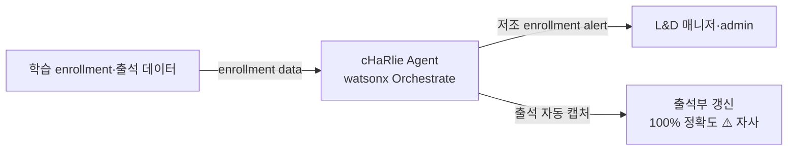

## Summary

IBM의 **cHaRlie** (Cognitive HR Learning EM Assistant) — Enterprise Learning Operations & Administration 팀을 위한 watsonx Orchestrate 기반 백오피스 에이전트 [[sources/ibm-case-study-hr-eloa-charlie-2023-12]]. 학습 enrollment 모니터링, 저조 enrollment 이벤트에 대한 매니저 alert, 반복적·오류 발생 쉬운 운영 업무 자동화 [[sources/ibm-case-study-hr-eloa-charlie-2023-12]] [[sources/intelligenthq-ibm-charlie-watsonx]]. ⚠️ 자사 보고: 이벤트 후 NPS 설문 기준 직원 만족도 15% 상승, 학습자 출석 캡처 100% 정확도, 출석부 갱신 turnaround 최소 91% 개선 [[sources/ibm-case-study-hr-eloa-charlie-2023-12]] [[sources/intelligenthq-ibm-charlie-watsonx]]. 기존 "onboarding time 25% 감소"는 인용 소스에 없어 _미공개_ 처리 (2026-09-27 grounding 점검).

## Problem / Why (도입 배경)

- **Before (baseline)**: L&D operations 팀이 class enrollment 모니터링·저조 enrollment 이벤트 후속 조치 알림 등 반복적·오류 발생 쉬운 업무를 수행 [[sources/ibm-case-study-hr-eloa-charlie-2023-12]]; 정량 baseline ❓ 미공개
- **Pain point**: 반복 업무의 오류·시간 소모 [[sources/ibm-case-study-hr-eloa-charlie-2023-12]]
- **Trigger**: _미공개 (not disclosed)_ — IBM 자체 watsonx Orchestrate 적용 사례(self-case) [[sources/ibm-case-study-hr-eloa-charlie-2023-12]]

## Solution Architecture

### A. Process (프로세스)

- **Before**: L&D admin이 enrollment 점검·저조 코스 후속 조치·출석 집계를 수작업 [[sources/ibm-case-study-hr-eloa-charlie-2023-12]]
- **After** (⚠️ 자사 보고 [[sources/ibm-case-study-hr-eloa-charlie-2023-12]] [[sources/intelligenthq-ibm-charlie-watsonx]]):
  1. cHaRlie가 class enrollment 모니터링
  2. 저조 enrollment로 후속 조치가 필요한 이벤트를 매니저에게 alert
  3. 학습자 출석 자동 캡처 (100% 정확도) 및 출석부 갱신
  4. 기타 반복 운영 업무 자동화 — 홍보 메시지·pre-event comms 세부는 _미공개 (not disclosed)_
- **HITL**: _미공개 (not disclosed)_ — 매니저가 alert를 받아 후속 조치 [[sources/ibm-case-study-hr-eloa-charlie-2023-12]]; 승인 절차 세부 미기술
- **Frequency**: _미공개 (not disclosed)_ (이벤트 기반으로 기술)
- **Scope of autonomy**: 모니터링·alert·출석 캡처 자동 (assist + automate) [[sources/ibm-case-study-hr-eloa-charlie-2023-12]]

### F. Diagrams (도식)

```mermaid
flowchart LR
    LMS[학습 enrollment·출석 데이터] -->|enrollment data| Charlie[cHaRlie Agent<br/>watsonx Orchestrate]
    Charlie -->|저조 enrollment alert| Admin[L&D 매니저·admin]
    Charlie -->|출석 자동 캡처| Capture[출석부 갱신<br/>100% 정확도 ⚠️ 자사]
```

범례: 실선 = IBM case study [[sources/ibm-case-study-hr-eloa-charlie-2023-12]] 확인.

### B. System & Infrastructure (시스템·인프라)

- **Core HRIS / 기반 시스템**: _미공개 (not disclosed)_ — 학습 시스템 명칭 미공개
- **AI 시스템 배치**: ✅ IBM watsonx Orchestrate 기반 [[sources/ibm-case-study-hr-eloa-charlie-2023-12]] [[sources/intelligenthq-ibm-charlie-watsonx]]
- **배포 환경**: _미공개 (not disclosed)_
- **연동·통합**: enrollment·출석 데이터 연동 [[sources/ibm-case-study-hr-eloa-charlie-2023-12]]; virtual class 시스템 명칭 _미공개 (not disclosed)_
- **사용자 접점**: _미공개 (not disclosed)_ (L&D admin facing)
- **인증·권한**: _미공개 (not disclosed)_

### C. Data (데이터)

- **입력 데이터 소스**: ✅ class enrollment 데이터, 학습자 출석 데이터 [[sources/ibm-case-study-hr-eloa-charlie-2023-12]]
- **데이터 규모**: _미공개 (not disclosed)_
- **전처리·정제**: _미공개 (not disclosed)_
- **학습 vs RAG vs In-context**: _미공개 (not disclosed)_
- **데이터 거버넌스**: _미공개 (not disclosed)_
- **민감정보 처리**: _미공개 (not disclosed)_ (직원 attendance가 personal data)

### D. Model (모델)

- **Foundation model**: _미공개 (not disclosed)_
- **모델 유형**: 자동화 에이전트 (watsonx Orchestrate) [[sources/ibm-case-study-hr-eloa-charlie-2023-12]]
- **제공 방식**: ✅ IBM watsonx Orchestrate (자사 플랫폼) [[sources/ibm-case-study-hr-eloa-charlie-2023-12]]
- **커스터마이징 기법**: _미공개 (not disclosed)_
- **Orchestration 프레임워크**: ✅ watsonx Orchestrate [[sources/ibm-case-study-hr-eloa-charlie-2023-12]]; connector 수·observability 등 세부 _미공개_
- **평가·가드레일**: ⚠️ 자사 보고: 출석 캡처 100% 정확도, NPS +15%, turnaround 91% 개선 [[sources/ibm-case-study-hr-eloa-charlie-2023-12]] — 평가 방법 세부 _미공개_

### E. Organization & Team (조직·팀 구조)

- **오너십**: IBM Enterprise Learning Operations & Administration 팀 [[sources/ibm-case-study-hr-eloa-charlie-2023-12]]
- **참여 역할**: _미공개 (not disclosed)_
- **팀 규모·기간**: _미공개 (not disclosed)_
- **거버넌스 체계**: _미공개 (not disclosed)_
- **변화관리**: _미공개 (not disclosed)_
- **파트너**: _미공개 (not disclosed)_ (IBM 자체 구축)

## Impact / Metrics (기대효과)

### 기대효과 요약
L&D 백오피스 자동화로 운영 부담 경감 + 직원 학습 경험 NPS 향상 (⚠️ 자사 보고).

- ⚠️ 자사 보고 [[sources/ibm-case-study-hr-eloa-charlie-2023-12]] [[sources/intelligenthq-ibm-charlie-watsonx]]:
  - 직원 만족도(이벤트 후 NPS 설문): +15%
  - 출석 캡처 정확도: 100%
  - 출석부 갱신 turnaround: 최소 91% 개선
  - onboarding time: _미공개_ (기존 "25% 감소"는 인용 소스에 없음)

## Governance & Risk

- ✅ 백오피스 자동화 — 직원 facing AI 대비 윤리·규제 리스크 낮음
- ⚠️ 출석 캡처 자동화의 직원 privacy 인지 수준 _미공개_
- ⚠️ 모든 수치는 IBM self-case(벤더=고객) — IntelligentHQ 기사는 case study 재서술이라 독립 검증 아님

## Contradictions

> [!note] 2026-09-27 grounding — "onboarding time 25% 감소", "IBM Granite", "IBM Cloud + AWS", "150+ connectors", "Webex/Zoom", "IBM SSO", "IBM 전체 직원 수", "홍보 메시지·pre-event comms 자동 발송" 서술은 인용 소스 raw 2건에 없어 삭제·_미공개_ 처리. sources 목록의 중복 항목(같은 소스 2회)은 스크립트 관리 대상.

## Consulting Angle

- **KR 적용 1순위 — "사내대학·연수원" reference**: 삼성인력개발원·현대인재개발원·LG Aspire·SK mySUNI 모두 manual L&D ops 부담 큼. cHaRlie는 학습자 facing AI(tutor)보다 **ROI 명확한 백오피스 agent template**
- **2026 Q3-Q4 L&D AI 제안**: "직원 facing AI"는 ROI 입증 어려우니 백오피스부터 시작 — cHaRlie 패턴 인용
- **KR 그룹 HRD 센터 직무 재설계**: L&D admin → "학습 전략 strategist + AI orchestrator"로 전환 명분
- **반면교사**: 출석 자동 캡처가 직원에게 "감시 도구"로 인식되지 않도록 자율 opt-in or 익명 통계 처리 권장
