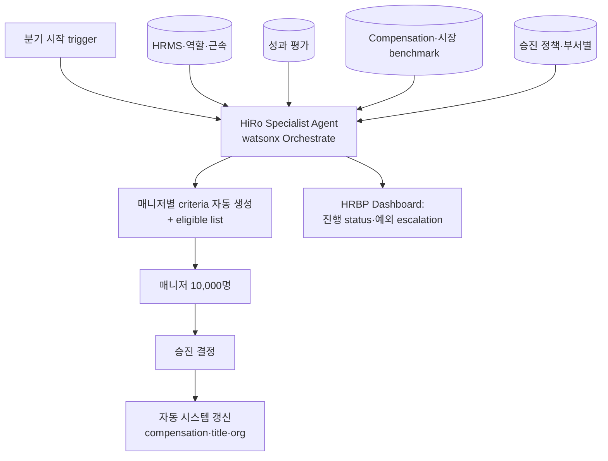

## Summary

IBM의 **HiRo**는 watsonx Orchestrate 기반 **분기 승진 관리 specialist agent (digital worker)**. AskHR 생태계 (2.1M conversations/년·80+ HR tasks 자동화) 내 promotion 영역 자동화. ⚠️ 자사 보고: 분기 승진 cycle을 10주 → 자동화로 단축, **HR Business Partner (HRBP) 시간 분기당 85% 절감**. 매니저 10,000명에 promotion criteria + eligible employees 리스트 자동 배포. IBM CHRO Nickle LaMoreaux가 HR Executive of the Year 2024 인터뷰·myHRfuture 팟캐스트·IBM 공식 case study에서 일관 언급.

## Problem / Why

- **Before (2023 이전)**: IBM 글로벌 280K 직원 분기 승진 cycle은 **HR Business Partner 수작업 spreadsheet** — 부서별 eligible employees 식별·매니저별 promotion criteria 안내·결정 후 compensation/title/org 시스템 수동 갱신
- **Pain point**:
  - 분기당 10주 소요 — HRBP 시간의 상당 비중
  - 매니저 10,000명 × 부서·지역 별 승진 정책 차이 → 일관성 결여, 매니저 confusion
  - 승진 결정 후 compensation·org chart·title 갱신을 여러 시스템에 수동 입력
- **Trigger**: IBM 자체 AI/agentic transformation (AskHR 6년 운영 후 specialist agent 확장 단계)

## Solution Architecture

### A. Process

- **Before**: HRBP가 spreadsheet로 (1) eligible employees 추출 → (2) 매니저에 정책·criteria 이메일 → (3) 매니저 결정 수집 → (4) compensation/title/org 시스템 수동 입력
- **After (HiRo agentic)**:
  1. HiRo가 분기 시작 시 자동으로 HR 시스템들 (HRMS·평가·comp)에서 eligible employees 데이터 통합
  2. 매니저별·부서별 promotion criteria 맞춤 작성 (LLM 기반)
  3. 10,000명 매니저에게 자동 발송 + 매니저용 simplified UI (criteria + eligible list + 승진 추천 데이터)
  4. 매니저가 결정 → HiRo가 compensation/title/org chart 자동 갱신
  5. HRBP는 dashboard로 진행 status·예외·escalation만 관리
- **HITL**: 매니저가 모든 승진 결정 권한 (HiRo는 제안·자동화만)
- **Frequency**: 분기 (annual에 가까운 주기)
- **Scope of autonomy**: prepare + execute (eligible 추출·자동 갱신은 자율, 결정은 매니저)

### B. System & Infrastructure

- **Core**: IBM watsonx Orchestrate platform (자사 LLM·orchestration)
- **AI 시스템 배치**: AskHR 생태계 specialist agent로 운영 (사용자 접점은 매니저용 web/Teams + HRBP dashboard)
- **연동**: IBM HR systems (HRMS·comp·org chart·평가) — IBM 자체 internal stack
- **인증**: IBM internal IdP, role-based access (HRBP·매니저·직원 권한 분리)

### C. Data

- **입력 데이터**:
  - HRMS (역할·근속·직급·이력)
  - 성과 평가 (분기·연간)
  - Compensation 데이터 (현재 급여·시장 benchmark)
  - 승진 정책 문서 (부서·지역별)
- **모델 구조**: LLM (자연어 criteria 생성·매니저용 설명) + classification (eligibility 판정) + RPA (시스템 갱신)
- **Data governance**: IBM internal HR data (직원 PII), GDPR (EU 직원), ISO 27001

### D. Model

- **Foundation model**: IBM watsonx (Granite 모델 자체 제품) — 구체 model variant·버전 _부분 미공개_
- **Customization**: IBM HR 도메인 prompt + RAG (정책 문서) + agentic orchestration (watsonx Orchestrate framework)

### E. Organization & Team

- **오너십**: IBM CHRO 직속 (Nickle LaMoreaux) + IBM People Tech 팀 + watsonx product 팀
- **참여 역할**: HRBP (운영·escalation), 매니저 (승진 결정), watsonx 엔지니어 (agent 개발·운영), legal (compensation compliance)
- **거버넌스**: IBM AI Ethics Board, AskHR governance framework (6년 운영 누적)

### F. Diagrams

범례: 모든 연결 ⚠️ IBM 자사 발표 (CHRO 인터뷰·case study).

## Impact / Metrics (기대효과)

### 기대효과 요약
분기 승진 cycle을 **HRBP 수작업 → 자동화**로 전환. ⚠️ 모든 metric은 IBM CHRO 자사 발표 (HR Executive·myHRfuture 인터뷰·IBM case study). 외부 고객 도입 사례는 _미공개_ (IBM 내부 도입만).

| 지표 | 값 | 출처 | 성격 |
|---|---|---|---|
| **HRBP 분기당 시간 절감** | **85%** | IBM CHRO 인터뷰·case study | ⚠️ 자사 보고 |
| **이전 분기 승진 cycle 소요** | **10주** | IBM CHRO 인터뷰 | ⚠️ 자사 보고 |
| 매니저 자동 배포 규모 | **10,000명** | IBM 자사 자료 | ⚠️ 자사 보고 |
| AskHR 생태계 conversations | **2.1M/년** | IBM AskHR case study | ⚠️ 자사 보고 |
| AskHR 자동화 task 수 | **80+** | IBM watsonx Orchestrate page | ⚠️ 자사 보고 |
| 외부 고객 도입 | _미공개_ — IBM 내부 도입만 공개 | — | ❓ 미공개 |

## Governance & Risk

- ⚠️ **모든 metric은 IBM 자사 발표** (CHRO 직접 인용) — Tier 1·2 독립 검증 (Forrester·Gartner) 0건. IBM이 동시에 watsonx 벤더이자 도입 기업이므로 이해관계 편향 존재
- ⚠️ **외부 고객 도입 사례 _미공개_** — IBM이 watsonx Orchestrate 솔루션을 외부 판매하지만 HiRo 동급 promotion agent의 외부 고객 reference는 공개 부재
- ⚠️ HiRo는 IBM 내부 도입 사례 — 외부 deployment 시 (a) IBM HRMS 통합 수준 (b) 매니저 10,000명+ scale (c) 분기 승진 cycle 같은 정형화된 프로세스가 전제
- ✅ 강점: IBM AI Ethics Board + AskHR 6년 governance 운영 — promotion 같은 high-risk HR AI에 대한 거버넌스 framework가 성숙
- ⚠️ 한국 적용 시: 한국 AI 기본법 (2026-01-22) **고영향 AI** 명확 (승진 = 인사 의사결정) → 영향평가·인적감독·이용자 고지 의무 적용

## Consulting Angle

- **Promotion management AI 글로벌 reference**: 한국 대기업 (삼성·LG·SK·현대차) 분기 승진·연 승진 cycle automation 컨설팅에서 **유일한 production reference** (외부 공개 기준)
- **AskHR 생태계 specialist agent 패턴 사례**: 단일 chatbot이 아닌 **HR 영역별 specialist agent (HiRo·Charlie·Blue Match·watsonx Orchestrate TA)** 분리 운영 — Workday Illuminate, ServiceNow HR과 비교 reference
- **vs Workday Illuminate Sentiment/Skills Agent**: Workday는 multi-tenant SaaS의 cross-customer agent, IBM HiRo는 **single-tenant 내부 도입** — 거버넌스·정책 customization 자유도 차이
- **반면교사 / 검증 한계**:
  - 외부 고객 도입 reference 0건 → 한국 클라이언트가 "삼성에서 도입한 사례 있나?" 물으면 **IBM 내부 도입만 공개되어 있다 솔직히 답변**
  - "85% HRBP 시간 절감"은 IBM CHRO 자사 발표 — 외부 인용 시 출처·자사 보고 명시
- **한국 적용 angle**:
  - 한국 대기업 분기·연 승진 cycle은 **HR 부서 시간의 가장 큰 비중** — automation potential 매우 큼
  - 단 (a) 승진 정책의 부서·계열사별 차이 (b) 한국식 인사고과·역량평가 (c) 노조·노사협의회 사전 통보 (한국 노동법) 등 customization 필수
  - **고영향 AI** 분류 → 영향평가·매니저 교육·결정 결과 감사 로그 설계 필수
- **Watch list**: IBM watsonx Orchestrate 외부 고객 promotion agent reference 발표·Forrester/Gartner의 promotion AI report 발표 시 confidence 재조정
