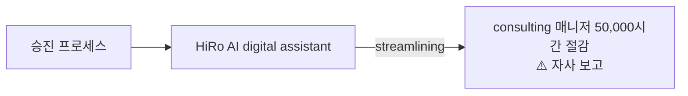

## Summary

IBM의 **HiRo**는 승진(promotion) 프로세스를 간소화하는 AI digital assistant — ⚠️ 자사 보고(HR Executive 2024, CHRO Nickle LaMoreaux): 지난해 IBM consulting 매니저의 **50,000시간** 절감 [[sources/hrexecutive-ibm-2024-of-the-year]]. IBM은 250,000명+ 글로벌 workforce [[sources/hrexecutive-ibm-2024-of-the-year]]. AskHR 생태계(연 2.1M+ 대화·80+ HR 태스크 자동화, watsonx Orchestrate) 내 specialist agent로 위치 [[sources/ibm-askhr-case-study-2025]] — 단, IBM AskHR case study·watsonx Orchestrate HR 에이전트 제품 페이지에는 HiRo 명칭이 없음 [[sources/ibm-askhr-case-study-2025]] [[sources/ibm-watsonx-orchestrate-hr-agents]]. 기존 페이지의 "분기 승진 cycle 10주", "HRBP 시간 85% 절감", "매니저 10,000명 자동 배포", "myHRfuture 팟캐스트"는 인용 소스 어디에도 없어 _미공개_ 처리 (2026-09-27 grounding 점검).

## Problem / Why (도입 배경)

- **Before (baseline)**: ❓ baseline 미공개 — 승진 프로세스의 기존 소요 시간·HRBP 투입은 인용 소스에 없음
- **Pain point**: 승진 프로세스의 매니저 시간 소모 — HiRo 도입으로 consulting 매니저 50,000시간 절감이라는 결과에서 역추론 가능하나 소스가 명시하지 않음 [[sources/hrexecutive-ibm-2024-of-the-year]]
- **Trigger**: IBM HR의 "eliminate, simplify, automate" 전략 — HiRO·AskHR 이후 job requisition 생성 도구·성과관리 도구로 확장 [[sources/hrexecutive-ibm-2024-of-the-year]]

## Solution Architecture

### A. Process (프로세스)

- **Before**: _미공개 (not disclosed)_ — 기존 "HRBP spreadsheet 4단계" 서술은 소스에 없어 삭제
- **After (HiRo)**: ⚠️ 자사 보고: "streamlining promotion processes" [[sources/hrexecutive-ibm-2024-of-the-year]] — 단계 세부(eligible 추출·criteria 배포·시스템 갱신)는 _미공개 (not disclosed)_
- **HITL**: _미공개 (not disclosed)_ — 매니저 결정 권한 여부 소스에 없음
- **Frequency**: _미공개 (not disclosed)_ (frontmatter `annual`은 분류값)
- **Scope of autonomy**: _미공개 (not disclosed)_

### B. System & Infrastructure (시스템·인프라)

- **Core**: _미공개 (not disclosed)_ — AskHR은 watsonx Orchestrate 기반 [[sources/ibm-askhr-case-study-2025]]이나 HiRo의 플랫폼은 소스에서 미확인
- **AI 시스템 배치**: _미공개 (not disclosed)_
- **연동**: _미공개 (not disclosed)_
- **인증**: _미공개 (not disclosed)_

### C. Data (데이터)

- **입력 데이터**: _미공개 (not disclosed)_ — HRMS·성과·compensation·정책 문서 입력은 소스에 없음
- **모델 구조**: _미공개 (not disclosed)_
- **Data governance**: _미공개 (not disclosed)_

### D. Model (모델)

- **Foundation model**: _미공개 (not disclosed)_
- **Customization**: _미공개 (not disclosed)_

### E. Organization & Team (조직·팀 구조)

- **오너십**: IBM CHRO Nickle LaMoreaux (2024 HR Executive of the Year) [[sources/hrexecutive-ibm-2024-of-the-year]]
- **참여 역할**: _미공개 (not disclosed)_
- **거버넌스**: _미공개 (not disclosed)_ — "IBM AI Ethics Board" 관여는 소스에 없음

### F. Diagrams (도식)

```mermaid
flowchart LR
    Promo[승진 프로세스] --> HiRo[HiRo AI digital assistant]
    HiRo -->|streamlining| Saved[consulting 매니저 50,000시간 절감<br/>⚠️ 자사 보고]
```

범례: 실선 = HR Executive 2024 인터뷰 [[sources/hrexecutive-ibm-2024-of-the-year]] 확인. 데이터 소스·시스템 갱신 노드는 미확인으로 제외.

## Impact / Metrics (기대효과)

### 기대효과 요약
승진 프로세스 간소화. ⚠️ 유일한 metric은 IBM CHRO 자사 발표(HR Executive 매개). 외부 고객 도입 사례는 _미공개_.

| 지표 | 값 | 출처 | 성격 |
|---|---|---|---|
| **consulting 매니저 시간 절감** | **50,000시간** (지난해, 2024 인터뷰 기준) | HR Executive 2024 [[sources/hrexecutive-ibm-2024-of-the-year]] | ⚠️ 자사 보고 |
| HRBP 분기당 시간 절감 | _미공개_ (기존 85%는 인용 소스에 없음) | — | ❓ |
| 이전 분기 승진 cycle 소요 | _미공개_ (기존 10주는 인용 소스에 없음) | — | ❓ |
| 매니저 자동 배포 규모 | _미공개_ (기존 10,000명은 인용 소스에 없음) | — | ❓ |
| IBM workforce | **250,000명+** | HR Executive 2024 [[sources/hrexecutive-ibm-2024-of-the-year]] | ✅ Fact |
| AskHR 생태계 conversations | **2.1M+/년** | IBM AskHR case study [[sources/ibm-askhr-case-study-2025]] | ⚠️ 자사 보고 |
| AskHR 자동화 task 수 | **80+** | IBM AskHR case study [[sources/ibm-askhr-case-study-2025]] | ⚠️ 자사 보고 |
| 외부 고객 도입 | _미공개_ — IBM 내부 도입만 공개 | — | ❓ 미공개 |

## Governance & Risk

- ⚠️ **모든 metric은 IBM 자사 발표** (CHRO 인터뷰) — Tier 1·2 독립 검증 0건. IBM이 동시에 watsonx 벤더이자 도입 기업
- ⚠️ **외부 고객 도입 사례 _미공개_** — HiRo 동급 promotion agent의 외부 reference 부재
- ⚠️ HiRo의 아키텍처·HITL·데이터 입력이 모두 _미공개_ — 승진 의사결정에 대한 AI 관여 범위를 소스로 확정할 수 없음
- ⚠️ 한국 적용 시: AI 기본법 **고영향 AI 검토 대상**(승진 = 인사 의사결정, `kr-high-impact-review`) → 영향평가·인적감독·이용자 고지 검토

## Contradictions

> [!note] 2026-09-27 grounding — 인용 소스 3건 중 HiRo를 언급하는 것은 HR Executive 2024 기사뿐이며, 해당 기사에는 "50,000시간 절감"만 있음. "10주 → 단축", "HRBP 85% 절감", "매니저 10,000명", "IBM 전체 직원 수 표기", "myHRfuture 팟캐스트", HRMS·성과·comp 입력, IdP·RBAC, GDPR·ISO 27001, Granite·RAG, AI Ethics Board 서술은 어느 소스에도 없어 삭제·_미공개_ 처리. IBM AskHR case study·watsonx Orchestrate 제품 페이지에는 HiRo 명칭이 없어 "AskHR 생태계 specialist agent" 배치는 추론이 아닌 페이지 분류 관점으로만 유지.

## Consulting Angle

- **Promotion management AI 글로벌 reference**: 한국 대기업 (삼성·LG·SK·현대차) 분기 승진·연 승진 cycle automation 컨설팅에서 **유일한 production reference** (외부 공개 기준)
- **AskHR 생태계 specialist agent 패턴 사례**: 단일 chatbot이 아닌 **HR 영역별 specialist agent (HiRo·Charlie·Blue Match·watsonx Orchestrate TA)** 분리 운영 — Workday Illuminate, ServiceNow HR과 비교 reference
- **vs Workday Illuminate Sentiment/Skills Agent**: Workday는 multi-tenant SaaS의 cross-customer agent, IBM HiRo는 **single-tenant 내부 도입** — 거버넌스·정책 customization 자유도 차이
- **반면교사 / 검증 한계**:
  - 외부 고객 도입 reference 0건 → 한국 클라이언트가 "삼성에서 도입한 사례 있나?" 물으면 **IBM 내부 도입만 공개되어 있다 솔직히 답변**
  - "50,000시간 절감"은 IBM CHRO 자사 발표(HR Executive 매개) — 외부 인용 시 출처·자사 보고 명시; HRBP 시간 절감률·cycle 단축 수치는 _미공개_
- **한국 적용 angle**:
  - 한국 대기업 분기·연 승진 cycle은 **HR 부서 시간의 가장 큰 비중** — automation potential 매우 큼
  - 단 (a) 승진 정책의 부서·계열사별 차이 (b) 한국식 인사고과·역량평가 (c) 노조·노사협의회 사전 통보 (한국 노동법) 등 customization 필수
  - **고영향 AI** 분류 → 영향평가·매니저 교육·결정 결과 감사 로그 설계 필수
- **Watch list**: IBM watsonx Orchestrate 외부 고객 promotion agent reference 발표·Forrester/Gartner의 promotion AI report 발표 시 confidence 재조정
