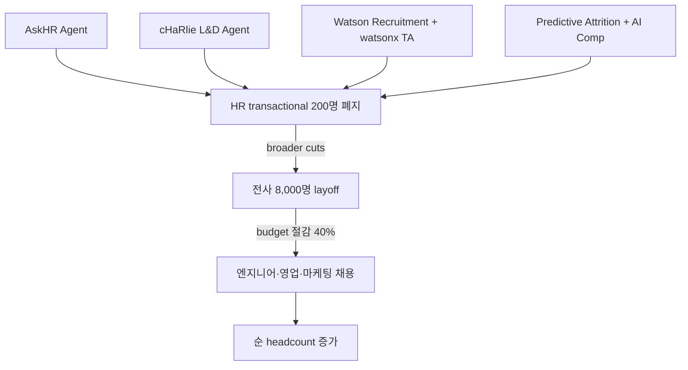

## Summary

2025-05 IBM CEO Arvind Krishna 발언 — AI agents (AskHR + watsonx Orchestrate stack)가 **"a couple hundred HR roles"** 대체. 전사 8,000명 layoff (~3% workforce). HR operating budget 4년간 40% 감소 (LaMoreaux). **단, 순 headcount는 증가** — 절감액을 엔지니어·영업·마케팅 채용에 재투자. "감원"이 아닌 "재배치 + 직무 전환" 패러다임의 canonical reference.

## Problem / Why

- **Before**: 270K 직원 IBM의 HR 운영 비용 baseline (CHRO LaMoreaux pre-AI era)
- **Pain point**: HR 백오피스 transactional 업무가 budget 흡수, 전략 HR에 투자 여력 부족
- **Trigger**: AskHR·watsonx Orchestrate·cHaRlie·Predictive Attrition 누적 효과 (2018~2025) → 임계 도달

## Solution Architecture

> 본 페이지는 *조직 outcome*. AI 도구 자체는 [[ibm-askhr-watsonx]], [[ibm-charlie-learning-ops-agent]], [[ibm-watsonx-orchestrate-ta-agent]] 등 separate page.

### A. Process

- **Before (As-is, pre-2025)**: HR ops 직원이 정책 Q&A·티켓·learning ops·screening·comp·attrition 분석 manual 수행
- **After (post-2025)**:
  1. AskHR이 HR 정책 Q&A·comp guidance·recognition·expense 80+ 태스크 자동 처리
  2. cHaRlie가 learning ops 백오피스 자율 처리
  3. Watson Recruitment·Predictive Attrition·watsonx Orchestrate TA Agent가 채용·retention·comp 워크플로 자율화
  4. 200명 HR 직원의 transactional role 폐지·재배치
  5. 8,000명 broader cuts (백오피스·중복 layer)
  6. 절감 budget을 엔지니어·영업·마케팅 신규 채용에 재투자
- **HITL**: 매니저 최종 결정·HR strategy team이 변화관리

### B/C/D/E. System

- 누적 AI portfolio (위 4 use case + 기타) — 단일 도구 아님
- 데이터: HR 운영 KPI · budget · headcount snapshot
- 오너십: Krishna(CEO) + LaMoreaux(CHRO) 공동 거버넌스

### F. Diagrams

## Impact / Metrics

### 기대효과 요약
HR ops 자동화로 200 HR roles 폐지 + 4년간 HR budget 40% 감소 + 순 headcount 증가 (재투자). KR HR 임원이 가장 자주 묻는 "AI 도입 후 인력 줄일 수 있나" 질문의 canonical reference.

- **Before → After (자사 보고)**:
  - HR roles 변화: baseline → 200명 displaced
  - 전사 layoff: 0 → 8,000 (~3% workforce)
  - HR operating budget: baseline → -40% (4년 누적)
  - 순 headcount: 단순 감소 아닌 **증가** (재투자 결과)
- **재투자 대상**: 엔지니어·영업·마케팅 (transactional → 가치 창출 직무 shift)

## Governance & Risk

- ⚠️ 자사 보고만 존재 — Tier 1 독립 검증 부재 (WSJ·CNBC 등 mainstream 매체는 IBM 발표 전달)
- ⚠️ "200 HR roles displaced"의 구체 직무·재배치 비율 _미공개_
- ⚠️ Korean 노동법 RIF 제한 — IBM 모델 직접 적용 불가, **재배치·reskilling**으로 framing 필수
- ⚠️ 8,000 layoff의 사회적·평판 비용 별도 분석 필요

## Consulting Angle

- **KR 컨설팅 핵심 reference — "AI로 인력 줄일 수 있나" 질문의 정답**:
  - 단순 cut 아닌 "재배치 + 재투자" frame이 핵심
  - 한국 노동법·노조·평판 컨텍스트에서 "감원"보다 "직무 전환·reskilling"으로 포지셔닝
  - 200/270K = 0.07% HR ops cut으로 40% budget 절감 — 임팩트 비율 시사점
- **2026 Q3-Q4 핵심 슬라이드**: "AI HR transformation: 비용 절감 vs 가치 재투자"
- **JPMorgan redeployment 사례 [[jpmorgan-llm-suite-redeployment]]와 cross-reference**: 글로벌 finance도 동일 패턴 — Krishna(IBM) + Dimon(JPM) 두 CEO 발언 결합
- **반면교사 포인트**:
  - "200 HR roles displaced"가 sound bite로 KR 미디어에 인용될 위험 — 노조·여론 충돌 우려
  - 임원 발표 시 항상 "재배치 + 재투자" 컨텍스트와 함께 전달 권장
- **Tier 1 검증 부재 caveat**: Bersin·Gartner의 IBM HR transformation 일반 코멘트는 있으나 200/8,000/40% 구체 수치 독립 검증 안 함
